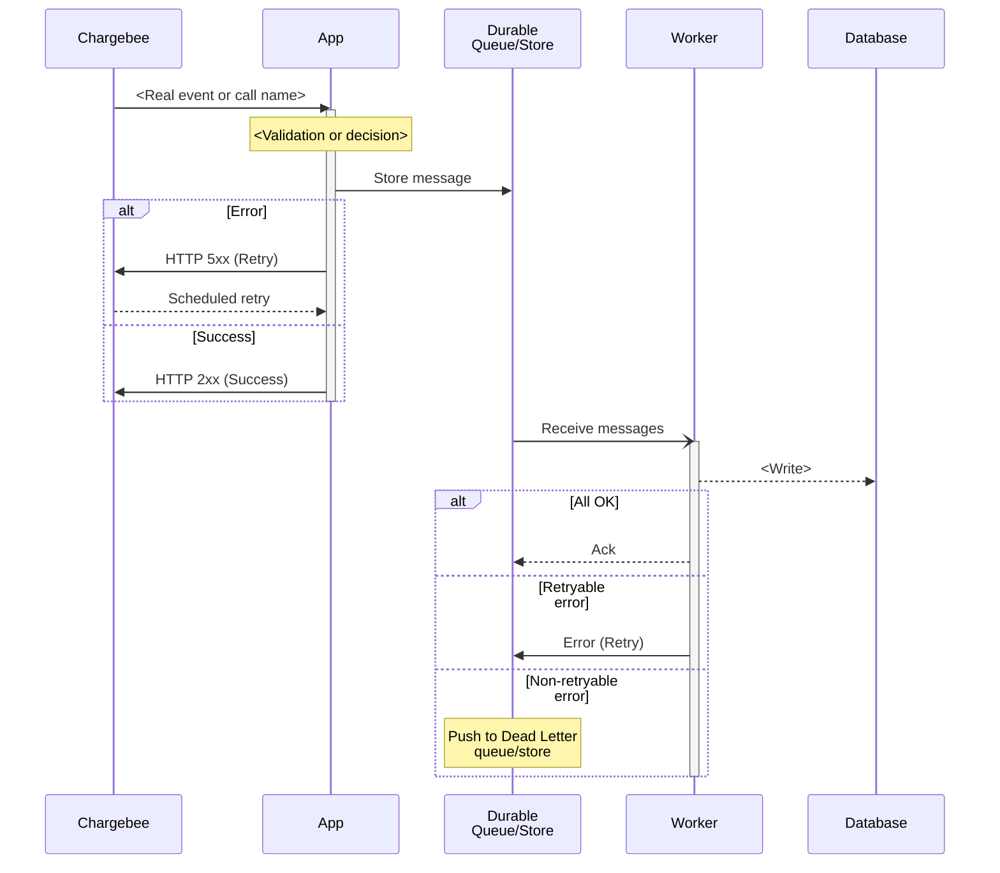
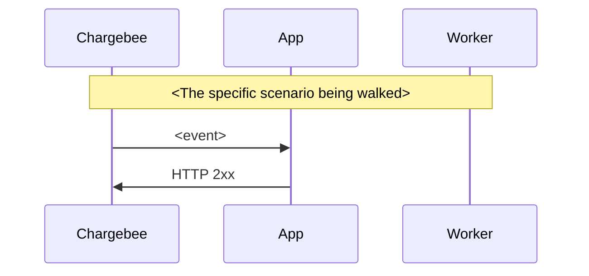

# How to <do the thing> with Chargebee

<!--
Delete every comment in this file before committing.
Intro: 2-4 sentences. Sentence one places the topic in a real integration sequence
("One of the first steps when integrating Chargebee ... is ..."). Then say what the
reader will build or decide. A short list of concrete reasons is optional and only
earns its place if the items are genuinely parallel. No meta-commentary about the guide.
-->

<Why this matters, in the reader's terms.> You will need <the thing> to:

* <Concrete outcome one>
* <Concrete outcome two>
* <Concrete outcome three, only if there is one>

## High level architecture

<!--
One mermaid diagram. Happy path plus the failure paths that matter. Keep it
technology-neutral: "Durable Queue/Store", not "SQS". See references/diagrams.md.
-->

<!--
Follow the diagram with prose dense enough that a reader who skipped it still
understands the design: where the trust boundary is, where the hand-off becomes
durable, what runs asynchronously, what is authoritative.
-->

## Best Practices

<!--
Group by responsibility or design decision. Each top-level bullet: what to do, why
it matters, what breaks if it is skipped. Nested bullets only for genuine sequences
or parallel mechanics. Do not bold a label at the front of every bullet.
-->

* <Recommendation stated as an action.> <Why, and what fails without it.> It should:

    - <Step one>
    - <Step two>
    - <Step three>

* <Recommendation two.> Bold a **new term** on first use, then drop the bold.

* <Recommendation three, covering duplicates, ordering, concurrency, or partial failure. State the delivery semantics precisely.>

### <The hardest correctness problem in this topic>

<!--
Promote a genuinely hard case into its own subsection. Name the failure concretely
using real Chargebee resource and event names. Add a scenario sequence diagram.
-->

<Explain the case. Lead with the mechanism, not the vibe.>

<Rules the implementation must follow, as short imperative sentences.>

## Implementation notes

The [`pointer`](../pointer/) app implements <topic> using <the opinionated choice>. <One short paragraph on how the pieces fit together at runtime.>

- [`pointer/<path>`](../pointer/<path>) — <role, and the runtime behavior that matters: what acknowledges, what retries, what happens on a thrown error.>

- [`pointer/<path>`](../pointer/<path>) — <role and behavior.>

<!--
Label opinionated choices as pointer's choices, not Chargebee requirements. If the
implementation diverges from the recommended production design, say so and say why.
-->

## Go-live checklist

<!--
Questions with testable yes/no answers. Cover configuration, authentication,
correctness, failure recovery, observability, security, scale, reconciliation, and
ownership as the topic warrants. Nothing as soft as "Is it production-ready?".
The document ends here. No summary, no conclusion.
-->

- [ ] <Configuration question?>

- [ ] <Authentication or authorization question?>

- [ ] <Correctness question about duplicates, ordering, or idempotency?>

- [ ] <Failure recovery question about retries and dead-lettering?>

- [ ] <Observability or reconciliation question?>
