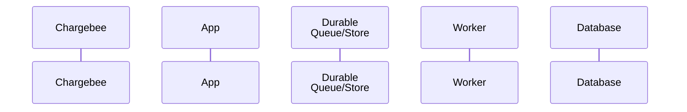
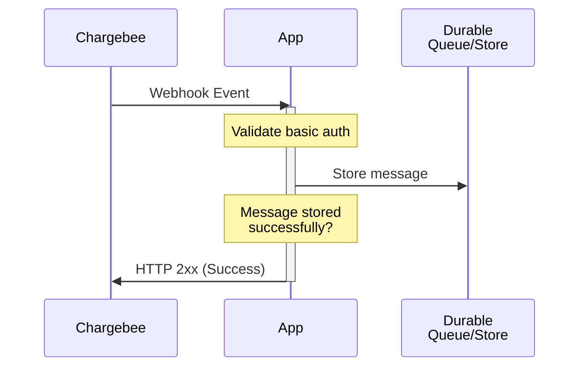
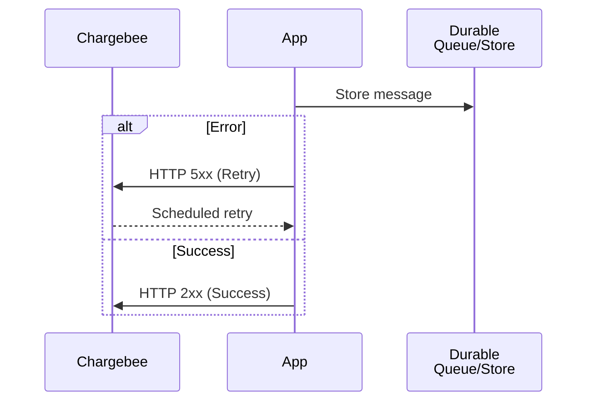
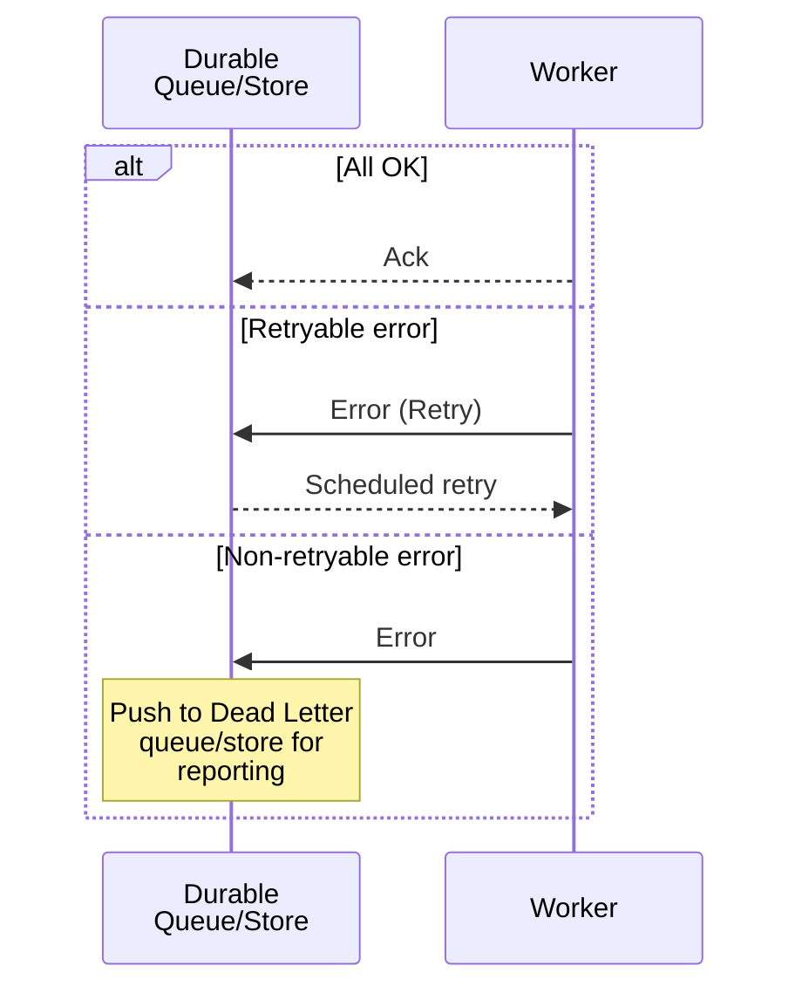
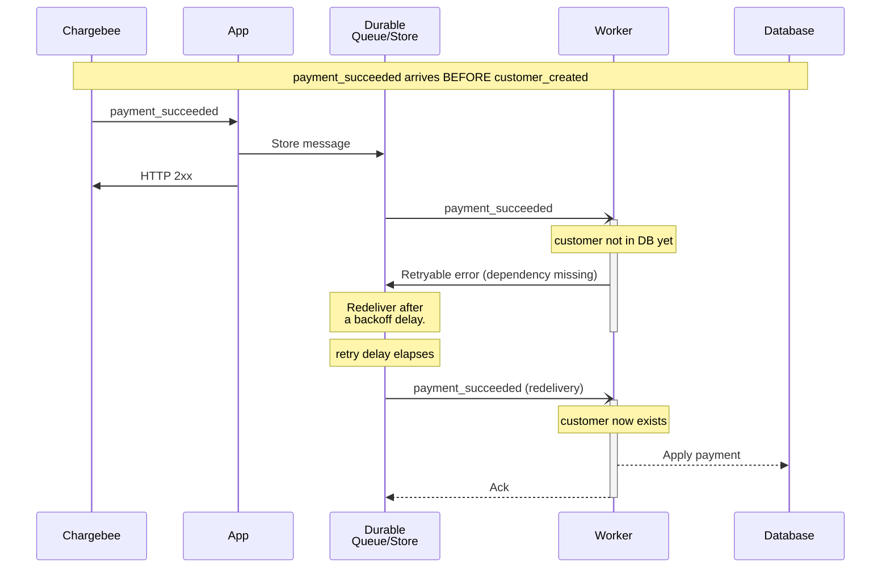
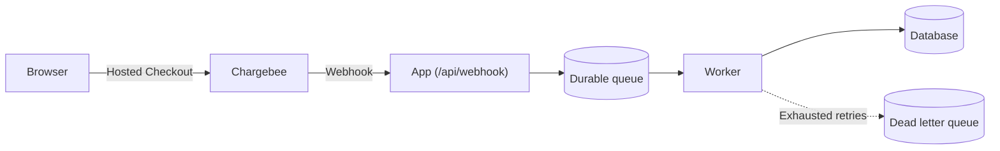

# Diagrams

Everything is code, diagrams included. Every diagram in `how-to/` is a fenced `mermaid` block in the markdown file. No images, no screenshots, no exported PNGs, no ASCII art, no links to Lucid, Miro, Excalidraw, or draw.io. GitHub renders mermaid natively, so the diagram stays reviewable in a pull request diff.

## Contents

- [Choosing a diagram type](#choosing-a-diagram-type)
- [Sequence diagram conventions](#sequence-diagram-conventions)
- [Arrow vocabulary](#arrow-vocabulary)
- [Showing failure paths](#showing-failure-paths)
- [Scenario diagrams](#scenario-diagrams)
- [Flowchart conventions](#flowchart-conventions)
- [Syntax pitfalls](#syntax-pitfalls)
- [What the diagram must not do](#what-the-diagram-must-not-do)

## Choosing a diagram type

| Use | When |
| --- | --- |
| `sequenceDiagram` | Timing, ordering, acknowledgements, retries, or who-waits-for-whom is the point. This is the default for the `High level architecture` section. |
| `flowchart LR` / `flowchart TD` | Component boundaries, routing, and deployment topology matter more than timing. |
| `stateDiagram-v2` | The topic is a lifecycle with named states, such as subscription or invoice status transitions. |
| `erDiagram` | The topic is about how Chargebee resources map onto local tables. |

One diagram in `High level architecture`. Additional diagrams belong inside the `Best Practices` subsection that needs them, next to the prose they clarify.

## Sequence diagram conventions

Declare every participant up front with a short lowercase alias and a readable display name. Use ` ` to wrap long names.

Established aliases, reused across guides so diagrams read consistently: `cb` (Chargebee), `app` (your application), `web` (browser or client), `queue`, `worker`, `db`, `dlq`.

Wrap the span where a component is doing work in `activate` / `deactivate`. It makes the synchronous portion of the flow visually obvious, which is usually the whole argument of the diagram.

Use `note over` for the things that are not messages: validation steps, decisions, and state checks.

Label messages with the real thing being sent. `payment_succeeded` beats `event`. `HTTP 2xx (Success)` beats `response`.

## Arrow vocabulary

Keep these consistent, because readers learn them across guides:

| Arrow | Meaning |
| --- | --- |
| `->>` | A request or a call the sender waits on |
| `-->>` | A response, or an internal write the caller does not block a remote system on |
| `-)` | Asynchronous delivery where the sender does not wait, such as a queue handing a message to a worker |

Annotate a push-or-poll ambiguity rather than picking one silently: `note over queue,worker: Poll or push messages`.

## Showing failure paths

The failure path is the reason the diagram exists. Put it in the diagram with `alt` / `else`, and name each branch by its outcome.

Where an error is not uniform, split the branches by how they are handled rather than by what threw:

## Scenario diagrams

When a subsection explains one specific hard case, open the diagram with a note spanning the full participant range that states the scenario, then walk it in order. This is what makes the out-of-order subsection in the webhook guide legible:

Use `note over` to mark the passage of time (`retry delay elapses`) rather than trying to draw it.

## Flowchart conventions

Use `flowchart LR` for a left-to-right pipeline, `flowchart TD` for a topology with layers. Give every node a stable id and quote any label containing punctuation.

Use `subgraph` to mark a trust or deployment boundary, and label the edge that crosses it.

## Syntax pitfalls

- Quote any label containing `(`, `)`, `:`, `,`, `#`, or `-`: `app["App (sync path)"]`. Unquoted parentheses break flowchart parsing.
- Use ` ` for line breaks inside labels and notes. It works in both sequence diagrams and flowcharts.
- In a sequence diagram the first `:` after an arrow starts the message text; later colons are literal.
- Every `alt`, `loop`, `opt`, `par`, and `subgraph` needs a matching `end`.
- `note over a,b:` spans participants; `note over a:` sits on one. There is no `note between`.
- `%%` starts a comment line.
- Declare participants explicitly instead of letting them be inferred, so the left-to-right order is deliberate.
- Render the diagram before committing. A mermaid block that fails to parse shows as a raw error on GitHub, and the validator only checks that the block exists.

## What the diagram must not do

- Duplicate the prose. The diagram carries the flow; the prose carries the reasoning.
- Show only the happy path.
- Include so many participants that the failure branches stop fitting. Split into a topology flowchart plus a focused sequence instead.
- Encode `pointer`-specific technology in the `High level architecture` diagram. Say `Durable Queue/Store`, not `SQS`. SQS belongs in `Implementation notes`.
