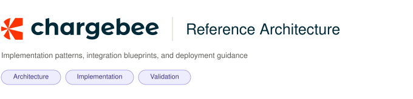
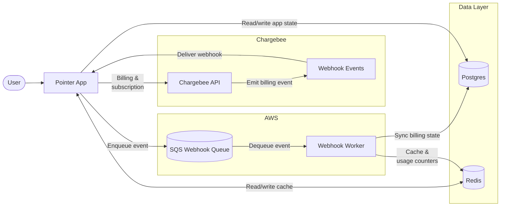

# Chargebee Reference Architecture

<picture>
  <source media="(prefers-color-scheme: dark)" srcset="./pointer/public/banner-dark.svg">
  <source media="(prefers-color-scheme: light)" srcset="./pointer/public/banner-light.svg">
  
</picture>

The purpose of this repository is to showcase the best practices around integrating Chargebee as the billing solution for a high traffic SaaS platform. This is split into two distinct parts:

- A collection of in-depth, technical how-tos which cover the Chargebee recommended best practices when integrating various billing and usage related Chargebee products

- A opinionated, fully functional SaaS application built to demonstrate how these concepts translate to code

## Audience

- Architects and solution consultants who are looking for Chargebee's recommended practices when integrating various products with their platform

- Developers who are looking to validate their integration code and ensure all edge-cases are covered

- LLMs and coding agents looking for authoritative sources for integrating Chargebee which are generalized and can be used to produce a working implementation using any tech stack

## What it covers

The topics below cover the best practices to achieve the required outcome and are vetted and updated continuously. They cover implementation details, edge cases to handle, testing scenarios, etc. To bridge the gap between documentation and implementation, each of these topics are actually implemented in code. The [pointer](../pointer/README.md) app is our demo application built with an opinionated tech stack with all the required pieces to spin up a working SaaS platform. 

Regardless of your tech stack or hosting platform, each how-to covers the functional/non-functional requirements and a production go-live checklist to help you along the journey.

Each how-to doc outlines:

- A high level architecture showing relevant components, and how data flows between them for specific scenarios

- Best practices to keep in mind, and testing scenarios which are useful in validating your implementation

- A go-live checklist of must do steps to pay attention to before your app gets deployed to production environments

Some topics may also contain specifics around how it is implemented in `Pointer`.

### Index

| Topic | Status | Last Updated |
|-------|--------|--------------|
| [Integrating Chargebee webhooks](./how-to/integrating-chargebee-webhooks.md) | Draft | |
| [Syncing and reconciling Chargebee entities](./how-to/syncing-and-reconciling-chargebee-entities.md) | Draft | |
| [Enforcing entitlement checks](./how-to/enforcing-entitlement-checks.md) | Draft | |
| [Usage based billing](./how-to/implementing-usage-based-billing.md) | Draft | |
| Credit based billing | Pending | |

## Pointer

Pointer is our reference app which mimics a LLM provider that is PLG (product led growth) driven. It was built from the ground up with the help of coding agents. Although code was generated via LLMs, the design and how-tos are thoroughly reviewed and edited by humans.

A high level overview of the pointer architecture is shown below. More details on the tech stack, components, infrastructure are detailed in [ARCHITECTURE.md](./pointer/ARCHITECTURE.md)

## Links

- [How to](./how-to/README.md)
- [Pointer demo](https://pointer.chargebee-labs.com)
- [Pointer source](./pointer/README.md)
