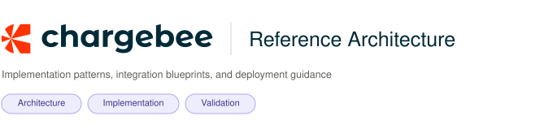
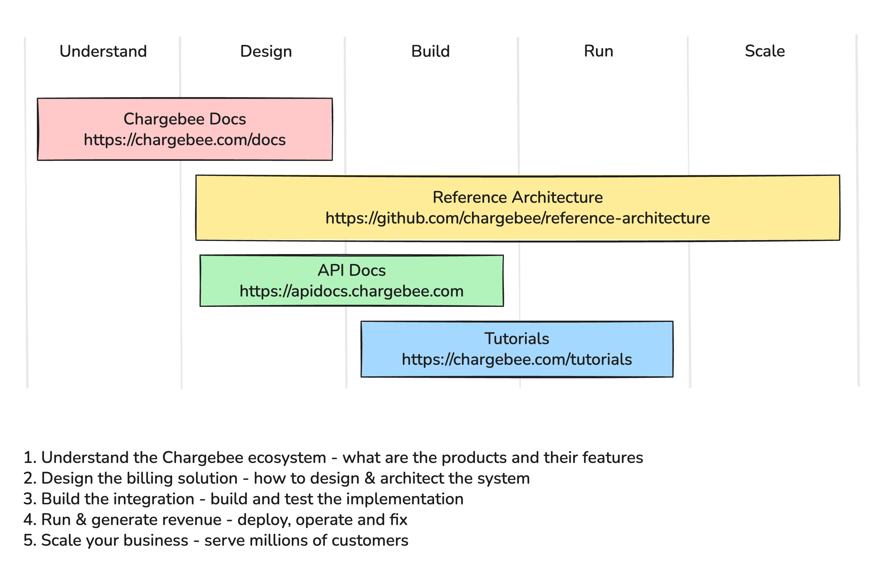
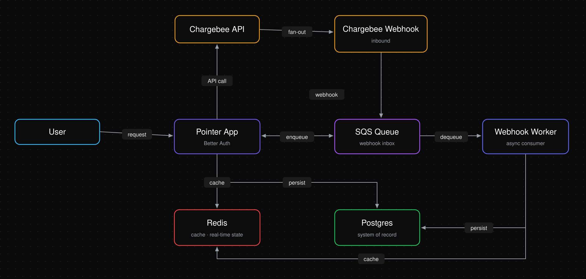

# Chargebee Reference Architecture

**Status**: This is a work in progress. Please expect continuous updates until it is marked ready for public consumption.

---

<picture>
  <source media="(prefers-color-scheme: dark)" srcset="./pointer/public/banner-dark.svg">
  <source media="(prefers-color-scheme: light)" srcset="./pointer/public/banner-light.svg">
  
</picture>

The purpose of this repository is to showcase best practices for integrating Chargebee as the billing solution for a high-traffic AI/SaaS platform. It is split into two distinct parts:

- A collection of in-depth, technical how-tos covering Chargebee-recommended best practices for integrating various billing- and usage-related Chargebee products

- An opinionated, fully functional, and deployable application built to demonstrate how these concepts translate into code

## Audience

- Architects and solution consultants looking for Chargebee's recommended practices when integrating Chargebee products with their platforms

- Developers looking to validate their integration code and ensure all edge cases are covered

- LLMs and coding agents looking for authoritative sources for integrating Chargebee that are generalized and can be used to produce a working implementation using any tech stack

## What it covers

The topics below cover best practices to achieve the required outcome and are vetted and updated continuously. They cover implementation details, edge cases to handle, and testing scenarios. To bridge the gap between documentation and implementation, each topic is implemented in code. The [Pointer](./pointer/README.md) app is our demo application, built with an opinionated tech stack and all the components needed to spin up a working SaaS platform.

Regardless of your tech stack or hosting platform, each how-to covers functional and non-functional requirements alongside a production go-live checklist.

Each how-to is broken down into self-contained topics that address a specific scenario. Each guide can include:

- Architecture or flow diagrams

- Pseudocode showing how certain cases may be structured in code

- Best practices to keep in mind, and testing scenarios useful for validating your implementation

- Do's and Don'ts

- An overview of how that topic is implemented in the demo app along with the relevant source files to review

- A go-live checklist of key requirements to verify before your app gets deployed to production environments

These topics are written in plain Markdown with Mermaid diagrams wherever possible. They are written and edited by humans, but can be consumed by agents as well.

## Where it fits in

While the Chargebee [docs](https://chargebee.com/docs) and [apidocs](https://apidocs.chargebee.com) serve as the main source of reference from the product and engineering teams, they are not structured for consuming topics in thin vertical slices, which is what this repository provides.

### Index

| Topic | Status | Last Updated |
|-------|--------|--------------|
| [Integrating Chargebee webhooks](./how-to/webhooks.md) | In Review | |
| [Enforcing entitlement checks](./how-to/entitlement-checks.md) | In Review | |
| [Sync Chargebee entities](./how-to/sync-chargebee-entities.md) | Draft | |
| [Usage-based billing](./how-to/usage-based-billing.md) | Draft | |
| [Usage alerts](./how-to/usage-alerts.md) | In Progress | |
| [Checkout experience](./how-to/checkout-experience.md) | In Progress | |

## Reference App

  

[Pointer](https://pointer.chargebee-labs.com) is our reference app, which models an LLM/AI API provider driven by product-led growth (PLG). A developer signs up, uses their daily token allowance, and upgrades to Pro to keep going. Chargebee handles subscriptions, entitlements, usage tracking, and alerts.

It was built from the ground up with the help of coding agents and Chargebee's official libraries and SDKs. Although a considerable amount of code was generated via LLMs, the architecture and design of the app and the how-to topics themselves are completely written and reviewed by humans.

Building Pointer alongside the how-to topics ensures they cover the practical aspects of integrating Chargebee with a monetizable product. We aim to continuously evolve and expand the reference architecture as we build out Pointer with additional features; this mimics how an actual product team integrates billing, subscription, entitlement, and usage management into their app.

A high-level overview of the Pointer architecture is shown below. Further details on the tech stack, components, and infrastructure are provided in [ARCHITECTURE.md](./pointer/ARCHITECTURE.md).

## Links

- [How to](./how-to/README.md)
- [Pointer demo](https://pointer.chargebee-labs.com)
- [Pointer source](./pointer/README.md)
