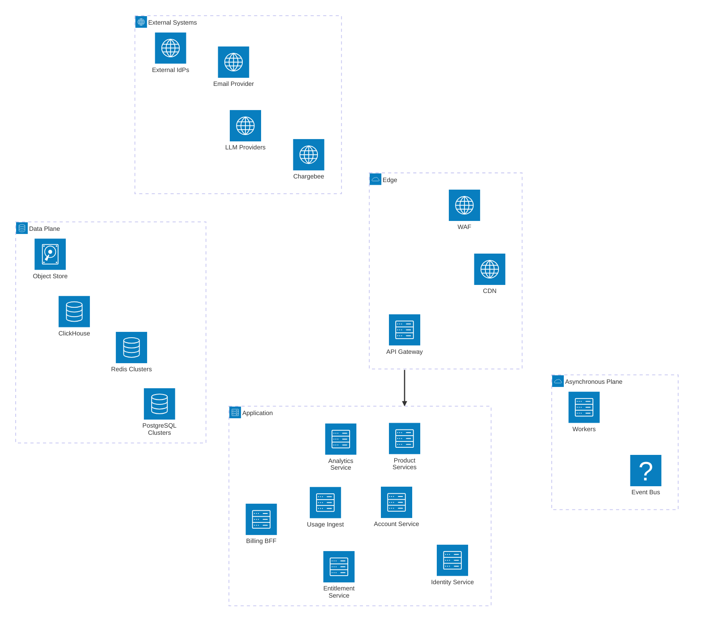

```mermaid
architecture-beta
    group l1(cloud)[Edge]
    service cdn(internet)[CDN] in l1
    service waf(internet)[WAF] in l1
    service apigw(server)[API Gateway] in l1

    group l2(server)[Application]
    service identity(server)[Identity Service] in l2
    service account(server)[Account Service] in l2
    service product(server)[Product Services] in l2
    service entitlement(server)[Entitlement Service] in l2
    service usage(server)[Usage Ingest] in l2
    service billing(server)[Billing BFF] in l2
    service analytics(server)[Analytics Service] in l2

    group l3(cloud)[Asynchronous Plane]
    service bus(queue)[Event Bus] in l3
    service workers(server)[Workers] in l3

    group l4(database)[Data Plane]
    service pg(database)[PostgreSQL Clusters] in l4
    service redis(database)[Redis Clusters] in l4
    service ch(database)[ClickHouse] in l4
    service obj(disk)[Object Store] in l4

    group l5(internet)[External Systems]
    service cb(internet)[Chargebee] in l5
    service llm(internet)[LLM Providers] in l5
    service email(internet)[Email Provider] in l5
    service idp(internet)[External IdPs] in l5

    apigw{group}:B --> T:product{group}
```

