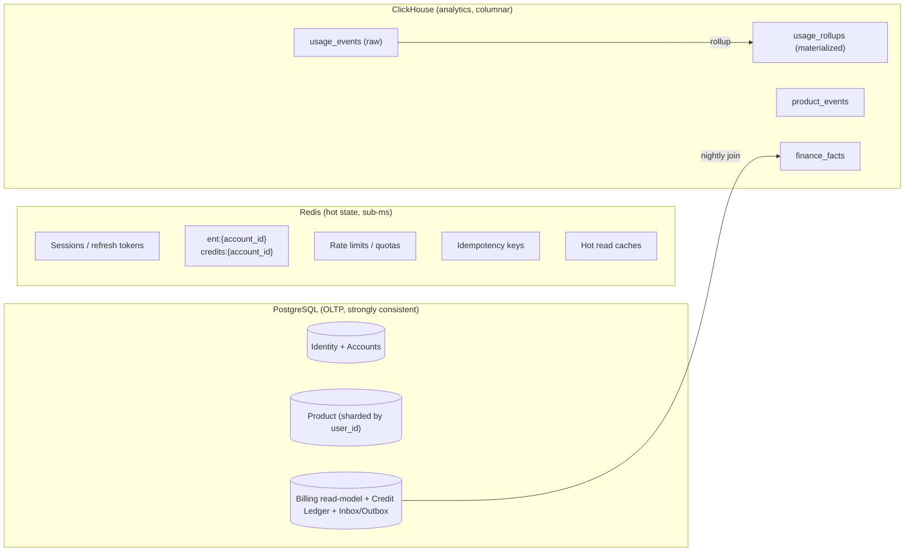
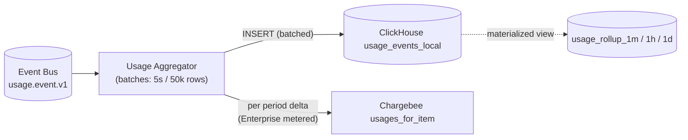

# 02 — Data Architecture

This document specifies the **logical schema, physical layout, and access patterns** for the
three data stores in the architecture: PostgreSQL, Redis, and ClickHouse.

Two partition keys, both ubiquitous:

- **`user_id`** — auth identity, partition key for **product data**.
- **`account_id`** — billing subject (1:1 Chargebee customer), partition key for
  **entitlements, quotas, billing**.

A user is a member of 1..N accounts (always at least their Personal Account). The active
account context for a request is in the JWT `acc` claim.

---

## 1. Storage Boundaries



---

## 2. PostgreSQL

### 2.1 Cluster Topology

| Cluster | Tenancy model | Replication | Notes |
|---|---|---|---|
| `pg-identity` | Single (global) | Primary + 2 replicas | Holds users, accounts, members, MFA, and the **shard map**. Auth on hot path |
| `pg-product` | **Sharded** by `user_id` (e.g., 32 shards) | Each shard: primary + 2 replicas | Highest volume; product data |
| `pg-billing` | Single (global) | Primary + 2 replicas + 1 logical | Holds the materialized billing read-model, credit ledger, and webhook inbox |

**Sharding rule for `pg-product`:** logical shard ID = `hash(user_id) % 1024`, mapped to
physical shard via `logical_shard_map` (1024 rows in `pg-identity`).

### 2.2 Identity + Account Schema (`pg-identity`)

```sql
-- ===== Users =====
CREATE TABLE users (
  user_id              UUID PRIMARY KEY,                   -- UUIDv7
  email                CITEXT UNIQUE NOT NULL,
  email_verified_at    TIMESTAMPTZ,
  display_name         TEXT,
  status               TEXT NOT NULL DEFAULT 'active',     -- active|suspended|deleted
  personal_account_id  UUID NOT NULL,                      -- FK to accounts; auto-created at signup
  home_region          TEXT NOT NULL,
  created_at           TIMESTAMPTZ NOT NULL DEFAULT now(),
  updated_at           TIMESTAMPTZ NOT NULL DEFAULT now(),
  deleted_at           TIMESTAMPTZ
);

CREATE TABLE credentials (
  user_id           UUID PRIMARY KEY REFERENCES users(user_id),
  password_hash     TEXT,
  password_set_at   TIMESTAMPTZ,
  must_reset        BOOLEAN NOT NULL DEFAULT false
);

CREATE TABLE mfa_factors (
  factor_id         UUID PRIMARY KEY,
  user_id           UUID NOT NULL REFERENCES users(user_id),
  type              TEXT NOT NULL,                          -- totp|webauthn|sms
  secret_encrypted  BYTEA,
  created_at        TIMESTAMPTZ NOT NULL DEFAULT now()
);

CREATE INDEX idx_mfa_user ON mfa_factors(user_id);

-- ===== Accounts (billing subject = Chargebee customer 1:1) =====
CREATE TABLE accounts (
  account_id          UUID PRIMARY KEY,                    -- UUIDv7
  type                TEXT NOT NULL,                       -- personal|team|enterprise
  name                TEXT NOT NULL,
  slug                TEXT UNIQUE,                         -- only set for team|enterprise
  owner_user_id       UUID NOT NULL REFERENCES users(user_id),
  cb_customer_id      TEXT UNIQUE,                         -- Chargebee customer id (nullable until provisioned)
  plan_tier           TEXT NOT NULL DEFAULT 'free',        -- free|pro|max|team|enterprise (mirror)
  seat_count          INT NOT NULL DEFAULT 1,              -- = subscription.plan_quantity
  sso_domain          TEXT,                                -- e.g. "@acme.com" (Team/Enterprise only)
  status              TEXT NOT NULL DEFAULT 'active',
  created_at          TIMESTAMPTZ NOT NULL DEFAULT now(),
  updated_at          TIMESTAMPTZ NOT NULL DEFAULT now(),
  deleted_at          TIMESTAMPTZ,
  CHECK (type IN ('personal','team','enterprise'))
);

CREATE INDEX idx_accounts_owner ON accounts(owner_user_id);
CREATE INDEX idx_accounts_cb_customer ON accounts(cb_customer_id);

-- One personal account per user (enforced)
CREATE UNIQUE INDEX uq_accounts_personal_per_user
  ON accounts(owner_user_id) WHERE type = 'personal';

ALTER TABLE users
  ADD CONSTRAINT fk_users_personal_account
  FOREIGN KEY (personal_account_id) REFERENCES accounts(account_id) DEFERRABLE INITIALLY DEFERRED;

-- ===== Membership =====
CREATE TABLE account_members (
  account_id        UUID NOT NULL REFERENCES accounts(account_id),
  user_id           UUID NOT NULL REFERENCES users(user_id),
  role              TEXT NOT NULL,                          -- owner|admin|member|billing
  joined_at         TIMESTAMPTZ NOT NULL DEFAULT now(),
  removed_at        TIMESTAMPTZ,
  PRIMARY KEY (account_id, user_id)
);

CREATE INDEX idx_members_user ON account_members(user_id) WHERE removed_at IS NULL;

-- ===== Invitations =====
CREATE TABLE account_invitations (
  invitation_id     UUID PRIMARY KEY,
  account_id        UUID NOT NULL REFERENCES accounts(account_id),
  email             CITEXT NOT NULL,
  role              TEXT NOT NULL DEFAULT 'member',
  token_hash        TEXT NOT NULL,                          -- hash of single-use token
  invited_by        UUID NOT NULL REFERENCES users(user_id),
  expires_at        TIMESTAMPTZ NOT NULL,
  status            TEXT NOT NULL DEFAULT 'pending',        -- pending|accepted|revoked|expired
  created_at        TIMESTAMPTZ NOT NULL DEFAULT now()
);

CREATE INDEX idx_invitations_account ON account_invitations(account_id);
CREATE INDEX idx_invitations_email ON account_invitations(email) WHERE status = 'pending';

-- ===== Shard map =====
CREATE TABLE logical_shard_map (
  logical_shard     INT PRIMARY KEY,                        -- 0..1023
  physical_shard    TEXT NOT NULL,                          -- e.g. "pg-product-04"
  status            TEXT NOT NULL DEFAULT 'active',         -- active|migrating
  updated_at        TIMESTAMPTZ NOT NULL DEFAULT now()
);
```

**Invariant maintained by the Account Service:**

- Every user has exactly one `personal` account (owned by themselves) created in the same
  transaction as the user.
- Seat count on a Team account is enforced at invitation acceptance time:
  `(SELECT COUNT(*) FROM account_members WHERE account_id = $1 AND removed_at IS NULL) <= accounts.seat_count`.

### 2.3 Product Schema (`pg-product`, per-shard)

Every product table follows three rules:

1. `user_id UUID NOT NULL` is the **first column**.
2. Every index begins with `user_id`.
3. **Row-Level Security** is enabled and forces `user_id = current_setting('app.user_id')::uuid`.

```sql
CREATE TABLE conversations (
  user_id           UUID NOT NULL,
  conversation_id   UUID NOT NULL,
  title             TEXT,
  model_id          TEXT NOT NULL,                          -- model used; from f_models tier
  created_at        TIMESTAMPTZ NOT NULL DEFAULT now(),
  updated_at        TIMESTAMPTZ NOT NULL DEFAULT now(),
  PRIMARY KEY (user_id, conversation_id)
);

CREATE TABLE messages (
  user_id           UUID NOT NULL,
  conversation_id   UUID NOT NULL,
  message_id        UUID NOT NULL,
  role              TEXT NOT NULL,                          -- user|assistant|system|tool
  content           TEXT NOT NULL,
  input_tokens      INT,
  output_tokens     INT,
  model_id          TEXT,
  created_at        TIMESTAMPTZ NOT NULL DEFAULT now(),
  PRIMARY KEY (user_id, conversation_id, message_id)
);

ALTER TABLE conversations ENABLE ROW LEVEL SECURITY;
ALTER TABLE messages      ENABLE ROW LEVEL SECURITY;

CREATE POLICY iso_conversations ON conversations
  USING (user_id = current_setting('app.user_id', true)::uuid);
CREATE POLICY iso_messages ON messages
  USING (user_id = current_setting('app.user_id', true)::uuid);

-- Outbox per service (in the same shard so it shares the writing transaction)
CREATE TABLE outbox (
  outbox_id         BIGSERIAL PRIMARY KEY,
  user_id           UUID NOT NULL,
  account_id        UUID NOT NULL,
  event_id          UUID UNIQUE NOT NULL,
  event_type        TEXT NOT NULL,
  payload           JSONB NOT NULL,
  occurred_at       TIMESTAMPTZ NOT NULL DEFAULT now(),
  published_at      TIMESTAMPTZ
);

CREATE INDEX idx_outbox_unpublished ON outbox(published_at) WHERE published_at IS NULL;
```

> **Connection setup:** every transaction runs `SET LOCAL app.user_id = '<user_id>'`. The
> framework refuses queries without user context. Product data is **not** filtered by
> `account_id` — even if a user moves between accounts, their conversations remain theirs.

### 2.4 Billing Read-Model + Credit Ledger Schema (`pg-billing`)

This is **a read-model** mirroring Chargebee, plus an authoritative ledger for purchased
credits. **Application services never write to it directly** — only the Webhook Ingestor,
Entitlement Sync Worker, and Credit Projector do.

```sql
-- ===== Customers (= Accounts) =====
CREATE TABLE cb_customers (
  cb_customer_id    TEXT PRIMARY KEY,
  account_id        UUID UNIQUE NOT NULL,                   -- our account_id
  email             CITEXT,
  raw               JSONB NOT NULL,
  updated_at        TIMESTAMPTZ NOT NULL DEFAULT now()
);

-- ===== Subscriptions =====
CREATE TABLE cb_subscriptions (
  cb_subscription_id TEXT PRIMARY KEY,
  cb_customer_id     TEXT NOT NULL REFERENCES cb_customers(cb_customer_id),
  account_id         UUID NOT NULL,
  status             TEXT NOT NULL,                         -- active|in_trial|cancelled|paused|future
  plan_id            TEXT NOT NULL,                         -- cb item id (e.g. plan-team)
  plan_price_id      TEXT NOT NULL,                         -- cb item_price id (e.g. plan-team-USD-Monthly)
  plan_quantity      INT NOT NULL DEFAULT 1,                -- = seats
  current_term_start TIMESTAMPTZ,
  current_term_end   TIMESTAMPTZ,
  trial_end          TIMESTAMPTZ,
  raw                JSONB NOT NULL,
  updated_at         TIMESTAMPTZ NOT NULL DEFAULT now()
);

CREATE INDEX idx_sub_account ON cb_subscriptions(account_id);

-- ===== Invoices =====
CREATE TABLE cb_invoices (
  cb_invoice_id     TEXT PRIMARY KEY,
  account_id        UUID NOT NULL,
  amount_due        BIGINT NOT NULL,                        -- minor units
  currency          TEXT NOT NULL,
  status            TEXT NOT NULL,                          -- paid|payment_due|...
  issued_at         TIMESTAMPTZ NOT NULL,
  raw               JSONB NOT NULL
);

CREATE INDEX idx_inv_account ON cb_invoices(account_id);

-- ===== Flat materialized entitlements (the hot-path source of truth in PG) =====
-- One row per (account, feature). Values are *post-multiplication* (already × plan_quantity for pooled metrics).
CREATE TABLE entitlements_current (
  account_id        UUID NOT NULL,
  feature_id        TEXT NOT NULL,                          -- f_input_tokens_daily, f_sso, etc.
  value_type        TEXT NOT NULL,                          -- switch|quantity|range|custom
  raw_value         JSONB NOT NULL,                         -- raw from CB: {"value":"5000000"}|{"unlimited":true}|...
  effective_value   JSONB NOT NULL,                         -- after seat multiplication: {"limit": 25_000_000}
  source            TEXT NOT NULL,                          -- plan|addon|override|grant
  cb_subscription_id TEXT,
  effective_from    TIMESTAMPTZ NOT NULL,
  effective_until   TIMESTAMPTZ,
  updated_at        TIMESTAMPTZ NOT NULL DEFAULT now(),
  PRIMARY KEY (account_id, feature_id)
);

CREATE INDEX idx_ent_feature ON entitlements_current(feature_id);

-- ===== Credit Ledger (append-only) =====
-- Source of truth for purchased credit balance. Redis credits:{account_id} is a cache.
CREATE TABLE credit_ledger (
  ledger_id         BIGSERIAL PRIMARY KEY,
  account_id        UUID NOT NULL,
  delta             BIGINT NOT NULL,                        -- +deposits / -debits
  reason            TEXT NOT NULL,                          -- pack-credits-1k|overage|grant|expiry|adjustment
  cb_invoice_id     TEXT,                                   -- when reason is a pack purchase
  usage_event_id    UUID,                                   -- when reason is overage debit
  occurred_at       TIMESTAMPTZ NOT NULL DEFAULT now(),
  expires_at        TIMESTAMPTZ                             -- packs expire after 12 months by default
);

CREATE INDEX idx_ledger_account_time ON credit_ledger(account_id, occurred_at DESC);

-- ===== Webhook inbox =====
CREATE TABLE webhook_inbox (
  cb_event_id       TEXT PRIMARY KEY,
  event_type        TEXT NOT NULL,
  payload           JSONB NOT NULL,
  received_at       TIMESTAMPTZ NOT NULL DEFAULT now(),
  processed_at      TIMESTAMPTZ
);

CREATE INDEX idx_inbox_unprocessed ON webhook_inbox(processed_at) WHERE processed_at IS NULL;

-- ===== Outbox for Billing BFF =====
CREATE TABLE billing_outbox (
  outbox_id         BIGSERIAL PRIMARY KEY,
  event_id          UUID UNIQUE NOT NULL,
  event_type        TEXT NOT NULL,
  payload           JSONB NOT NULL,
  occurred_at       TIMESTAMPTZ NOT NULL DEFAULT now(),
  published_at      TIMESTAMPTZ
);

-- ===== Usage push state (for Chargebee usages_for_item idempotency) =====
CREATE TABLE usage_push_state (
  cb_subscription_id TEXT NOT NULL,
  cb_item_price_id   TEXT NOT NULL,
  period_start       TIMESTAMPTZ NOT NULL,
  high_water_quantity BIGINT NOT NULL DEFAULT 0,
  last_sequence      BIGINT NOT NULL DEFAULT 0,
  last_pushed_at     TIMESTAMPTZ,
  PRIMARY KEY (cb_subscription_id, cb_item_price_id, period_start)
);
```

### 2.5 PostgreSQL Operational Defaults

| Setting | Value | Why |
|---|---|---|
| Connection pool | PgBouncer in **transaction mode** in front of every cluster | App connections are cheap; backend connections are precious |
| Statement timeout | 5 s default; 30 s for migrations | Prevent runaway queries |
| Lock timeout | 2 s | Avoid head-of-line blocking |
| `idle_in_transaction_session_timeout` | 30 s | Detect leaks |
| Auto-vacuum | Aggressive on shard tables, ledger, outbox | High churn |
| Backups | Continuous WAL archiving + daily base backup | RPO ≤ 5 min |
| Logical replication | `pg-billing` → analytics replica → ClickHouse loader | Daily finance joins |

---

## 3. Redis

### 3.1 Cluster Topology

| Cluster | Purpose | Persistence | Failure mode |
|---|---|---|---|
| `redis-session` | User sessions, refresh-token denylist | AOF, replicated | Logout on full failure |
| `redis-ent` | Entitlements + credit balance + plan snapshots | RDB + AOF, replicated | Fall back to `pg-billing` |
| `redis-rl` | Rate limits, daily/monthly quota counters | None (ephemeral; reconciled from CH) | Fail-open with conservative cap |
| `redis-idem` | Idempotency keys | AOF, replicated | Reject ambiguous retries |
| `redis-cache` | Generic read caches | None | Cache miss = PG hit |

Each cluster uses **Redis Cluster mode** with hash-tagged keys for co-location.

### 3.2 Key Layout

```
# ----- redis-session -----
sess:<session_id>                      -> JSON {user_id, active_account_id, exp}     TTL = access-token TTL (~15m)
refresh:<jti>                          -> "revoked" | absent                          TTL = refresh TTL (~30d)

# ----- redis-ent (account-keyed; hash-tagged on {account_id}) -----
ent:{<account_id>}                     -> HASH feature_id -> JSON effective_value     TTL = 24h + jitter
ent:{<account_id>}:plan                -> JSON {plan_id, status, term_end, seats}    TTL = 24h
ent:{<account_id>}:lock                -> "1"                                         TTL = 5s (sync lock)

# Credit balance (cached; ledger in pg-billing is truth)
credits:{<account_id>}                 -> INT (current balance)                      TTL = 1h, refreshed on writes
credits:{<account_id>}:lock            -> "1"                                         TTL = 2s

# ----- redis-rl (account- or user-keyed) -----
# Account-pooled daily token quotas
quota:{<account_id>}:f_input_tokens:<YYYY-MM-DD>    -> INT counter   TTL = end-of-day + 1h
quota:{<account_id>}:f_output_tokens:<YYYY-MM-DD>   -> INT counter   TTL = end-of-day + 1h

# Account-pooled monthly credits-from-plan counter (separate from purchased balance)
quota:{<account_id>}:f_credits_monthly:<YYYY-MM>    -> INT counter   TTL = end-of-month + 1h

# Per-user API rate limit (token bucket; no multiplication)
rl:api:{<user_id>}                     -> bucket fields                                TTL = bucket window

# Threshold debounce ("you've used 80%" notifications)
threshold:{<account_id>}:<feature>:<period>   -> "1"                                  TTL = period

# ----- redis-idem -----
idem:<service>:<key>                   -> JSON {status, response_hash}                 TTL = 24h

# ----- redis-cache -----
cache:<entity>:<id>                    -> JSON                                         TTL = 60s + jitter
shardmap:logical:<n>                   -> "pg-product-NN"                              TTL = 5m
account_membership:{<user_id>}         -> SET of account_id                            TTL = 5m (revoke on member change events)
```

### 3.3 Patterns

- **Token bucket rate limit** uses Lua for atomic refill+take.
- **Quota INCRBY-then-check**: `INCRBY quota:{account}:f_input_tokens:<date> by N` returns the new total; compare against the cached limit; if over, attempt credit debit.
- **Credit debit**: `DECRBY credits:{account} by overage` returns new balance; if negative, roll back with `INCRBY` and deny.
- **Idempotency** uses `SET NX` with TTL.
- **Cache stampede protection**: jittered TTLs + short-lived `*:lock` keys for single-flight loads.
- **Membership revocation**: `account.member_added/removed` events delete `account_membership:{user_id}` so the next request re-loads from PG.

### 3.4 Capacity (at 100M users / ~100M accounts)

| Object | Size estimate | Total |
|---|---|---|
| Entitlements hash per account | ~2 KB | ~200 GB → 16+ shards × 16 GB |
| Plan snapshot | ~0.5 KB | ~50 GB |
| Credit balance | ~50 B | ~5 GB |
| Active daily quota counters | ~50 B × ~40M DAU × 3 | ~7 GB |
| Active rate-limit buckets | ~100 B × ~20M concurrent | ~2 GB |
| Session per active user | ~0.5 KB × ~40M DAU | ~20 GB |

---

## 4. ClickHouse

ClickHouse stores **all** high-volume usage and product analytics. Never on the synchronous
request path.

### 4.1 Cluster Topology

- **2+ shards × 2 replicas** initially, scaled by adding shards.
- ClickHouse Keeper for replication coordination.
- Inserts via Distributed table; ingestion uses direct shard writes for back-pressure isolation.

### 4.2 Tables

```sql
-- ===== Raw usage events (one per LLM call + one per non-LLM action) =====
CREATE TABLE usage_events_local ON CLUSTER ch_cluster (
  event_id          UUID,
  occurred_at       DateTime64(3, 'UTC'),
  ingested_at       DateTime64(3, 'UTC') DEFAULT now64(3),
  account_id        String,
  user_id           String,
  feature_id        LowCardinality(String),                 -- f_input_tokens_daily, f_output_tokens_daily, f_api_calls
  metric            LowCardinality(String),                 -- input_tokens|output_tokens|api_calls|credits_consumed
  quantity          Float64,
  unit              LowCardinality(String),
  model_id          LowCardinality(String),                 -- e.g. "gpt-4o", "claude-3.5-sonnet"
  cost_usd_micro    Int64,                                  -- our cost (provider) in $1e-6
  cb_subscription_id LowCardinality(String),
  cb_item_price_id   LowCardinality(String),
  is_overage        UInt8,                                  -- 1 if drew from credit balance
  attrs             Map(String, String),
  trace_id          String
)
ENGINE = ReplicatedMergeTree('/clickhouse/tables/{shard}/usage_events', '{replica}')
PARTITION BY toYYYYMMDD(occurred_at)
ORDER BY (account_id, user_id, feature_id, occurred_at, event_id)
TTL toDateTime(occurred_at) + INTERVAL 13 MONTH;

CREATE TABLE usage_events ON CLUSTER ch_cluster AS usage_events_local
ENGINE = Distributed(ch_cluster, default, usage_events_local, cityHash64(account_id));

-- ===== 1-minute rollup =====
CREATE MATERIALIZED VIEW usage_rollup_1m_local ON CLUSTER ch_cluster
ENGINE = SummingMergeTree
PARTITION BY toYYYYMMDD(bucket)
ORDER BY (account_id, user_id, feature_id, metric, model_id, bucket)
AS SELECT
  toStartOfMinute(occurred_at) AS bucket,
  account_id,
  user_id,
  feature_id,
  metric,
  model_id,
  sum(quantity)             AS qty_sum,
  sum(cost_usd_micro)       AS cost_sum,
  sum(is_overage)           AS overage_count,
  count()                   AS event_count
FROM usage_events_local
GROUP BY bucket, account_id, user_id, feature_id, metric, model_id;

-- 1h and 1d rollups follow the same pattern.

-- ===== Product analytics =====
CREATE TABLE product_events_local ON CLUSTER ch_cluster (
  event_id    UUID,
  occurred_at DateTime64(3, 'UTC'),
  account_id  String,
  user_id     String,
  event_name  LowCardinality(String),
  properties  Map(String, String),
  context     Map(String, String)
)
ENGINE = ReplicatedMergeTree('/clickhouse/tables/{shard}/product_events', '{replica}')
PARTITION BY toYYYYMM(occurred_at)
ORDER BY (account_id, event_name, occurred_at, event_id)
TTL toDateTime(occurred_at) + INTERVAL 25 MONTH;
```

### 4.3 Ingestion Pattern



The aggregator:

1. Deduplicates within the batch on `event_id`.
2. Drops events older than configurable lateness (e.g. 24h).
3. Tags each event with `cb_subscription_id` and `cb_item_price_id` from Redis ent cache.
4. Pushes incremental usage to Chargebee for plans where billing is metered (Enterprise overage, future on-demand tiers).

### 4.4 Finance Reconciliation (Nightly)

1. Sum daily token usage from `usage_rollup_1d`.
2. Sum credit-pack purchases from `pg-billing.cb_invoices` (logical replica).
3. Sum credit-ledger debits from `pg-billing.credit_ledger`.
4. Cross-check: `credits_purchased − credits_debited == credit_balance` per account.
5. Alert if drift > 0.1%.

---

## 5. Cross-Store Consistency

| Pair | Mechanism | Guarantee |
|---|---|---|
| `pg-product` ↔ Bus | Transactional outbox + Outbox Relay | At-least-once publication; consumers idempotent |
| `pg-identity` ↔ Bus (account events) | Same outbox pattern in `pg-identity` | At-least-once |
| Bus ↔ ClickHouse | Aggregator with `event_id` dedup | Effectively-once with bounded duplicates |
| Bus ↔ Redis (entitlements) | Entitlement Sync writes PG first, then Redis | Convergence < 5 s p99 |
| Chargebee ↔ `pg-billing` | Webhook Ingestor + nightly reconciler | Drift detected within 24h |
| Credit purchases | Webhook → Bus → Credit Projector → ledger then Redis | Ledger is truth; Redis cache 1h TTL |
| Quota counters ↔ ClickHouse | Hourly reconciler reads `usage_rollup_1h` and corrects Redis counters | Bounded drift; eventually exact |
