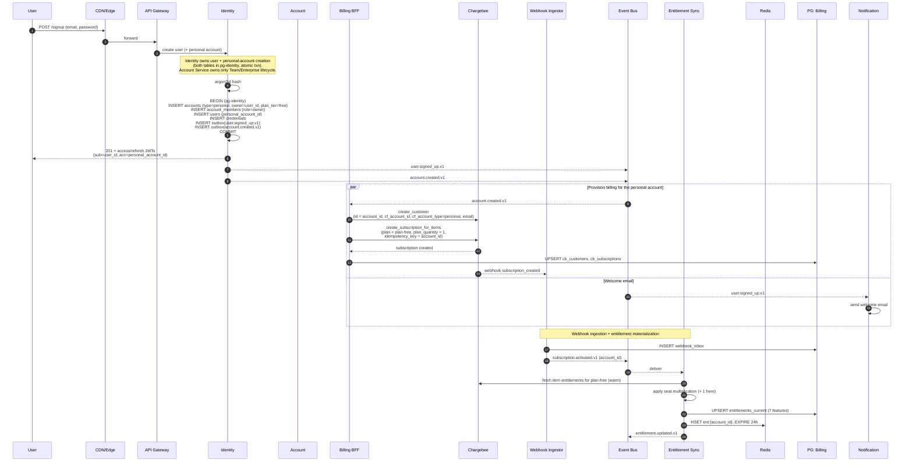
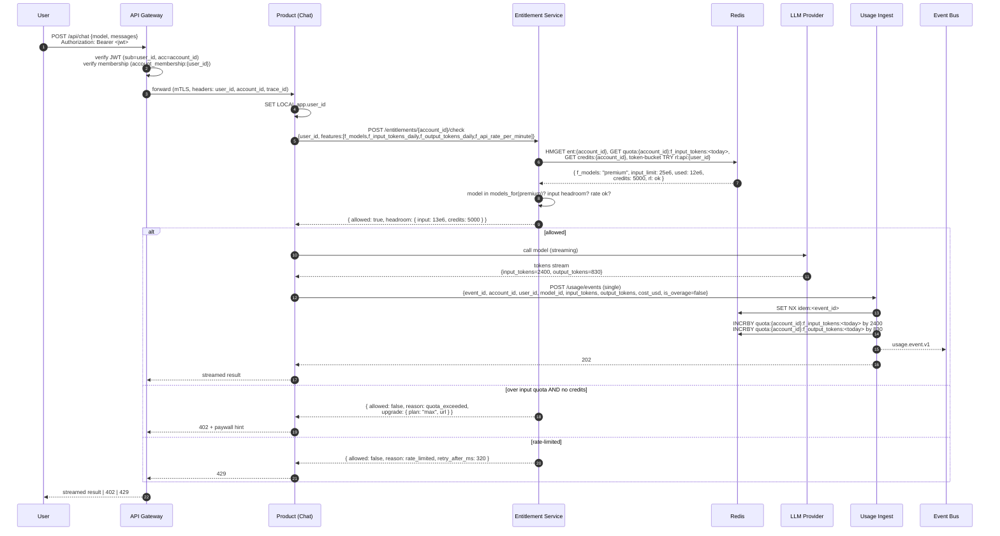
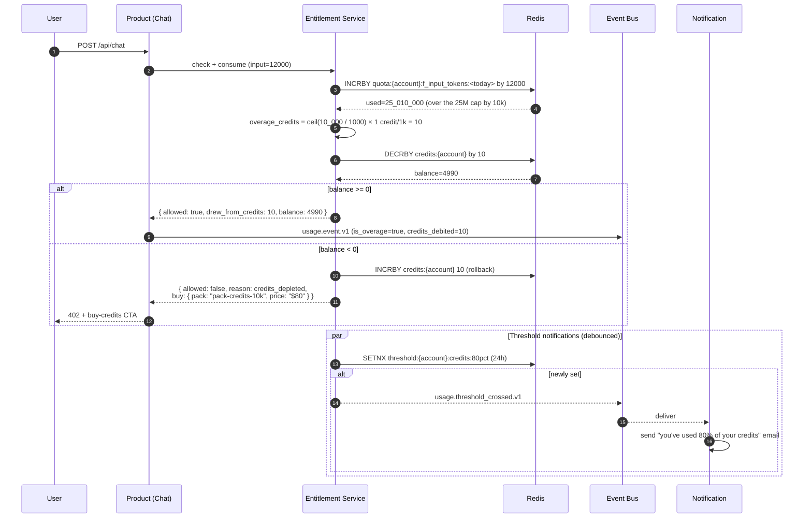
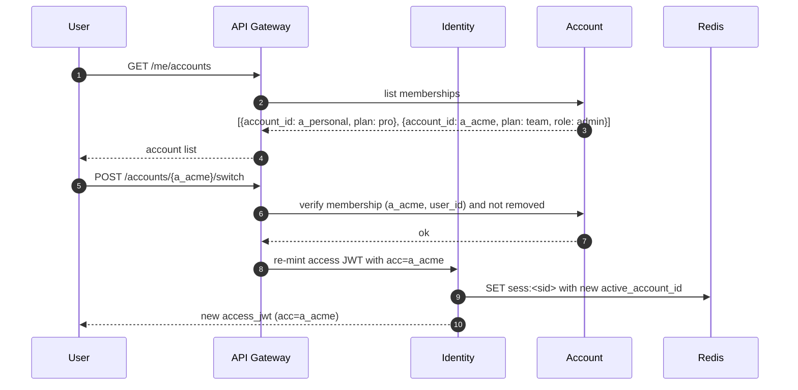
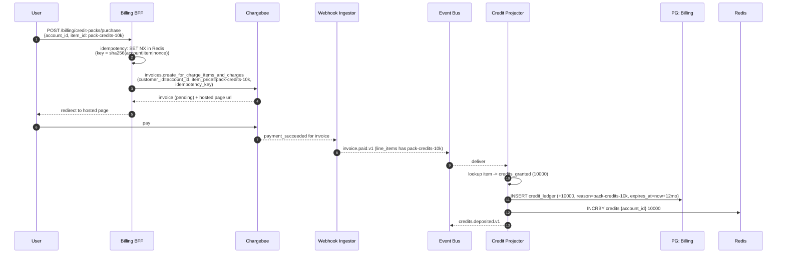
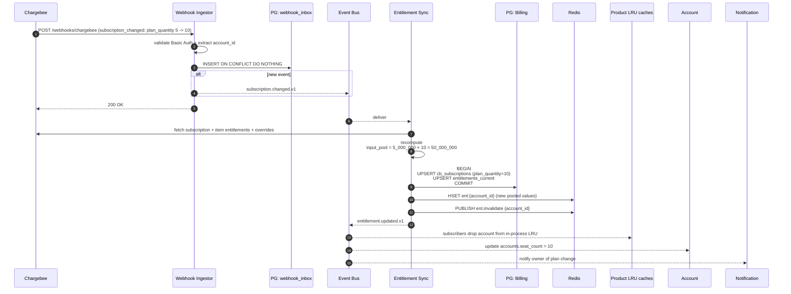
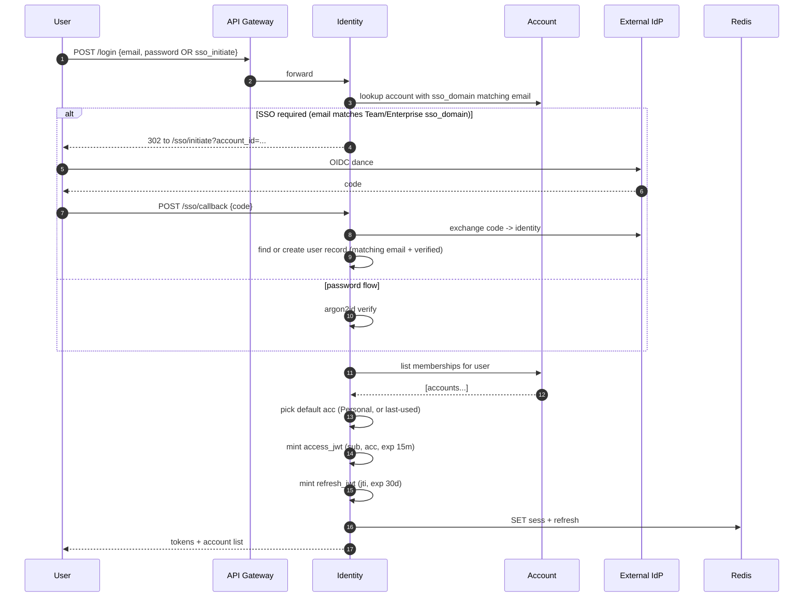
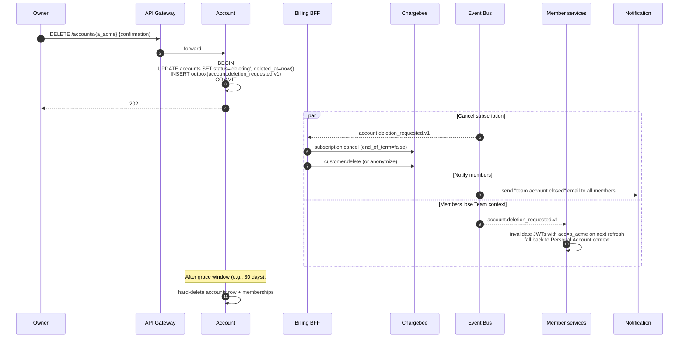
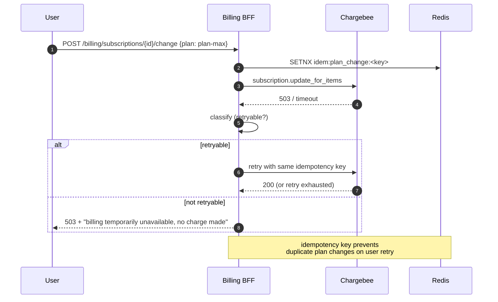

# 04 — Sequence Flows

Major end-to-end flows of the platform. Each diagram shows **synchronous calls** as solid
arrows and **asynchronous events** as dashed arrows. All flows assume the architecture in
[`01-architecture.md`](01-architecture.md) and the entitlement model in
[`07-product-and-entitlements.md`](07-product-and-entitlements.md).

Two ids travel everywhere:

- `user_id` — the authenticated human (JWT `sub`)
- `account_id` — the active billing context (JWT `acc`)

---

## 1. Self-Serve Sign-Up + Personal Account + Free Subscription (PLG)

A user signs up, gets a Personal Account, and a Free subscription is provisioned async — they
can use the product immediately.



**Key properties**

- The user is logged in **before** Chargebee provisioning completes — billing is fully async.
- Until entitlements materialise, the Entitlement Service returns the **default Free-tier set** baked in config; the product works immediately.
- `account_id` = `cb_customer_id` keeps the customer-create call naturally idempotent on retry.
- Idempotency keys: `account_id` for customer creation; `(account_id, "free")` for the subscription.

---

## 2. AI Request: Entitlement Check + Token Quota + Rate Limit (Hot Path)

The most frequent flow in the system: a user asks the AI a question. Latency budget for the
*decision*: **p99 < 50 ms** (the LLM call itself dominates total time).



**Notes**

- Entitlement check + quota INCRBY + rate-limit consume happen in **one Redis round-trip** via a Lua script (sub-ms).
- Quota INCRBY is "speculative": if the LLM call fails, the Product Service emits a **negative** `usage.event.v1` with `quantity = -input_tokens` to roll the counter back; the aggregator dedupes via `event_id`.
- The `is_overage` flag (set by Entitlement Service when used > limit and credits debited instead) tags the event so finance can separate plan usage from overage.

---

## 3. Token Overage → Credit Debit → Pack Purchase

When the daily quota is exhausted, requests fall back to the credit balance. When credits run
out, the user is offered a credit pack.



The credit pack purchase is a separate Billing BFF flow (§6).

---

## 4. Account Switching (User Has Multiple Accounts)

A user belongs to their Personal Account plus a Team Account. They switch context.



The frontend keeps a single refresh token; the access token is short-lived (15 min) and
re-minted on switch. All subsequent requests carry `acc=a_acme` and are entitlement-checked
against the Team account's plan.

---

## 5. Create Team Account + Invite + Accept

Bringing teammates into a Team plan.

```mermaid
sequenceDiagram
    autonumber
    participant U as Owner User
    participant GW as API Gateway
    participant AC as Account
    participant BL as Billing BFF
    participant CB as Chargebee
    participant WH as Webhook Ingestor
    participant Bus as Event Bus
    participant ES as Entitlement Sync
    participant Redis as Redis
    participant N as Notification
    participant Inv as Invitee

    U->>GW: POST /accounts {type:team, name:"Acme", initial_seats:5}
    GW->>AC: create team account
    AC->>AC: BEGIN<br/>INSERT accounts (type=team, owner=U)<br/>INSERT account_members (role=owner)<br/>INSERT outbox(account.created.v1)<br/>COMMIT
    AC-->>U: { account_id: a_acme }

    par Provision Chargebee
        Bus-->>BL: account.created.v1 (type=team)
        BL-->>U: present checkout (because team plan is paid)
    end

    U->>GW: POST /billing/checkout-session<br/>{plan_id: plan-team, plan_quantity: 5, account_id: a_acme}
    GW->>BL: forward
    BL->>CB: hosted_pages.checkout_new_for_items<br/>(customer_id=a_acme, item_price=plan-team-USD-Monthly,<br/>quantity=5, idempotency_key)
    CB-->>BL: hosted page url
    BL-->>U: redirect to Chargebee
    U->>CB: pay
    CB-->>WH: subscription_created (plan=plan-team, plan_quantity=5)
    WH-->>Bus: subscription.activated.v1
    Bus-->>ES: deliver
    ES->>ES: resolve entitlements × plan_quantity (5)<br/>=> input_tokens_pool=25M/day, ...
    ES->>Redis: HSET ent:{a_acme}
    ES-->>Bus: entitlement.updated.v1
    Bus-->>AC: subscription.activated.v1
    AC->>AC: UPDATE accounts SET plan_tier='team', seat_count=5

    Note over U,Inv: Invite teammate
    U->>GW: POST /accounts/{a_acme}/invitations {email, role:member}
    GW->>AC: create invitation
    AC->>AC: validate seat headroom: count(active members) < seat_count<br/>INSERT account_invitations (token_hash)<br/>INSERT outbox(account.invitation_sent.v1)
    AC-->>U: invitation created
    Bus-->>N: deliver
    N->>Inv: email with single-use link {token}

    Inv->>GW: GET /invitations/{token}/accept (after signup if needed)
    GW->>AC: accept invitation
    AC->>AC: validate token, expiry, seat headroom<br/>INSERT account_members (role=member)<br/>UPDATE invitations SET status=accepted<br/>INSERT outbox(account.member_added.v1)
    AC->>Redis: DEL account_membership:{invitee_user_id}
    AC-->>Inv: ok; you are a member of a_acme
```

**Properties**

- Seat enforcement is at **invitation acceptance**, not creation, so the owner can pre-issue invites equal to their seat count.
- Adding more seats than `plan_quantity`? Owner first calls `POST /billing/subscriptions/{id}/change` to bump quantity, which increases `f_max_seats` after the webhook lands.
- Removing a member doesn't reclaim a seat from Chargebee billing — seats are paid for whether or not filled, until the next plan change.

---

## 6. Credit Pack Purchase



The user sees the new balance after the next entitlement check (within seconds).

---

## 7. Subscription Change Webhook → Entitlement Cache Invalidation

A plan change initiated from Chargebee admin or the customer portal (e.g., owner upgrades
Team from 5 to 10 seats).



**Convergence target:** webhook receipt → Redis updated within **5 s p99**, end-to-end visible
within **30 s p99** (LRU TTL bounds the worst case).

---

## 8. Login (with Optional Account-Scoped SSO)



---

## 9. Account Deletion

A user deletes a Team account they own. Distinct from "delete my user" which is owner-driven
on the Personal Account.



Deleting the **user** (Personal Account) follows the deletion flow shown in the previous
revision — it cancels both Personal and any solo-owned Team accounts.

---

## 10. Failure Path: Chargebee Outage During Plan Change



Every Chargebee mutation in Billing BFF carries an idempotency key derived from
`sha256(account_id|operation|inputs|nonce)` held in Redis 24h. Retries are safe.

---

## 11. End-to-End Tracing

Every flow above carries a **W3C trace context**:

- HTTP headers `traceparent` / `tracestate` between services
- Bus event field `trace_id` (and `span_id` of the producer)
- ClickHouse `trace_id` column on `usage_events` and `product_events`
- Chargebee API calls carry `traceparent` in a custom header (terminates at the boundary)

This enables a single trace view for "user clicked upgrade → paid → entitlement updated →
first AI request after upgrade succeeded with the new model" — the most-asked support
question in PLG products.
