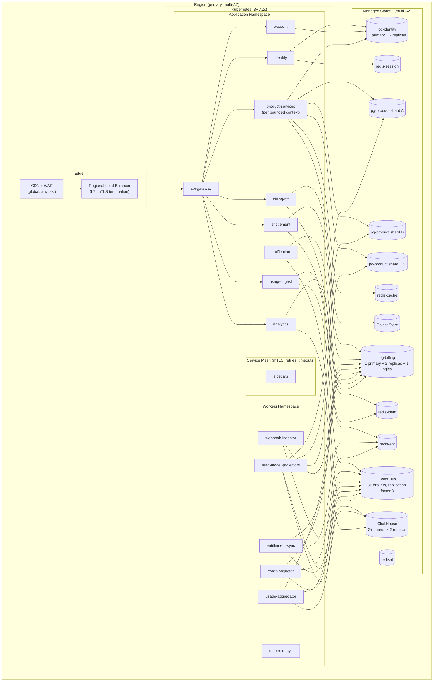
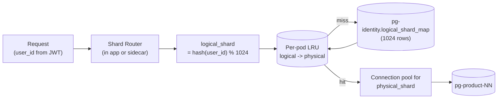

# 05 — Scaling & Deployment

This document specifies **how each component scales independently**, the **deployment
topology**, and a **capacity model** for 100M users.

---

## 1. Independent Scaling Axes

Every tier scales on a different bottleneck. Crossing these axes — coupling two tiers — is
the most common architectural sin in SaaS platforms; this design avoids it.

| Tier | Bottleneck | Scale knob | What does *not* scale it |
|---|---|---|---|
| Edge / API Gateway | RPS, TLS terminations | Pod replicas, regions, CDN PoPs | DB size |
| Identity, Account, Product, Billing BFF | RPS, CPU, connection pool | Pod replicas (HPA on CPU + RPS) | Redis size, CB rate limit |
| Entitlement Service | Read QPS, p99 | Pod replicas, Redis cluster size | Product service count |
| Usage Ingest | Ingress RPS | Pod replicas, bus partitions | ClickHouse size |
| Usage Aggregator | Bus consumer lag | Consumer group size = bus partitions | API tier |
| Webhook Ingestor | Webhook QPS | Pod replicas | PG-billing size |
| PG-identity / PG-billing | Write IOPS, replication lag | Vertical (instance) + read replicas | Other PG clusters |
| PG-product | Write IOPS, storage | **Horizontal sharding** (more shards) | Replicas alone |
| Redis (per cluster) | Memory, ops/sec | Cluster nodes, key-space partitioning | Other Redis clusters |
| ClickHouse | Insert throughput, query concurrency | Shards (insert), replicas (query) | PG |
| Event Bus | Partition count, broker count | Partitions per topic, brokers | Consumer count |

**Rule of thumb:** if a metric on tier *A* causes a scale event on tier *B*, you have an
unwanted coupling. Audit it.

---

## 2. Deployment Topology

The Product Services read `pg-identity` only for the **logical→physical shard map** (1024
rows, cached for 5 minutes per pod). The Account Service shares the `pg-identity` cluster but
writes to its own tables (`accounts`, `account_members`, `account_invitations`).

### 2.1 Multi-Region

For global latency and DR, the architecture is **active-active per region for stateless
tiers** and **active-passive for stateful tiers** initially, with selective active-active for
specific stores:

| Component | Initial topology | Eventual topology |
|---|---|---|
| Edge / CDN | Global anycast | unchanged |
| API gateway, app services, workers | Active-active per region | unchanged |
| `pg-identity`, `pg-billing` | Single-region primary; read replicas in other regions | Logical replication per-region for reads |
| `pg-product` shards | Pinned to a user home region (in `users.home_region`) | Cross-region replicas for DR |
| Redis | Per-region clusters (no global state) | unchanged |
| ClickHouse | Per-region; daily cross-region replication for finance | Aggregation tier in primary region |
| Event Bus | Per-region; cross-region mirror for critical topics | unchanged |
| Chargebee | Single global Chargebee site | unchanged |

**User home region** is stamped on the user at signup based on signup IP / chosen region;
all of their product data lives in that region. The home region is part of the JWT and drives
request routing at the API gateway.

### 2.2 Environments

| Env | Purpose | Sizing |
|---|---|---|
| `dev` | Per-developer namespaces, in-cluster Redis/PG | Smallest viable |
| `staging` | Integration, performance tests | ~10% of prod |
| `prod` | Production | Capacity plan below |

Chargebee has matching **sites**: `acme-test` (dev/staging) and `acme` (prod). The
`environment` custom field on every customer prevents cross-talk if data ever leaks.

---

## 3. Capacity Model (100M users)

### 3.1 Workload Inputs

| Input | Estimate |
|---|---|
| Total users | 100M (50M paid + 50M free) |
| Total accounts | ~100M Personal + ~1–5M Team + ~1k Enterprise |
| DAU | ~40M |
| Authenticated requests / DAU / day | ~200 (chats, code suggestions, etc.) |
| Total app RPS (peak) | ~150–300k |
| AI/LLM calls / sec (peak) | ~10–30k (each emits a usage.event.v1) |
| Tokens metered / day (across fleet) | ~10–100B |
| Total usage events RPS (peak) | ~30–60k |
| Webhook events / sec from Chargebee (sustained / peak) | 2k / 20k |

### 3.2 PostgreSQL

| Cluster | Working set | Sizing | Notes |
|---|---|---|---|
| `pg-identity` | 100M users + ~100M accounts + memberships + credentials + MFA + 1024-row shard map → ~120 GB | 1 primary (16 vCPU / 64 GB / NVMe) + 2 replicas | Auth load is read-heavy → replicas absorb |
| `pg-billing` | ~100M subs + ~300M invoices/yr + entitlements (~3 KB × 100M ≈ 300 GB) + credit ledger (~50M rows/yr) | 1 primary (32 vCPU / 128 GB / NVMe 2 TB) + 2 replicas + 1 logical replica | Heaviest by data volume |
| `pg-product` | Domain-dependent; assume ~5 KB / user / domain | **32 physical shards** initially, each ~2 TB | Sized so a single shard outage = ~3% of users impacted |

**Connection budgets (per cluster):**

- Use PgBouncer in **transaction pooling** mode in front of each cluster.
- Backend connections per primary: ~400 (for 32 vCPU). Frontend connections per pod: 5.
- Sized for ~80 pods per cluster before adding read replicas.

### 3.3 Redis

| Cluster | Memory | Ops/sec |
|---|---|---|
| `redis-session` | ~40 GB (40M sessions × ~1 KB) | ~200k |
| `redis-ent` | ~250 GB (100M accounts × ~2.5 KB ent + credits balance) | ~400k peak |
| `redis-rl` | ~30 GB (account-pooled token quotas + per-user rate buckets) | ~300k |
| `redis-idem` | ~5 GB (24h TTL keys) | ~30k |
| `redis-cache` | ~50 GB | ~100k |

`redis-ent` at 250 GB requires a **multi-shard cluster** (e.g., 16+ shards × 16 GB), with
hash-tag co-location of all keys for an account (`ent:{account_id}`, `credits:{account_id}`).

### 3.4 ClickHouse

- Usage events at ~30k events/s × 86,400 s ≈ **2.6B events/day**.
- Each AI call emits 1 usage event with `input_tokens` + `output_tokens` (no per-token row — tokens are quantities on a single row).
- Average row size after `LowCardinality` compression: ~120 B (richer schema than generic).
- Daily raw volume: ~300 GB; with replication factor 2 and 13-month retention: ~120 TB.
- **Initial cluster:** 8 shards × 2 replicas, 64 vCPU / 256 GB / 4 TB NVMe per node. Scale by adding shards.

### 3.5 Event Bus

- Producer peak: ~50k events/s.
- Consumer fan-out: ~3 (usage aggregator + projectors + notification).
- **Topic partitions:** start at **256 per high-volume topic** (`usage.event.v1`); 32 for control-plane topics. Partition count is sized so the cluster can grow to 4× without re-partitioning hot topics.
- Brokers: 6+ initially, replication factor 3, min ISR 2.

### 3.6 Chargebee Rate Limits

Chargebee enforces site-level API rate limits. The platform respects them by:

1. **Per-site rate-limit token bucket** in `redis-rl` (`rl:cb:global`) shared by all callers.
2. Billing BFF, Usage Aggregator, Webhook Ingestor (for `fetch entitlements`) all consume from this bucket.
3. Burst credits reserved for foreground operations (Billing BFF) > background (reconcilers).

---

## 4. Auto-Scaling Rules

| Component | Primary signal | Secondary signal | Floor | Ceiling |
|---|---|---|---|---|
| API Gateway | RPS / pod | p95 latency | 6 | 200 |
| Application services | CPU 60% | RPS / pod | 3 / service | 100 / service |
| Entitlement Service | RPS, p99 < 5 ms | Redis pool saturation | 6 | 200 |
| Usage Ingest | RPS, queue depth | CPU | 6 | 100 |
| Usage Aggregator | Bus consumer lag | CPU | = partitions / 4 | = partitions |
| Webhook Ingestor | RPS | Inbox lag | 4 | 50 |
| Entitlement Sync | Bus consumer lag | PG pool wait | 4 | 64 |
| Credit Projector | Bus consumer lag | PG pool wait | 2 | 32 |
| Notification | Bus consumer lag | provider rate-limit | 2 | 32 |
| PG primaries | Manual / planned | — | — | vertical only |
| Redis | Manual (cluster reshape) | memory % | — | scale-out |
| ClickHouse | Manual (add shard) | disk %, query queue | — | scale-out |
| Bus | Manual (add brokers / partitions) | producer latency | — | scale-out |

**HPA pattern:** all stateless services have a `HorizontalPodAutoscaler` with both CPU and a
custom metric (RPS or consumer lag), and a `PodDisruptionBudget` with `minAvailable = 50%`.

---

## 5. Sharding Strategy for `pg-product`

**Properties**

- 1024 logical shards mapped to 32 (initial) physical shards via a tiny lookup table.
- The logical shard for any user is a **deterministic hash** — no per-user routing row required, so the directory does not grow with user count.
- Splitting a physical shard means re-pointing some logical shards in the map; no user rehash.
- The map itself is cached aggressively (TTL 5 min) and invalidated by event when remapping happens.
- Each pod holds N PG connection pools, one per physical shard it has touched recently (LRU bound).

**Migration of a user between shards** (rare, e.g., for residency change):

1. Mark `users.status = 'migrating'` (writes pause via a guard at the service layer).
2. Copy data with a per-user export → import job from source to target shard.
3. Update `users.home_region` and any per-user routing override (added when needed).
4. Resume writes; drop on source after a verification window.

---

## 6. Deployment & Release

| Concern | Approach |
|---|---|
| Container images | One image per service, semver tags + git SHA |
| Rollouts | Argo Rollouts / Flagger; **canary** for app services, **blue/green** for control plane |
| Migrations | Online (e.g., expand-migrate-contract); never destructive deploys |
| Feature flags | Runtime flags keyed by `user_id` for risky changes; default-off |
| Schema changes | Reviewed against shard count; backfills via dedicated jobs, not deploy |
| DLQ ops | Every consumer has a DLQ topic; ops can replay with a CLI |

---

## 7. Capacity Triggers (When To Scale)

| Trigger | Action |
|---|---|
| Bus partition lag > 30 s p99 for 10 min | Scale consumer group; if at partition count, add partitions |
| `redis-ent` memory > 75% | Add cluster shards |
| `pg-product` shard > 70% disk OR > 60% IOPS | Plan a shard split |
| ClickHouse disk > 70% | Add a CH shard; migrate the largest partitions |
| Chargebee API 429 rate > 0.1% | Tighten rl bucket; defer reconcilers |
| Entitlement sync lag > 30 s | Page on-call; check Bus + PG-billing health |
