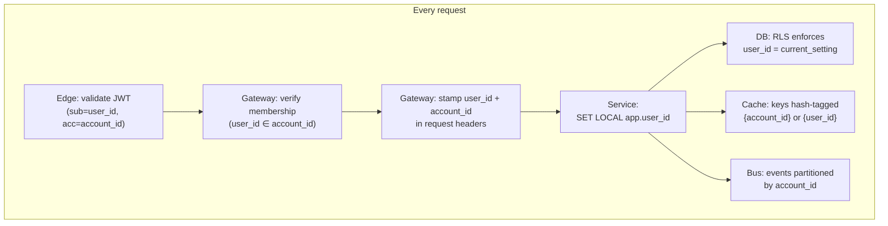
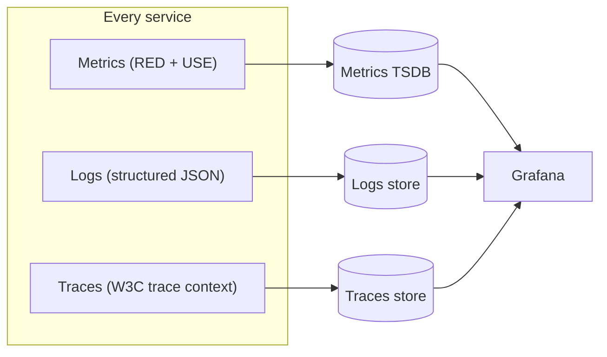

# 06 — Cross-Cutting Concerns

Per-user / per-account isolation, security, observability, SLOs, and disaster recovery.
These concerns apply to **every** service and must not be retrofitted later.

---

## 1. Isolation Model

The platform uses the **pool model** (shared infrastructure) with **two partition keys**:

- **`user_id`** isolates **product data** (one user's chats/conversations)
- **`account_id`** isolates **billing & entitlements** (one account's plan, quotas, members)

Hard isolation rules below are non-negotiable.

### 1.1 Rules

1. **Every row in product schemas has `user_id NOT NULL`** as the first column with PG RLS enforcing `user_id = current_setting('app.user_id')`.
2. **Every row in billing schemas has `account_id NOT NULL`** indexed.
3. **Every index begins with the partition key** of its table.
4. **The application framework MUST refuse a product query with no user context** and a billing/entitlement query with no account context.
5. **Cache keys are hash-tagged** with the appropriate scope: `ent:{account_id}`, `quota:{account_id}:...`, `rl:api:{user_id}`. Cross-account collisions are impossible by construction.
6. **Bus partition key = `account_id`** so per-account ordering is preserved (entitlement updates, billing events, member changes).
7. **Membership is verified at the gateway** on every request: the JWT claim `acc` must exist in `account_membership:{user_id}` (Redis SET refreshed from PG, invalidated on member events). A user with a stolen JWT for a Team account they were just removed from gets a `403` on the next request.
8. **Tracing carries both `user_id` and `account_id` as span attributes** but never PII; both are stable opaque identifiers.

### 1.2 Noisy-Neighbour Mitigation

| Mitigation | Where |
|---|---|
| Token-bucket rate limit per `user_id` per route | API Gateway (Redis) |
| Account-pooled token quotas with hard cap (then credits, then 402) | Entitlement Service |
| Per-user **adaptive concurrency** at the API tier | App framework |
| Bus partitions distribute load; no single account can saturate a single consumer | Bus design |
| ClickHouse query quotas per `account_id` for dashboards | CH user profiles |
| Per-user PG statement cost limits | Application layer (timeout) |
| **High-traffic user migration to a dedicated `pg-product` shard** | Shard split process (`05` §5) |

### 1.3 Pinned-Shard Users (Optional)

Specific users (high-volume Enterprise members, automated workloads) can opt into a **pinned shard**:

- A row in `pg-identity.user_shard_override` (added when first such user appears) takes precedence over the deterministic hash.
- The user's product data lives on a dedicated `pg-product` shard.
- The application stack stays the same; only the routing is pinned.

This avoids the weight of a fully isolated deployment while protecting other users from
noisy-neighbour effects.

---

## 2. Security

### 2.1 Authentication & Authorization

| Boundary | Mechanism |
|---|---|
| End user → Edge | OAuth2/OIDC; access token (15 min) + refresh token (30 d) |
| Edge → service | mTLS via service mesh; JWT propagated as `Authorization` header |
| Service → service | mTLS + signed JWT (short-lived service identity) |
| Service → PG | mTLS, password rotated by secret manager |
| Service → Redis | TLS, ACL per service |
| Service → Bus | mTLS, ACLs per topic |
| Service → Chargebee | API key per environment, in env var, rotated quarterly |
| Webhook from Chargebee → us | HTTPS Basic Auth credentials, rotated quarterly, validated with `secrets.compare_digest` |

**Authorization model** has three layers:

1. **Resource ownership (RLS)** — product rows are accessible only to the user that owns them (`user_id = current user`). Enforced by Postgres, not by application code.
2. **Account membership** — to act in a given account context, the user must be an active member of that account (verified at the gateway against `account_membership:{user_id}` cache).
3. **Account role** — within an account, four roles: `owner`, `admin`, `member`, `billing`.
   - `owner` / `admin` — manage members, plans, billing
   - `billing` — manage plans/billing only (limited admin for finance staff)
   - `member` — use the product

**ABAC** is layered on top via the Entitlement Service for feature gating (does this account
have the entitlement to invoke this feature *at all*?). Roles + entitlements together gate
every sensitive action.

### 2.2 Secrets Management

- A central secret manager (AWS Secrets Manager / HashiCorp Vault).
- Pods receive secrets at start via projected volumes; **never** baked into images.
- Rotation is automated; rotating Chargebee API keys triggers a rolling restart of Billing BFF and Usage Aggregator.

### 2.3 Data Protection

| Data | At rest | In transit |
|---|---|---|
| All databases | Disk encryption (KMS) | TLS |
| Object store | SSE-KMS, per-user prefixes | TLS |
| PII columns (email, name) | Application-layer encryption with envelope keys | TLS |
| Payment data | **Never stored** locally — Chargebee + payment processor |
| Backups | Encrypted, immutable retention | TLS |

**Right to be forgotten** has two flavours:

- **User deletion** — cancels all accounts the user solely owns; for accounts they're a member of, removes the membership; deletes their product data (per-`user_id` purge across shards).
- **Account deletion** — cancels the account's Chargebee subscription, removes all members, and tombstones the account row.

Each owning service runs a deletion job for its tables on the corresponding events; ClickHouse
uses partition drops + lightweight `DELETE` against `product_events`/`usage_events`; the
Chargebee customer is anonymized via the Chargebee API. Tombstones are retained for 30 days
to satisfy refund/dispute windows, then hard-deleted.

### 2.4 Input Validation & API Surface

- Validation at the **edge of the service** (controller layer); no trust of cross-service input.
- Strict JSON schemas for events; a registry rejects unknown event versions.
- All DB access is parameterised; no string concatenation.
- Output encoding done in the controller; no HTML in domain entities.

### 2.5 Threat Model Summary

| Threat | Control |
|---|---|
| Cross-user data leak | RLS + cache hash tags + bus partitioning |
| Cross-account leak (one user accessing another's account context) | Membership check at gateway + account-keyed entitlement cache |
| Account takeover | MFA, anomalous login detection, refresh-token denylist |
| Stale JWT after member removal | `account_membership:{user_id}` invalidated on member events; checked at gateway |
| Replay attacks | Idempotency keys with TTL, signed timestamps on webhooks |
| Webhook spoofing | Basic Auth + IP allowlist of Chargebee egress |
| SQL injection | Parameterised queries; static analysis in CI |
| SSRF | Egress allowlist + URL validators; outbound webhooks via dedicated worker network policy |
| LLM prompt-injection / data exfiltration | Tool-allowlist per model; per-account redaction policies; PII-scrubbing on outbound prompts (Enterprise) |
| Mass-signup abuse (free tier) | Edge bot detection, email verification gating expensive features, per-IP signup rate limit, device fingerprint heuristics |
| Free-tier credit-pack fraud (chargebacks) | Pack invoice not credited until `payment_succeeded`; chargeback events trigger ledger reversal |
| Supply chain | SBOM, image signing, admission policies |

> **Free-tier abuse** is the dominant fraud vector for B2C PLG: throwaway emails created en
> masse to game free quotas. The platform mitigates with email verification, edge bot
> management, and entitlement gates that require a verified email + phone (or payment method
> on file) before granting expensive features.

---

## 3. Observability

### 3.1 Three Signals

**Logs**

- JSON, fields: `ts`, `level`, `service`, `trace_id`, `span_id`, `user_id`, `event`, `attrs`.
- No free-form interpolation; structured key/value only.
- PII redaction at the SDK layer (centralised allow-list of fields).

**Metrics**

- Per-service **RED**: rate, errors, duration (p50/p95/p99).
- Per-store **USE**: utilisation, saturation, errors.
- Per-domain: bus consumer lag, webhook inbox depth, CB push success/fail, entitlement sync convergence time.

**Traces**

- W3C trace context end-to-end.
- Sampling: 100% on errors, 1% on success, with **head-based** + **tail-based** combined sampling.
- Trace IDs persisted on usage events and product events in ClickHouse for join.

### 3.2 Critical Dashboards

| Dashboard | Owner | Key panels |
|---|---|---|
| API gateway health | Platform | RPS, p99 by route, 5xx rate, rate-limit rejections |
| Entitlement hot path | Platform | p99 by tier (LRU/Redis/PG), miss rates |
| Chargebee integration | Billing | API success rate, 429 rate, webhook lag, sync convergence time |
| Usage pipeline | Data | events/sec ingested, CH insert latency, CB push delta, push failures |
| PG-billing | Platform | replication lag, write IOPS, connection pool wait |
| User top-N | Platform | RPS, error %, storage, by `user_id` (for noisy-neighbour ops) |

### 3.3 Alerts (paging)

| Alert | Threshold | Reason |
|---|---|---|
| Entitlement sync lag | > 30 s for 5 min | Users paid but unblocked |
| CB webhook inbox unprocessed | > 1000 for 10 min | Loss of billing visibility |
| Usage aggregator CB push failure | > 1% for 30 min | Revenue leak |
| API 5xx | > 1% for 5 min | User impact |
| Bus consumer lag (any critical topic) | > 60 s p99 for 10 min | Pipeline stall |
| PG primary replication lag | > 30 s | DR readiness |
| Free-tier signup rate spike | > 10× rolling baseline | Abuse / bot wave |

---

## 4. SLOs

| Service / Flow | SLI | SLO | Error budget (30d) |
|---|---|---|---|
| Public API availability | 2xx + 4xx (excluding 402/429) | 99.95% | 21.6 min |
| Public API latency | p99 of authenticated non-LLM request | < 300 ms | — |
| Entitlement check + quota INCRBY (in-cluster) | p99 | < 5 ms | — |
| AI request decision (entitlement + rate + quota) | p99 | < 50 ms | — |
| Sign-up to logged-in | success rate | 99.99% | — |
| Checkout completion (CB success → entitlement updated) | p99 | < 10 s | — |
| Credit pack purchase (paid → balance visible) | p99 | < 30 s | — |
| Team invite accept → seat counted | p99 | < 5 s | — |
| Webhook ingestion ack | p99 | < 200 ms | — |
| Usage event ingestion | p99 (client perceived) | < 50 ms | — |
| Usage event → ClickHouse visible | p99 | < 60 s | — |
| Usage push to CB convergence (metered tiers) | p99 | < 5 min | — |
| Finance recon drift (token usage vs CB invoice) | < 0.1% per item-price per period | hard cap | — |
| Credit ledger drift (purchased − debited == balance) | 0% | hard cap | — |

When the **error budget** for a SLO is exhausted, feature deploys for that service freeze
until budget is restored or a post-mortem authorises an exception.

---

## 5. Resilience & Disaster Recovery

### 5.1 Failure Domains

| Domain | Blast radius |
|---|---|
| One pod | 0 (load balanced) |
| One AZ | Slight latency, no data loss |
| One region (primary) | Stateful failover; minutes of write unavailability |
| One PG shard (`pg-product`) | Users on that shard only; ~3% impact at 32 shards |
| Redis cluster | Hot path degraded → falls back to PG |
| Chargebee outage | New checkouts blocked; existing usage continues; convergence delayed |
| Bus | Producers buffer to outbox; consumers idle; no data loss |

### 5.2 RPO / RTO

| Component | RPO | RTO |
|---|---|---|
| `pg-*` clusters | ≤ 5 min (continuous WAL) | < 30 min (failover or restore) |
| Redis (cache) | N/A (rebuildable) | < 10 min (rebuild from PG) |
| Redis (idempotency, sessions) | ≤ 1 min | < 5 min (replicated) |
| ClickHouse | ≤ 1 hour (replicated + daily backup) | < 1 hour (replica promotion) |
| Bus | ≤ 1 min (replicated) | < 5 min |
| Object store | 0 (provider durability) | < 5 min |
| Chargebee | depends on Chargebee | depends on Chargebee |

### 5.3 Resilience Patterns

| Pattern | Where |
|---|---|
| Circuit breaker | All inter-service calls and Chargebee SDK |
| Bulkheads (per-dependency thread/connection pools) | Every adapter |
| Timeouts (no naked calls) | Mesh-enforced default 500 ms; per-route override |
| Retries with exponential backoff + jitter | Idempotent operations only |
| Idempotency keys | Every Chargebee mutation, every event consumer |
| Outbox + Inbox | Producer + consumer of every event |
| DLQ | Every consumer; named `<consumer>.dlq` |
| Chaos drills | Monthly: kill a pod, kill an AZ, simulate Chargebee 5xx, simulate Redis loss |
| Game days | Quarterly: failover `pg-billing`; replay a day of webhooks |

---

## 6. Compliance & Audit

| Concern | Mechanism |
|---|---|
| Audit log of admin actions | Append-only ClickHouse table `audit_log`; immutable, retained 7 yrs |
| SOC 2 / ISO 27001 controls | Mapped to platform controls (access reviews, change mgmt, vuln scans) |
| GDPR DSR (export, delete) | Self-serve in user settings; backed by per-service exporters writing to object store |
| Data residency | User home region; no cross-region writes for product data |
| PCI scope | Out: payment data never enters platform. In: tokenisation only via Chargebee. |
| Tax | Chargebee handles tax computation via integrations; platform does not |

---

## 7. Implementation Checklist (per service)

When implementing a new service in this architecture, an agent must verify each item:

- [ ] Service has a single owner and a single bounded context.
- [ ] All persistent state is owned by the service alone.
- [ ] Every public route is documented (OpenAPI / equivalent).
- [ ] Every event the service produces is in the event registry with a versioned schema and includes `account_id` + `user_id` in the envelope.
- [ ] Every event the service consumes has an idempotency strategy keyed by `event_id`.
- [ ] Every Chargebee call (if any) goes through Billing BFF, with idempotency keys.
- [ ] Every PG write is wrapped in a transaction that also writes the outbox.
- [ ] Every product table starts with `user_id` and has RLS enabled.
- [ ] Every billing/entitlement table is keyed by `account_id` and indexed on it first.
- [ ] Every cache key is hash-tagged on `{account_id}` (billing/ent) or `{user_id}` (per-user state).
- [ ] Health endpoints `GET /healthz` and `GET /readyz` exist.
- [ ] Metrics, structured logs, and traces are emitted with both `user_id` and `account_id` attributes.
- [ ] HPA + PDB defined; resources requested + limited.
- [ ] Service has a DLQ for every consumed topic.
- [ ] Failure modes documented (what does it do when its DB / Redis / Bus / Chargebee is down).
- [ ] Deletion handlers exist for both `user.deletion_requested.v1` AND `account.deletion_requested.v1`.
- [ ] Runbook exists for the top 5 alert conditions.
