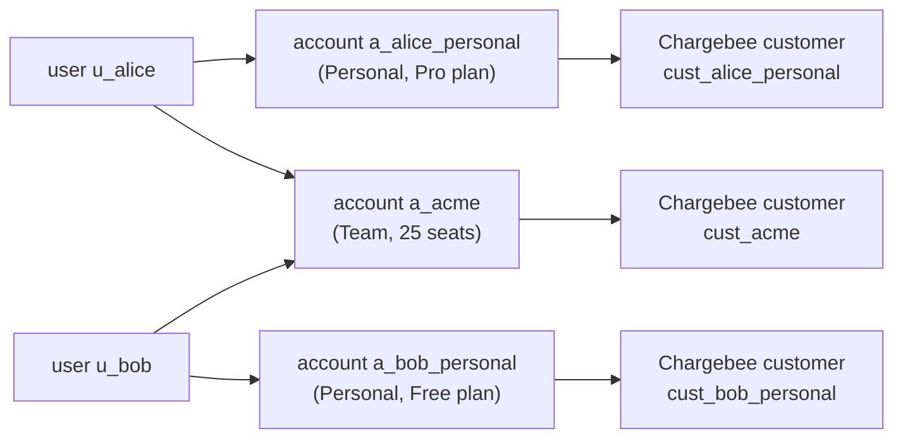
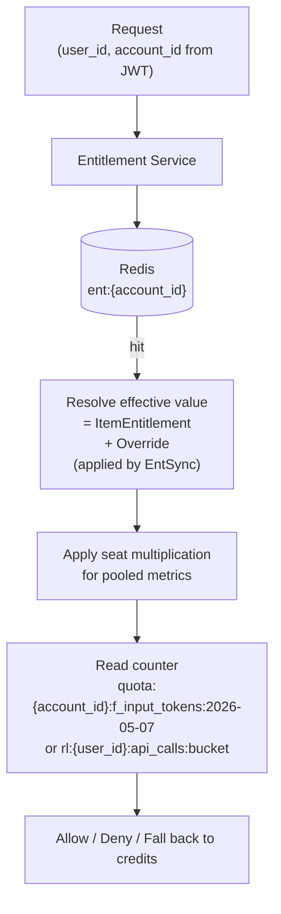
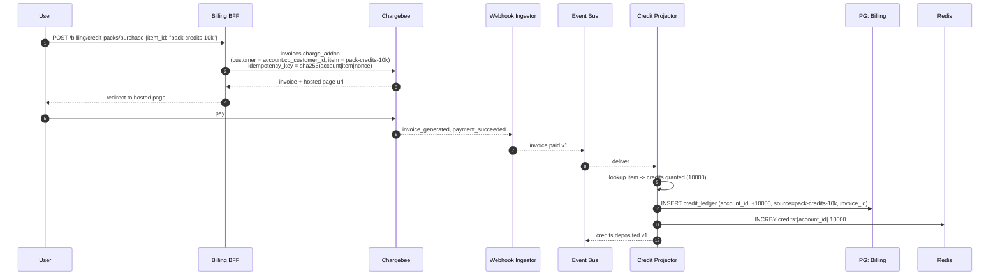

# 07 — Product, Tiers, and Chargebee Entitlement Catalog

This is the canonical specification of the **product**, its **tiers**, and the
**Chargebee Product Catalog 2.0** configuration that backs them. Generic platform docs
(`[01](01-architecture.md)`…`[06](06-cross-cutting.md)`) point here for concrete entitlements.

The product is an **AI coding/productivity assistant** (Cursor-class). The platform monetises
through tiered subscriptions plus pay-as-you-go credit packs.

---

## 1. Account Concept (Billing Subject)

To support Team and Enterprise tiers (multi-seat) while keeping individual sign-up frictionless:

- `**User`** = identity (auth subject). Always one human.
- `**Account`** = billing subject = **Chargebee customer (1:1)**. Has 1..N member users.
- Every user has **one Personal Account** auto-created at sign-up with the user as sole owner. Free / Pro / Max plans run on a Personal Account.
- A user may additionally **create or join Team / Enterprise Accounts** (separate Chargebee customers, multi-seat plans).
- **Active account context** (`acc` claim in JWT) determines which entitlements apply to the request.




The Personal Account is invisible to the user in the UI for solo users — they don't see
"accounts"; they just see "my plan". The concept matters only because the system needs a
billing subject for every subscription.

---

## 2. Tiers


| Tier           | Account type | Pricing                         | Target user              |
| -------------- | ------------ | ------------------------------- | ------------------------ |
| **Free**       | Personal     | $0                              | Try the product          |
| **Pro**        | Personal     | $20 / month                     | Solo professional        |
| **Max**        | Personal     | $100 / month                    | Power user (heavy usage) |
| **Team**       | Team         | $30 / seat / month, min 2 seats | Small to mid teams       |
| **Enterprise** | Enterprise   | Custom (contract)               | Large organisations      |


A user can upgrade Free → Pro → Max within their Personal Account. Switching from Personal
plans to Team/Enterprise creates a **new account** rather than mutating the personal one.

---

## 3. Entitlement Catalog (Logical View)

Seven entitlements drive the product. **All entitlements are stored in Chargebee** as
*Features*; values are attached to Items (plans) as *Item Entitlements*.


| ID                      | Chargebee `feature.type` | `unit`    | Scope at runtime | Notes                                   |
| ----------------------- | ------------------------ | --------- | ---------------- | --------------------------------------- |
| `f_input_tokens_daily`  | `quantity`               | `token`   | account-pooled   | Resets daily 00:00 UTC                  |
| `f_output_tokens_daily` | `quantity`               | `token`   | account-pooled   | Resets daily 00:00 UTC                  |
| `f_credits_monthly`     | `quantity`               | `credit`  | account-pooled   | Plan-granted; plus purchased packs      |
| `f_api_rate_per_minute` | `quantity`               | `request` | per-user         | Token bucket per member                 |
| `f_max_seats`           | `quantity`               | `seat`    | account-wide     | = `subscription.plan_quantity` for Team |
| `f_sso`                 | `switch`                 | —         | account-wide     | Boolean                                 |
| `f_models`              | `custom`                 | —         | account-wide     | Tier label → model list (mapped in app) |
| `f_prompt_customzation` | `                        |           |                  |                                         |


> **Why some entitlements are account-pooled and others per-user:** team plans share a token
> budget (predictable spend) but rate-limit per member (one bad actor can't consume the
> entire team's QPS). This matches industry norms for AI tools.

### 3.1 Entitlement Matrix


| Feature                 | Free    | Pro        | Max        | Team (per seat)                | Enterprise   |
| ----------------------- | ------- | ---------- | ---------- | ------------------------------ | ------------ |
| `f_input_tokens_daily`  | 50,000  | 1,000,000  | 10,000,000 | 5,000,000                      | unlimited    |
| `f_output_tokens_daily` | 10,000  | 200,000    | 2,000,000  | 1,000,000                      | unlimited    |
| `f_credits_monthly`     | 0       | 500        | 5,000      | 2,000                          | unlimited    |
| `f_api_rate_per_minute` | 30      | 300        | 1,000      | 500                            | 5,000        |
| `f_max_seats`           | 1       | 1          | 1          | 2..100 (subscription quantity) | unlimited    |
| `f_sso`                 | ❌       | ❌          | ❌          | ✅                              | ✅            |
| `f_models`              | `basic` | `advanced` | `premium`  | `premium`                      | `enterprise` |


**Per-seat semantics for Team:** Team plan token & credit values are **per seat**; the runtime
multiplies by current seat count (`subscription.plan_quantity`) to derive the pooled cap.
Per-user metrics (rate limit) are applied per member directly without multiplication.

```
account_pool_cap = seat_value × plan_quantity     # for input/output tokens, credits
member_cap        = seat_value                    # for api_rate_per_minute
```

### 3.2 Models (Custom Feature → App Mapping)

Chargebee stores the level as an opaque tier label. The application maps it to a model list
at runtime (config-driven, version-controlled, hot-reloadable):

```yaml
# config/models.yaml — application-level mapping (NOT in Chargebee)
basic:
  - gpt-4o-mini
  - claude-3-haiku
advanced:
  - gpt-4o-mini
  - claude-3-haiku
  - gpt-4o
  - claude-3.5-sonnet
premium:
  - gpt-4o-mini
  - claude-3-haiku
  - gpt-4o
  - claude-3.5-sonnet
  - claude-3.7-sonnet
  - gpt-5
enterprise:
  - "*"            # all premium models
  - claude-opus
  - gpt-5-pro
  - on-prem:*      # Enterprise-account-specific endpoints
```

Why this split: model availability changes weekly. We don't want to redeploy Chargebee plan
config to ship a new model. The Chargebee value is a stable tier label; the model list is a
live config artefact.

---

## 4. Chargebee Product Catalog 2.0 — Concrete Configuration

### 4.1 Item Family

```
item_family.id = ai-product
item_family.name = "AI Product"
```

### 4.2 Items (Plans)


| `item.id`         | `item.type` | `item.name` | Notes            |
| ----------------- | ----------- | ----------- | ---------------- |
| `plan-free`       | `plan`      | Free        | 1 seat, $0       |
| `plan-pro`        | `plan`      | Pro         | 1 seat           |
| `plan-max`        | `plan`      | Max         | 1 seat           |
| `plan-team`       | `plan`      | Team        | per-seat pricing |
| `plan-enterprise` | `plan`      | Enterprise  | custom contract  |


### 4.3 Items (Credit Packs — One-Time Charges)

Credit packs are **one-time purchases** (Item type = `charge`). Buying a pack triggers a
Chargebee invoice; the charge event drives a credit deposit in our system.


| `item.id`           | `item.type` | Price | Credits granted |
| ------------------- | ----------- | ----- | --------------- |
| `pack-credits-1k`   | `charge`    | $10   | 1,000           |
| `pack-credits-10k`  | `charge`    | $80   | 10,000          |
| `pack-credits-100k` | `charge`    | $700  | 100,000         |


### 4.4 Item Prices (per region/cadence)

For each plan, define multiple item-prices for currency × cadence:

```
plan-pro-USD-Monthly        $20.00 / month
plan-pro-USD-Annual         $200.00 / year
plan-pro-EUR-Monthly        €19.00 / month
plan-max-USD-Monthly        $100.00 / month
plan-team-USD-Monthly       $30.00 / seat / month   (pricing_model = per_unit)
plan-team-USD-Annual        $300.00 / seat / year   (pricing_model = per_unit)
plan-enterprise-USD         custom (contract)        (pricing_model = flat_fee, negotiated)
```

`plan-team-*` uses `**pricing_model = per_unit**` so total = `unit_price × plan_quantity`.

### 4.5 Features (Chargebee `Feature` objects)

Created via `POST /api/v2/features`:

```jsonc
// Switch
{ "id": "f_sso", "name": "SSO", "type": "switch", "status": "active" }

// Quantity (with pre-defined levels)
{
  "id": "f_input_tokens_daily",
  "name": "Daily input tokens",
  "type": "quantity",
  "unit": "token",
  "levels": [
    { "value": "50000",     "level": 0 },
    { "value": "1000000",   "level": 1 },
    { "value": "10000000",  "level": 2 },
    { "value": "5000000",   "level": 3 },     // per-seat for Team
    { "is_unlimited": true, "level": 4 }
  ],
  "status": "active"
}

{
  "id": "f_output_tokens_daily",
  "name": "Daily output tokens",
  "type": "quantity",
  "unit": "token",
  "levels": [
    { "value": "10000",    "level": 0 },
    { "value": "200000",   "level": 1 },
    { "value": "2000000",  "level": 2 },
    { "value": "1000000",  "level": 3 },
    { "is_unlimited": true, "level": 4 }
  ]
}

{
  "id": "f_credits_monthly",
  "name": "Monthly credits",
  "type": "quantity",
  "unit": "credit",
  "levels": [
    { "value": "0",       "level": 0 },
    { "value": "500",     "level": 1 },
    { "value": "5000",    "level": 2 },
    { "value": "2000",    "level": 3 },
    { "is_unlimited": true, "level": 4 }
  ]
}

{
  "id": "f_api_rate_per_minute",
  "name": "API requests per minute",
  "type": "quantity",
  "unit": "request",
  "levels": [
    { "value": "30",   "level": 0 },
    { "value": "300",  "level": 1 },
    { "value": "1000", "level": 2 },
    { "value": "500",  "level": 3 },
    { "value": "5000", "level": 4 }
  ]
}

{
  "id": "f_max_seats",
  "name": "Max seats",
  "type": "quantity",
  "unit": "seat",
  "levels": [
    { "value": "1",       "level": 0 },
    { "value": "100",     "level": 1 },
    { "is_unlimited": true, "level": 2 }
  ]
}

// Custom
{
  "id": "f_models",
  "name": "Available models",
  "type": "custom",
  "levels": [
    { "value": "basic",      "level": 0 },
    { "value": "advanced",   "level": 1 },
    { "value": "premium",    "level": 2 },
    { "value": "enterprise", "level": 3 }
  ]
}
```

> Chargebee `quantity` features take a discrete list of pre-defined level values. Adding a
> new tier value requires updating the feature levels (idempotent; a one-time API call).

### 4.6 Item Entitlements (per-plan)

Created via `POST /api/v2/items/{item_id}/item_entitlements`:

```jsonc
// plan-free
[
  { "feature_id": "f_input_tokens_daily",  "value": "50000" },
  { "feature_id": "f_output_tokens_daily", "value": "10000" },
  { "feature_id": "f_credits_monthly",     "value": "0" },
  { "feature_id": "f_api_rate_per_minute", "value": "30" },
  { "feature_id": "f_max_seats",           "value": "1" },
  { "feature_id": "f_sso",                 "value": "false" },
  { "feature_id": "f_models",              "value": "basic" }
]

// plan-pro
[
  { "feature_id": "f_input_tokens_daily",  "value": "1000000" },
  { "feature_id": "f_output_tokens_daily", "value": "200000" },
  { "feature_id": "f_credits_monthly",     "value": "500" },
  { "feature_id": "f_api_rate_per_minute", "value": "300" },
  { "feature_id": "f_max_seats",           "value": "1" },
  { "feature_id": "f_sso",                 "value": "false" },
  { "feature_id": "f_models",              "value": "advanced" }
]

// plan-max
[
  { "feature_id": "f_input_tokens_daily",  "value": "10000000" },
  { "feature_id": "f_output_tokens_daily", "value": "2000000" },
  { "feature_id": "f_credits_monthly",     "value": "5000" },
  { "feature_id": "f_api_rate_per_minute", "value": "1000" },
  { "feature_id": "f_max_seats",           "value": "1" },
  { "feature_id": "f_sso",                 "value": "false" },
  { "feature_id": "f_models",              "value": "premium" }
]

// plan-team — values are PER SEAT; runtime multiplies by plan_quantity for pooled metrics
[
  { "feature_id": "f_input_tokens_daily",  "value": "5000000" },
  { "feature_id": "f_output_tokens_daily", "value": "1000000" },
  { "feature_id": "f_credits_monthly",     "value": "2000" },
  { "feature_id": "f_api_rate_per_minute", "value": "500" },
  { "feature_id": "f_max_seats",           "value": "100" },
  { "feature_id": "f_sso",                 "value": "true" },
  { "feature_id": "f_models",              "value": "premium" }
]

// plan-enterprise — most use "unlimited"; custom values applied via Entitlement Overrides per-customer
[
  { "feature_id": "f_input_tokens_daily",  "value": "unlimited" },
  { "feature_id": "f_output_tokens_daily", "value": "unlimited" },
  { "feature_id": "f_credits_monthly",     "value": "unlimited" },
  { "feature_id": "f_api_rate_per_minute", "value": "5000" },
  { "feature_id": "f_max_seats",           "value": "unlimited" },
  { "feature_id": "f_sso",                 "value": "true" },
  { "feature_id": "f_models",              "value": "enterprise" }
]
```

### 4.7 Per-Customer Overrides (Enterprise)

Enterprise contracts often negotiate non-standard limits. Chargebee supports this via
**Entitlement Overrides** on a subscription, leaving the plan's `Item Entitlement` defaults
intact:

```http
POST /api/v2/subscriptions/{subscription_id}/subscription_entitlements
```

```jsonc
// Acme Corp negotiates 100k req/min and a custom model list
[
  { "feature_id": "f_api_rate_per_minute", "value": "100000" }
]
```

The `Entitlement Sync Worker` materialises the override into `entitlements_current` for that
account, so the hot path doesn't need to know overrides are special.

---

## 5. Runtime Resolution




### 5.1 Token / Credit Decision Tree

For an AI request that consumes T input + O output tokens:

```
1. plan_input_cap   = ent.f_input_tokens_daily   × plan_quantity
2. plan_output_cap  = ent.f_output_tokens_daily  × plan_quantity
3. used_input  = INCRBY quota:{account}:f_input_tokens:<today>  by T
4. used_output = INCRBY quota:{account}:f_output_tokens:<today> by O
5. if used_input <= plan_input_cap  AND used_output <= plan_output_cap:
       -> Allow; do not touch credit balance
6. else:
       overage = max(0, used_input  - plan_input_cap)  * input_credit_rate
               + max(0, used_output - plan_output_cap) * output_credit_rate
       remaining_credits = DECRBY credits:{account} by overage
       if remaining_credits >= 0:
           -> Allow; deduct from credit balance
       else:
           -> Deny with 402 + paywall hint (buy credit pack OR upgrade plan)
```

`input_credit_rate` and `output_credit_rate` are app-level constants
(e.g., 1 credit per 1,000 input tokens, 4 credits per 1,000 output tokens). They are not in
Chargebee — they are pricing physics of the product.

### 5.2 Rate Limit Decision

```
allowance = ent.f_api_rate_per_minute  # per-user, no multiplication
result    = TOKEN_BUCKET.try_consume(rl:{user_id}:api_calls, allowance, refill=allowance/60s)
if result == ok:
    -> Allow
else:
    -> 429 Too Many Requests
```

### 5.3 Switch / Custom Decisions

```
if action_requires_sso and not ent.f_sso:
    -> 402 (paywall: "SSO is available on Team and above")

if requested_model not in models_for(ent.f_models):
    -> 402 (paywall: "Model X requires the Max plan or above")
```

---

## 6. Credit Pack Purchase Flow (Outline)




Credit balance is **the sum of the `credit_ledger` table** for the account, plus
plan-granted credits for the current period. The Redis counter is a cache; the ledger is the
truth.

---

## 7. Per-Member Quota vs Per-Account Pool — Cheat Sheet


| Feature                 | Counter key                                       | Limit derivation                             | Reset                                             |
| ----------------------- | ------------------------------------------------- | -------------------------------------------- | ------------------------------------------------- |
| `f_input_tokens_daily`  | `quota:{account_id}:f_input_tokens:<YYYY-MM-DD>`  | `ent.value × plan_quantity`                  | Daily 00:00 UTC                                   |
| `f_output_tokens_daily` | `quota:{account_id}:f_output_tokens:<YYYY-MM-DD>` | `ent.value × plan_quantity`                  | Daily 00:00 UTC                                   |
| `f_credits_monthly`     | `credits:{account_id}` (running balance)          | `ent.value × plan_quantity` + ledger top-ups | Plan portion: monthly; pack portion: 12-month TTL |
| `f_api_rate_per_minute` | `rl:{user_id}:api_calls:<60s_bucket>`             | `ent.value` (no multiplication)              | Sliding window                                    |
| `f_max_seats`           | n/a (enforced at invite time)                     | `ent.value`                                  | n/a                                               |
| `f_sso`                 | n/a                                               | boolean                                      | n/a                                               |
| `f_models`              | n/a                                               | tier → list at request time                  | n/a                                               |


---

## 8. Plan Change Semantics


| Change            | What happens                                                                                                                                             |
| ----------------- | -------------------------------------------------------------------------------------------------------------------------------------------------------- |
| Free → Pro        | Plan change on the Personal Account's subscription; entitlements update on next webhook (< 5 s)                                                          |
| Pro → Max         | Same as above                                                                                                                                            |
| Max → Team        | **A new Team Account is created** (new Chargebee customer, new subscription with `plan_quantity`); the user becomes the owner. Personal account remains. |
| Team seat add     | `subscription.update` with new `plan_quantity`; webhook updates `f_max_seats` ceiling and pooled caps                                                    |
| Team → Enterprise | Plan change with negotiated overrides applied via Subscription Entitlements                                                                              |
| Cancel Team       | Subscription cancelled at period end; on cancellation, members lose Team access but keep their Personal Accounts                                         |


Members do **not** lose their data when they leave a Team Account. Their data is partitioned
by `user_id`, not by `account_id`; only their billing context changes.

---

## 9. Bootstrap Script (Order of Operations for an Implementer)

When an implementer seeds Chargebee for a new environment:

1. Create the Item Family (`ai-product`).
2. Create all **Features** (§4.5).
3. Create all **Items** (plans + credit packs) (§4.2, §4.3).
4. Create **Item Prices** (§4.4) — at least USD-Monthly per plan + credit packs.
5. Create **Item Entitlements** for each plan (§4.6).
6. Configure **Webhook endpoint** with Basic Auth credentials.
7. Configure **API key** with scope = (read+write on customers, subscriptions, invoices, items, item_prices, features, entitlements).
8. Smoke test: create a customer + free subscription, verify webhook arrives, verify entitlements materialise into `pg-billing.entitlements_current`.

Bootstrap is **idempotent**: every operation uses the SDK's `id` parameter so the same script
can be re-run on existing environments without errors.

---

## 10. References

- Chargebee Feature object: [https://apidocs.chargebee.com/docs/api/features/feature-object](https://apidocs.chargebee.com/docs/api/features/feature-object)
- Chargebee Entitlement object: [https://apidocs.chargebee.com/docs/api/entitlements/entitlement-object](https://apidocs.chargebee.com/docs/api/entitlements/entitlement-object)
- Chargebee Item Entitlements: [https://apidocs.chargebee.com/docs/api/item_entitlements](https://apidocs.chargebee.com/docs/api/item_entitlements)
- Chargebee Subscription Entitlements / Overrides: [https://apidocs.chargebee.com/docs/api/subscription_entitlements](https://apidocs.chargebee.com/docs/api/subscription_entitlements)
- Chargebee `usages_for_item` (metered usage push): see `chargebee-integration` skill

