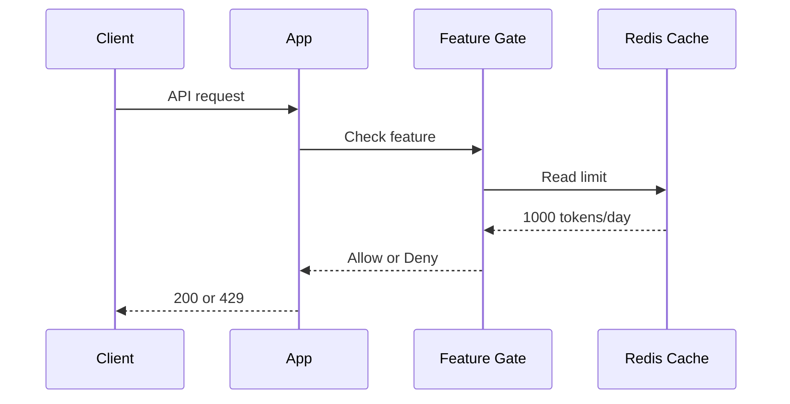
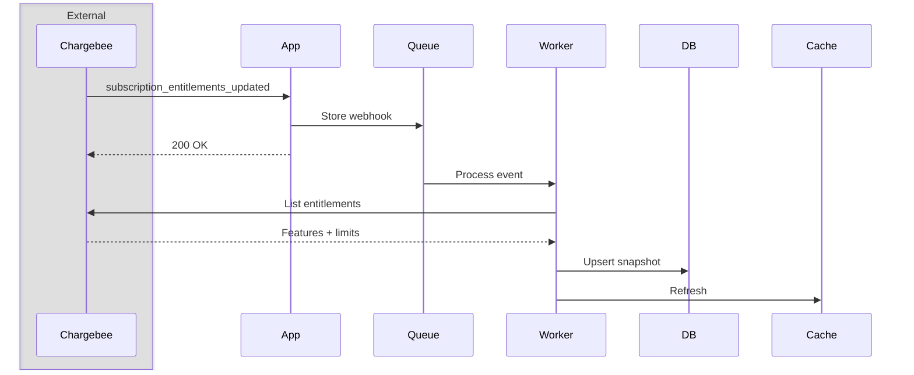
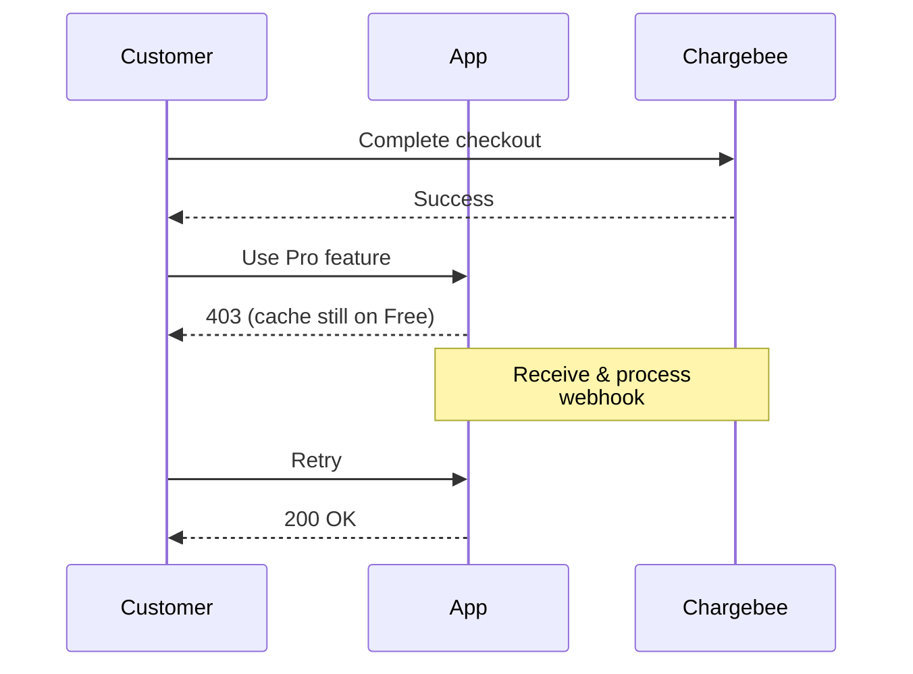
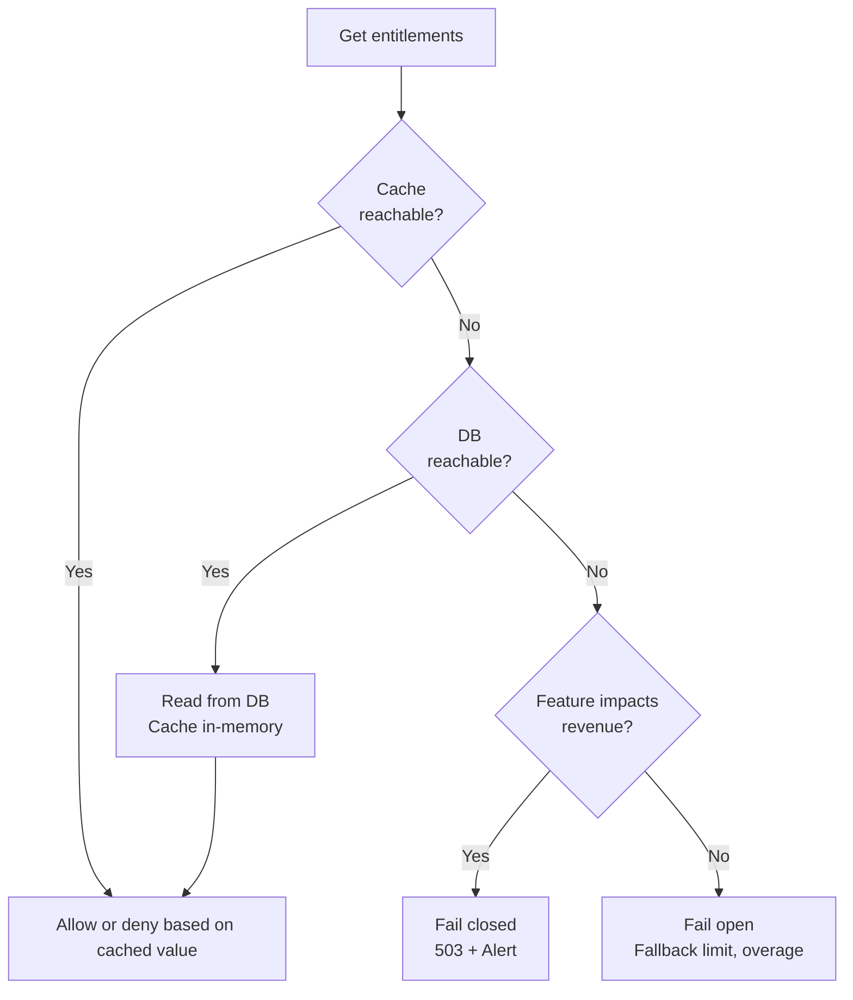

# How To Enforce Entitlement Checks

This topic covers using Chargebee's entitlements and features to:

* Block or allow product actions based on the subscription's current feature access
* Apply numeric limits (API requests/sec, token quotas, number of seats) predictably under load

**Important**: Chargebee is the source of truth for entitlements and your app caches the required entitlements and features locally to reduce API calls in the hot path. The topic also covers how to stay consistent when plans change, overrides are applied, or Chargebee is temporarily unreachable

## Setup

- Product Catalog 2.0 with features and entitlements configured
- Subscriptions already synced locally (see webhook guide)
- A database which acts as the source of truth for entitlements, which are updated by Chargebee's webhook events
- A cache layer (Redis) for access checks when serving a request

## 1. How Entitlement Checks Work



### Flow

1. User makes authenticated request
2. Feature gate reads entitlement limit from cache
3. Gate compares usage vs limit
4. Request continues or returns 429

```typescript
// Check the user's entitlement for a particular feature
const limit = await cache.get(`entitlement:${subscriptionId}:${featureId}`);

if (usage >= limit) {
  throw new ForbiddenError("Usage limit exceeded");
}
```

## 2. Feature Types And Enforcement Rules

| Type | What it means | How to check |
|------|---------------|--------------|
| switch | Boolean on/off | `value === true` |
| quantity | Numeric limit | `usage < value or value === "unlimited"` |
| range    | Number in range | Same as quantity |
| custom   | Text labels     | `value === "premium"` |
|


```typescript
// Switch feature (e.g., SSO enabled)
if (entitlement.value !== true) {
  throw new ForbiddenError("SSO not available on your plan");
}
// Quantity feature (e.g., API rate limit)
const limit = entitlement.value === "unlimited" ? Infinity : entitlement.value;
if (currentUsage >= limit) {
  throw new TooManyRequestsError("Rate limit exceeded");
}
// Custom feature (e.g., model tier)
if (entitlement.value !== "gpt-4") {
  throw new ForbiddenError("Upgrade to access GPT-4");
}
```

## 3. Syncing Entitlements In The Worker

Since the app reads the cached entitlements only from Redis while serving requests, it's important to keep the data in sync with Chargebee any time the entitlements are updated. This is handled asynchronously in the background worker, which reads the queued webhook event, and updates the database with the entitlement snapshot



```typescript
// Worker handler (simplified)
async function handleEntitlementsUpdated(event) {
  const { subscription_id } = event.content.subscription;

  // Fetch full entitlement list
  const entitlements = await chargebee.subscriptionEntitlement.subscriptionEntitlementsForSubscription({ subscription_id, limit: 100 });

  // Store locally
  await db.upsertEntitlements(subscription_id, entitlements.list);

  // Refresh cache
  await cache.del(`entitlements:${subscription_id}`);
}
```

**Key points**:

* Worker processes webhooks asynchronously
* Update the snapshot for the customer/subscription
* Invalidate cache after DB write

✅ **Recommended**: Webhooks must be processed near real-time to ensure entitlements aren't exceeded

⚠️ **Not recommended**: Calling Chargebee API during the user request, which will use up your API quota quickly and degrade the experience of your customer


## 4. Handling Subscription Upgrades and Downgrades

When a customer upgrades or downgrades their subscription, Chargebee will trigger the `subscription_entitlements_updated` webhook event. However, since the event can take a few seconds to be processed by our worker, our customer may experience the following:

* When upgrading, they will not immediately have access to the new upgraded entitlements which means they can't use their subscription features right away

* When downgrading, they may still continue to use features they no longer should have access to

To avoid a sub-par user experience, then entitlements for the new subscription can be fetched once the checkout flow is completed, so that the customer can use his new limits right away.



```typescript
// After successful upgrade
async function onCheckoutSuccess(subscriptionId) {
  // Optimistically refresh before webhook arrives
  const entitlements = await chargebee.subscriptionEntitlement
    .subscriptionEntitlementsForSubscription(subscription_id);

  await db.upsertEntitlements(subscriptionId, entitlements.list);
  await cache.del(`entitlements:${subscriptionId}`);
}
```

⚠️ **Not recommended**: Waiting for the webhook to trigger fetching the updated entitlements (causes upgrade lag)

⚠️ **Not recommended**: Calling Chargebee in the feature gate (adds latency to every request)

⚠️ **Not recommended**: Letting cache naturally expire when downgrading (customer gets free access for anywhere between a few seconds to minutes)

## 5. Entitlement Overrides

In some scenarios, certain customers may have custom limits provisioned via [entitlement overrides](https://apidocs.chargebee.com/docs/api/entitlement_overrides). For example, the sales team might provision custom limits to an enterprise customer as a part of the deal.

In such cases, the API sets the `subscription_entitlement.is_overridden` flag to `true`, and the response will automatically reflect the overridden value.

```typescript
// Gate should check the resolved value, not plan defaults
const entitlement = await getEntitlement(subscriptionId, "f_api_rate");

// ✅ Correct: uses Chargebee's computed value (includes overrides)
const limit = entitlement.value;

// ❌ Wrong: static plan table misses overrides
const limit = PLAN_LIMITS[planId].api_rate;
```

Events to watch: `entitlement_overrides_updated`, `entitlement_overrides_removed`

## 6. Fail-Safe Behavior

To avoid undefined behaviour, your app has to be designed around the idea that any component can fail. In the case of entitlements, the following failure modes have to be handled:

| Failure scenario | Impact | Remediation options |
|------------------|--------|---------------|
| Redis cache unreachable | Entitlements cannot be determined | 1. Fallback to DB snapshot<br>2. Use a in-memory cache with short TTL |
| Chargebee API limit exceeded (`api_request_limit_exceeded`, HTTP 429) | Refresh fails, snapshot goes stale | 1. Honour `Retry-After`, then exponential backoff with jitter<br>2 Retry in the background<br>3. Avoid duplicate requests for same subscription  |
| Chargebee returns 5xx (`internal_temporary_error`, `site_read_only_mode`) | Refresh fails | 1. Treat as retryable and keep the last-known-good snapshot<br>2. Never write a partial or empty snapshot on a failed fetch |
| Webhook endpoint down | Chargebee retries 7 times over ~3 days 7 hours, then the event is lost | 1. Return 200 as soon as the event is durably queued<br>2. Reconcile on a schedule so a lost event self-heals |
| Worker backlog | Snapshots silently age | Alert on queue lag and on snapshot age, not just on errors |

Depending on how expensive it is to serve a user's request, you may broadly choose to deny or allow access in the case of a component failure.




**Option 1: Fail closed (deny access)**

```typescript
try {
  const limit = await cache.get(`entitlement:${subId}:${featureId}`);
} catch (err) {
  throw new ServiceUnavailableError("Try again later");
}
```

✅ Use for: Paid features (SSO, advanced models)

⚠️ Risk: Blocks paying customers during outage

**Option 2: Fail open (allow access)**

```typescript
try {
  const limit = await cache.get(`entitlement:${subId}:${featureId}`);
} catch (err) {
  return FALLBACK_LIMIT; // Allow with basic limits
}
```

✅ Use for: Soft metering, usage that bills later

⚠️ Risk: Free usage during outage

## 7. Customer vs Subscription Entitlements

Chargebee exposed two APIs to fetch the entitlements for a customer:

* [List subscription entitlements](https://apidocs.chargebee.com/docs/api/subscription_entitlements/list-subscription-entitlements) returns entitlements for a particular subscription, regardless of its status

* [List customer entitlements](https://apidocs.chargebee.com/docs/api/customer_entitlements/list-customer-entitlements) returns entitlements across *all* of a customer's active subscriptions, plus those granted directly to the customer (for example a one-time charge)

| | Subscription entitlements | Customer entitlements |
|---|---|---|
| Scope | One subscription | `active` + `non_renewing` subscriptions, plus customer-level grants |
| Consolidation | By your app | By Chargebee API when `consolidate_entitlements=true`
| Extra fields | `feature_name`, `feature_type`, `is_overridden`, `expires_at` | `customer_id`, `subscription_id` |
| Webhook Events | `subscription_entitlements_created`, `subscription_entitlements_updated` | `customer_entitlements_updated` |

The choice of which method to use to fetch and determine user entitlements is dependent on various product and business factors. However, in simple terms:

* If your app allows a single subscription per user with a fixed set of entitlements that cannot be topped up, subscription entitlements will be easier to configure and manage
* If a user can have multiple subscriptions, or they can be provided additional entitlements via overrides, fetching customer entitlements with `consolidate_entitlements=true` can make it simpler and more accurate since Chargebee handles the logic to merge the entitlements


### Feature Value Consolidation

| Feature type | Consolidated value |
|--------------|--------------------|
| switch   | `true` if any subscription grants `true` |
| quantity | Sum of all values; `unlimited` if any value is `unlimited` |
| range    | Sum, capped at `levels[1].value` unless that level is unlimited; `unlimited` wins |
| custom   | The highest level held |

```typescript
async function loadCustomerEntitlements(customerId: string) {
  const entitlements = [];
  let offset: string | undefined;

  do {
    const page = await chargebee.customerEntitlement.entitlementsForCustomer(customerId, {
      limit: 100,
      consolidate_entitlements: true,
      offset,
    });

    entitlements.push(
      ...page.list
        .map((entry) => entry.customer_entitlement)
        .filter((e) => e.is_enabled)
    );
    offset = page.next_offset;
  } while (offset);

  return entitlements;
}
```

**Key points**:

* Both endpoints are eventually consistent, so a read immediately after a write may return the old value
* If `entitlement.is_enabled === false`, the customer _does not_ have access to the entitlement, regardless of the value returned
* Customer-level entitlements do not carry over to a new subscription, so a plan change will not move them

## Pointer Implementation Notes

Entitlements are used across the app to provide various features to the end-users. For example, a user with a free subscription gets access to a smaller list of LLM models along with a limited set of tokens and requests per month. Subscription upgrades trigger the refresh of the customer's entitlement snapshot, and the hot-path avoids hitting the Chargebee API.

Using the [`@chargebee/entitlements`](https://npmx.dev/@chargebee/entitlements) library, the app maintains the cached entitlements in Redis, which is backed by the source of truth in Postgres which is kept in sync via webhooks and the background worker.

Some relevant files to look into the hood:

- [`pointer/lib/entitlements/provider.ts`](../pointer/lib/entitlements/provider.ts) — entitlement lookup via Redis -> Postgres -> Chargebee API. A request never waits on Chargebee: a subscription with no snapshot defaults to the free-tier limits while the refresh runs in the background. Cache TTL defaults to 300 seconds and snapshot TTL to 24 hours, both configurable.

- [`pointer/lib/entitlements/gate.ts`](../pointer/lib/entitlements/gate.ts) — Feature specific gates. Throws `EntitlementGateError` with `429` and `retryAfterSeconds` for a rate limit, `402` for an exhausted quota or a model the plan does not include.

- [`pointer/lib/entitlements/sync.ts`](../pointer/lib/entitlements/sync.ts), [`pointer/lib/entitlements/queue.ts`](../pointer/lib/entitlements/queue.ts) — Background sync logic.

- [`pointer/app/api/entitlements/checkout-complete/route.ts`](../pointer/app/api/entitlements/checkout-complete/route.ts) — Optimistic refresh after subscription checkout succeeds, rather than waiting for the webhook event.

- [`pointer/scripts/catalog.ts`](../pointer/scripts/catalog.ts) — the script to create the Chargebee catalog, including entitlements, features and per-plan limits.

## Go-Live Checklist

- [ ] Is the site on Product Catalog 2.0 with every gated feature defined in Chargebee?

- [ ] Does every gate read the local snapshot, with no Chargebee API call on the request path?

- [ ] Does the worker refresh the snapshot on `subscription_entitlements_created` and `subscription_entitlements_updated`?

- [ ] Does it also refresh on the plan-item events, such as `subscription_changed` and `subscription_renewed`?

- [ ] Does it refresh on `entitlement_overrides_updated` and `entitlement_overrides_removed`?

- [ ] Does the gate use the resolved `value` from Chargebee rather than a static plan table, so overrides are honoured?

- [ ] Does the gate deny access when `is_enabled` is `false`, whatever the value says?

- [ ] Is `unlimited` handled as unlimited, and not as the string `"unlimited"` compared against a number?

- [ ] Are per-seat limits multiplied by the subscription's quantity?

- [ ] Does the app refresh entitlements when checkout returns, instead of waiting for the webhook?

- [ ] Is the worst-case downgrade window bounded by a cache TTL you have chosen deliberately?

- [ ] Is the fail-open or fail-closed decision made per feature, and do product and finance agree with it?

- [ ] Does a request behave as intended at exactly the limit, not just above and below it?

- [ ] Is there a reconciliation job that compares local snapshots against Chargebee and reports drift?

- [ ] Can support tell whether a customer's snapshot is stale, without reading logs?

