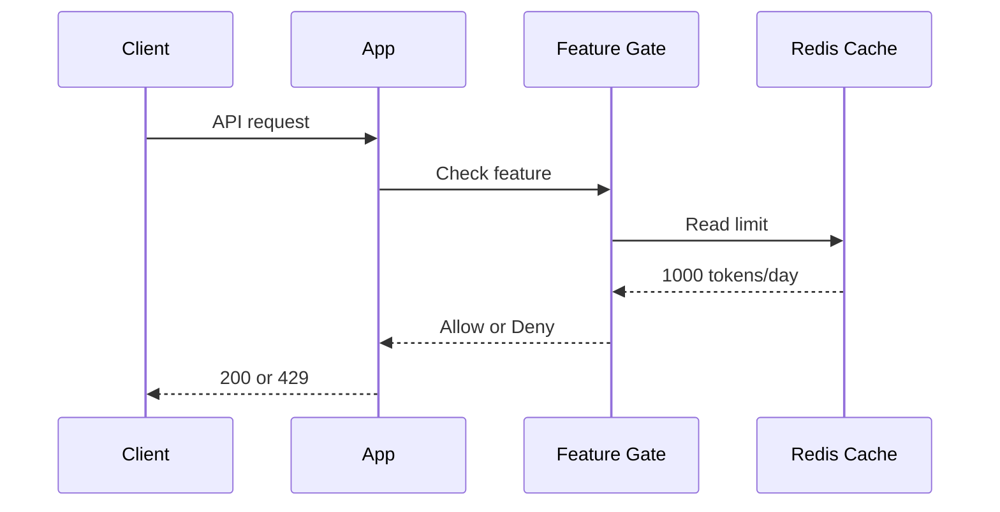
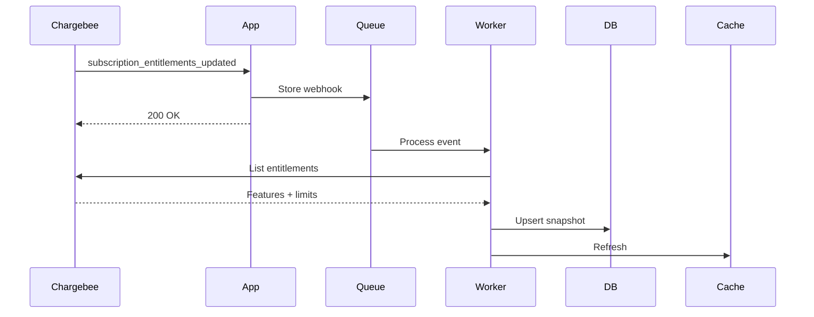
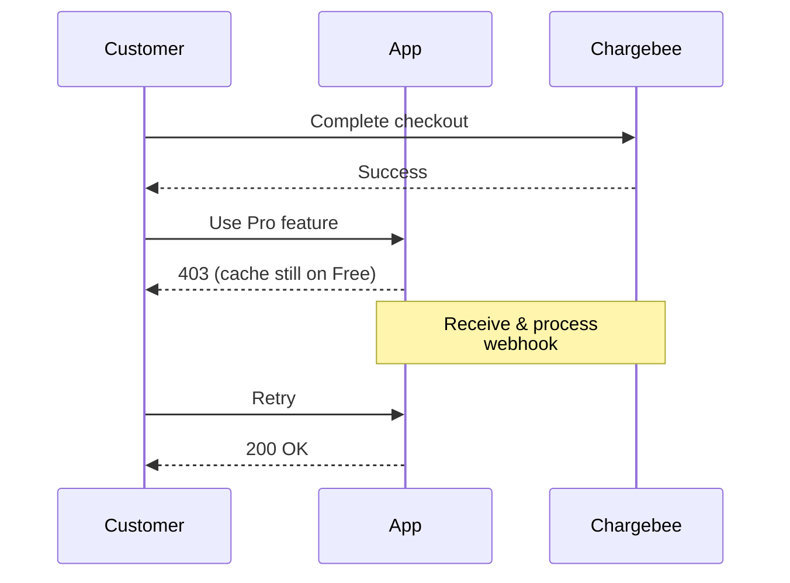

# How to enforce entitlement checks

This topic covers using Chargebee's entitlements and features to:

* Block or allow product actions based on the subscription's current feature access
* Apply numeric limits (API requests/sec, token quotas, number of seats) predictably under load

**Important**: Chargebee is the source of truth for entitlements and your app caches the required entitlements and features locally to reduce API calls in the hot path. The topic also covers how to stay consistent when plans change, overrides are applied, or Chargebee is temporarily unreachable

## Setup

- Subscriptions already synced locally (see webhook guide)
- Product Catalog 2.0 with features and entitlements configured
- A database which acts as the source of truth for entitlements, which are updated by Chargebee's webhook events
- A cache layer (Redis) for access checks when serving a request

## How entitlement checks work



### Flow
1. User makes authenticated request
2. Feature gate reads entitlement limit from cache
3. Gate compares usage vs limit
4. Request continues or returns 429

```typescript
// Check the user's entitlement for a particular feature
const limit = await cache.get(`entitlement:${subscriptionId}:${featureId}`);

if (usage >= limit) {
  throw new ForbiddenError("Usage limit exceeded");
}
```

### Syncing Entitlements (Worker)

Since the app reads the cached entitlements only from Redis while serving requests, it's important to keep the data in sync with Chargebee any time the entitlements are updated. This is handled asynchronously in the background worker, which reads the queued webhook event, and updates the database with the entitlement snapshot.




```typescript
// Worker handler (simplified)
async function handleEntitlementsUpdated(event) {
  const { subscription_id } = event.content.subscription;

  // Fetch full entitlement list
  const entitlements = await chargebee.subscriptionEntitlement.subscriptionEntitlementsForSubscription({ subscription_id, limit: 100 });

  // Store locally
  await db.upsertEntitlements(subscription_id, entitlements.list);

  // Refresh cache
  await cache.del(`entitlements:${subscription_id}`);
}
```

**Key points**:

* Worker processes webhooks asynchronously
* Update the snapshot for the customer/subscription
* Invalidate cache after DB write

✅ **Recommended**: Webhooks must be processed near real-time to ensure entitlements aren't exceeded

⚠️ **Not recommended**: Calling Chargebee API during the user request, which will use up your API quota quickly and degrade the experience of your customer


### Handling Subscription Upgrades

**Problem**: Customer upgrades to Pro but gets blocked for 5 seconds while webhook processes. This will cause an error to be returned until the entitlements updated event has been processed.

To avoid a sub-par user experience, then entitlements for the new subscription can be fetched once the checkout flow is completed, so that the customer can use his new limits right away.



```typescript
// After successful upgrade
async function onCheckoutSuccess(subscriptionId) {
  // Optimistically refresh before webhook arrives
  const entitlements = await chargebee.subscriptionEntitlement
    .subscriptionEntitlementsForSubscription(subscription_id);

  await db.upsertEntitlements(subscriptionId, entitlements.list);
  await cache.del(`entitlements:${subscriptionId}`);
}
```

⚠️ **Not recommended**: Waiting only for webhook to fetch the new entitlements (causes upgrade lag)

⚠️ **Not recommended**: Calling Chargebee in the feature gate (adds latency to every request)


### Feature types and enforcement rules

| Type | What it means | How to check |
|------|---------------|--------------|
| switch | Boolean on/off | `value === true` |
| quantity | Numeric limit | `usage < value or value === "unlimited"` |
| range    | Number in range | Same as quantity |
| custom   | Text labels     | `value === "premium"` |
|


```typescript
// Switch feature (e.g., SSO enabled)
if (entitlement.value !== true) {
  throw new ForbiddenError("SSO not available on your plan");
}
// Quantity feature (e.g., API rate limit)
const limit = entitlement.value === "unlimited" ? Infinity : entitlement.value;
if (currentUsage >= limit) {
  throw new TooManyRequestsError("Rate limit exceeded");
}
// Custom feature (e.g., model tier)
if (entitlement.value !== "gpt-4") {
  throw new ForbiddenError("Upgrade to access GPT-4");
}
```
