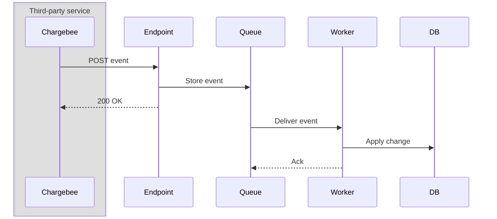
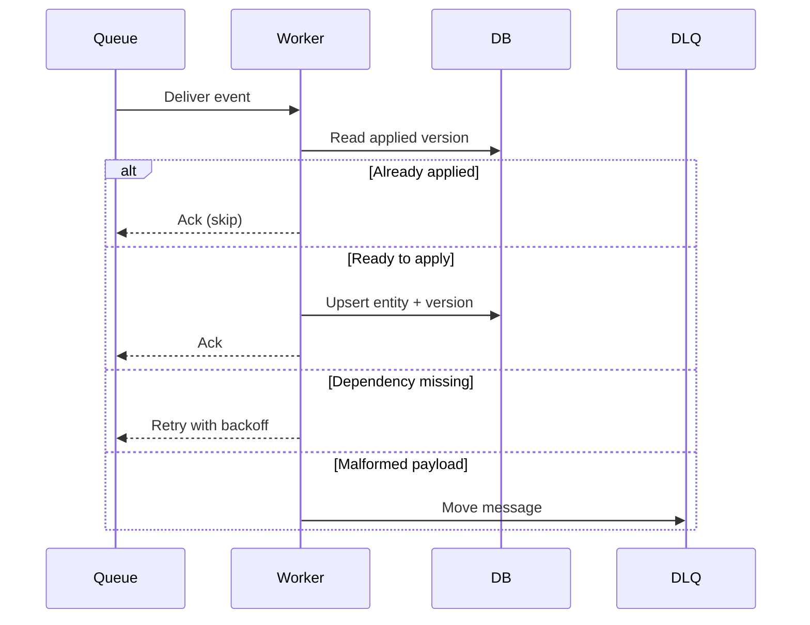
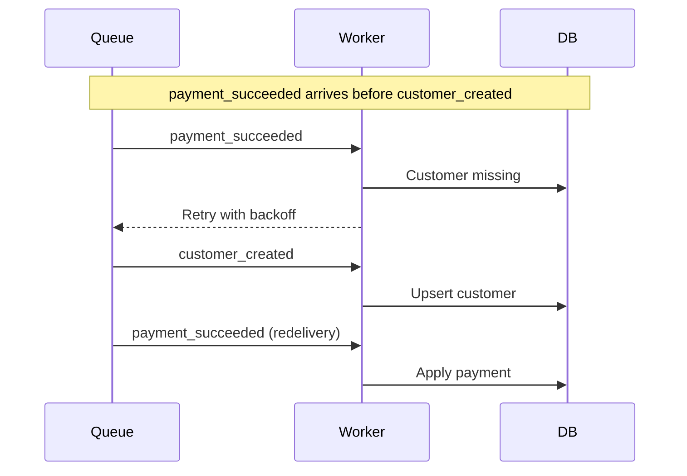

# How To Integrate Chargebee Webhooks

Webhooks are usually the first thing you build after the Chargebee SDK is wired up. This topic covers using them to:

* Keep your app's copy of customers, subscriptions and invoices in sync with your Chargebee site
* Trigger your own work when a payment, renewal or plan change happens
* Recover the outcome of a billing flow when the customer closes the browser mid-checkout

**Important**: Chargebee is the source of truth for billing state. Your app keeps a local mirror of it. The webhook endpoint's only job is to accept the event and make it durable. Everything else happens in a background worker.

## Setup

- A webhook configured in Chargebee under **Settings > Configure Chargebee > API Keys and Webhooks**
- An HTTPS endpoint protected with [basic authentication](https://www.chargebee.com/docs/billing/2.0/site-configuration/webhook_settings)
- A durable queue (or a table) the endpoint can write to
- A background worker that consumes from that queue
- A table to record which event `id` and `resource_version` you have already applied

## 1. How Webhook Delivery Works



### Flow

1. Something changes in Chargebee (a subscription is created, a payment succeeds)
2. Chargebee POSTs the event as JSON to your endpoint
3. The endpoint validates basic auth and writes the event to the queue
4. The endpoint returns `200`, which tells Chargebee the event was delivered
5. The worker picks the event up later and updates the database

Delivery is **at-least-once** and **unordered**. The same event can arrive twice, and a later event can arrive before an earlier one. Once you answer `200`, Chargebee stops tracking the event, so finishing the work is entirely your app's problem.

## 2. What The Endpoint Does

The endpoint has one responsibility: make the event durable, fast. Chargebee's execution timeout on a live site is 60 seconds, and a timeout counts as a failure, so any real work belongs in the worker.

```typescript
// Validate, enqueue, answer. No DB writes on this path.
await queue.send({ MessageBody: JSON.stringify(event), MessageDeduplicationId: event.id });
return new Response(null, { status: 200 });
```

If the enqueue fails, return a `5xx`. Chargebee then [retries the delivery](https://www.chargebee.com/docs/billing/2.0/site-configuration/webhook_settings), so nothing is lost.

✅ **Recommended**: Return `200` as soon as the event is durably stored

✅ **Recommended**: Return `5xx` when you could not store it, and let Chargebee redeliver

⚠️ **Not recommended**: Updating your database, calling the Chargebee API, or sending email inside the endpoint. A slow dependency turns into a webhook timeout and a retry storm.

⚠️ **Not recommended**: Returning `200` on an error to "keep Chargebee quiet". The event is then gone for good.

## 3. What The Worker Does

The worker is where the actual sync happens. It is a separate process from your web app, so a burst of webhooks never competes with customer traffic. It runs one pipeline per message and its exit path decides the message's fate.



The pipeline, in order:

1. Parse the body. A body that will never parse is a poison message (section 7)
2. Skip the event if you have already applied an equal or newer `resource_version` (section 5)
3. Requeue the event if a parent record it references is missing (section 6)
4. Apply the change to the database
5. Record the applied `resource_version`, then acknowledge the message

```typescript
// Ack only after the version is committed, so a crash mid-apply replays the event
await applyEvent(event);
await commitVersions(event);
```

**Key points**:

* Acknowledging is the worker's way of saying "done", not "received"
* Throwing (not acknowledging) puts the message back on the queue for another attempt
* Scaling out means running more worker processes — the queue's visibility timeout stops two workers from applying the same event

✅ **Recommended**: One worker per queue, scaled horizontally, with the queue's retry and dead-letter policy doing the error handling

⚠️ **Not recommended**: Doing the sync in a `setTimeout` or fire-and-forget promise in the web process. A deploy or a crash drops the event silently.

## 4. Handling Duplicate Deliveries

Retries mean the same event can arrive more than once. The event `id` is unique per event, so use it as the deduplication key.

```sql
-- A replay of an already-processed event falls straight through
INSERT INTO webhook_event (id) VALUES ($1) ON CONFLICT (id) DO NOTHING;
```

Chargebee's [last retry lands about 3 days and 7 hours](https://apidocs.chargebee.com/docs/api/events) after the original event, so keep event IDs for at least that long before purging them.

✅ **Recommended**: Writing every applied event `id` to a table, and making your upserts idempotent so a duplicate is a no-op

⚠️ **Not recommended**: Deduplicating on `(event_type, subscription_id)`. Two legitimate changes to the same subscription share that key.

## 5. Handling Out-Of-Order Events

Network delays and retries mean a newer event can arrive before an older one. Every Chargebee resource carries a `resource_version` that increases on each change, so compare it against what you have stored before writing.

```typescript
// The incoming snapshot is older than what's already applied — ignore it
if (event.content.subscription.resource_version <= stored.resourceVersion) return;
```

`resource_version` is per resource, not per event. An event's `content` can hold a customer, a subscription and an invoice, each with its own version, so check each one you intend to write.

The payload is a point-in-time snapshot taken when the change happened, and it does not change on retries. When you need the current state instead of the snapshot, call the resource's retrieve endpoint.

✅ **Recommended**: Storing the applied `resource_version` per resource, and only advancing it forward

⚠️ **Not recommended**: Ordering events by `occurred_at`. It tells you when the change happened, not whether your row is newer.

## 6. Handling Dependent Events That Arrive Early

The classic case: `payment_succeeded` arrives referencing a customer whose `customer_created` has not been processed yet. There is no row to attach the payment to.



Treat "dependency not ready" as a *retryable* error. The worker does not acknowledge the message, the queue redelivers it after a delay, and other messages keep flowing past it in the meantime.

```typescript
// Not an error to alert on — the parent event is usually seconds behind
if (!(await customerExists(event.content.subscription.customer_id))) {
  throw new RetryableWebhookError("customer not in DB yet");
}
```

Exempt the resource the event itself creates. A `customer_created` event must not wait for the customer to already exist.

✅ **Recommended**: Retrying the dependent event with increasing backoff until its parent lands

⚠️ **Not recommended**: Dropping the event, or returning `5xx` to Chargebee. You already stored it, so the retry belongs to your queue.

⚠️ **Not recommended**: Fetching the missing parent from the Chargebee API inline. It works, but it hides genuine ordering problems and burns API quota on every gap.

## 7. Handling Poison Messages

Some messages will never succeed: an unparseable body, a missing event `id`, a payload your code cannot interpret. Retrying these wastes the retry budget that dependent events need.

```typescript
// Skip the retries and send it to the dead letter queue immediately
if (!event.id) throw new PoisonWebhookError("webhook body is missing an event id");
```

Send them to a [dead letter queue](https://en.wikipedia.org/wiki/Dead_letter_queue), alert when it is non-empty, and keep a way to replay messages back onto the main queue once the bug is fixed. Chargebee can also resend a webhook manually from **Logs > Events**, which is the fallback when a message is lost entirely.

✅ **Recommended**: Separating "retry patiently" from "fail fast", so a malformed payload and a late parent event get different treatment

⚠️ **Not recommended**: A single `catch` that retries everything. Poison messages then retry for days and bury the real failures.

## 8. Retry And Retention Settings

Two independent retry loops are in play. Chargebee's loop gets the event to your endpoint; your queue's loop gets it through your worker.

| | Chargebee to endpoint | Queue to worker |
|---|---|---|
| Retries on | Non-`2xx` response or timeout | Unacknowledged message |
| Attempts | 7 | Your `maxReceiveCount` |
| Schedule | 2m, 6m, 30m, 1h, 5h, 1d, 2d | Your backoff policy |
| Total window | ~3 days 7 hours | Your retention period |
| Gives up by | Failure email, manual resend | Dead letter queue |

Back off progressively using the delivery count, rather than retrying at a fixed interval.

```typescript
// 30s -> 1m -> 2m -> ... capped at 15m
const backoff = Math.min(30 * 2 ** (receiveCount - 1), 900);
```

Set the queue's retention period well above the largest out-of-order gap you expect. Gaps are normally seconds, so hours-to-days of retention is ample headroom.

## 9. Choosing Events And Endpoints

A Chargebee site allows up to five webhooks. Subscribe each one to only the events it acts on, instead of leaving **All Events** selected — fewer deliveries means less noise and less retry load.

If you configure more than one endpoint, give each a distinct job. One for the app's billing sync, one for auditing or analytics. Two endpoints both writing the same tables produces duplicate work that your deduplication has to absorb.

Check the event's `api_version` against the API version your client library targets. A mismatch means the `content` is structured differently from what your code expects.

If you already run on AWS and your event volume is high, [Event Streaming via AWS EventBridge](https://www.chargebee.com/docs/billing/2.0/site-configuration/webhook_settings) delivers the same events without an HTTP endpoint to operate. The endpoint in section 2 disappears; everything from section 3 onwards still applies.

✅ **Recommended**: One endpoint owning the billing mirror, subscribed to the specific event types your app handles

⚠️ **Not recommended**: Pointing several services at the same endpoint and fanning out from there without a queue. One slow consumer then times out the webhook for everyone.

## See It Running In The Demo App

[Pointer](https://pointer.chargebee-labs.com) is an AI coding assistant with a free tier. A developer signs up, uses their daily token allowance, and upgrades to Pro to keep going. Chargebee runs the checkout and the charge — the webhook is how Pointer finds out the plan changed and raises the limit, seconds later, without polling.

The `/admin/flow` view in the demo animates that path live: the event arriving, the queue hop, the worker applying it, and the retry when a dependency is not ready yet.

Pointer runs Next.js, Postgres and AWS SQS, and uses the Better Auth Chargebee plugin. Those are its choices, not Chargebee requirements.

- [`pointer/lib/webhooks.ts`](../pointer/lib/webhooks.ts) — the endpoint's publish step. Sends the validated event to SQS using the event `id` as the dedupe key, then returns.

- [`pointer/workers/chargebee-webhook-worker.ts`](../pointer/workers/chargebee-webhook-worker.ts) — the consumer loop. Long-polls the queue; returning from the handler acknowledges the message, throwing leaves it for redelivery.

- [`pointer/workers/chargebee-webhook-processor.ts`](../pointer/workers/chargebee-webhook-processor.ts) — the per-message pipeline: stale check, dependency check, apply, commit versions, ack.

- [`pointer/lib/webhooks/webhook-guards.ts`](../pointer/lib/webhooks/webhook-guards.ts) — the `resource_version` and dependency guards, backed by the `chargebee_resource_version` table.

- [`pointer/infra/sqs.tf`](../pointer/infra/sqs.tf) — the queue and DLQ. `maxReceiveCount = 5`, main queue retention 4 days, DLQ retention 14 days, with a CloudWatch alarm when the DLQ is non-empty.

## Go-Live Checklist

- [ ] Is the webhook URL served over HTTPS and protected with basic authentication?

- [ ] Does the endpoint return `2xx` only after the event is durably stored, and `5xx` when it is not?

- [ ] Does the endpoint stay clear of database writes and outbound API calls?

- [ ] Is every applied event `id` recorded, and kept for at least 3 days and 7 hours?

- [ ] Does the worker compare `resource_version` per resource before writing, and only advance it forward?

- [ ] Does the worker retry a missing-dependency event instead of dropping or failing it?

- [ ] Do malformed payloads reach the dead letter queue without consuming the retry budget?

- [ ] Is the dead letter queue alerted on, and can its messages be replayed onto the main queue?

- [ ] Is the queue's retention period longer than the largest out-of-order gap you expect?

- [ ] Is each webhook subscribed to only the event types it handles, rather than **All Events**?

- [ ] Does the event `api_version` match the API version your client library targets?
