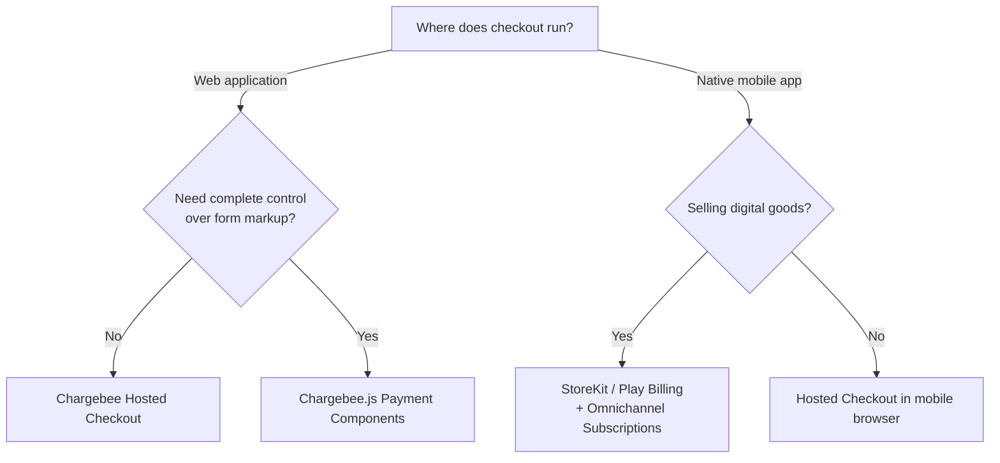
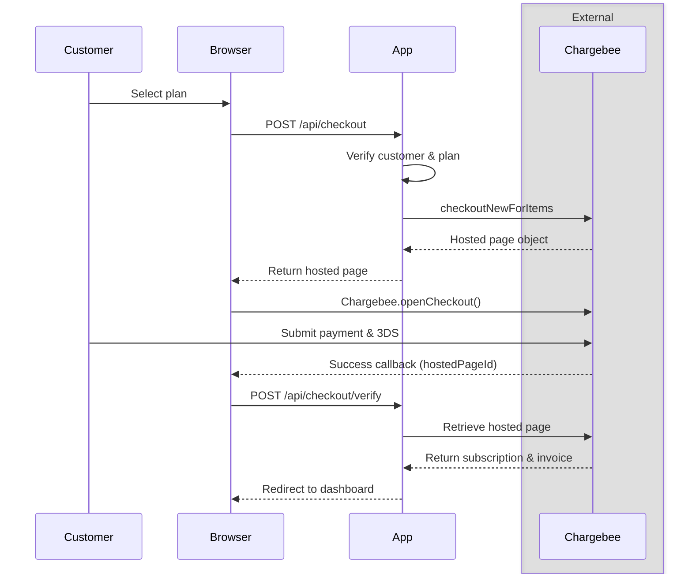
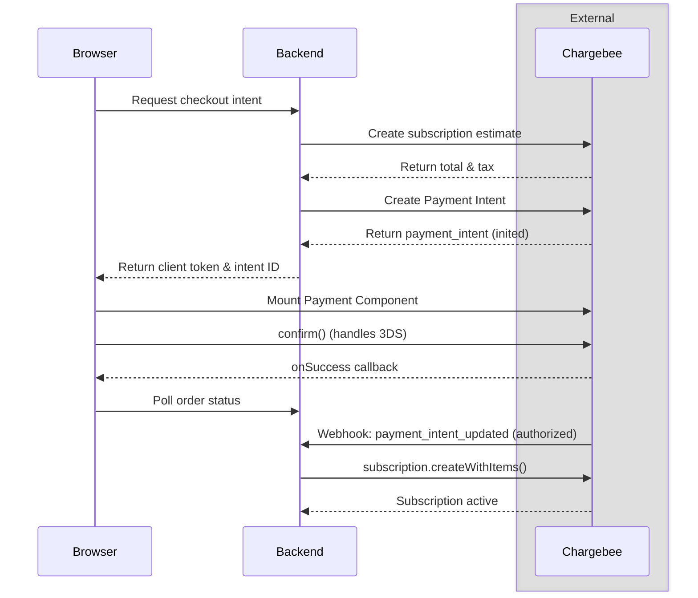
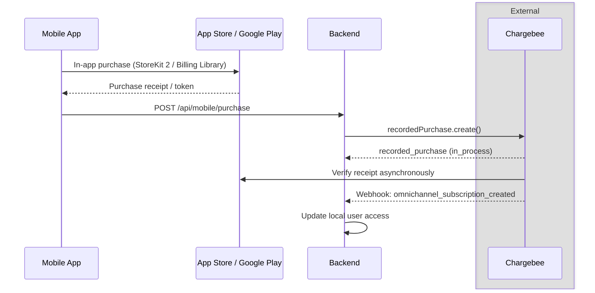

# How To Build A Checkout Experience

Integrating checkout requires balancing customer convenience with billing security. The frontend guides users through plan selection and payment, while your server retains control over pricing, plan eligibility, and order fulfillment.

This guide covers how to:

* Choose between Hosted Checkout, Chargebee.js Payment Components, and native app store flows
* Launch new subscriptions and plan upgrades using Product Catalog 2.0
* Build a custom checkout form without exposing card data to your application
* Record native Apple and Google in-app purchases in Chargebee Omnichannel Subscriptions
* Grant access safely after checkout and recover from dropped connections or browser refreshes

Chargebee is the system of record for subscriptions, customer balances, and invoices. Your application owns authentication, plan eligibility, and the local billing mirror.

## Setup

* Product Catalog 2.0 with items, item prices, currencies, and tax rules configured
* At least one payment gateway and required payment methods active in Chargebee
* Checkout branding, fields, and return URLs published under **Settings > Configure Chargebee > Checkout & Self-Serve Portal**
* Publishable API key when using Chargebee.js Payment Components
* HTTPS webhook endpoint and background queue worker (see [webhook integration](./webhooks.md))
* For mobile app purchases, an Apple or Google app connected to [Omnichannel Subscriptions](https://www.chargebee.com/docs/billing/2.0/mobile-subscriptions/omnichannel-subscription-overview)

## 1. Choose The Checkout Experience

Chargebee supports three checkout models depending on your platform and user interface needs:

| Model | Best for | UI owner | PCI compliance |
|:---|:---|:---|:---|
| Hosted Checkout | Standard web apps, fast setup, broad payment method support | Chargebee (modal or full-page) | Handled by Chargebee (SAQ A) |
| Payment Components | Web apps requiring an embedded, fully custom design | Your application, with Chargebee iframes | Handled by Chargebee iframes (SAQ A) |
| Native In-App Purchases | iOS and Android apps selling digital products | Native store UI (StoreKit / Play Billing) | Handled by Apple / Google |



Most web applications should use [Hosted Checkout](https://www.chargebee.com/docs/billing/2.0/hosted-capabilities/hosted-checkout). It manages order previews, tax calculation, 3D Secure challenges, mobile wallets, and regional payment methods without custom billing UI.

Use [Payment Components](https://www.chargebee.com/docs/payments/2.0/payment-components/overview) when hosted layouts cannot fit your design system. Your backend must then coordinate pricing estimates, Payment Intents, and asynchronous order creation.

For native mobile apps selling digital goods, store policies require using Apple In-App Purchase or Google Play Billing. Complete the transaction in the mobile app, then record the receipt in Chargebee.

✅ Do: Validate customer identity, plan eligibility, and discounts on your backend before initiating checkout.

⚠️ Don't: Collect or transmit raw card details through your server. Doing so triggers full PCI DSS (SAQ D) compliance audits.

## 2. Implement Hosted Checkout

Hosted Checkout provides a prebuilt payment flow that collects customer details, authorizes the charge, and updates the subscription.

### Layout Options And Constraints

* **In-app modal:** Opens as an overlay modal inside your web page. It supports all Chargebee payment methods and maintains application context. Chargebee.js manages the modal iframe automatically.
* **Full-page redirect:** Opens as a standalone page on your Chargebee domain. It supports embedded containers, product images, and rich HTML descriptions.

Two operational constraints govern these layouts:

1. **Nested iframe restriction:** Do not wrap an in-app checkout URL inside your own iframe tag. The modal is already an iframe, and nesting it breaks mobile viewports, sandbox permissions, and payment redirects.
2. **Redirect payment methods:** Payment methods that require top-level redirects (such as PayPal, GoCardless, and Plaid) fail inside embedded iframes. They require `embed: false` or a full-page layout.



### Flow

1. The customer selects a plan on your pricing page.
2. The client requests a checkout session from your backend.
3. The backend resolves the customer ID and calls `chargebee.hostedPage.checkoutNewForItems` (or `checkoutExistingForItems` for upgrades).
4. The backend returns the hosted page object to the browser.
5. The browser opens the modal using `Chargebee.openCheckout`.
6. After payment, the client sends the returned `hosted_page.id` to the backend for server verification.

```typescript
// Server: create hosted page for an authenticated user
const { hosted_page: hostedPage } =
  await chargebee.hostedPage.checkoutNewForItems(
    {
      layout: "in_app",
      customer: {
        id: chargebeeCustomerId,
        email: session.user.email,
      },
      subscription_items: [
        { item_price_id: allowedItemPriceId, quantity: 1 },
      ],
      pass_thru_content: JSON.stringify({ checkoutAttemptId }),
    },
    { "chargebee-idempotency-key": checkoutAttemptId },
  );

return Response.json(hostedPage);
```

For upgrades on existing subscriptions, call `checkoutExistingForItems`. In Product Catalog 2.0, `replace_items_list` defaults to `false`. You must pass `replace_items_list: true` when switching plans, or Chargebee appends the new item to the subscription alongside the old one.

```typescript
// Browser: launch hosted checkout with Chargebee.js
const chargebee = Chargebee.init({ site: process.env.NEXT_PUBLIC_CHARGEBEE_SITE });

chargebee.openCheckout({
  hostedPage: async () => {
    const res = await fetch("/api/checkout", {
      method: "POST",
      headers: { "content-type": "application/json" },
      body: JSON.stringify({ planId: "pro-monthly" }),
    });
    if (!res.ok) throw new Error("Checkout creation failed");
    return res.json();
  },
  success: async (hostedPageId) => {
    await fetch("/api/checkout/verify", {
      method: "POST",
      headers: { "content-type": "application/json" },
      body: JSON.stringify({ hostedPageId }),
    });
    window.location.assign("/dashboard");
  },
});
```

To prevent mobile Safari and Chrome from blocking checkout popups, trigger `openCheckout` synchronously from a direct user tap or click. Passing a promise callback directly to `hostedPage` lets Chargebee open the modal window immediately while the network request resolves.

✅ Do: Pass `replace_items_list: true` on `checkoutExistingForItems` when swapping plans.

⚠️ Don't: Rely on client return query parameters alone to grant paid access. Always verify the hosted page status on your backend.

## 3. Build A Custom Checkout With Payment Components

[Payment Components](https://www.chargebee.com/docs/payments/2.0/payment-components/overview) render secure payment fields inside an iframe hosted on Chargebee's domain. Your application owns the surrounding checkout layout, while card details bypass your servers.

Payment Components replace the deprecated Card Components and Payment Method Helpers. New custom checkouts should use Payment Components. Verify that your payment gateway supports Payment Intents for the methods you plan to offer.



### Flow

1. The customer selects a plan and enters their billing address.
2. Your backend calls Chargebee's estimate API to compute taxes, discounts, and the final total.
3. Your backend creates a `payment_intent` for that amount and stores the checkout attempt locally.
4. The browser loads Chargebee.js with your publishable key, creates the payment component with the Payment Intent ID, and mounts it into a DOM container.
5. The customer submits payment details.
6. The frontend calls `paymentComponent.validate()`, followed by `paymentComponent.confirm()`. The component manages card tokenization and 3D Secure challenges inside its iframe.
7. When authorization succeeds, the component fires `onSuccess`. The UI switches to a processing screen.
8. Chargebee delivers a `payment_intent_updated` webhook with status `authorized`. Your backend worker verifies the intent and calls `subscription.createWithItems` to activate the subscription.

```typescript
// Server: estimate total and create Payment Intent
const { estimate } =
  await chargebee.estimate.createSubItemForCustomerEstimate(customerId, {
    subscription_items: [{ item_price_id: itemPriceId, quantity: 1 }],
    billing_address: address,
  });

const invoice = estimate.invoice_estimate;
if (!invoice || invoice.amount_due === undefined) {
  throw new Error("No immediate invoice generated for checkout");
}

const { payment_intent: intent } = await chargebee.paymentIntent.create(
  {
    customer_id: customerId,
    amount: invoice.amount_due,
    currency_code: invoice.currency_code,
    defer_payment_method_type: true,
  },
  { "chargebee-idempotency-key": `${attemptId}:intent` },
);
```

```typescript
// Browser: mount and confirm payment
const chargebee = Chargebee.init({
  site: process.env.NEXT_PUBLIC_CHARGEBEE_SITE,
  publishableKey: process.env.NEXT_PUBLIC_CHARGEBEE_PK,
});

const components = chargebee.components({ locale: "en" });
const payment = components.create("payment", {
  paymentIntent: { id: paymentIntentId },
}, {
  onSuccess: () => showProcessingScreen(),
  onError: (err) => showErrorMessage(err.message),
});

await payment.mount("#payment-container");

async function handlePayClick() {
  const isValid = await payment.validate();
  if (!isValid) return;
  await payment.confirm();
}
```

```typescript
// Webhook Worker: fulfill subscription on payment authorization
if (event.event_type !== "payment_intent_updated") return;

const intent = event.content.payment_intent;
if (intent.status !== "authorized") return;

const attempt = await db.checkoutAttempts.findByIntentId(intent.id);
if (!attempt || attempt.status === "completed") return;

const result = await chargebee.subscription.createWithItems(
  attempt.customerId,
  {
    subscription_items: attempt.items,
    payment_intent: { id: intent.id },
  },
  { "chargebee-idempotency-key": `${attempt.id}:subscription` },
);

await db.checkoutAttempts.markCompleted(attempt.id, result.subscription.id);
```

Use distinct idempotency keys for creating the Payment Intent and creating the subscription. Reusing the same key across different endpoints causes Chargebee to reject the second call with an HTTP 422 error. Estimate APIs do not create resources and do not accept idempotency keys.

✅ Do: Compute prices and taxes through the Estimate API before creating a Payment Intent.

⚠️ Don't: Call `subscription.createWithItems` from the browser's `onSuccess` callback. If the customer closes the tab during authorization, the payment succeeds but the subscription is never created. Fulfill via webhooks instead.

## 4. Record Native In-App Purchases

Web checkouts are prohibited for digital products inside iOS and Android apps. App Store and Google Play policies require native in-app purchases. Chargebee handles these through [Omnichannel Subscriptions](https://www.chargebee.com/docs/billing/2.0/mobile-subscriptions/omnichannel-subscription-overview).

Apple and Google manage renewals, cancellations, and payment collection. Chargebee maintains a mirrored subscription record so your backend can evaluate entitlements consistently across web and mobile platforms.



### Flow

1. The customer completes a purchase using StoreKit 2 or Google Play Billing.
2. The mobile app sends the transaction ID (Apple) or order ID and purchase token (Google) to your backend.
3. Your backend validates the user session and links the purchase to their Chargebee customer ID.
4. Your backend calls `chargebee.recordedPurchase.create`.
5. Chargebee returns a `recorded_purchase` object with `status: "in_process"`.
6. Chargebee validates the receipt directly with Apple or Google and delivers an `omnichannel_subscription_created` webhook.
7. Your webhook processor updates the local database mirror and unlocks the purchased features.

```typescript
// Server: record native mobile purchase
const { recorded_purchase: purchase } = await chargebee.recordedPurchase.create(
  {
    app_id: process.env.CHARGEBEE_APPLE_APP_ID,
    customer: { id: customerId },
    apple_app_store: { transaction_id: appleTransactionId },
  },
  { "chargebee-idempotency-key": purchaseAttemptId },
);

return Response.json({ status: purchase.status, id: purchase.id });
```

For Google Play, pass `google_play_store.order_id` (format: `GPA.xxxx-xxxx-xxxx-xxxxx`) and `google_play_store.purchase_token`.

Configure Apple App Store Server Notifications and Google Cloud Pub/Sub in Chargebee. When a user cancels, renews, or pauses in their app store settings, Chargebee updates the omnichannel subscription automatically.

Chargebee's older mobile SDKs belong to Mobile Subscriptions (Legacy) and no longer receive feature updates. New native applications should use StoreKit 2 and Google Play Billing directly, with receipts recorded via the Omnichannel API.

✅ Do: Configure store server-to-server notifications so renewals and cancellations sync to Chargebee.

⚠️ Don't: Create regular Chargebee Billing subscriptions for mobile purchases. Omnichannel subscriptions manage their own lifecycle and do not produce Chargebee invoices.

## 5. Verify Purchases And Recover From Failures

Network timeouts, closed tabs, and expired sessions occur during checkout. A dependable integration treats the client callback as an optimistic hint, using server retrieval and webhooks to guarantee fulfillment.

### Verify Completed Sessions

For Hosted Checkout, pass the returned `hosted_page.id` to your backend and call `chargebee.hostedPage.retrieve`:

1. Confirm `hosted_page.state === "succeeded"`.
2. Confirm the customer ID matches the authenticated user session.
3. Confirm the subscription items match the user's selected plan.
4. Mark the local checkout attempt completed to prevent replay attacks.

After verification, update your local mirror and clear cached entitlements immediately. This gives the customer instant access without waiting for background webhook delivery.

### Recovery Scenarios

| Scenario | System behavior | Recovery action |
|:---|:---|:---|
| Customer closes modal before paying | Hosted page remains in `created` state | Leave attempt open; generate a fresh hosted page if they resume later |
| Hosted page session expires (3-hour TTL) | Chargebee rejects checkout with expired error | Prompt user to restart checkout and generate a new page |
| Customer clicks Pay multiple times | Frontend sends duplicate requests | Return the existing intent or hosted page using a deterministic idempotency key |
| User closes browser during 3DS redirect | Payment completes, but redirect handler never runs | Background `subscription_created` or `payment_intent_updated` webhook fulfills the order |
| Webhook arrives before client redirect | Worker updates local mirror first | Client verification sees the updated record and redirects cleanly |
| Receipt recording returns `status: "ignored"` | Store transaction was already processed | Confirm active access for the user without throwing an error |

✅ Do: Update local entitlements immediately upon verified checkout return for instant access.

⚠️ Don't: Trust URL query strings like `?state=succeeded` without calling `hostedPage.retrieve` on your backend.

## See It Running In The Pointer Demo App

The Pointer demo app uses Hosted Checkout via `@chargebee/better-auth`. It provisions a free subscription at sign-up, opens an upgrade checkout when switching tiers, and refreshes entitlements immediately on return:

* [`pointer/app/choose-plan/_components/plan-picker.tsx`](../pointer/app/choose-plan/_components/plan-picker.tsx): Renders self-service plans and invokes `authClient.subscription.create` or `update` to open Hosted Checkout.
* [`pointer/app/_components/account-provisioning.tsx`](../pointer/app/_components/account-provisioning.tsx): Waits for the initial customer record before opening an upgrade checkout.
* [`pointer/lib/checkout-urls.ts`](../pointer/lib/checkout-urls.ts): Generates absolute success and cancel return URLs for hosted pages.
* [`pointer/app/api/entitlements/checkout-complete/route.ts`](../pointer/app/api/entitlements/checkout-complete/route.ts): Handles the checkout return, verifies the authenticated user, and triggers an optimistic entitlement refresh.
* [`pointer/plugins/chargebee-plugin.ts`](../pointer/plugins/chargebee-plugin.ts): Configures plan limits, organization billing permissions, and the webhook event bus.
* [`pointer/workers/chargebee-webhook-processor.ts`](../pointer/workers/chargebee-webhook-processor.ts): Asynchronously updates the PostgreSQL subscription mirror and version records.

## Go-Live Checklist

- [ ] Is Product Catalog 2.0 active with plan item prices, addon prices, and currencies configured?
- [ ] Does your checkout model match your platform (Hosted Checkout, Payment Components, or Omnichannel)?
- [ ] Are Chargebee secret API keys restricted to backend environments, with only publishable keys in browser bundles?
- [ ] Is Chargebee.js loaded directly from `https://js.chargebee.com/v2/chargebee.js`?
- [ ] Are hosted pages created via backend API calls rather than unauthenticated client buttons?
- [ ] Are redirect URLs for PayPal, GoCardless, and Plaid tested with `embed: false`?
- [ ] Do backend mutation calls include a unique, deterministic `chargebee-idempotency-key` header?
- [ ] Does the custom checkout path compute estimates before generating Payment Intents?
- [ ] Is subscription fulfillment in custom checkouts triggered by the authorized webhook rather than the browser callback?
- [ ] Does your redirect return handler verify `hostedPage.retrieve` before granting access?
- [ ] Does the return handler refresh local entitlements immediately so users see upgraded features without delay?
- [ ] Is an asynchronous webhook worker running to fulfill purchases when users close the tab?
- [ ] For native mobile purchases, are Apple and Google store notifications connected to Omnichannel Subscriptions?
- [ ] Has your team confirmed PCI compliance obligations (SAQ A for Hosted Pages and Payment Components)?
