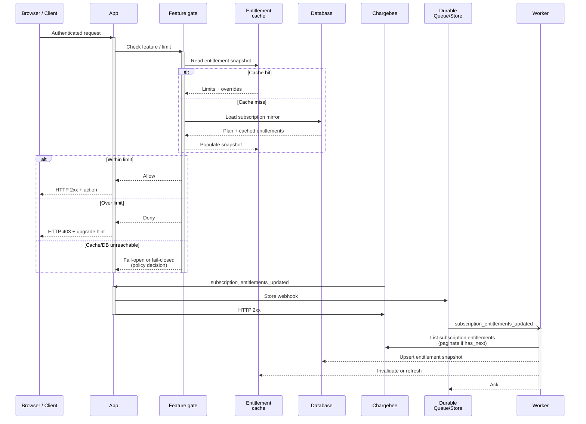
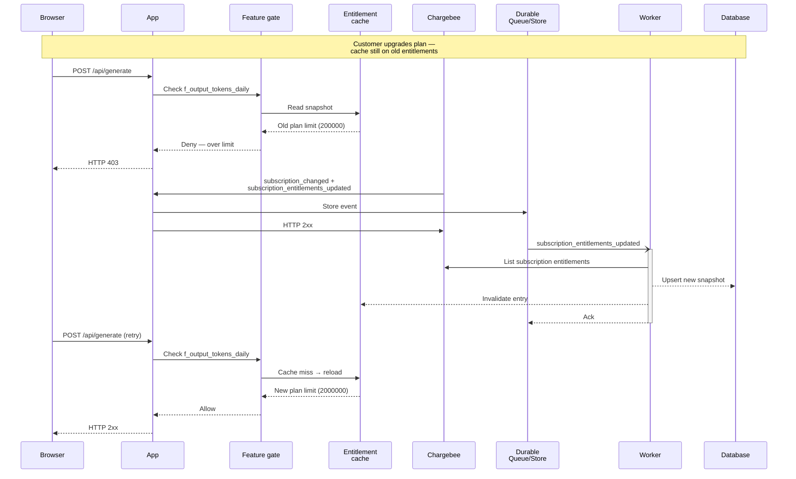

# How to enforce entitlements at runtime

Once subscriptions and webhooks are wired up, the next integration step is deciding what a signed-in user can do on each request. You will need runtime entitlement enforcement to:

* Block or allow product actions based on the subscription's current feature access
* Apply numeric limits (seats, API rate, token quotas) predictably under load
* Stay consistent when plans change, overrides are applied, or Chargebee is temporarily unreachable

This guide assumes [Product Catalog 2.0](https://www.chargebee.com/docs/billing/2.0/product-catalog/product-catalog) — items, item prices, and the [entitlements API](https://apidocs.chargebee.com/docs/api/entitlements) resource — not the legacy plan/addon catalog. Chargebee remains the billing **system of record**; your app mirrors subscription entitlements locally and reads that mirror on the hot path.

## High level architecture

Chargebee computes [subscription_entitlement](https://apidocs.chargebee.com/docs/api/subscription_entitlements) records from catalog entitlements, subscription items, and any [entitlement_override](https://apidocs.chargebee.com/docs/api/entitlement_overrides) records. Your app should not re-derive that math at runtime unless you have a strong reason — copy the resolved `value` fields into a local snapshot and enforce against that. Webhooks are **at-least-once** and [not ordered for time-critical work](https://apidocs.chargebee.com/docs/api/events); the entitlement cache therefore always lags Chargebee by at least one webhook delivery plus worker processing time. The feature gate sits **after** authentication and **before** the business handler, reading only the local snapshot and a usage counter — never the Chargebee API on the synchronous path.

## Best Practices

* Treat [subscription_entitlement](https://apidocs.chargebee.com/docs/api/subscription_entitlements) as the enforcement source, not raw plan metadata. A subscription inherits entitlements from the items and item prices on it; [entitlement_override](https://apidocs.chargebee.com/docs/api/entitlement_overrides) records at the subscription, plan price, addon price, or charge level can change the effective value. The API exposes the resolved outcome on each subscription entitlement (`value`, `is_overridden`, `components`). Mirror that snapshot locally and key your gates on `feature_id`, not on `itemPriceId` alone. If you only map `itemPriceId → static plan limits`, subscription-level overrides and grandfathered catalog entitlements will be wrong.

* Model Chargebee features explicitly before writing gate code. A [feature](https://apidocs.chargebee.com/docs/api/features) has a `type` of `switch`, `quantity`, `range`, or `custom`, plus optional `levels[]` and `unit` for numeric types. Catalog [entitlements](https://apidocs.chargebee.com/docs/api/entitlements) linking a feature to an `item` or `item_price` set the per-product values; [item_entitlements](https://apidocs.chargebee.com/docs/api/item_entitlements) is deprecated — migrate to the Entitlements API. Each gate should know how to interpret one feature type:

    - `switch`: treat `value` `true` / `false` (API docs also describe `available` on catalog entitlements) as on/off
    - `quantity`: compare usage against a numeric limit; any component with `unlimited` makes the subscription entitlement `unlimited`
    - `range`: same enforcement shape as quantity, but values can be any whole number in the configured range
    - `custom`: compare against enumerated labels (for example `basic` vs `premium` model tiers)

* Sync entitlements asynchronously from webhook events, not from the request path. Chargebee fires `subscription_entitlements_created` on new subscriptions and [subscription_entitlements_updated](https://apidocs.chargebee.com/docs/api/events/webhook/subscription_entitlements_updated) alongside `subscription_changed` when recurring or non-recurring items change. Override changes emit `entitlement_overrides_updated` and `entitlement_overrides_removed` (see [event types](https://apidocs.chargebee.com/docs/api/events/event-types)); expired overrides eventually emit `entitlement_overrides_auto_removed` (deletion can lag up to 12 hours after `expires_at`). Catalog-side edits emit `item_entitlements_updated`, `item_price_entitlements_updated`, and related types — these affect future subscription entitlement calculations but may not change existing subscriptions when [grandfathering](https://www.chargebee.com/docs/billing/2.0/entitlements/grandfathering-entitlements) is enabled. The worker should:

    - Persist the webhook durably, return HTTP `2xx`, then fetch the full entitlement set with the [List subscription entitlements](https://apidocs.chargebee.com/docs/api/subscription_entitlements) endpoint when the event payload's `has_next` flag is true (the webhook includes at most the first 100 records)
    - Upsert by `(subscription_id, feature_id)` and store `is_overridden` so gates can audit override-driven access
    - Invalidate or version the entitlement cache entry for that subscription after a successful write

* Keep usage counters separate from entitlement snapshots. Entitlement records answer "what is the limit"; counters answer "how much has been consumed in this window". Store counters in a low-latency store (for example Redis sorted sets or atomic integers with TTL aligned to the billing period). Increment counters in the same code path that performs the gated action, after the gate allows the request. Do not write usage back to Chargebee on every API call unless you are on a metered/usage-based billing path — for included-quota features, local counters are enough for enforcement; Chargebee [Usage Alerts](https://www.chargebee.com/docs/billing/2.0/usage-based-billing/usage-alerts) (Private Beta — contact Chargebee Support to enable) can fire `alert_status_changed` webhooks when metered usage crosses thresholds.

* Apply Chargebee's aggregation rules when validating your snapshot. For `quantity` features (see [How subscription entitlements are determined](https://apidocs.chargebee.com/docs/api/subscription_entitlements)), the subscription entitlement is the sum of each subscription item's entitlement value multiplied by that item's `quantity`, unless any component is `unlimited`. For `switch` features, the subscription entitlement is `true` if any contributing item is `true`. Subscription-level overrides replace the computed value entirely. Per-seat plans (like `plan-team` in the reference catalog) rely on this multiplication — a per-seat limit times seat count must not be hard-coded from the base plan row alone.

* Pick a single fail direction for cache and datastore outages and document it per feature class. There is no Chargebee-default answer — it is a product decision. Fail closed (deny when the snapshot is missing or stale) protects revenue and prevents complimentary access during outages, but risks blocking paying customers when Redis or Postgres blips. Fail open (allow when unreachable) keeps the product usable, but risks unlimited usage during an outage. A common split: fail closed for hard paid features (`switch` gates like SSO), fail open for soft metering where downstream billing can reconcile later — but only if your finance team accepts that trade-off.

### Enforcement latency versus billing truth

The classic case: a customer upgrades from Pro to Max in Chargebee, completes checkout, and immediately hits an API endpoint. Chargebee has already updated the subscription, but your worker has not processed `subscription_entitlements_updated` yet, so the entitlement cache still holds Pro limits. The customer sees a false `403` or an upgrade prompt for a feature they just paid for.

The mirror image is downgrade lag: the cache still shows Max limits for seconds (or longer if the worker is backed up) after a downgrade, so the customer keeps higher-tier access until the snapshot refreshes.

Rules that keep this predictable:

- Never call the Chargebee API synchronously inside the gate to "fix" latency — webhook delivery is async and rate-limited; you will add tail latency and still race with concurrent changes.
- On upgrade paths you control, optimistically refresh the snapshot when checkout or `subscription.update` returns success, before the webhook arrives. Treat the webhook as reconciliation, not the first write.
- On downgrade paths, prefer letting the cache expire naturally or refreshing immediately — granting extra access briefly is usually cheaper than revoking paid access briefly.
- Expose cache version or `occurred_at` on entitlement rows so support can tell "customer is on new plan in Chargebee but cache timestamp is old" without guessing.
- For downgrades that must cut access immediately, pair webhook sync with a short TTL on cache entries (seconds to low minutes) so the worst-case stale window is bounded.

### Threshold prompts, hard caps, and overages

Numeric features need two policies: what happens as the customer approaches the limit, and what happens at the limit.

For soft thresholds (upgrade prompts, in-app banners), compare local usage counters against a percentage of the entitlement limit without blocking the action. Chargebee [Usage Alerts](https://www.chargebee.com/docs/billing/2.0/usage-based-billing/usage-alerts) evaluates metered usage in near real time and sends `alert_status_changed` when status moves between `within_limit` and `in_alarm` — useful when usage events are already flowing to Chargebee. For non-metered included quotas enforced only in your app, implement the same threshold logic locally (for example fire an internal event at 80% of `f_credits_monthly`).

For hard caps, the gate rejects the request when `usage >= limit` unless the subscription entitlement is `unlimited`. For overages, the gate allows the action and a separate pipeline records billable usage — Chargebee's usage-based billing path handles overage invoicing when configured. Mixing both on the same feature without documenting it produces customers who are blocked *and* billed, or neither.

Pick one primary enforcement mode per feature and test the boundary: at limit minus one, at limit, and at limit plus one.

### Grandfathered and overridden entitlements

Two mechanisms diverge a subscription from the plan's catalog defaults:

[Grandfathering](https://www.chargebee.com/docs/billing/2.0/entitlements/grandfathering-entitlements) applies when enabled on a site: catalog entitlement changes can apply only to new subscriptions while existing subscriptions keep prior item entitlements. Sites with grandfathering enabled cannot use certain deprecated item entitlement upsert APIs. Your worker must consume `subscription_entitlements_updated` for existing customers — never assume a plan's current catalog row describes an old subscription.

[Subscription entitlement overrides](https://apidocs.chargebee.com/docs/api/entitlement_overrides) cover sales-led deals: subscription-level overrides (`entity_id` omitted) or entity-level overrides on a specific plan price, addon price, or charge. The resulting `subscription_entitlement.is_overridden` flag (see [subscription entitlements API](https://apidocs.chargebee.com/docs/api/subscription_entitlements)) is `true` when an override drives the value. Subscription-level overrides support `effective_from` and `expires_at`; after expiry the override object disappears and `entitlement_overrides_auto_removed` fires on a delay (up to 12 hours). A gate that reads static plan limits from code will miss these entirely — including Enterprise contracts wired in the Chargebee dashboard with overrides while the base plan row shows `custom` pricing.

### Demo scenario: enforcing an API rate limit live

The reference catalog defines `f_api_rate_per_minute` as a `quantity` [feature](https://apidocs.chargebee.com/docs/api/features) with per-plan values seeded in [`pointer/scripts/catalog.ts`](../pointer/scripts/catalog.ts) (30 requests/min on Free, 300 on Pro, 1000 on Max, 500 per seat on Team, 5000 on Enterprise). A minimal live gate for `POST /api/generate` would:

1. Resolve the caller's active subscription reference (user or organization) to a `subscription_id` in the local mirror
2. Load `f_api_rate_per_minute` from the entitlement snapshot (not from `planLimits` alone — overrides can differ)
3. Increment a Redis key `rate:{subscription_id}:{minute_bucket}` with TTL 60 seconds
4. If the count exceeds the entitlement value (and the value is not `unlimited`), return HTTP `429` with a link to `/choose-plan`; otherwise proceed

This keeps the hot path to two reads (subscription lookup + counter increment) and no Chargebee round trip. Pair it with a dashboard widget that reads the same counter so the `/flow` demo can show the gate firing in real time.

## Implementation notes

TODO

## Go-live checklist

- [ ] Is the site on Product Catalog 2.0 with features and entitlements configured via the [entitlements API](https://apidocs.chargebee.com/docs/api/entitlements) (not legacy [item_entitlements](https://apidocs.chargebee.com/docs/api/item_entitlements) alone)?

- [ ] Does the worker persist full `subscription_entitlement` snapshots (paginating when webhook `has_next` is true) on `subscription_entitlements_created` and `subscription_entitlements_updated`?

- [ ] Does the worker refresh snapshots on `entitlement_overrides_updated`, `entitlement_overrides_removed`, and handle delayed `entitlement_overrides_auto_removed`?

- [ ] Does every feature gate read the local entitlement snapshot rather than calling Chargebee synchronously?

- [ ] Are `quantity` limits enforced using Chargebee's sum-of-items aggregation (including subscription item `quantity`), not a static plan table alone?

- [ ] When a customer completes an upgrade in your checkout flow, does the app optimistically refresh entitlements before the webhook arrives?

- [ ] Does enforcement fail safe — i.e., does the chosen fail-open/fail-closed policy match what product and finance expect when Redis or Postgres is down?

- [ ] Are subscription-level and entity-level entitlement overrides reflected in the snapshot (`is_overridden` checked in tests)?

- [ ] For hard-capped features, does usage at exactly the limit behave as intended (blocked or allowed) and match the overage policy if one exists?

- [ ] Are threshold / upgrade prompts driven off the same counter the gate uses, so users are not prompted after already being blocked (or vice versa)?

- [ ] Is there a reconciliation job or support query that compares local entitlement snapshots to Chargebee's [List subscription entitlements](https://apidocs.chargebee.com/docs/api/subscription_entitlements) API for drift detection?
