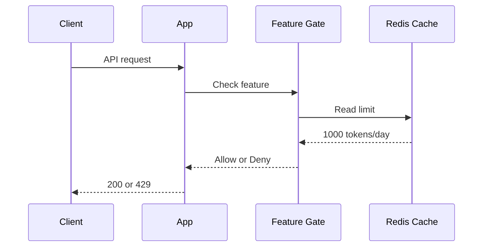
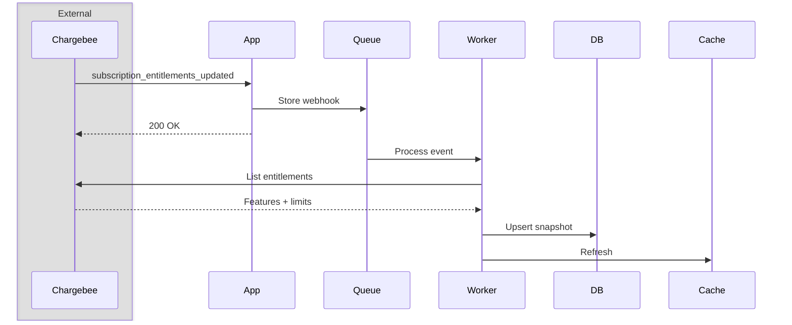
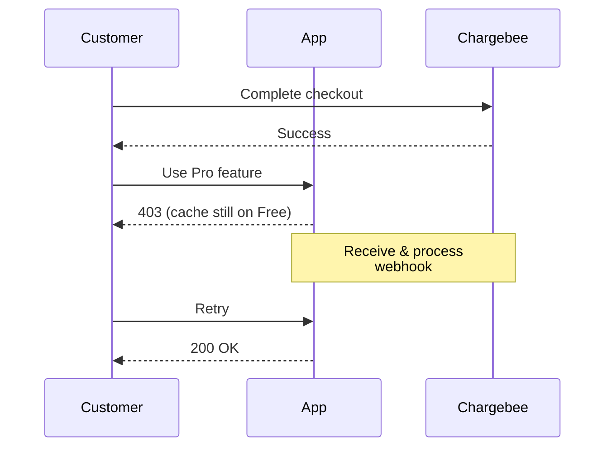
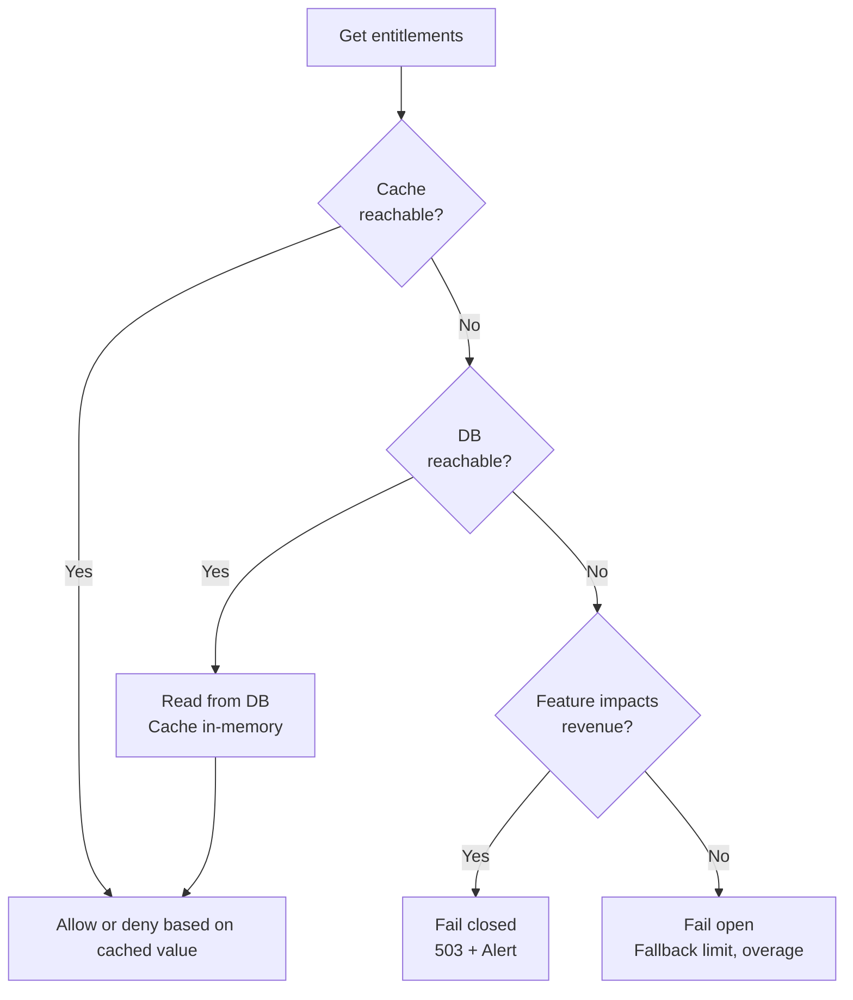

# How To Enforce Entitlement Checks

Chargebee is the source of truth for entitlements, but calling its API on every incoming request introduces latency and exhausts rate limits. Instead, cache entitlement snapshots locally in Redis and Postgres.

This guide covers how to:

* Allow or block actions based on a subscription's current feature access
* Enforce numeric limits (API rate limits, token quotas, and seat counts) under load
* Keep local snapshots consistent during plan changes, manual overrides, and Chargebee outages

## Setup

- Product Catalog 2.0 with features and entitlements configured
- Subscriptions synced locally (see webhook guide)
- A local database (such as Postgres) that stores entitlement snapshots updated by Chargebee webhooks
- A Redis cache for low-latency checks on incoming requests

## 1. How Entitlement Checks Work



### Flow

1. The client sends an authenticated request.
2. The feature gate reads the cached entitlement limit from Redis.
3. The gate compares current usage against the limit.
4. The app lets the request proceed, or rejects it with an error (such as 429 or 403).

```typescript
// Check the user's entitlement for a particular feature
const limit = await cache.get(`entitlement:${subscriptionId}:${featureId}`);

if (usage >= limit) {
  throw new ForbiddenError("Usage limit exceeded");
}
```

## 2. Feature Types And Enforcement Rules

| Type | What it means | How to check |
|------|---------------|--------------|
| switch | Boolean on/off | `value === true` |
| quantity | Numeric limit | `usage < value or value === "unlimited"` |
| range    | Number in range | Same as quantity |
| custom   | Text labels     | `value === "premium"` |

```typescript
// Switch feature (e.g., SSO enabled)
if (entitlement.value !== true) {
  throw new ForbiddenError("SSO not available on your plan");
}
// Quantity feature (e.g., API rate limit)
const limit = entitlement.value === "unlimited" ? Infinity : entitlement.value;
if (currentUsage >= limit) {
  throw new TooManyRequestsError("Rate limit exceeded");
}
// Custom feature (e.g., model tier)
if (entitlement.value !== "gpt-4") {
  throw new ForbiddenError("Upgrade to access GPT-4");
}
```

## 3. Syncing Entitlements In The Worker

Because incoming requests only read cached entitlements from Redis, a background worker must keep local state in sync with Chargebee. When Chargebee emits an entitlement event, the worker fetches the latest snapshot, updates the database, and evicts the cached Redis key.



```typescript
// Worker handler (simplified)
async function handleEntitlementsUpdated(event) {
  const { subscription_id } = event.content.subscription;

  // Fetch full entitlement list
  const entitlements = await chargebee.subscriptionEntitlement.subscriptionEntitlementsForSubscription({ subscription_id, limit: 100 });

  // Store locally
  await db.upsertEntitlements(subscription_id, entitlements.list);

  // Refresh cache
  await cache.del(`entitlements:${subscription_id}`);
}
```

**Worker requirements**:

* Process webhooks asynchronously through a durable queue so API traffic never blocks on Chargebee.
* Upsert the complete entitlement snapshot in the database before invalidating the cache.
* Evict the Redis cache key after the database write succeeds.

✅ Do: Process webhooks promptly so local entitlement limits stay current.

⚠️ Don't: Call the Chargebee API while serving user requests. Doing so burns your rate limit and adds network latency to every call.


## 4. Handling Subscription Upgrades and Downgrades

When a customer upgrades or downgrades their subscription, Chargebee sends a `subscription_entitlements_updated` webhook event. Because webhook delivery and worker execution take a few seconds, relying on the worker alone creates edge cases:

* On an upgrade, the customer returns to your app before the webhook arrives and gets blocked from features they just paid for.
* On a downgrade, the customer continues using retired features until the worker runs or the cache expires.

To make upgrades feel instant, fetch entitlements for the new subscription directly in your checkout callback, store the snapshot, and bust the cache.



```typescript
// After successful upgrade
async function onCheckoutSuccess(subscriptionId) {
  // Optimistically refresh before webhook arrives
  const entitlements = await chargebee.subscriptionEntitlement
    .subscriptionEntitlementsForSubscription(subscription_id);

  await db.upsertEntitlements(subscriptionId, entitlements.list);
  await cache.del(`entitlements:${subscriptionId}`);
}
```

✅ Do: Refresh entitlements immediately in your checkout callback so customers get instant access to upgraded features.

⚠️ Don't: Wait for the background webhook before updating access after checkout. Delivery delays cause noticeable upgrade lag.

⚠️ Don't: Call Chargebee directly inside the feature gate to resolve cache lag. That penalizes every user request with external network latency.

⚠️ Don't: Rely on natural cache expiration during downgrades. Stale cache entries allow users to access revoked features until the TTL expires.

## 5. Entitlement Overrides

Sales teams often provision custom limits for enterprise customers that differ from default plan tiers. Chargebee supports this through [entitlement overrides](https://apidocs.chargebee.com/docs/api/entitlement_overrides).

When an override is active, Chargebee sets `subscription_entitlement.is_overridden` to `true` and returns the custom limit directly in `value`. Feature gates must always check the resolved `value` from your snapshot. Avoid comparing against hardcoded plan tables, which miss customer-specific overrides.

```typescript
// Gate should check the resolved value, not plan defaults
const entitlement = await getEntitlement(subscriptionId, "f_api_rate");

// ✅ Correct: uses Chargebee's computed value (includes overrides)
const limit = entitlement.value;

// ❌ Wrong: static plan table misses overrides
const limit = PLAN_LIMITS[planId].api_rate;
```

Listen for both `entitlement_overrides_updated` and `entitlement_overrides_removed` webhook events so changes in Chargebee reflect in your local database immediately.

## 6. Fail-Safe Behavior

Every component in the entitlement path can fail. Your application must handle cache outages, upstream rate limits, and webhook delays without crashing:

| Failure scenario | Impact | Remediation options |
|------------------|--------|---------------------|
| Redis cache unreachable | Entitlements cannot be determined | 1. Fall back to the database snapshot<br>2. Use an in-memory cache with a short TTL |
| Chargebee API limit exceeded (`api_request_limit_exceeded`, HTTP 429) | Refresh fails, snapshot goes stale | 1. Honor `Retry-After`, then apply exponential backoff with jitter<br>2. Retry in the background<br>3. Coalesce duplicate requests for the same subscription |
| Chargebee returns 5xx (`internal_temporary_error`, `site_read_only_mode`) | Refresh fails | 1. Treat as retryable and keep the last known good snapshot<br>2. Never overwrite local data with a partial or empty snapshot on failure |
| Webhook endpoint down | Chargebee retries 7 times over ~3 days 7 hours, then drops the event | 1. Acknowledge HTTP 200 as soon as the event is durably queued<br>2. Run a scheduled reconciliation job to repair missed events |
| Worker backlog | Snapshots silently age | Alert on queue lag and snapshot age, not just worker error counts |

When both the cache and the database are unreachable, decide feature by feature whether to fail open or fail closed based on financial impact.




**Option 1: Fail closed (deny access)**

```typescript
try {
  const limit = await cache.get(`entitlement:${subId}:${featureId}`);
} catch (err) {
  throw new ServiceUnavailableError("Try again later");
}
```

✅ Best for: Hard gates and costly features (SSO, advanced model calls)

⚠️ Risk: Blocks paying customers during an infrastructure outage

**Option 2: Fail open (allow access)**

```typescript
try {
  const limit = await cache.get(`entitlement:${subId}:${featureId}`);
} catch (err) {
  return FALLBACK_LIMIT; // Allow with basic limits
}
```

✅ Best for: Soft metering and usage billed in arrears

⚠️ Risk: Users get unbilled access during an outage

## 7. Customer vs Subscription Entitlements

Chargebee provides two endpoints for retrieving entitlements:

* [List subscription entitlements](https://apidocs.chargebee.com/docs/api/subscription_entitlements/list-subscription-entitlements): Returns entitlements for a specific subscription, regardless of its status.
* [List customer entitlements](https://apidocs.chargebee.com/docs/api/customer_entitlements/list-customer-entitlements): Returns entitlements across all of a customer's active subscriptions, plus customer-level grants (such as one-time purchases).

| | Subscription entitlements | Customer entitlements |
|---|---|---|
| Scope | One subscription | `active` and `non_renewing` subscriptions, plus customer-level grants |
| Consolidation | Handled by your app | Handled by Chargebee when `consolidate_entitlements=true` |
| Extra fields | `feature_name`, `feature_type`, `is_overridden`, `expires_at` | `customer_id`, `subscription_id` |
| Webhook events | `subscription_entitlements_created`, `subscription_entitlements_updated` | `customer_entitlements_updated` |

Choose between them based on your account structure:

* Use subscription entitlements if your app assigns one subscription per customer with fixed plan limits. This keeps caching logic simple.
* Use customer entitlements with `consolidate_entitlements=true` if customers can hold multiple subscriptions or buy add-on grants. Chargebee handles the consolidation math so your app receives a single merged total.

### Feature Value Consolidation

| Feature type | Consolidated value |
|--------------|--------------------|
| switch   | `true` if any subscription grants `true` |
| quantity | Sum of all values; `unlimited` if any value is `unlimited` |
| range    | Sum, capped at `levels[1].value` unless that level is unlimited; `unlimited` wins |
| custom   | The highest level held |

```typescript
async function loadCustomerEntitlements(customerId: string) {
  const entitlements = [];
  let offset: string | undefined;

  do {
    const page = await chargebee.customerEntitlement.entitlementsForCustomer(customerId, {
      limit: 100,
      consolidate_entitlements: true,
      offset,
    });

    entitlements.push(
      ...page.list
        .map((entry) => entry.customer_entitlement)
        .filter((e) => e.is_enabled)
    );
    offset = page.next_offset;
  } while (offset);

  return entitlements;
}
```

**Important**:

* Both endpoints are eventually consistent. Reading immediately after a write may return a stale value.
* If `entitlement.is_enabled === false`, the customer has no access to the feature, regardless of the value returned.
* Customer-level entitlements do not move over when a subscription changes plans.

## See It Running In The Demo App

The demo app enforces these entitlement patterns across model access and usage limits. Free users receive a small set of models along with monthly token and request limits. Subscription upgrades trigger an immediate refresh of the customer's snapshot so the request path never contacts Chargebee.

Using the [`@chargebee/entitlements`](https://npmx.dev/@chargebee/entitlements) library, the app stores cached entitlements in Redis, persists snapshots in Postgres, and keeps state in sync through webhooks and background worker jobs.

Implementation files to review:

- [`pointer/lib/entitlements/provider.ts`](../pointer/lib/entitlements/provider.ts): Entitlement lookup order (Redis, then Postgres, then Chargebee API). Requests never block on Chargebee: if a subscription lacks a snapshot, the provider falls back to free-tier limits while triggering a background refresh. Configured with a 300-second cache TTL and a 24-hour snapshot TTL.

- [`pointer/lib/entitlements/gate.ts`](../pointer/lib/entitlements/gate.ts): Feature-specific gates. Throws `EntitlementGateError` with HTTP 429 and `retryAfterSeconds` for rate limits, or HTTP 402 when a quota is exhausted or a plan excludes the requested model.

- [`pointer/lib/entitlements/sync.ts`](../pointer/lib/entitlements/sync.ts), [`pointer/lib/entitlements/queue.ts`](../pointer/lib/entitlements/queue.ts): Background queue workers and reconciliation logic.

- [`pointer/app/api/entitlements/checkout-complete/route.ts`](../pointer/app/api/entitlements/checkout-complete/route.ts): Optimistic refresh triggered as soon as subscription checkout succeeds, avoiding webhook delivery delays.

- [`pointer/scripts/catalog.ts`](../pointer/scripts/catalog.ts): Script that creates the Chargebee product catalog, feature definitions, and per-plan limits.

## Go-Live Checklist

- [ ] Is the site on Product Catalog 2.0 with every gated feature defined in Chargebee?

- [ ] Does every feature gate read from the local cache, avoiding Chargebee API calls on the request path?

- [ ] Does the worker refresh the snapshot on `subscription_entitlements_created` and `subscription_entitlements_updated`?

- [ ] Does the worker also refresh on plan-item events, such as `subscription_changed` and `subscription_renewed`?

- [ ] Does the worker refresh on `entitlement_overrides_updated` and `entitlement_overrides_removed`?

- [ ] Does the gate evaluate Chargebee's resolved `value` directly so custom overrides apply? (Static plan tables miss overrides.)

- [ ] Does the gate deny access when `is_enabled` is `false`, regardless of what `value` says?

- [ ] Does the gate treat `"unlimited"` as an infinite limit, rather than comparing a string against a number?

- [ ] Are per-seat limits multiplied by the subscription's quantity?

- [ ] Does the app refresh entitlements immediately when checkout returns, avoiding upgrade lag from webhook delays?

- [ ] Is the downgrade window bounded by a deliberate cache TTL?

- [ ] Are fail-open and fail-closed policies decided per feature and agreed upon with product and finance?

- [ ] Does request behavior behave as intended at exactly the limit, as well as above and below it?

- [ ] Is there a scheduled reconciliation job that compares local snapshots against Chargebee to catch drift?

- [ ] Can support teams verify whether a customer's snapshot is stale without inspecting logs?
