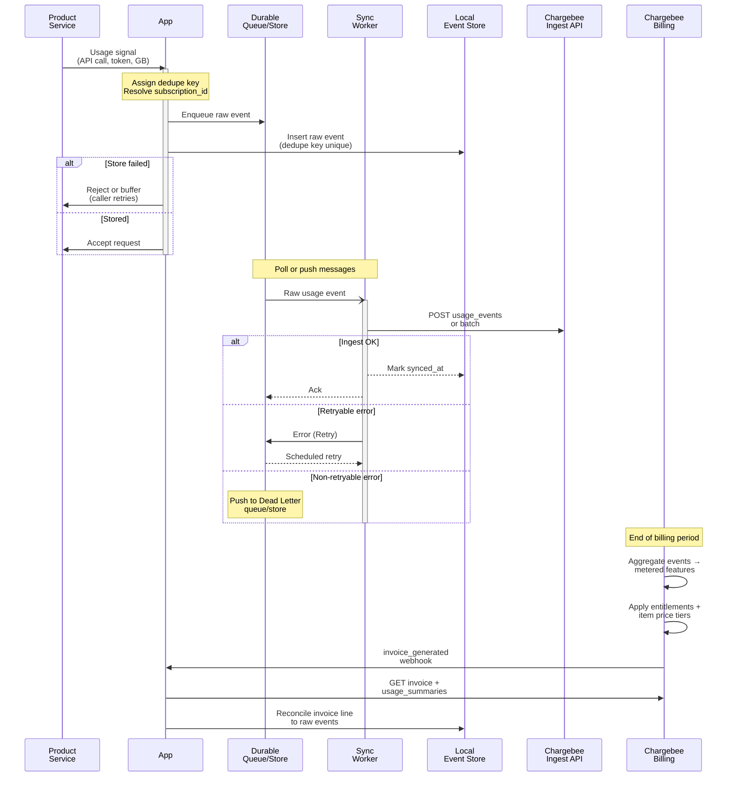
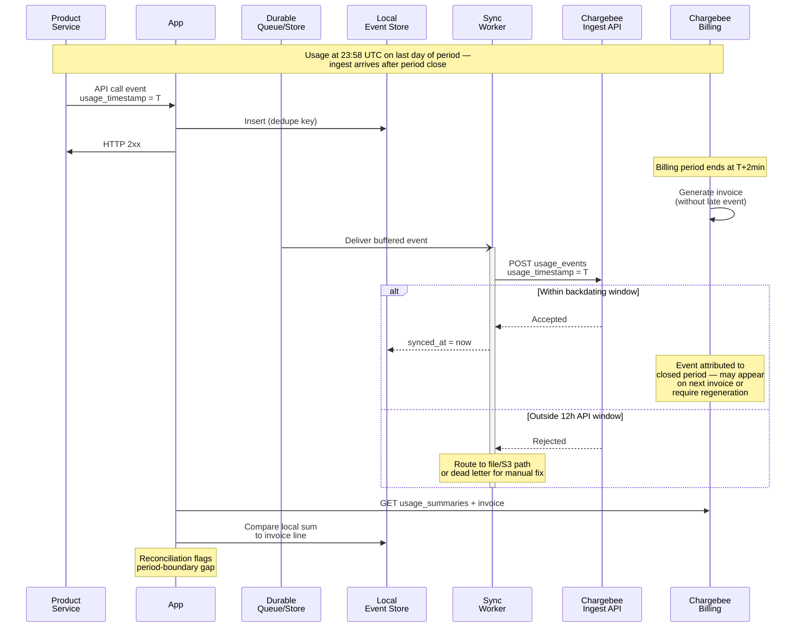

# How to implement usage-based billing with Chargebee

Once subscriptions are live, the next billing problem is turning raw product consumption into invoice lines that reconcile back to source events. You will need a usage pipeline to:

* Ingest high-volume consumption events without losing or double-counting them
* Aggregate usage into billable quantities that match Chargebee's metered features
* Rate aggregated usage against [Product Catalog 2.0](https://www.chargebee.com/docs/billing/2.0/product-catalog/product-catalog) item prices and produce invoice lines at period close
* Enforce included allowances and cut off or alert when a customer exceeds quota

This guide assumes **Product Catalog 2.0** (`items` / `item_prices` / `features`), not the legacy plans/addons 1.0 model. Chargebee exposes two distinct usage surfaces; most new SaaS integrations should target **Advanced Usage-Based Billing (UBB)** via the [Usage Events API](https://apidocs.chargebee.com/docs/api/usage_events), not the older [Usages API](https://apidocs.chargebee.com/docs/api/usages) for Automated Metered Billing.


## High level architecture



Your product emits a usage signal on every billable action. The synchronous path validates the caller, resolves the Chargebee `subscription_id`, and durably stores the raw event locally before returning success to the caller. A background worker pushes stored events to Chargebee's ingest host (`https://{site}.ingest.chargebee.com/api/v2/usage_events` for single events, or the [batch usage events endpoint](https://apidocs.chargebee.com/docs/api/usage_events/ingest-usages-in-batch) for batches). Chargebee holds the billing system of record: it aggregates schemaless event `properties` through [metered features](https://www.chargebee.com/docs/billing/2.0/usage-based-billing/defining-metered-features), applies [linked pricing and entitlements](https://www.chargebee.com/docs/billing/2.0/usage-based-billing/link-pricing), and generates the invoice at period end. Your reconciliation job compares the invoice line quantity and amount against your local raw-event roll-up and Chargebee's [usage summaries](https://apidocs.chargebee.com/docs/api/usage_summaries) for the same window.

Keep real-time enforcement (rate limits, hard caps) in your app against local aggregates. Chargebee's [usage charges](https://apidocs.chargebee.com/docs/api/usage_charges) resource and [alert_status_changed](https://apidocs.chargebee.com/docs/api/events/webhook/alert_status_changed) webhooks inform billing state; they are not a substitute for blocking an API call at request time.


## Best Practices

* Choose Advanced UBB over the legacy Usages API before writing ingestion code. Advanced UBB ingests schemaless events and decouples metering from the catalog — you define [metered features](https://www.chargebee.com/docs/billing/2.0/usage-based-billing/defining-metered-features) that aggregate over event `properties` after ingestion. The legacy [Usages API](https://apidocs.chargebee.com/docs/api/usages) posts pre-aggregated quantities per `item_price_id` and `usage_date` (Unix seconds) and applies only when Automated Metered Billing is enabled with `metered: true` on the [item](https://apidocs.chargebee.com/docs/api/items). The legacy path also caps at 5,000 usage records per subscription lifetime. High-volume SaaS should use UBB; reserve the Usages API only for low-volume, pre-aggregated meters you control entirely in your app.

* Store every raw event locally before acknowledging the caller. Chargebee ingest is at-least-once from your worker's perspective — network retries and queue redelivery can produce duplicate POST attempts. Your local store is the reconciliation anchor. Insert with a unique constraint on your dedupe key and treat conflicts as success. Without a local copy you cannot explain an invoice line six weeks later.

* Mirror Chargebee's dedupe contract in your local store. For UBB, the unique event identity is `(subscription_id, usage_timestamp, deduplication_id)` — all three fields are required on ingest, and [deduplication_id](https://apidocs.chargebee.com/docs/api/usage_events) must disambiguate multiple events that share the same millisecond timestamp for one subscription. Generate `deduplication_id` from a stable idempotency key your product already has (request ID, message ID, UUID from the originating service). For POST retries to Chargebee's main API (including legacy usage creates), also send the [idempotency key header](https://apidocs.chargebee.com/docs/api/idempotency) (`chargebee-idempotency-key`) — replays within the 30-minute idempotency window return the original response with `chargebee-idempotency-replayed: true`.

* Batch high-volume ingestion; preserve per-event ordering only where it matters. The [batch endpoint](https://apidocs.chargebee.com/docs/api/usage_events/ingest-usages-in-batch) accepts up to 500 events per request. Your worker should accumulate events by time or count, flush batches, and retry the whole batch on transient failures while relying on dedupe keys to absorb partial replays. Ordering between unrelated subscriptions does not matter. Ordering within one subscription only matters when your metered feature uses `max` or `last`-style logic — for `count` and `sum` aggregations, commutative batches are safe.

* Keep event `properties` flat and forward-compatible. UBB ingestion is [schemaless](https://www.chargebee.com/docs/billing/2.0/usage-based-billing/ingesting-usage-events-into-chargebee): you can add a new metric by emitting a new property field without redeploying the ingest pipeline. Avoid [reserved property names](https://www.chargebee.com/docs/billing/2.0/usage-based-billing/ingesting-usage-events-into-chargebee#reserved-keywords) such as `subscription_id`, `usage_timestamp`, SQL keywords like `count` or `sum`, and unprefixed generic names like `status`. Prefer namespaced fields (`api_method`, `tokens_input`, `storage_bytes`). When you start billing on a new field, create a new metered feature in Chargebee that filters and aggregates that property — existing events in the stream already carry the data.

* Configure catalog, metered features, and pricing as separate layers. In Product Catalog 2.0, a [feature](https://apidocs.chargebee.com/docs/api/features) with `metered: true` defines what to count and how ([sum, count, min, max, average, count distinct](https://www.chargebee.com/docs/billing/2.0/usage-based-billing/defining-metered-features)). [Link pricing](https://www.chargebee.com/docs/billing/2.0/usage-based-billing/link-pricing) attaches included usage (entitlements on non-metered plan/addon items) and on-demand usage (metered plan/addon [item prices](https://apidocs.chargebee.com/docs/api/item_prices) with `pricing_model` of `per_unit`, `tiered`, `volume`, or `stairstep`). For UBB, configure included quantities through entitlements on linked items — `free_quantity` on item prices is [not supported for UBB](https://apidocs.chargebee.com/docs/api/item_prices); included allowance lives in entitlements instead ([FAQ](https://www.chargebee.com/docs/billing/2.0/usage-based-billing/usage-based-billing-faqs)).

* Enforce allowance in your app; use Chargebee alerts for billing-side notification. Chargebee does not block your API at the edge. Read entitlements from the subscription (or mirror them locally from webhooks) and maintain a running counter in your local store for the current period. When usage crosses the included limit, reject or throttle at the gateway. For billing visibility, configure [usage alerts](https://www.chargebee.com/docs/billing/2.0/usage-based-billing/usage-alerts) (private beta — contact Chargebee Support to enable) on the metered feature: Chargebee evaluates thresholds within seconds of processing ingested events and emits `alert_status_changed` when status moves between `within_limit` and `in_alarm`. Handle that webhook to notify the customer, trigger an upgrade flow, or flip a hard-cap flag in your app. Poll [usage charges](https://apidocs.chargebee.com/docs/api/usage_charges) for near-current `total_usage`, `included_usage`, and `on_demand_usage` when you need a billing-aligned view without waiting for period close.

* Reconcile invoice lines to raw events every billing period. After `invoice_generated`, fetch the invoice and locate the metered line item. Compare its quantity to (a) your local roll-up of raw events for the subscription over `usage_from`/`usage_to` from usage charges or the invoice period, and (b) Chargebee's [usage summaries](https://apidocs.chargebee.com/docs/api/usage_summaries) for the same `feature_id` and window. Mismatches usually trace to late-arriving events, metered-feature filter drift, or timezone boundary errors — not to "Chargebee math being wrong." Persist reconciliation results; unresolved drift above a tolerance should page someone.


### Late and duplicate usage events

Duplicate delivery is normal. Your ingest worker may POST the same event twice after a timeout; Chargebee's dedupe key prevents double counting on the billing side as long as you reuse the same `(subscription_id, usage_timestamp, deduplication_id)`. Locally, treat the dedupe key as the idempotency boundary: insert-first, sync-second, mark `synced_at` only after a successful ingest response.

Late events are harder because billing period boundaries are enforced on `usage_timestamp`, not on when your worker finally delivers the event. Via the Usage Events API, `usage_timestamp` must fall within the [last 12 hours](https://apidocs.chargebee.com/docs/api/usage_events/create-a-usage-event) at ingest time, on both test and live sites. S3 and file upload accept a much wider window — Chargebee's [advisory limits](https://www.chargebee.com/docs/billing/2.0/usage-based-billing/understanding-usages#usage-based-billing-limits) list **365 days** of backdating on a test site and **30 days** on a live site, with the API window configurable on request. An event whose true consumption time falls outside 12 hours needs the file/S3 path or a raised limit — do not assume you can POST arbitrarily old timestamps through the real-time API.

For legacy Usages API integrations, [usage_date](https://apidocs.chargebee.com/docs/api/usages) is in Unix seconds and only one record may exist per `(subscription_id, item_price_id, usage_date)`. Chargebee bills usages whose `usage_date` falls while the subscription is `active` or `non_renewing`; usages whose date falls in an already-closed invoice period are stored but not invoiced unless the invoice is regenerated.



Clock skew between your servers and Chargebee adds edge cases around period boundaries. Emit `usage_timestamp` from the time the consumption occurred in your product (ideally from the originating service clock, corrected with NTP), not from the sync worker clock at delivery time. If your app clock runs ahead, events can land in the next period early; if it runs behind, valid events miss the backdating window. Monitor skew between `occurred_at` (your insert time) and `usage_timestamp` (billing time) — large deltas predict reconciliation pain.

Chargebee subscription billing periods follow the site [time zone](https://www.chargebee.com/docs/billing/2.0/site-configuration/time-zone) (site-wide, not per user). Your local aggregation windows for enforcement should use the same timezone boundary as Chargebee, or convert explicitly. A customer in Tokyo on a site configured for US/Eastern can see invoice period cutoffs that do not match their local midnight.


### Demo scenario: API-call events through to an invoice line

This walkthrough validates the full pipeline on a test site with [Advanced Usage-Based Billing enabled](https://www.chargebee.com/docs/billing/2.0/usage-based-billing/understanding-usages#enable-advanced-usage-based-billing).

1. **Catalog setup.** Create a plan item price (flat base fee) and a metered addon item price (`per_unit` at, say, $0.001 per call). Define a metered feature "API Calls" with aggregation `count` over property `api_method` (or count all events with no filter). [Link pricing](https://www.chargebee.com/docs/billing/2.0/usage-based-billing/link-pricing): include 1,000 API calls on the plan, attach the metered addon for on-demand overage.

2. **Subscribe a test customer** and note the `subscription_id`.

3. **Emit events from your app.** On each API request, enqueue and store:

```json
{
  "subscription_id": "sub_xxx",
  "usage_timestamp": 1738732394123,
  "deduplication_id": "req_abc123",
  "properties": {
    "event_type": "api_request",
    "api_method": "get_usage",
    "response_code": 200
  }
}
```

POST to `https://{site}.ingest.chargebee.com/api/v2/usage_events`, or batch via the worker. Use [Time Machine](https://www.chargebee.com/docs/billing/2.0/site-configuration/time-machine) on the test site to advance into the next billing period without waiting a month.

4. **Observe aggregation.** In the Chargebee UI under Usages, confirm events appear and the metered feature count increases. Optionally call [usage charges](https://apidocs.chargebee.com/docs/api/usage_charges) to see `total_usage`, `included_usage`, and `on_demand_usage` before invoicing.

5. **Close the period.** After Time Machine advances billing, open the generated invoice. The metered line should show overage quantity `(total_calls - 1000)` rated at the addon's unit price. Reconcile: `count(*)` of local raw events with `usage_timestamp` in the period should equal `total_usage` on the usage charge and the billed quantity on the line (modulo included allowance).


## Implementation notes

TODO

## Go-live checklist

- [ ] Is Advanced Usage-Based Billing enabled on the target Chargebee site (test via Billing LogIQ settings; live via access request)?

- [ ] Does the catalog use Product Catalog 2.0 (`items` / `item_prices`) with metered features, included entitlements, and on-demand item prices linked per the [link-pricing](https://www.chargebee.com/docs/billing/2.0/usage-based-billing/link-pricing) model you intend (PAYG, fixed fee + overage, or hybrid)?

- [ ] Does every ingested event carry `subscription_id`, `usage_timestamp` (epoch milliseconds), `deduplication_id`, and flat `properties` with no reserved field names?

- [ ] Are duplicate events handled idempotically locally (unique dedupe key) and at Chargebee (same `(subscription_id, usage_timestamp, deduplication_id)` on retry)?

- [ ] Are late events handled — events buffered past the 12-hour API backdating window routed to file/S3 ingestion or operations review, not dropped silently?

- [ ] Does the sync worker retry transient ingest failures without acknowledging the queue message, and route permanently rejected payloads to a dead-letter store?

- [ ] Does real-time enforcement (rate limits, hard caps) read from local period counters aligned to the Chargebee site time zone, not only from post-hoc invoice data?

- [ ] If usage alerts are enabled, is the webhook endpoint subscribed to `alert_status_changed` and wired to customer notification or lockout logic?

- [ ] After a test billing period (Time Machine or natural), does usage reconcile to the invoice line — local raw-event count matches `usage_summaries` / invoice quantity for each metered feature within your tolerance?

- [ ] Is there an on-call runbook for reconciliation drift (metered-feature filter change, entitlement grandfathering, period-boundary late events)?
