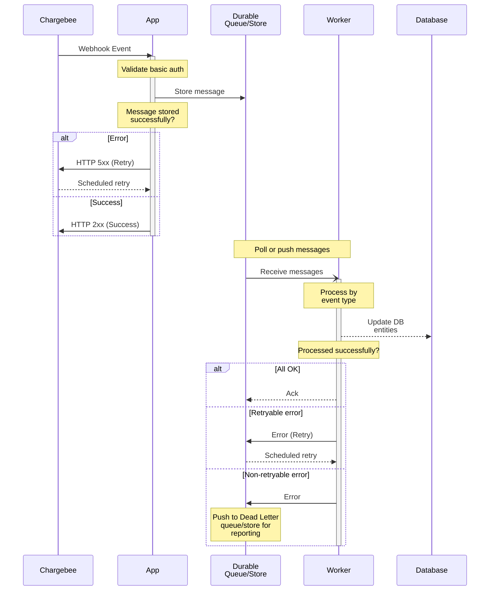
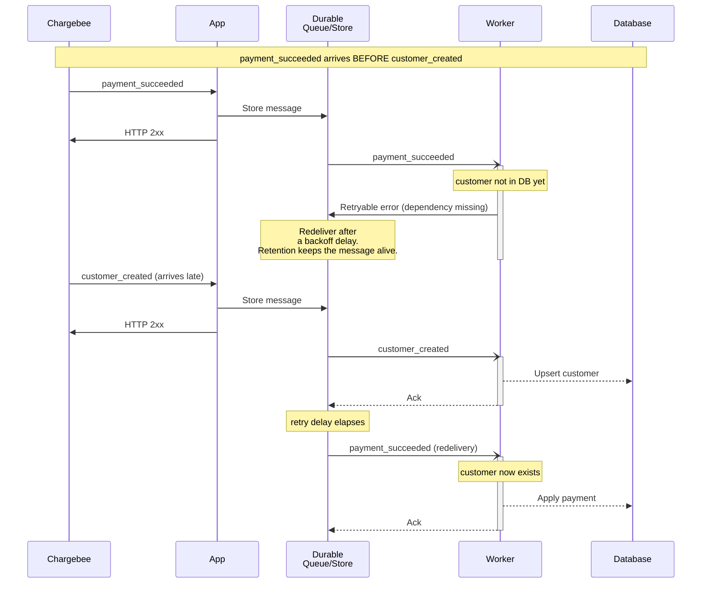

# How to integrate Chargebee Webhooks

One of the first steps when integrating Chargebee using the SDK/API is to setup webhooks. You will need wekhooks to:

* Keep your app data in sync with your Chargebee site
* Listen to events related to payments, subscriptions, etc for your system to trigger additional processes
* To verify and reconcile the outcome of a billing flow in case of errors

## High level architecture

## Best Practices

* The incoming webhook handler should do the bare minimum synchronously: validate and store the message delivered from Chargebee. It should:

    - Validate the basic authentication credentials from the request headers
    - Check the `event_type` to ensure it's a relevant event that has to be acted upon
    - Store the event payload in a __durable queue__ or database with the event `id` as the unique identifier. This ensures events are not lost, and duplicate events can be ignored
    - Respond to the webhook request with a HTTP `2xx` response indicating that the webhook was handled successfully
    - In case of errors, respond with a HTTP `5xx` error, in which case Chargebee will attempt to deliver the message again

* __Background workers__ should consume the messages from the queue and process them as required. Since any operation performed by the worker is asynchronous, this can include all error prone or retryable actions. Once processed successfully, acknowledge the message so the queue doesn't redeliver it.

* If a message cannot be processed due to non-retryable errors (e.g. payload not valid JSON), move them to the equivalent of a [__dead letter queue__](https://en.wikipedia.org/wiki/Dead_letter_queue) for further analysis and auditing.

* __Idempotent operations__: Since asynchronous systems have different message delivery semantics (at-least-once, at-most-once, exactly-once), ensure the messages are processed with idempotency in mind. In practical terms, this can include:

    - Storing important events in a audit table along with the message `id`
    - Checking for duplicate message IDs when receiving the webhook event from Chargebee
    - Ensuring SQL queries ignore changes in case of insert/update (e.g. `ON CONFLICT DO NOTHING`)

* If multiple webhooks are configured for an environment, ensure they don't cause duplication. For example, one endpoint may be for the primary application to respond to billing events, and the other may be for auditing or reporting.

* Since webhook events can be [delivered out of order](https://apidocs.chargebee.com/docs/api/events/event-object#out-of-order-delivery), store and compare the `resource_version` returned in the webhook `content`. Note that `resource_version` has to be individually checked for all resources returned in the webhook content (e.g. `content.customer.resource_version`, `content.subscription.resource_version`). Out-of-order delivery also means an event can arrive **before another event it depends on** (for example, a `payment_succeeded` referencing a customer whose `customer_created` hasn't been processed yet). Your worker must be able to handle these dependency gaps — see [Handling out-of-order and dependent events](#handling-out-of-order-and-dependent-events) below.

* `event_id` is the unique identifier 

* Integration verifier -- use LLM ( review prompt)

## Handling out-of-order and dependent events

Chargebee delivers events with **at-least-once** semantics and **no ordering guarantee**. Most of the time events arrive in roughly the order they occurred, but network retries and independent delivery mean a later event can overtake an earlier one. This becomes a correctness problem when events have **dependencies** between resources.

The classic case: a `payment_succeeded` (or `subscription_created`) arrives and references a customer whose `customer_created` event **hasn't been processed yet**. The worker cannot attach the payment to a customer that doesn't exist in your database.

The important thing is what you should *not* do:

- **Don't drop the event.** The dependency will likely arrive moments later.
- **Don't return a 5xx to Chargebee** just because your worker isn't ready — you've already durably stored the message, so acknowledge receipt and let the worker retry from the queue.

Instead, let the message **stay in the queue in a retry state** until its prerequisite lands. The worker treats "dependency not ready" as a *retryable* error: it does not acknowledge the message, so the queue redelivers it after a delay. Meanwhile the queue keeps making progress on other messages, so the blocked event is never head-of-line blocking the rest.

### How long / how many times to retry

Two independent knobs make this robust, and they answer "how patient should the queue be?":

- **Retry with backoff — how many attempts.** On each unacknowledged delivery the message becomes available again after a *backoff delay*, and its delivery/receive count is incremented. After a configured **maximum delivery count**, the message is routed to a [dead letter queue](https://en.wikipedia.org/wiki/Dead_letter_queue) instead of being retried forever. Prefer an **increasing backoff** keyed off the delivery count so a dependency-not-ready message waits progressively longer (seconds → minutes) between attempts rather than burning all its retries in a burst.

- **Retention — how long overall.** The message survives in the queue for the whole **retention period** regardless of individual retries. This is the real safety margin for out-of-order delivery: as long as the prerequisite event arrives within the retention window (and the message hasn't exhausted its max receive count), the dependent event will eventually process. Out-of-order gaps are usually seconds, so a retention period of hours-to-days is ample headroom.

Aim to **distinguish a "dependency not ready" error (retry patiently) from a "poison" message (malformed / permanently un-processable, fail fast to the DLQ)** so that transient ordering gaps don't share the same retry budget as genuinely broken payloads. Whatever lands in the DLQ should be monitored, retained long enough for investigation, and re-drivable back onto the main queue once the root cause is fixed.

## Implementation notes

## Go-live checklist

- [ ] Has basic authentication been configured for the webhook in the Chargebee dashboard?

- [ ] Do you save all validated webhook events to a durable queue or database so it can be processed asynchronously?

- [ ] Are all messages processed with idempotency in mind so that duplicate messages are handled gracefully and in a predictable manner.

- [ ] Can your worker tolerate out-of-order and dependent events (e.g. a payment before its customer) by retrying rather than dropping or failing them?

- [ ] Is the queue retention period comfortably longer than the largest realistic out-of-order gap, and is a max-retry / dead-letter policy configured for messages that never succeed?
