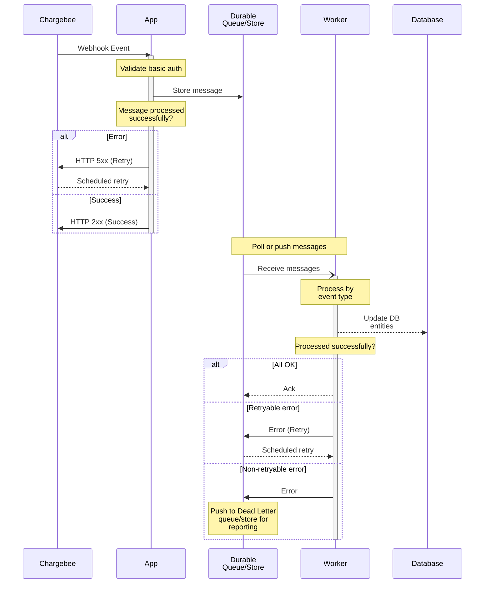

# How to integrate Chargebee Webhooks

One of the first steps when integrating Chargebee using the SDK/API is to setup webhooks. You will need wekhooks to:

* Keep your app data in sync with your Chargebee site
* Listen to events related to payments, subscriptions, etc for your system to trigger additional processes
* To verify and reconcile the outcome of a billing flow in case of errors

## High level architecture

## Best Practices

* The incoming webhook handler should do the bare minimum synchronously: validate and store the message delivered from Chargebee. It should:

    - Validate the basic authentication credentials from the request headers
    - Check the `event_type` to ensure it's a relevant event that has to be acted upon
    - Store the event payload in a __durable queue__ or database with the event `id` as the unique identifier. This ensures events are not lost, and duplicate events can be ignored
    - Respond to the webhook request with a HTTP `2xx` response indicating that the webhook was handled successfully
    - In case of errors, respond with a HTTP `5xx` error, in which case Chargebee will attempt to deliver the message again

* __Background workers__ should consume the messages from the queue and process them as required. Since any operation performed by the worker is asynchronous, this can include all error prone or retryable actions. Once processed successfully, acknowledge the message so the queue doesn't redeliver it.

* If a message cannot be processed due to non-retryable errors (e.g. payload not valid JSON), move them to the equivalent of a [__dead letter queue__](https://en.wikipedia.org/wiki/Dead_letter_queue) for further analysis and auditing.

* __Idempotent operations__: Since asynchronous systems have different message delivery semantics (at-least-once, at-most-once, exactly-once), ensure the messages are processed with idempotency in mind. In practical terms, this can include:

    - Storing important events in a audit table along with the message `id`
    - Checking for duplicate message IDs when receiving the webhook event from Chargebee
    - Ensuring SQL queries ignore changes in case of insert/update (e.g. `ON CONFLICT DO NOTHING`)

* If multiple webhooks are configured for an environment, ensure they don't cause duplication. For example, one endpoint may be for the primary application to respond to billing events, and the other may be for auditing or reporting.

* Since webhook events can be [delivered out of order](https://apidocs.chargebee.com/docs/api/events/event-object#out-of-order-delivery), store and compare the `resource_version` returned in the webhook `content`. Note that `resource_version` has to be individually checked for all resources returned in the webhook content (e.g. `content.customer.resource_version`, `content.subscription.resource_version`)

## Implementation notes

## Go-live checklist

- [ ] Has basic authentication been configured for the webhook in the Chargebee dashboard?

- [ ] Do you save all validated webhook events to a durable queue or database so it can be processed asynchronously?

- [ ] Are all messages processed with idempotency in mind so that duplicate messages are handled gracefully and in a predictable manner.
