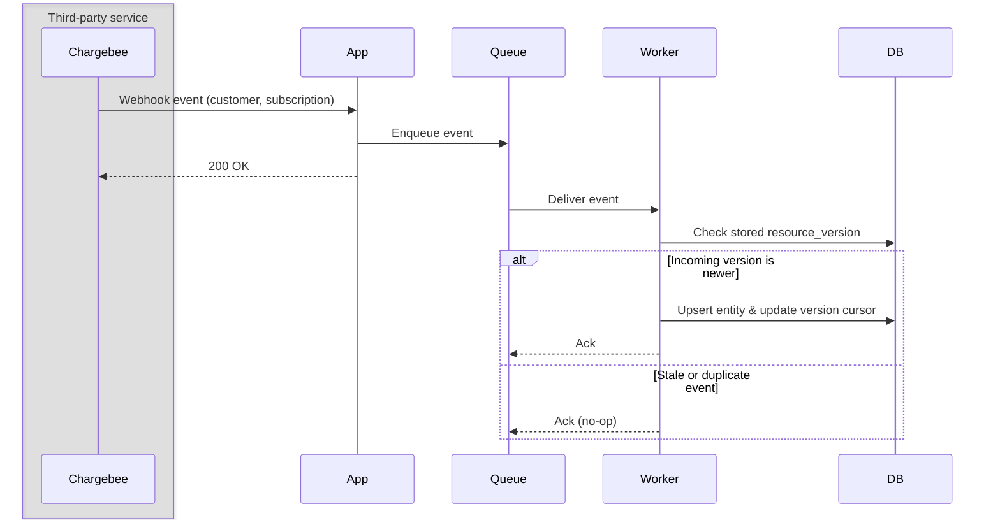
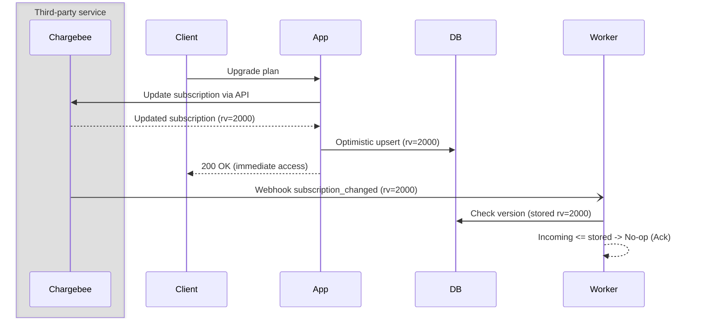
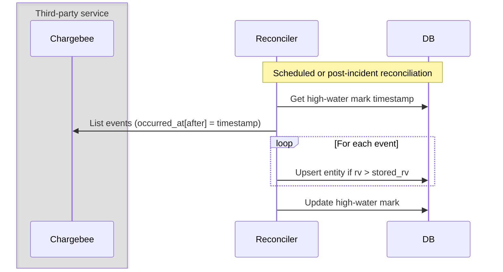
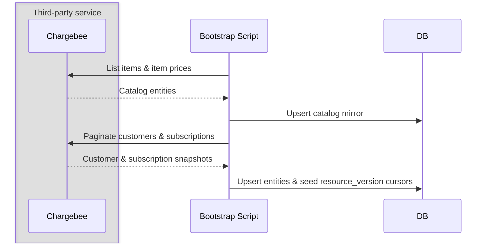

# How To Sync And Reconcile Chargebee Entities

Once webhooks are configured, your application needs a local database copy of billing state to authorize requests, enforce plan tiers, and render account dashboards without calling Chargebee on every HTTP request. This topic covers:

* Keeping a fast local mirror of customers, subscriptions, and catalog entities in sync with Chargebee
* Processing updates safely in a background worker using resource_version guards
* Handling subscription upgrade races between synchronous checkout mutations and asynchronous webhooks
* Recovering from missed webhook events or cold starts using event replay and list APIs

**Important**: Chargebee is the single source of truth for billing state. Your app maintains a read-only mirror. Application requests read from the local mirror, while state-changing operations route to the Chargebee API first.

## Setup

* Product Catalog 2.0 configured with items, item prices, and entitlements
* Webhook endpoint enqueuing events into a durable queue (see webhook guide)
* Background worker consuming events and writing to your local database
* A tracking table (e.g. chargebee_resource_version) storing the latest applied version per resource


## High Level Architecture



### Flow

1. An event occurs in Chargebee (subscription created, plan changed, invoice paid)
2. Chargebee posts the webhook to your application endpoint
3. The endpoint enqueues the message durably and returns 200 OK
4. The background worker picks up the message and inspects resource_version
5. If the version is newer than the database mirror, the worker upserts the row and commits the new version cursor


## 1. How Entity Mirroring Works

Your local database acts as a read mirror, not an authority. Mirror only entities required to authenticate users, check permissions, and render core UI.

| Entity            | What to mirror     | Why mirror locally |
|-------------------|--------------------|-----------------|
| Customer          | id, email, app user_id / org_id | Joins billing entities to your application accounts |
| Subscription      | id, customer_id, status, current_term_end, item_price_id                    | Gates feature access, checks renewal status, displays active plan |
| Catalog           | item_id, item_price_id, pricing tiers                                       | Renders pricing pages and maps plans to feature gates             |
| Invoice / Payment | Fetch on demand (or mirror id, status, amount if billing history is in-app) | Infrequently accessed; can be queried via API or hosted portal    |

```typescript
// Read access tier from local mirror without calling Chargebee
const subscription = await db.subscription.findUnique({
    where: { userId: session.userId, status: "active" },
});
if (!subscription) {
    throw new ForbiddenError("Active subscription required");
}
```

✅ Recommended: Store external IDs (chargebeeCustomerId, chargebeeSubscriptionId) on user records as join keys

✅ Recommended: Skip mirroring resources your app only accesses through the hosted billing portal (e.g., historical invoice PDFs)

⚠️ Not recommended: Treating local database columns as authoritative for subscription status; local edits that bypass Chargebee cause data drift


## 2. What The Worker Does

The background worker is the sole writer for the entity mirror. It processes messages asynchronously to decouple third-party webhook delivery from user-facing traffic.

```mermaid
sequenceDiagram
    participant Queue
    participant Worker
    participant DB
    Queue->>Worker: subscription_changed
    Worker->>DB: Read applied resource_version
    alt Stored version >= incoming version
      Worker-->>Queue: Ack (skip stale)
    else Stored version < incoming version
      Worker->>DB: Upsert subscription row
      Worker->>DB: Commit new resource_version
      Worker-->>Queue: Ack
    end
  ```

The worker executes this sequence for each message:

1. Extract entity payloads from event.content (e.g., content.subscription, content.customer)
2. Verify freshness against the stored resource_version for that specific resource
3. Upsert entity fields into local tables inside a database transaction
4. Advance the version cursor in the tracking table
5. Acknowledge the queue message

```typescript
// Worker pipeline: guard, upsert, commit, ack
if (await isEventStale(event)) return ack();
await db.transaction(async (tx) => {
    await upsertSubscription(tx, event.content.subscription);
    await commitResourceVersion(tx, "subscription", event.content.subscription);
});
await ack();
```

✅ Recommended: Commit the entity update and the version cursor in the same database transaction

✅ Recommended: Acknowledge the queue message only after the database transaction succeeds

⚠️ Not recommended: Running database upserts inline within the HTTP webhook endpoint


## 3. Handling Ordering With resource_version

Chargebee webhooks can arrive out of order. Every versioned object inside event.content carries a resource_version (a millisecond timestamp counter) that increments on every mutation.

```mermaid
sequenceDiagram
    participant Queue
    participant Worker
    participant DB
    Note over Queue,Worker: Event A (rv=100) delayed in network<br>Event B (rv=200) arrives first
    Queue->>Worker: Event B (rv=200)
    Worker->>DB: Stored is 0 -> Upsert entity & set rv=200
    Worker-->>Queue: Ack
    Queue->>Worker: Event A (rv=100)
    Worker->>DB: Stored is 200 -> 100 <= 200 -> Skip
    Worker-->>Queue: Ack (no-op)
  ```

  Rules for version tracking:

  • Track version per resource type and ID (subscription:sub_123, customer:cust_456). Versions advance independently across different entities.
  • Do not rely on event occurred_at for deduplication; occurred_at represents when the event triggered, while resource_version represents the entity mutation state.

```typescript
// Check if incoming version is older than stored version
const stored = await getStoredVersion(resourceType, resourceId);
if (stored && incomingResourceVersion <= stored.version) {
    return true; // Stale event; safe to ignore
}
```

```sql
-- Track monotonic high-water marks per resource
INSERT INTO chargebee_resource_version (resource_key, version, updated_at)
VALUES ($1, $2, NOW())
ON CONFLICT (resource_key) DO UPDATE
SET version = EXCLUDED.version, updated_at = NOW()
WHERE EXCLUDED.version > chargebee_resource_version.version;
```

✅ Recommended: Compare resource_version for every individual entity in event.content

⚠️ Not recommended: Maintaining a single global version cursor for the entire site

## 4. Handling Subscription Upgrades (Preventing Split-Brain)

When a customer upgrades in the app, two paths execute: the synchronous API mutation (or checkout redirect) and the asynchronous subscription_changed webhook. If the app writes locally before the webhook arrives, writes can race and corrupt state.



To avoid split-brain and provide immediate UI feedback:

1. Mutate via Chargebee first: Call Chargebee's subscription update API.
2. Apply immediate response: Upsert the local database row using the response body and record its resource_version.
3. Allow webhook to no-op: When the corresponding webhook arrives, the worker sees incoming.resource_version <= stored.resource_version and cleanly discards it.

```typescript
// Synchronous upgrade mutation
const { subscription } = await chargebee.subscription.updateForItems(subId, {
    subscription_items: [{ item_price_id: newPlanPriceId }],
});
// Update local mirror using API response; webhook will no-op later
await syncSubscriptionMirror(subscription);
```

✅ Recommended: Update local mirror state using the Chargebee API response immediately after checkout/upgrade mutations

⚠️ Not recommended: Updating local subscription status optimistically before Chargebee responds

⚠️ Not recommended: Waiting purely for the webhook after checkout without refreshing locally, which causes visible upgrade lag for the user


## 5. Reconciling Gaps After Outages

Webhooks can be missed due to queue outages, bad deployments, or networking incidents. Chargebee retries webhooks for up to 2 days, but extended downtime requires proactive reconciliation.



Use two reconciliation strategies depending on the gap window:

### Option 1: Event Replay (Gaps < 90 Days)

Chargebee retains events for 90 days. Walk the List events API (https://apidocs.chargebee.com/docs/api/events/list-events) and pass each event directly into the worker's processing logic.

```typescript
// Replay events from last known cursor
const events = await chargebee.event.list({
    "occurred_at[after]": lastSyncTimestamp,
    "sort_by[asc]": "occurred_at",
    limit: 100,
});
for (const entry of events.list) {
    await processWebhookEvent(entry.event);
}
```

### Option 2: Full Entity Backfill (Gaps > 90 Days or Cold Starts)

If event retention has lapsed, paginate the resource list endpoints directly using next_offset.

```typescript
// Paginating current entity snapshots
let offset: string | undefined;
do {
    const result = await chargebee.subscription.list({ limit: 100, offset });
    for (const entry of result.list) {
      await syncSubscriptionMirror(entry.subscription);
    }
    offset = result.next_offset;
} while (offset);
```

✅ Recommended: Run a daily reconciliation cron to catch any drifted rows

✅ Recommended: Reuse the same idempotent worker logic for event replay and webhooks

⚠️ Not recommended: Deleting local rows during reconciliation if an event is missing; verify current status with retrieve first


## 6. Cold Start And Backfill

When standing up a fresh environment or recovering an empty database:



Bootstrap sequence:

1. Pull Catalog: Paginate items and item prices from Chargebee and populate catalog tables.
2. Pull Active Subscriptions: Paginate customers and subscriptions. Link Chargebee customers to internal users via metadata or email.
3. Seed Version Cursors: Populate the chargebee_resource_version table with current timestamps from the API response so incoming webhooks do not replay older state.
4. Enable Webhook Ingress: Enable worker processing. Steady-state updates take over seamlessly.

✅ Recommended: Seed version cursors during backfill to avoid unnecessary worker replay

⚠️ Not recommended: Relying on webhooks alone to populate state on an empty database

## See It Running In The Demo App

* [`pointer/workers/chargebee-webhook-processor.ts`](../pointer/workers/chargebee-webhook-processor.ts) — SQS message consumer pipeline: runs stale checks, enforces parent dependencies, applies upserts, and commits version cursors.
* [`pointer/lib/webhooks/webhook-guards.ts`](../pointer/lib/webhooks/webhook-guards.ts) — Implements isEventStale, versionedResources, and commitVersions backed by the chargebee_resource_version table.
* [`pointer/lib/subscriptions.ts`](../pointer/lib/subscriptions.ts) — Queries active subscription status and item price limits from PostgreSQL for incoming AI requests.
* [`pointer/scripts/catalog.ts`](../pointer/scripts/catalog.ts) — Defines and deploys the Product Catalog 2.0 structure (items, prices, and entitlements) into Chargebee.


## Go-Live Checklist

- [ ] Does the app treat Chargebee as the single source of truth, routing mutations to Chargebee before updating local state?

- [ ] Is every entity upsert guarded by a check against that resource's stored resource_version?

- [ ] Does the worker commit the entity changes and the version high-water mark inside the same database transaction?

- [ ] Does the worker acknowledge queue messages only after successful persistence?

- [ ] Are subscription upgrades applied to the local mirror immediately using the API response to eliminate UI lag?

- [ ] Does a reconciliation job exist to detect and heal gaps via the List events API (for gaps < 90 days) or resource list APIs?

- [ ] Are all catalog entities mapped to Product Catalog 2.0 (items and item_prices) rather than legacy plans?

- [ ] Does the cold-start backfill seed resource_version tracking records so initial webhooks do not process as duplicate writes?
