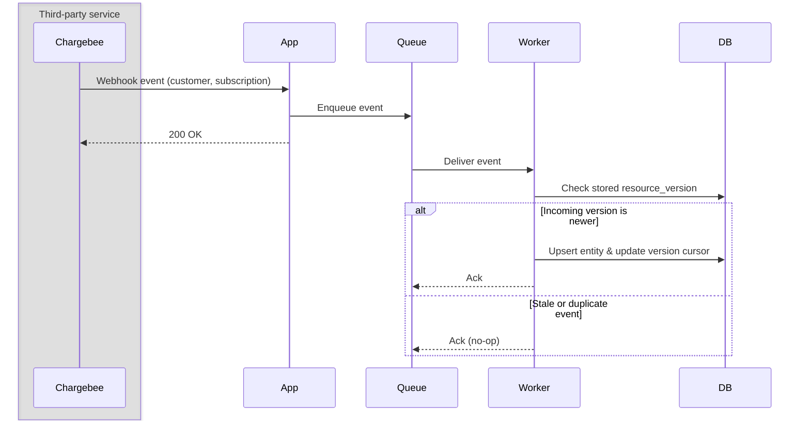
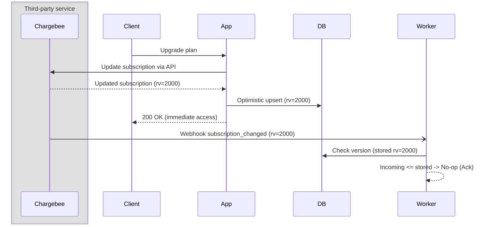
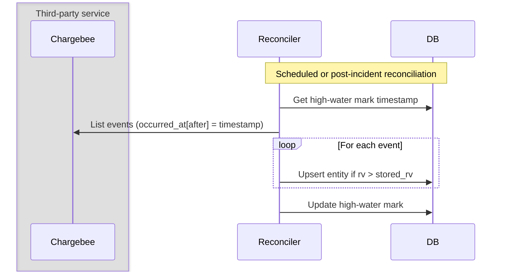
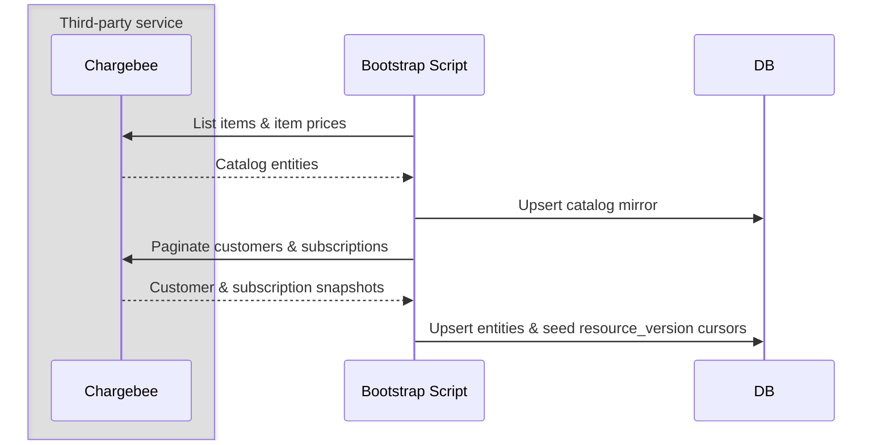

# How To Sync And Reconcile Chargebee Entities

Your application needs a local database copy of billing state to authorize requests, enforce plan tiers, and render account dashboards without calling Chargebee on every HTTP request.

This guide covers how to:

* Maintain a local read-only mirror of customers, subscriptions, and catalog entities
* Process updates safely in a background worker using `resource_version` guards
* Prevent upgrade race conditions between synchronous checkout mutations and asynchronous webhooks
* Recover from missed events or cold starts using event replay and list APIs

Chargebee remains the source of truth for billing state. Your application reads from the local mirror, while any state-changing operation routes to the Chargebee API first.

## Setup

- Product Catalog 2.0 configured with items, item prices, and entitlements
- A webhook endpoint enqueuing events into a durable queue (see webhook guide)
- A background worker consuming events and writing to your local database
- A tracking table (such as `chargebee_resource_version`) storing the latest applied version per resource

## High Level Architecture


```mermaid
  sequenceDiagram
    box rgba(0,0,0,0.1) Third-party service
    participant Chargebee
    end
    participant App
    participant Queue
    participant Worker
    participant DB
    Chargebee->>App: Webhook event (customer, subscription)
    App->>Queue: Enqueue event
    App-->>Chargebee: 200 OK
    Queue->>Worker: Deliver event
    Worker->>DB: Check stored resource_version
    alt Incoming version is newer
      Worker->>DB: Upsert entity & update version cursor
      Worker-->>Queue: Ack
    else Stale or duplicate event
      Worker-->>Queue: Ack (no-op)
    end
```

### Flow

1. An event occurs in Chargebee (such as a subscription created, plan changed, or invoice paid).
2. Chargebee sends a webhook to your application endpoint.
3. The endpoint enqueues the message durably and returns HTTP 200.
4. The background worker picks up the message and inspects its `resource_version`.
5. If the version is newer than the database mirror, the worker upserts the row and commits the new version cursor.

## 1. How Entity Mirroring Works

Your local database is a read-only mirror, not the billing authority. Mirror only the entities needed to authenticate users, check permissions, and render core account views.

| Entity            | What to mirror     | Why mirror locally |
|-------------------|--------------------|-----------------|
| Customer          | id, email, app user_id / org_id | Joins billing entities to your application accounts |
| Subscription      | id, customer_id, status, current_term_end, item_price_id                    | Gates feature access, checks renewal status, displays active plan |
| Catalog           | item_id, item_price_id, pricing tiers                                       | Renders pricing pages and maps plans to feature gates             |
| Invoice / Payment | Fetch on demand (or mirror id, status, amount if billing history is in-app) | Infrequently accessed; can be queried via API or hosted portal    |

```typescript
// Read access tier from local mirror without calling Chargebee
const subscription = await db.subscription.findUnique({
    where: { userId: session.userId, status: "active" },
});
if (!subscription) {
    throw new ForbiddenError("Active subscription required");
}
```

✅ Do: Store external IDs (`chargebeeCustomerId`, `chargebeeSubscriptionId`) on user records as join keys.

✅ Do: Skip mirroring resources your app only accesses through the hosted billing portal (such as invoice PDFs).

⚠️ Don't: Treat local database columns as authoritative for subscription status. Making manual local edits bypasses Chargebee and causes data drift.

## 2. What The Worker Does

The background worker is the sole writer for the entity mirror. It processes messages asynchronously so third-party webhook delivery is decoupled from user-facing traffic.

```mermaid
sequenceDiagram
    participant Queue
    participant Worker
    participant DB
    Queue->>Worker: subscription_changed
    Worker->>DB: Read applied resource_version
    alt Stored version >= incoming version
      Worker-->>Queue: Ack (skip stale)
    else Stored version < incoming version
      Worker->>DB: Upsert subscription row
      Worker->>DB: Commit new resource_version
      Worker-->>Queue: Ack
    end
  ```

The worker executes this sequence for each message:

1. Extract entity payloads from `event.content` (such as `content.subscription` and `content.customer`).
2. Verify freshness against the stored `resource_version` for that specific resource.
3. Upsert entity fields into local tables inside a database transaction.
4. Advance the version cursor in the tracking table.
5. Acknowledge the queue message.

```typescript
// Worker pipeline: guard, upsert, commit, ack
if (await isEventStale(event)) return ack();
await db.transaction(async (tx) => {
    await upsertSubscription(tx, event.content.subscription);
    await commitResourceVersion(tx, "subscription", event.content.subscription);
});
await ack();
```

✅ Do: Commit the entity update and the version cursor in the same database transaction.

✅ Do: Acknowledge the queue message only after the database transaction succeeds.

⚠️ Don't: Run database upserts inline within the HTTP webhook endpoint. Doing so ties webhook acknowledgment to database write latency and risks timeouts under load.

## 3. Handling Ordering With resource_version

Chargebee webhooks can arrive out of order. Every versioned object inside `event.content` carries a `resource_version` (a millisecond timestamp counter) that increments on every mutation.

```mermaid
sequenceDiagram
    participant Queue
    participant Worker
    participant DB
    Note over Queue,Worker: Event A (rv=100) delayed in network<br>Event B (rv=200) arrives first
    Queue->>Worker: Event B (rv=200)
    Worker->>DB: Stored is 0 -> Upsert entity & set rv=200
    Worker-->>Queue: Ack
    Queue->>Worker: Event A (rv=100)
    Worker->>DB: Stored is 200 -> 100 <= 200 -> Skip
    Worker-->>Queue: Ack (no-op)
  ```

Rules for version tracking:

- Track versions per resource type and ID (`subscription:sub_123`, `customer:cust_456`). Versions advance independently across different entities.
- Do not rely on event `occurred_at` for deduplication. `occurred_at` marks when the event fired, while `resource_version` reflects the actual entity mutation state.

```typescript
// Check if incoming version is older than stored version
const stored = await getStoredVersion(resourceType, resourceId);
if (stored && incomingResourceVersion <= stored.version) {
    return true; // Stale event; safe to ignore
}
```

```sql
-- Track monotonic high-water marks per resource
INSERT INTO chargebee_resource_version (resource_key, version, updated_at)
VALUES ($1, $2, NOW())
ON CONFLICT (resource_key) DO UPDATE
SET version = EXCLUDED.version, updated_at = NOW()
WHERE EXCLUDED.version > chargebee_resource_version.version;
```

✅ Do: Compare `resource_version` for every individual entity in `event.content`.

⚠️ Don't: Maintain a single global version cursor for the entire site. Different entities update independently and will falsely reject valid events if tied to a single counter.

## 4. Handling Subscription Upgrades (Preventing Split-Brain)

When a customer upgrades in the app, two paths touch subscription state: the synchronous API mutation (or checkout redirect) and the asynchronous `subscription_changed` webhook. If the app updates state incorrectly or waits solely on the webhook, the user either experiences upgrade lag or writes race.


```mermaid
sequenceDiagram
    box rgba(0,0,0,0.1) Third-party service
    participant Chargebee
    end
    participant Client
    participant App
    participant DB
    participant Worker
    Client->>App: Upgrade plan
    App->>Chargebee: Update subscription via API
    Chargebee-->>App: Updated subscription (rv=2000)
    App->>DB: Optimistic upsert (rv=2000)
    App-->>Client: 200 OK (immediate access)
    Chargebee-)Worker: Webhook subscription_changed (rv=2000)
    Worker->>DB: Check version (stored rv=2000)
    Worker-->>Worker: Incoming <= stored -> No-op (Ack)
```

To prevent race conditions and provide instant UI feedback:

1. Mutate in Chargebee first: Call Chargebee's subscription update API.
2. Update the local mirror from the response: Upsert the local database row using the response body and record its `resource_version`.
3. Let the webhook no-op: When the corresponding webhook arrives, the worker sees `incoming.resource_version <= stored.resource_version` and cleanly discards it.

```typescript
// Synchronous upgrade mutation
const { subscription } = await chargebee.subscription.updateForItems(subId, {
    subscription_items: [{ item_price_id: newPlanPriceId }],
});
// Update local mirror using API response; webhook will no-op later
await syncSubscriptionMirror(subscription);
```

✅ Do: Update local mirror state using the Chargebee API response immediately after checkout or upgrade mutations.

⚠️ Don't: Update local subscription records optimistically before Chargebee confirms the change. If the Chargebee request fails, local state will be out of sync.

⚠️ Don't: Wait purely for the background webhook after checkout without updating locally. Webhook delivery delays leave paying customers waiting for upgraded access.

## 5. Reconciling Gaps After Outages

Webhooks can be missed due to queue outages, bad deployments, or networking incidents. Chargebee retries webhooks for up to 2 days, but extended downtime requires proactive reconciliation.


```mermaid
sequenceDiagram
    box rgba(0,0,0,0.1) Third-party service
    participant Chargebee
    end
    participant Reconciler
    participant DB
    Note over Reconciler,DB: Scheduled or post-incident reconciliation
    Reconciler->>DB: Get high-water mark timestamp
    Reconciler->>Chargebee: List events (occurred_at[after] = timestamp)
    loop For each event
      Reconciler->>DB: Upsert entity if rv > stored_rv
    end
    Reconciler->>DB: Update high-water mark
```

Use two reconciliation strategies depending on the gap window:

### Option 1: Event Replay (Gaps < 90 Days)

Chargebee retains events for 90 days. Query the [list events API](https://apidocs.chargebee.com/docs/api/events/list-events) and pass each event directly into the worker's processing logic.

```typescript
// Replay events from last known cursor
const events = await chargebee.event.list({
    "occurred_at[after]": lastSyncTimestamp,
    "sort_by[asc]": "occurred_at",
    limit: 100,
});
for (const entry of events.list) {
    await processWebhookEvent(entry.event);
}
```

### Option 2: Full Entity Backfill (Gaps > 90 Days or Cold Starts)

If event retention has lapsed, paginate the resource list endpoints directly using `next_offset`.

```typescript
// Paginating current entity snapshots
let offset: string | undefined;
do {
  const result = await chargebee.subscription.list({ limit: 100, offset });
  for (const entry of result.list) {
    await syncSubscriptionMirror(entry.subscription);
  }
  offset = result.next_offset;
} while (offset);
```

✅ Do: Run a scheduled reconciliation job to catch drifted records.

✅ Do: Reuse the same idempotent worker logic for event replay and live webhooks.

⚠️ Don't: Delete local records during reconciliation if an expected event is missing. Query Chargebee's retrieve endpoint first to verify current status.

## 6. Cold Start And Backfill

When provisioning a fresh environment or restoring an empty database, backfill catalog and customer state before enabling live traffic:


```mermaid
  sequenceDiagram
    box rgba(0,0,0,0.1) Third-party service
    participant Chargebee
    end
    participant Script as Bootstrap Script
    participant DB
    Script->>Chargebee: List items & item prices
    Chargebee-->>Script: Catalog entities
    Script->>DB: Upsert catalog mirror
    Script->>Chargebee: Paginate customers & subscriptions
    Chargebee-->>Script: Customer & subscription snapshots
    Script->>DB: Upsert entities & seed resource_version cursors
```

Bootstrap sequence:

1. Pull the catalog: Paginate items and item prices from Chargebee and populate catalog tables.
2. Pull active subscriptions: Paginate customer and subscription records, linking Chargebee customers to internal users via metadata or email.
3. Seed version cursors: Populate `chargebee_resource_version` with the current timestamps from the API response so incoming webhooks do not replay older state.
4. Enable webhook workers: Start worker processing. Steady-state updates take over without reprocessing older records.

✅ Do: Seed version cursors during the backfill so incoming webhooks do not replay already-applied state.

⚠️ Don't: Rely on webhooks alone to populate an empty database. Webhooks only transmit changes, so existing customers and catalog items will be missing.

## See It Running In The Demo App

Implementation files to review:

* [`pointer/workers/chargebee-webhook-processor.ts`](../pointer/workers/chargebee-webhook-processor.ts): SQS message consumer pipeline that checks for stale events, enforces parent dependencies, applies upserts, and commits version cursors.
* [`pointer/lib/webhooks/webhook-guards.ts`](../pointer/lib/webhooks/webhook-guards.ts): Implements `isEventStale`, `versionedResources`, and `commitVersions` backed by the `chargebee_resource_version` table.
* [`pointer/lib/subscriptions.ts`](../pointer/lib/subscriptions.ts): Queries active subscription status and item price limits from PostgreSQL for incoming AI requests.
* [`pointer/scripts/catalog.ts`](../pointer/scripts/catalog.ts): Defines and deploys the Product Catalog 2.0 structure (items, prices, and entitlements) into Chargebee.

## Go-Live Checklist

- [ ] Does the app treat Chargebee as the single source of truth, routing mutations to Chargebee before updating local state?

- [ ] Is every entity upsert guarded by a check against that resource's stored `resource_version`?

- [ ] Does the worker commit entity changes and the version high-water mark inside the same database transaction?

- [ ] Does the worker acknowledge queue messages only after successful persistence?

- [ ] Are subscription upgrades applied to the local mirror immediately using the API response to eliminate UI lag?

- [ ] Does a reconciliation job exist to detect and heal gaps via the list events API (for gaps < 90 days) or resource list APIs?

- [ ] Are all catalog entities mapped to Product Catalog 2.0 (`items` and `item_prices`) rather than legacy plans?

- [ ] Does the cold-start backfill seed `resource_version` tracking records so initial webhooks do not process as duplicate writes?
