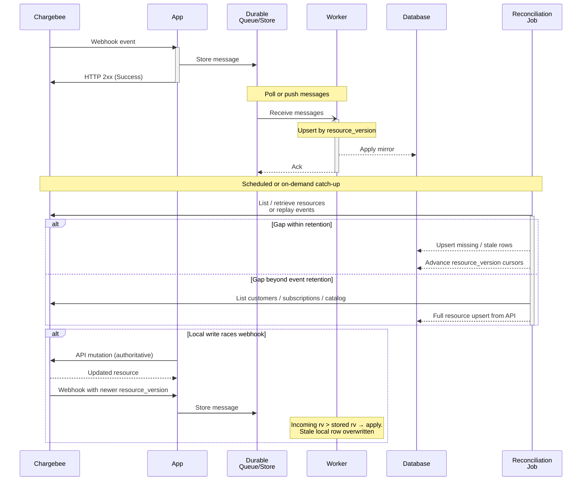
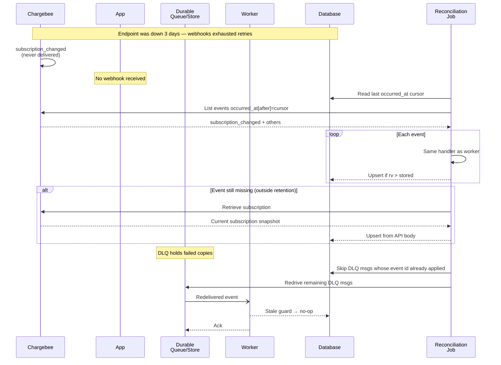
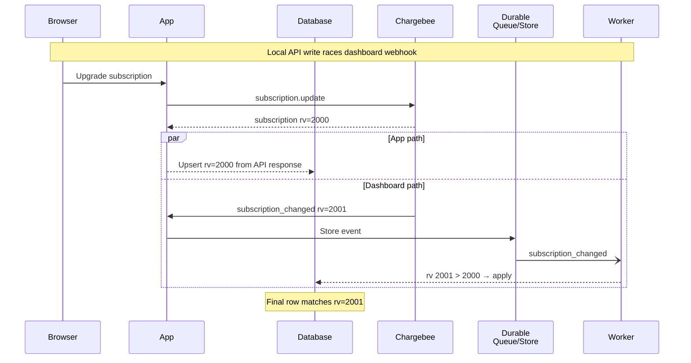

# How to sync and reconcile Chargebee entities

Once webhooks are flowing, the next integration step is deciding what billing state lives in your database and how you recover when it drifts. You will need entity sync and reconciliation to:

* Treat Chargebee as the single source of truth while keeping a fast local mirror for auth, entitlements, and UI
* Rebuild local billing state from Chargebee after webhook gaps, a cold start, or a bad deploy
* Prevent split-brain where a local write and a webhook-driven write fight over the same row

This guide assumes **Product Catalog 2.0** — items, item prices, features, and item entitlements — not the legacy plans/addons API. If your site still runs Catalog 1.0, the list endpoints, event payloads, and local schema differ; confirm your site's catalog version in the Chargebee dashboard before copying any API call here.

## High level architecture

Chargebee owns every billing fact — customers, subscriptions, invoices, payments, and the product catalog. Your app keeps a **mirror**: enough relational state to authorize requests, render dashboards, and enforce entitlements without calling Chargebee on every page view. Webhooks are the steady-state sync path: the HTTP handler validates and durably enqueues, a worker applies idempotent upserts keyed on `resource_version`, and only then acknowledges the message.

Reconciliation is the safety net. A scheduled or manually triggered job compares local rows against Chargebee — either by replaying events from the [List events API](https://apidocs.chargebee.com/docs/api/events/list-events) or by listing resources directly — and repairs gaps that webhooks missed. When a local mutation must happen (sign-up provisioning, admin override), route it through the Chargebee API first; the webhook that follows carries the authoritative `resource_version` and wins any race with optimistic local writes.

## Best Practices

* Draw a hard line between **system-of-record fields** and **app-owned fields**. Chargebee owns subscription status, billing period, item prices on a subscription, invoice totals, coupon redemptions, and catalog definitions. Your database owns the join keys (`chargebeeCustomerId` on a user or organization row), denormalized display fields you are willing to rebuild, and derived entitlement limits you compute from catalog metadata. Never treat a local column as authoritative for billing state unless you can reconstruct it entirely from a Chargebee API response. Skip mirroring resources your app never reads locally — invoices you only link out to in the billing portal do not need a table.

* Mirror subscriptions, customers, and the catalog entities your checkout and entitlement paths depend on. At minimum for a self-serve SaaS app:

    - **Customers** — link Chargebee customer IDs to app users or organizations; mirror billing contact fields only if the UI needs them offline.
    - **Subscriptions** — status, current term, plan item price, quantity, and cancellation schedule drive access control.
    - **Product catalog** — items, item prices, features, and item entitlements (Catalog 2.0) or their legacy plan/addon equivalents; coupon definitions if you apply codes in-app.
    - **Invoices and payments** — mirror when you render billing history in-app or reconcile revenue; otherwise fetch on demand.

    The [object relationship model](https://www.chargebee.com/docs/billing/2.0/getting-started/object-relationship) shows how these pieces connect: a subscription references one customer, one or more item prices, and optional coupons; invoices hang off subscriptions.

* Use **two rebuild paths** and know when each applies:

    - **Event replay** — walk the [List events](https://apidocs.chargebee.com/docs/api/events/list-events) endpoint with `occurred_at[after]` / `occurred_at[before]` filters and `sort_by[asc] = "occurred_at"`, processing each event through the same handler the webhook worker uses. Works when you still have the events and your handler is deterministic. [Retrieve an event](https://apidocs.chargebee.com/docs/api/events/retrieve-an-event) notes that only events **less than 90 days old** can be retrieved; treat 90 days as the hard ceiling for event-based catch-up unless you have been archiving events yourself.
    - **Resource list backfill** — paginate [List customers](https://apidocs.chargebee.com/docs/api/customers), [List subscriptions](https://apidocs.chargebee.com/docs/api/subscriptions), [List items](https://apidocs.chargebee.com/docs/api/items), [List item prices](https://apidocs.chargebee.com/docs/api/item_prices), and [List coupons](https://apidocs.chargebee.com/docs/api/coupons) with `limit` up to **100** and follow `next_offset` until exhausted ([pagination](https://apidocs.chargebee.com/docs/api)). Use this for cold starts, gaps older than event retention, or when you need the latest snapshot regardless of history. For large sites, [Export customers](https://apidocs.chargebee.com/docs/api/exports/export-customers) and [Export subscriptions](https://apidocs.chargebee.com/docs/api/exports/export-subscriptions) produce async ZIP exports — at most **five** export jobs can run concurrently ([Exports](https://apidocs.chargebee.com/docs/api/exports)).

    Apply the same `resource_version` guard on both paths. A replayed event or a listed resource with `resource_version` less than or equal to what you already stored is a no-op.

* Run reconciliation on a **schedule** and after incidents. A daily job that samples recently active subscriptions and any row whose `updatedAt` lag exceeds a threshold catches slow drift; an on-demand job after webhook endpoint downtime or queue backlog clears repairs acute gaps. Store per-resource high-water marks (`resource_version` or last-seen `occurred_at`) so the job can skip work already applied. Emit metrics for rows repaired, events skipped as stale, and API pages fetched so you can tune frequency against [rate limits](https://apidocs.chargebee.com/docs/api/error-handling) (`HTTP 429` — back off and retry).

* **Cache catalog and entitlement data** that is read on every request but changes rarely. A typical pattern:

    - Load item prices and plan entitlements into memory or Redis at process start and on a TTL (hours to a day for catalog; minutes for subscription status if you cache it at all).
    - Invalidate on webhook events `item_updated`, `item_price_updated`, `item_entitlements_updated`, or on reconciliation diff.
    - Prefer caching derived entitlement limits (tokens per day, seat caps) keyed by `item_price_id`, not whole subscription objects — subscription state should come from the database mirror updated by webhooks.

    Set cache TTL shorter than your reconciliation interval so a missed webhook expires before the cache lies to authorization code for long.

* Store webhook event IDs for **at-least-once** deduplication separately from `resource_version`. Chargebee delivers webhooks with no ordering guarantee ([event object — out-of-order delivery](https://apidocs.chargebee.com/docs/api/events/event-object#out-of-order-delivery)) and retries for up to **two days** until it receives `HTTP 2xx`. The last retry can arrive around **three days and seven hours** after the original trigger — keep processed event IDs at least that long before purging. `resource_version` handles stale payloads; event `id` handles exact duplicates.

### Reconciliation after webhook gaps

Webhook gaps happen when your endpoint returns `HTTP 5xx`, the queue loses messages, or processing exhausts retries and lands in a [dead letter queue](https://en.wikipedia.org/wiki/Dead_letter_queue). Chargebee keeps retrying webhooks for up to two days, but if your endpoint was down longer than that, those notifications are gone from Chargebee's delivery pipeline even though the billing change already happened on their side.

The recovery sequence:

1. Fix the ingress path so new webhooks durably enqueue again.
2. Determine the gap window — last successfully processed event timestamp, or the oldest unacked queue message.
3. If the gap is within **90 days**, replay events from the List events API filtered on `occurred_at`, reusing the webhook handler.
4. If the gap exceeds event retention, or you need an authoritative snapshot now, list (or export) resources from the API and upsert every row.
5. Drain the DLQ after the replay — redrive only messages whose events were not already applied via replay.

Do not delete local rows just because you never saw a `subscription_cancelled` webhook during an outage. Prefer fetching the subscription from Chargebee and mirroring its current `status` and `resource_version`; Chargebee's retrieve response is the tiebreaker.

### Ordering with resource_version

`resource_version` is a per-resource monotonic counter — Chargebee updates it with a new **timestamp in milliseconds** on every change ([customers](https://apidocs.chargebee.com/docs/api/customers), [subscriptions](https://apidocs.chargebee.com/docs/api/subscriptions), [items](https://apidocs.chargebee.com/docs/api/items), [item prices](https://apidocs.chargebee.com/docs/api/item_prices), [coupons](https://apidocs.chargebee.com/docs/api/coupons)). It is **not** a global sequence: a subscription's version and its customer's version advance independently, and neither orders relative to the other.

Rules:

- Compare `resource_version` **per resource type and id** — store `customer:cb_abc → 1710000000123`, not one cursor for the whole site.
- On every webhook, inspect **each** object in `content` that carries `resource_version` (for example `content.customer.resource_version` and `content.subscription.resource_version` on a `subscription_changed` event). Apply updates only where incoming `rv1` > stored `rv2`; ignore the rest ([out-of-order delivery](https://apidocs.chargebee.com/docs/api/events/event-object#out-of-order-delivery)).
- Do not use event `occurred_at` as the staleness key across different resources — two events for different resources can arrive out of order even when their timestamps look ordered.
- Events whose `content` includes arrays (credit notes, unbilled charges) may carry multiple versioned objects; version each array element individually.
- After a successful apply, persist the new high-water mark in the same transaction as the mirror write so a crash cannot leave the version table ahead of the entity row.

Cross-resource ordering is a dependency problem, not a version problem. A `payment_succeeded` referencing a customer id that is not in your database yet should retry until `customer_created` lands — see [Handling out-of-order and dependent events](integrating-chargebee-webhooks.md#handling-out-of-order-and-dependent-events) in the webhook guide.

### Back-fill on cold start

An empty database or a fresh environment needs a bootstrap before webhooks alone can keep you current.

1. **Push catalog to Chargebee** (greenfield) — create item families, features, items, item prices, and entitlements via API so the site matches your product definition. Catalog objects change infrequently; many teams treat the repo as canonical and run an idempotent bootstrap script on deploy rather than mirroring catalog rows from webhooks into Postgres.
2. **Pull runtime state** — paginate all customers and subscriptions (and any other mirrored resources) from Chargebee; upsert each with its `resource_version`. Link customers to app users by email or explicit metadata you set at creation time.
3. **Seed version cursors** — populate the `resource_version` store from the API bodies so the first live webhook does not replay history you already ingested.
4. **Enable webhooks** — from this point forward, the queue worker is the primary writer; reconciliation runs as a periodic diff.

For Catalog 2.0 sites, list [items](https://apidocs.chargebee.com/docs/api/items) and [item prices](https://apidocs.chargebee.com/docs/api/item_prices) separately — subscriptions reference item price IDs, not raw item IDs. Include archived or deleted catalog objects if existing subscriptions still point at them (`deleted` resources remain retrievable via list APIs).

`pointer` has no backfill script yet. When you add one, confirm whether listing subscriptions needs a `status[is]` filter or an unfiltered paginated list is acceptable for your site size.

### Avoiding split-brain between local DB and Chargebee

Split-brain appears when your app writes billing state locally and Chargebee simultaneously sends a webhook reflecting a different truth — common when sign-up creates a customer through the API while a `customer_created` event is in flight, or when an admin edits a subscription in the Chargebee dashboard during a local "upgrade" request.

Pick one writer per field:

- **Chargebee wins** for every field Chargebee stores. Local updates that skip the API are bugs.
- **App wins** only for join columns Chargebee does not model (`userId`, organization membership) and for derived caches you can drop and rebuild.

Concrete rules:

- Create customers and subscriptions through Chargebee API calls (or the Better Auth plugin that wraps them), not by inserting mirror rows directly. Persist the returned IDs and wait for the webhook — or upsert immediately from the API response using the same code path the worker uses, then let the webhook no-op on matching `resource_version`.
- Never update subscription status locally "optimistically" after checkout; read from the mirror only after webhook processing or an explicit retrieve confirms the change.
- If you must patch metadata both sides use, write to Chargebee first (`customer.update`, subscription metadata fields), then mirror the response — not the other way around.
- Run reconciliation with compare-and-swap semantics: fetch the remote resource, apply only if remote `resource_version` > local, log and alert when local is ahead of remote (that indicates a local write bypassed Chargebee).

## Implementation notes

TODO

## Go-live checklist

- [ ] Is every mirrored billing field documented as either Chargebee-owned (rebuildable from API) or app-owned (join keys only)?

- [ ] Does a reconciliation job exist (scheduled or on-demand) that can repair webhook gaps without manual SQL?

- [ ] Can you rebuild local subscription and customer mirrors from Chargebee alone — via event replay within 90 days or via list/export APIs — on an empty database?

- [ ] Does every upsert compare `resource_version` per resource id and type, not per event or global cursor?

- [ ] Are webhook event IDs deduplicated for at least three days and seven hours to cover Chargebee's final retry window?

- [ ] Do app-initiated billing mutations go through the Chargebee API before (or atomically with) any local mirror write?

- [ ] After a simulated webhook outage, does replay or API backfill converge the mirror to Chargebee's dashboard state?

- [ ] Is catalog caching (if used) invalidated on catalog webhook events or TTL expiry shorter than the reconciliation interval?

- [ ] Are DLQ messages monitored, and is there a documented redrive procedure that skips events already applied during replay?

- [ ] Does the integration target Product Catalog 2.0 (`item` / `item_price` APIs) rather than legacy `plan` / `addon` endpoints?
