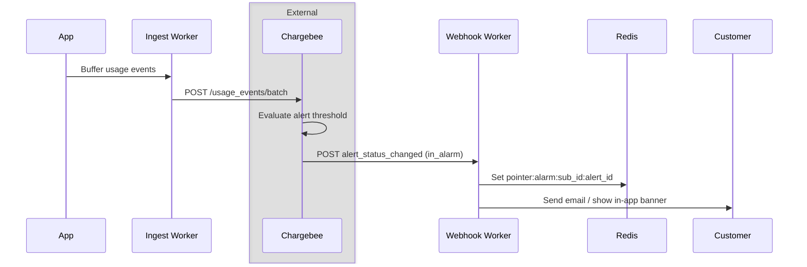
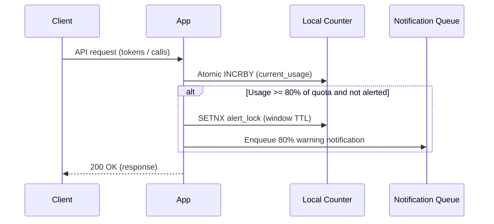
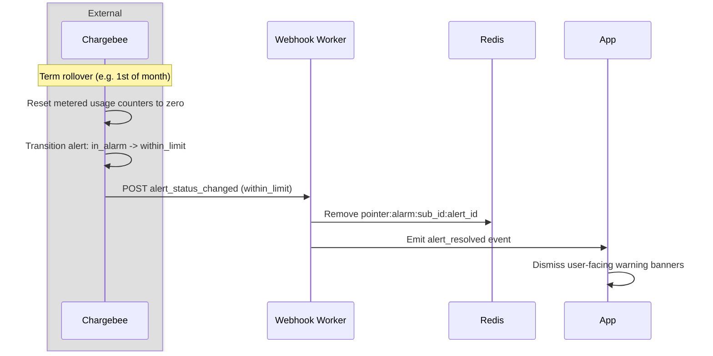
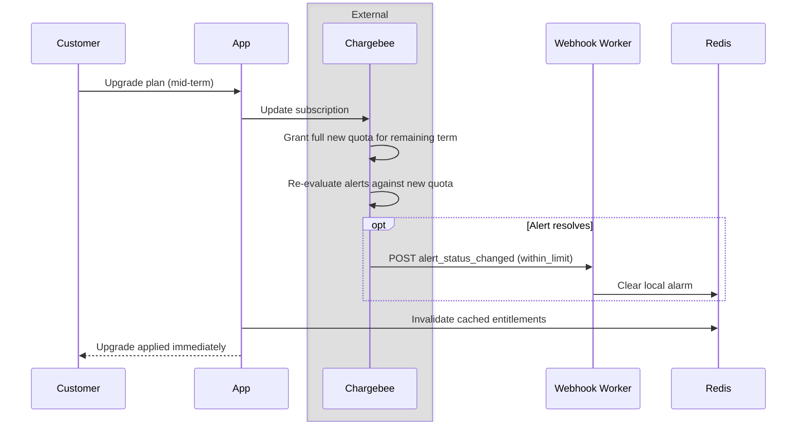

# How To Configure Usage Alerts

When billing on consumption, customers need advance warning before unexpected overage charges appear on an invoice. Chargebee's usage alerts can be configured to notify the app that the aggregate of a metered feature is within a certain threshold. This ping is received by the app as a webhook event and can then be used appropriately to notify the end user.

This guide covers how to:

* Configure Chargebee usage alerts on metered features and process `alert_status_changed` webhooks
* Separate Chargebee billing alerts from real-time in-app quota enforcement on non-metered features
* Handle limit resets at billing cycle boundaries and term restarts
* Manage quota adjustments, prorations, and alert states during mid-term subscription changes

Chargebee stores billing alerts and evaluates thresholds. Your application handles immediate customer notifications and real-time request enforcement.

## Setup

- Usage ingestion pipeline sending events to Chargebee (see [usage-based billing](./usage-based-billing.md))
- Webhook endpoint configured to receive `alert_status_changed` events (see [webhook integration](./webhooks.md))
- A local cache (such as Redis) to store alarm states for fast UI rendering

## 1. How Usage Alerts Work

Chargebee evaluates [usage alerts](https://www.chargebee.com/docs/billing/2.0/usage-based-billing/usage-alerts) within seconds of receiving usage events. You define an alert rule for a metered feature with a specific threshold, such as 80% of included quota or an absolute quantity.

When consumption crosses the threshold, Chargebee updates the subscription alert status from `within_limit` to `in_alarm` and posts an `alert_status_changed` webhook to your application.



### Flow

1. You create an alert in Chargebee under **Usages > Alerts** or through the API, selecting a metered feature, a threshold percentage (such as 80% or 100%), and optional plan filters (see [setting up usage alerts](https://www.chargebee.com/docs/billing/2.0/usage-based-billing/setting-up-usage-alerts)).
2. As customers use your product, your background worker sends usage events to Chargebee's `batchIngest` API.
3. Chargebee evaluates the aggregated events against active alert rules.
4. If a subscription crosses the threshold, Chargebee sets its alert status to `in_alarm` and delivers an `alert_status_changed` webhook.
5. Your webhook worker saves the alarm state to a fast local store (such as Redis) and triggers customer-facing notifications.

### Alert vs Alert Status

| Concept | What it represents | How you interact with it |
|:---|:---|:---|
| Alert | The configuration rule: feature, threshold, and target plans | Create, update, disable, or delete via UI or API |
| Alert Status | The live subscription state: `within_limit` or `in_alarm` | Read-only state computed automatically by Chargebee |

### Scope: Global vs Subscription-Scoped

| Dimension | Global Alert | Subscription-Scoped Alert |
|:---|:---|:---|
| Scope | All subscriptions using the metered feature | One specific subscription |
| Filter conditions | Filter by `plan_price_id` to target specific plans | Not supported; bound to `subscription_id` |
| Alert status | One status record per matching subscription | Single status record |
| Primary use case | Standard milestones (such as 80% warnings) across plans | Custom thresholds negotiated for enterprise accounts |

When handling the `alert_status_changed` webhook, persist the alarm to Redis so user interfaces can render warning banners immediately.

```typescript
// Process alert_status_changed webhooks from Chargebee
export async function processAlertWebhook(event: WebhookEvent): Promise<boolean> {
  if (event.event_type !== "alert_status_changed") return false;

  const { alert, alert_status: status } = event.content as {
    alert?: { id: string; name: string; metered_feature_id: string };
    alert_status?: { subscription_id: string; alarm_status: string; alarm_triggered_at: number };
  };

  if (!alert?.id || !status?.subscription_id) return true;

  const isAlarm = status.alarm_status === "in_alarm";

  // Store in Redis with TTL so customer dashboards show banners instantly
  const key = `pointer:alarm:${status.subscription_id}:${alert.id}`;
  if (isAlarm) {
    await redis.set(key, JSON.stringify({
      alertId: alert.id,
      subscriptionId: status.subscription_id,
      alarmStatus: "in_alarm",
      meteredFeatureId: alert.metered_feature_id,
      triggeredAt: status.alarm_triggered_at,
    }), "EX", 25 * 60 * 60);

    await sendCustomerNotification(status.subscription_id, alert.name);
  } else {
    await redis.del(key);
  }

  return true;
}
```

✅ Do: Store active alarm states in a local Redis cache so application dashboards display warnings without calling Chargebee.

✅ Do: Use global alerts with plan filters to maintain different thresholds (such as 80% on Starter vs 95% on Enterprise) without creating separate rules per customer.

⚠️ Don't: Poll Chargebee's alert status endpoints on user request paths. Use incoming webhooks to keep local state up to date.

⚠️ Don't: Block user requests when an alert fires unless you deliberately configured that threshold as a hard service cutoff. Most alerts serve as advance warnings before overage fees accumulate.

## 2. Metered vs Non-Metered Features

Chargebee usage alerts evaluate only metered features backed by ingested usage events. Non-metered features (such as daily token limits, minute-level API request limits, or prepaid seat counts) do not send event streams to Chargebee. Aggregation and alerting for non-metered features have to be done in the app.

| Capability | Metered Features | Non-Metered Features |
|:---|:---|:---|
| Ingestion path | Batched to Chargebee Usage Events API | Tracked locally in Redis or Postgres |
| Aggregation authority | Chargebee Billing engine | Application local counters |
| Alert trigger | Chargebee `alert_status_changed` webhook | Application event bus or notification queue |
| Evaluation latency | Near real time (seconds after batch ingestion) | Sub-millisecond on the request path |
| Common use case | Monthly usage overages, pooled billing | Daily rate limits, burst limits, seat caps |



### Flow for Non-Metered Alerting

1. The client makes a request consuming a non-metered entitlement (such as 500 LLM output tokens).
2. The application increments an atomic counter in Redis tied to the customer's reset window (such as `quota:sub_123:tokens:2026-09-29`).
3. If the counter crosses the alert threshold (such as 80% of the daily allowance), the app claims a distributed lock key using `SETNX` with a TTL matching the window.
4. If the lock was acquired, the app dispatches an alert notification to the queue. The lock prevents repeated notifications on subsequent requests in the same window.
5. The request completes without waiting for external billing APIs.

```typescript
// Enforce and alert on non-metered daily quotas in local Redis
const windowKey = `quota:${subscriptionId}:tokens:${utcDayKey}`;
const alertLockKey = `alert:lock:${subscriptionId}:tokens:${utcDayKey}:80pct`;

const currentUsage = await redis.incrby(windowKey, tokenDelta);

if (currentUsage >= dailyAllowance * 0.8) {
  // SETNX allows only the first request crossing the threshold to fire an alert
  const acquired = await redis.set(alertLockKey, "1", "EX", 86400, "NX");
  if (acquired) {
    await notificationQueue.send({
      subscriptionId,
      feature: "tokens",
      threshold: "80%",
      usage: currentUsage,
    });
  }
}
```

✅ Do: Use atomic Redis operations and idempotency locks (`SET ... NX`) so local threshold alerts fire exactly once per window.

✅ Do: Handle non-metered quotas in the application so rate checks complete in sub-millisecond time.

⚠️ Don't: Attempt to send usage events to Chargebee for sub-minute or daily rate-limit enforcement. Chargebee aggregates billing data for periodic invoicing. Real-time request throttling belongs in your application.

## 3. When Are Usage Limits Reset

Understanding reset timing prevents duplicate alerts and false overage warnings across billing boundaries.



### Reset Scenarios

| Reset Type | Trigger | Chargebee Action | Application Action |
|:---|:---|:---|:---|
| Billing cycle renewal | Subscription renewal date | Metered counters reset to zero; alert status switches to `within_limit` | Webhook worker removes local Redis alarm key; clears UI banners |
| Fixed window (non-metered) | UTC day or minute rollover | None (Chargebee does not track daily non-metered limits) | Redis key TTL expires; local alert lock key resets automatically |
| Mid-term reset (`force_term_reset`) | API subscription update | Terminates term, settles overages, starts new term at zero usage | Re-fetch entitlements, clear Redis alarms, reset local usage counters |

### Chargebee Billing Cycle Reset

When a subscription renews into a new billing cycle:

1. Chargebee resets the subscription's metered usage counters to zero.
2. Any active alerts transition from `in_alarm` back to `within_limit`.
3. Chargebee sends an `alert_status_changed` webhook with `alarm_status: "within_limit"`.
4. Your application removes the local alarm record from Redis, clearing warning banners from the customer portal.

```typescript
// Clear local alarm when Chargebee confirms status returned to within_limit
if (status.alarm_status === "within_limit") {
  await redis.del(`pointer:alarm:${status.subscription_id}:${alert.id}`);
  await emit("chargebee.alert_resolved", {
    alertId: alert.id,
    subscriptionId: status.subscription_id,
  });
}
```

### Non-Metered Window Reset

Non-metered features do not reset on Chargebee's renewal dates unless configured for a monthly term. Daily or hourly limits should use UTC timestamp keys with a set TTL (such as 86,400 seconds for daily keys). When the TTL expires, both the counter and the alert lock disappear without requiring manual cleanup jobs.

### Timezone Differences

Chargebee billing cycles run in the time zone configured in your Chargebee site settings. If your application tracks non-metered quotas in UTC, the resets will occur at different times of day. State the reset time zone clearly on usage dashboards so users know when their allowances renew.

✅ Do: Listen for `alert_status_changed` webhooks with `alarm_status: "within_limit"` to dismiss UI warnings automatically when a new cycle begins.

✅ Do: Use TTLs on local quota keys so non-metered allowances and threshold locks expire cleanly without cron scripts.

⚠️ Don't: Assume Chargebee resets non-metered features. If a plan includes 10,000 API calls per day, your application must track and reset that quota.

## 4. Mid Term Subscription Change

When a customer upgrades, increases quantity, or purchases a top-up mid-cycle, quotas and alert thresholds change before the billing term ends. The [Chargebee mid-term subscription changes guide](https://www.chargebee.com/docs/billing/2.0/usage-based-billing/mid-term-subscription-changes-ubb) specifies how each change type calculates entitlements and overages.



### Subscription Change Scenarios

| Scenario | Entitlement Timing | Invoicing Impact | Usage Alert Impact |
|:---|:---|:---|:---|
| Plan upgrade | New plan quota granted in full for remaining term; not prorated by time | Prorated credit for unused old plan; prorated charge for new plan | Total usage may fall below the new quota threshold; Chargebee switches alert from `in_alarm` to `within_limit` |
| Prepaid quantity increase | Quota scales linearly and applies retroactively from cycle start | Prorated charge for additional units | Prior usage is measured against the higher total; active alarms may clear |
| Entitlement override | Takes effect immediately; valid retroactively from cycle start | None (no invoice or credit note generated) | Recalculates overages and alert limits against overridden quota |
| Top-up addon | Quota granted for addon billing period (from attachment date forward) | Prorated charge for addon | Covers usage after attachment date; prior usage remains overage unless backdated |
| Immediate overage settlement (`invoice_usages`) | Current term closes; new term starts at zero usage | Unbilled overages invoiced immediately | Closes active alarms for prior term; starts new term `within_limit` |

### Plan Upgrades

When upgrading from a smaller plan to a larger plan mid-cycle:

- The old plan's unused charge receives a prorated credit note.
- The new plan's included usage quota is granted in full for the remainder of the period. Entitlements are not time-prorated.
- Events with timestamps before the upgrade date map to the old plan's entitlement grant. Events after the upgrade date map to the new grant.
- If a customer was `in_alarm` under the old plan, the higher quota often brings usage back below the threshold percentage. Chargebee detects this on the next incoming usage event and emits an `alert_status_changed` webhook with `within_limit`.

### Prepaid Quantity Increases

When increasing the quantity of a prepaid plan item (such as doubling a 100,000-unit tier):

- The new entitlement applies retroactively from the beginning of the billing term.
- Usage that previously counted as an overage is now absorbed by the expanded quota.
- If an alert was triggered at 80% of 100,000 units (80,000 units), increasing quantity to 2 raises the quota to 200,000. That 80,000 units now represents 40%, clearing the alarm.

### Entitlement Overrides

Direct entitlement overrides modify included usage without altering plans or attaching addons. Because overrides apply retroactively from the start of the billing period, overage math and alert thresholds adjust immediately without generating invoices or credit notes.

### Top-Up Addons

Attaching a non-metered top-up addon adds extra included units, but the entitlement grant period only covers usage from the addon attachment date forward. Usage recorded before that date remains billable overage unless the addon attachment is backdated to the start of the cycle.

### Immediate Overage Invoicing

If you want to invoice accumulated overages at the time of a mid-term change instead of waiting for term end, call the subscription update API with:

```json
{
  "invoice_usages": true,
  "force_term_reset": true
}
```

This closes the current billing term, creates an invoice for unbilled overages, and starts a new billing term at zero usage. Any active alerts for that subscription reset to `within_limit`.

```typescript
// Refresh entitlements and evict alarms on checkout return
export async function handleSubscriptionUpgrade(subscriptionId: string) {
  // Evict cached entitlements so the next check fetches the expanded quota
  await redis.del(`entitlements:${subscriptionId}`);

  // Fetch updated entitlements from Chargebee
  const response = await chargebee.subscriptionEntitlement
    .subscriptionEntitlementsForSubscription(subscriptionId, { limit: 100 });

  // Update local database snapshot
  await db.upsertEntitlements(subscriptionId, response.list);

  // If new quota exceeds current consumption, remove active local alarm
  const alarms = await getLocalAlarms(subscriptionId);
  for (const alarm of alarms) {
    if (alarm.alarm_status === "in_alarm") {
      await redis.del(`pointer:alarm:${subscriptionId}:${alarm.alert_id}`);
    }
  }
}
```

✅ Do: Invalidate local entitlement caches and quota counters immediately when a customer upgrades so they receive expanded capacity right away.

✅ Do: Use backdating when attaching top-up addons if you want the extra quota to cover usage that occurred earlier in the current billing cycle.

⚠️ Don't: Rely on mid-term plan changes to clear past overages unless you backdate the change or choose an operation that applies retroactively (such as quantity increases or entitlement overrides).

⚠️ Don't: Set `invoice_usages: true` without `force_term_reset: true`. Chargebee requires both parameters together to settle overages mid-term.

## See It Running In The Demo App

Implementation files to review:

- [`pointer/lib/alerts/sync.ts`](../pointer/lib/alerts/sync.ts): Webhook processor for `alert_status_changed`. Updates local Redis alarm keys and emits domain events for the admin flow.

- [`pointer/lib/alerts/provider.ts`](../pointer/lib/alerts/provider.ts): Queries active alarms from Chargebee and reconciles them with local Redis alarm keys (`pointer:alarm:<subscription_id>:<alert_id>`).

- [`pointer/lib/usage/events.ts`](../pointer/lib/usage/events.ts): Non-blocking usage recording buffer feeding events to Chargebee.

- [`pointer/lib/entitlements/gate.ts`](../pointer/lib/entitlements/gate.ts): Enforces local non-metered limits and quota boundaries in real time.

## Go-Live Checklist

- [ ] Are metered features configured in Chargebee Product Catalog 2.0 with linked usage alerts?

- [ ] Does your webhook endpoint accept `alert_status_changed` events and return HTTP 200 quickly?

- [ ] Does the webhook worker save active alarm states to a fast local store (such as Redis) for zero-latency dashboard rendering?

- [ ] Does the application handle the `within_limit` status transition to dismiss warning banners when usage resets?

- [ ] Are non-metered quotas (daily token limits, minute-level API limits) aggregated and alerted locally in the application?

- [ ] Do local non-metered alert checks use atomic locks (`SETNX`) so customers receive exactly one notification per window?

- [ ] Does the subscription change workflow invalidate local entitlement and alarm caches immediately after checkout?

- [ ] Are top-up addons backdated to the cycle start date when intended to absorb prior unbilled overages?
