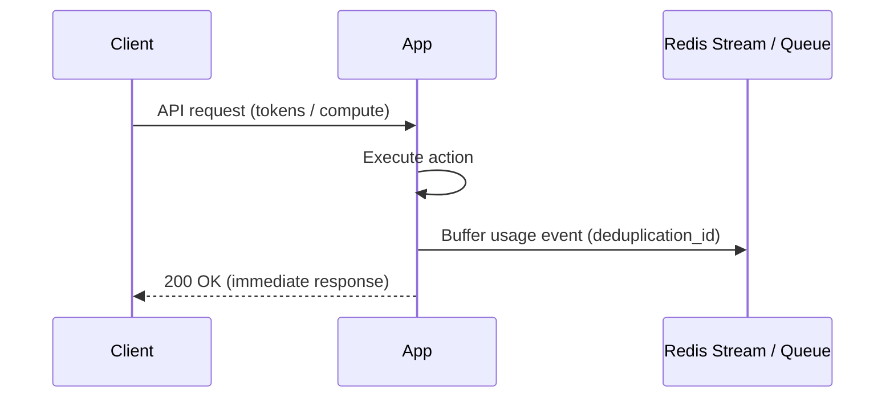
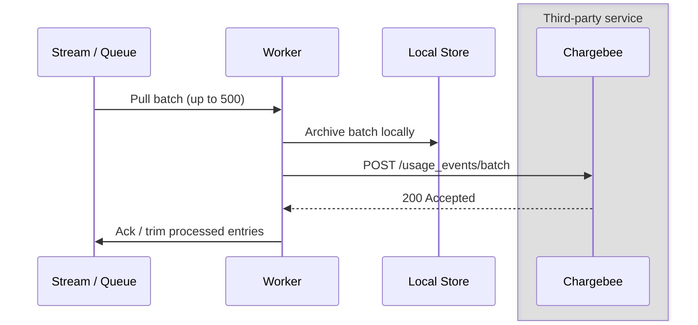
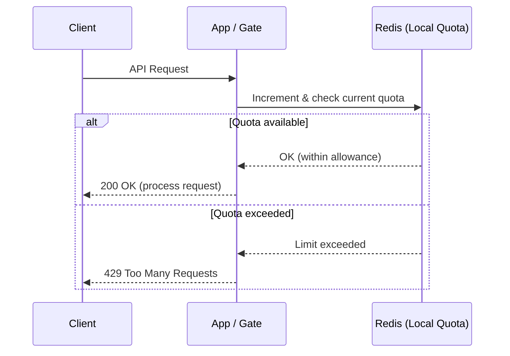
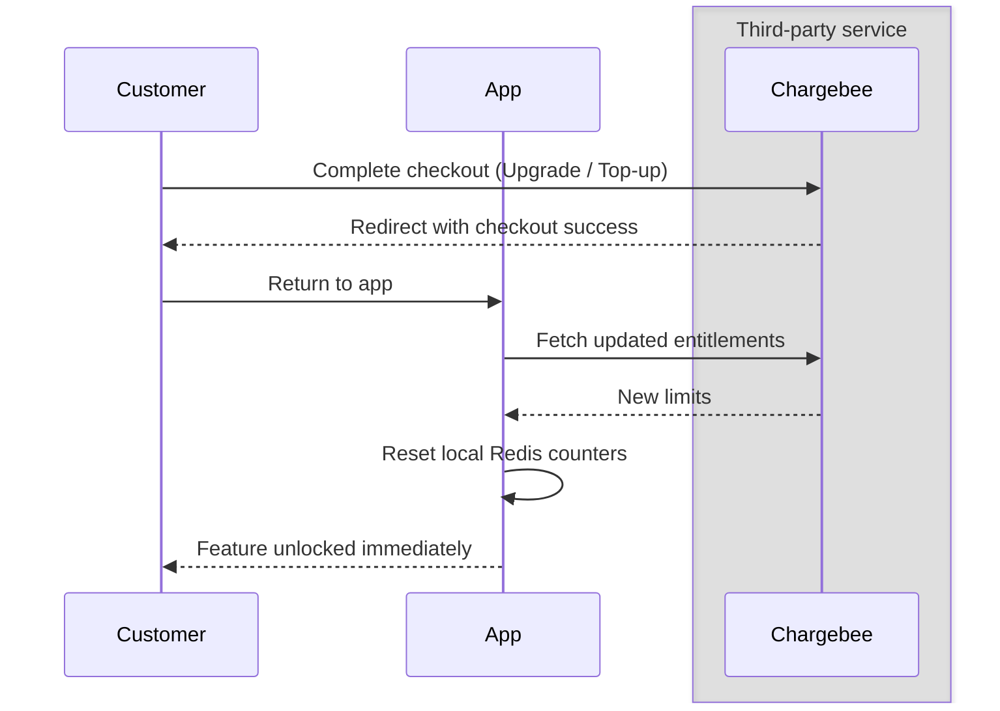
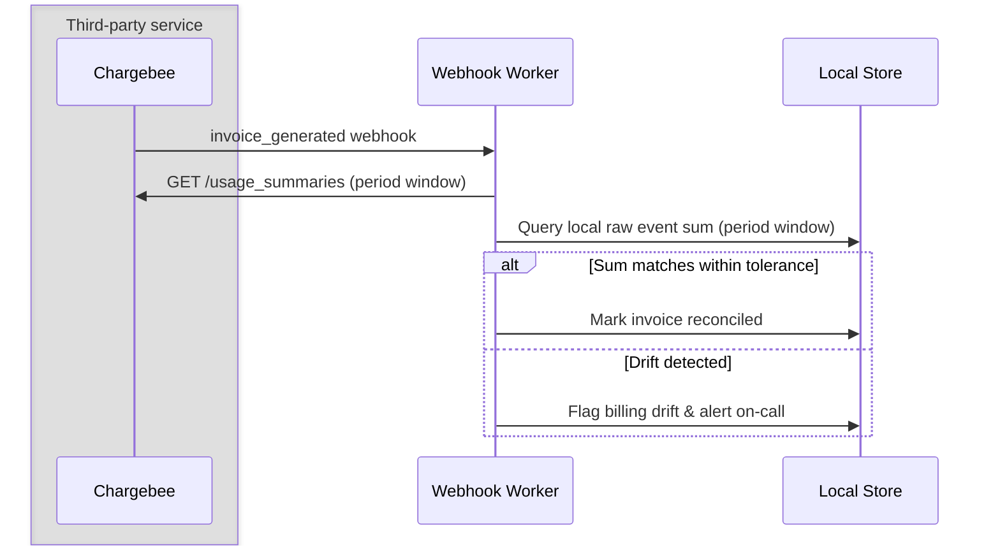

# How To Implement Usage-Based Billing

Turning raw product activity (API hits, LLM tokens, compute hours) into accurate Chargebee invoices requires decoupling your high-volume product traffic from billing ingestion. This topic covers:

* Recording usage on the hot path without adding latency or risking data loss
* Batching and synchronizing usage events to Chargebee's Advanced Usage-Based Billing (UBB) API
* Enforcing real-time quotas locally while letting Chargebee handle period-end rating and invoicing
* Reconciling invoice lines back to your local raw event history

**Important**: Chargebee is the system of record for billing aggregation and invoicing, but your app is the authority for real-time enforcement. Never call Chargebee's API inside customer-facing request paths.

## Setup

- Product Catalog 2.0 with [metered features](https://www.chargebee.com/docs/billing/2.0/usage-based-billing/defining-metered-features) and linked pricing configured
- A fast local buffer (Redis Stream or durable message queue) on the request path
- A local event store (PostgreSQL) for audit trails and billing reconciliation
- A background worker to flush event batches to Chargebee's [Usage Events API](https://apidocs.chargebee.com/docs/api/usage_events)

## 1. How Usage Ingestion Works
When a customer performs a billable action, record the event locally and return immediately. Ingesting synchronously to Chargebee adds latency and fails customer requests if the billing API is slow.



### Flow
1. Customer executes an action (e.g. LLM completion, file upload).
2. The application computes usage and assigns a stable `deduplication_id` (such as a UUIDv7 trace ID).
3. The event is written to a fast local buffer (sub-millisecond).
4. The API response returns to the customer without waiting on third-party networks.

```typescript
// Fast, non-blocking usage recording on the request path
await stream.xadd("usage_events", "*", "event", JSON.stringify({
    subscription_id: subscriptionId,
    usage_timestamp: Date.now(),
    deduplication_id: requestId,
    properties: { input_tokens: 150, output_tokens: 420 }
}));
  ```
✅ **Recommended**: Buffer usage events in-memory or in an append-only stream (sub-millisecond) before returning to the caller.

⚠️ **Not recommended**: Calling Chargebee's ingest endpoint inline during a user request. External latency degrades user experience and creates cascading timeouts.


## 2. What The Worker Does
The background worker drains buffered events, writes them to your local database for reconciliation, and flushes batches to Chargebee.



### Flow

1. Read a batch of up to 500 events from the buffer.
2. Persist the raw events to PostgreSQL (the reconciliation source of truth).
3. Check the 12-hour timestamp cutoff; dead-letter expired events.
4. Call Chargebee's `batchIngest` endpoint.
5. Acknowledge and delete entries from the buffer only after Chargebee accepts the batch.

```typescript
// Flush up to 500 events per batch and mark synced
await chargebee.usageEvent.batchIngest({ events: batch.map((e) => e.payload) });
await db.usageEvents.markSynced(batch.map((e) => e.deduplicationId));
await stream.xack("usage_events", "worker_group", batch.map((e) => e.streamId));
```

**Key points**:

* Chargebee's batch endpoint accepts a maximum of **500 events** per request.
* Acknowledge messages only after Chargebee returns `200`.
* If Chargebee is temporarily unavailable, leave messages on the buffer and retry with exponential backoff.

✅ **Recommended**: Keep batches large (up to 500) to minimize HTTP round-trips and preserve API quota.

⚠️ **Not recommended**: Acknowledging the queue before Chargebee returns `200`. A worker crash mid-flight permanently loses billable revenue.


## 3. Enforcing Limits: App vs Chargebee
Chargebee calculates usage asynchronously for periodic billing. It cannot evaluate real-time rate limits or quota boundaries at millisecond request speeds.



### Flow

1. Store allowance thresholds in your local cache (synced via plan entitlements).
2. Increment and check customer counters in Redis on every request.
3. Reject or throttle immediately with `429` or `402` when the limit is breached.
4. Let Chargebee rate overages or aggregate totals at the end of the billing cycle.

```typescript
// Real-time quota check in local cache; zero external API latency
const current = await redis.incrby(`quota:${subscriptionId}:tokens`, requestedTokens);
if (current > allowance) {
    throw new QuotaExceededError("Daily token limit exceeded. Upgrade or add credits.");
}
```

✅ **Recommended**: Enforce hard limits and concurrency caps against local counters in Redis.

⚠️ **Not recommended**: Polling Chargebee's `usage_charges` endpoint on each request to determine whether to allow user actions.

## 4. Handling Upgrades and Overages
When a customer exhausts their included allowance, they either purchase credit top-ups, upgrade their tier, or spill over into metered pay-as-you-go pricing.



### Flow
1. Customer reaches quota limit; UI displays an upgrade or credit pack prompt.
2. Customer completes checkout via Chargebee Checkout or customer portal.
3. On redirect back to the app, the app immediately fetches updated entitlements from Chargebee.
4. Reset the local usage counters in Redis so the customer can resume work without waiting for webhooks.

```typescript
// Optimistic entitlement refresh on checkout completion
await chargebee.subscriptionEntitlement.subscriptionEntitlementsForSubscription(subId);
await redis.del(`quota:${subId}:tokens`);
```

✅ **Recommended**: Reset local enforcement counters immediately on the checkout return handler.

⚠️ **Not recommended**: Waiting for the `subscription_entitlements_updated` webhook to unlock limits. Webhook delivery delays make users wait minutes after paying.

## 5. Handling Duplicate and Late Events
Networks drop and workers retry. Chargebee deduplicates using a composite key: `(subscription_id, usage_timestamp, deduplication_id)`.

```sql
-- Local idempotent table prevents double-counting inside your database
INSERT INTO usage_events (subscription_id, usage_timestamp, deduplication_id, properties)
VALUES ($1, $2, $3, $4)
ON CONFLICT (deduplication_id) DO NOTHING;
```

### The 12-Hour Backdating Window

Chargebee's Usage Events API enforces a strict constraint: `usage_timestamp` must be within the **last 12 hours**.
| Scenario | Behavior | Resolution |
|:---|:---|:---|
| **Worker retry (< 12 hours)** | Chargebee deduplicates using `deduplication_id`. | Safe to retry entire batch. |
| **Worker backlog (> 12 hours)** | Chargebee rejects the event with an error. | Split expired events, move to dead-letter storage, and ingest via Chargebee S3/file bulk import. |
| **Duplicate delivery** | Chargebee ignores the replayed event. | Send stable idempotency key on all requests. |

```typescript
// Drop or route expired events before sending batch to Chargebee
const TWELVE_HOURS_MS = 12 * 60 * 60 * 1000;
const isExpired = (event: UsageEvent) => (Date.now() - event.usage_timestamp) > TWELVE_HOURS_MS;
```

✅ **Recommended**: Use a deterministic UUID or request trace ID as your `deduplication_id`.

⚠️ **Not recommended**: Infinitely retrying batches containing events older than 12 hours. The entire batch will fail repeatedly.


## 6. Invoicing and Period-Close Reconciliation
At billing period close, Chargebee aggregates ingested events according to your metered feature SQL definitions and generates an invoice line item.



### Flow

1. Receive the `invoice_generated` webhook event.
2. Query Chargebee's `usage_summaries` API for the invoiced subscription and period dates.
3. Compute the sum of raw events stored in PostgreSQL for the same period.
4. Compare the quantities and trigger an alert if drift exceeds a safety threshold.

```typescript
// Verify billed invoice quantity matches local event totals
const localSum = await db.getEventSum(subscriptionId, featureId, periodStart, periodEnd);
const drift = Math.abs(invoiceItem.quantity - localSum);

if (drift > TOLERANCE) {
  await alertOnCall(Usage drift on ${subscriptionId}: CB=${invoiceItem.quantity}, Local=${localSum});
}
```

✅ **Recommended**: Compare local raw-event rollups against Chargebee's `usage_summaries` automatically on every invoice.

⚠️ **Not recommended**: Overwriting local usage data with Chargebee's invoice values without auditing discrepancies.


## See It Running In The Demo App


- [`pointer/lib/usage/events.ts`](../pointer/lib/usage/events.ts) — The non-blocking domain write API (`recordUsageEvent`). Enqueues generation usage without delaying the AI response.

- [`pointer/lib/usage/stream.ts`](../pointer/lib/usage/stream.ts) — Redis Streams buffer implementing consumer groups, pending-entry reclaiming, and batch reads.

- [`pointer/lib/usage/flush.ts`](../pointer/lib/usage/flush.ts) — The batch pump that archives entries to PostgreSQL, partitions expired events (> 12 hours), and ingests batches to Chargebee.

- [`pointer/lib/usage/ingest.ts`](../pointer/lib/usage/ingest.ts) — Wrapper for Chargebee's `usageEvent.batchIngest` API handling batch limits and retry counts.

- [`pointer/workers/usage-flush-loop.ts`](../pointer/workers/usage-flush-loop.ts) — Long-running background loop in the worker container driving periodic flushes.

- [`pointer/scripts/catalog.ts`](../pointer/scripts/catalog.ts) — Declares metered features (`Input tokens`, `Output tokens`, `Credits consumed`, `Generations`) and maps them to Chargebee event properties.


## Go-Live Checklist

- [ ] Is Product Catalog 2.0 active with metered features configured in Chargebee?

- [ ] Is the usage recording call on the request path non-blocking (buffered via Redis or queue)?

- [ ] Does every usage event carry a unique `deduplication_id`, `subscription_id`, and millisecond `usage_timestamp`?

- [ ] Are events batched up to a maximum of 500 records before calling Chargebee's ingest endpoint?

- [ ] Does the worker retain events locally in PostgreSQL before calling third-party endpoints?

- [ ] Are messages acknowledged on the buffer only after Chargebee returns `200`?

- [ ] Does the worker partition out events older than 12 hours so stale payloads don't block fresh batches?

- [ ] Are quotas and rate limits enforced locally against cache, without synchronous Chargebee API calls?

- [ ] Does the checkout success handler refresh entitlements and reset cache counters immediately?

- [ ] Is there an automated reconciliation job comparing `invoice_generated` quantities against local event sums?
