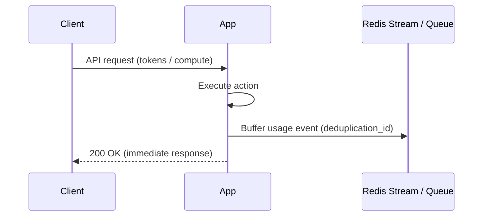
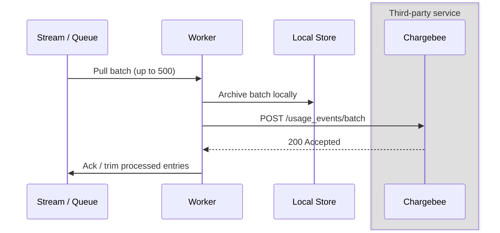
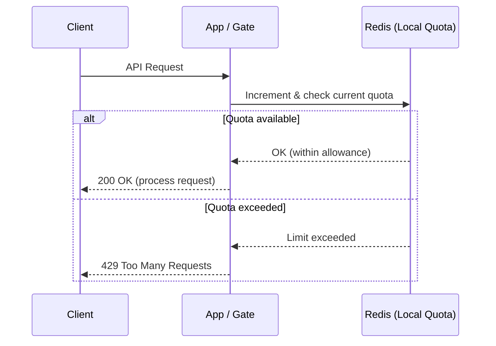
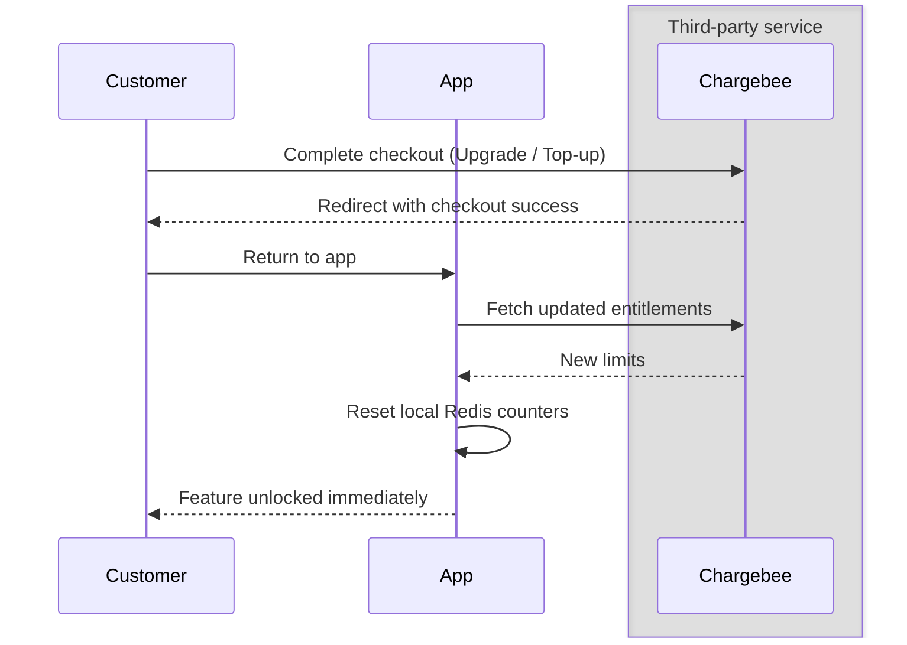
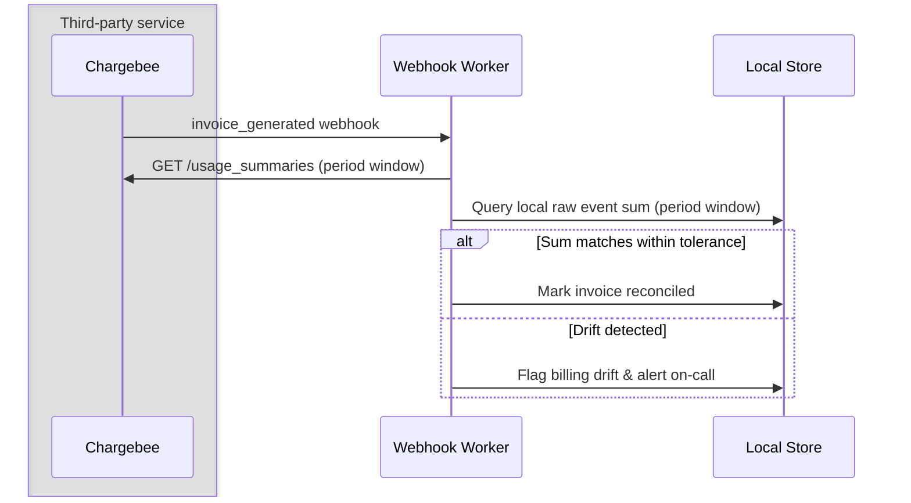

# How To Implement Usage-Based Billing

Charging for metered usage (API requests, LLM tokens, or compute hours) requires keeping billing ingestion out of your core application path. Calling external billing APIs during a request adds latency, risks customer-facing failures, and burns through rate limits.

This guide covers how to:

* Record usage events locally on the hot path with minimal overhead
* Batch and synchronize events to Chargebee's Advanced Usage-Based Billing (UBB) API
* Enforce real-time quotas locally while letting Chargebee handle cycle-end rating and invoicing
* Reconcile invoice line items against your raw event logs

Chargebee is the system of record for billing aggregation and invoices, but your app is the authority for real-time quota enforcement. Never call Chargebee's API inside user-facing request paths.

## Setup

- Product Catalog 2.0 with [metered features](https://www.chargebee.com/docs/billing/2.0/usage-based-billing/defining-metered-features) and linked pricing configured
- A fast local buffer (such as a Redis Stream or durable message queue) on the request path
- A local event store (such as PostgreSQL) for audit trails and billing reconciliation
- A background worker to flush event batches to Chargebee's [Usage Events API](https://apidocs.chargebee.com/docs/api/usage_events)

## 1. How Usage Ingestion Works

When a customer performs a billable action, record the event locally and return immediately. Synchronous billing calls add latency and cause user requests to fail whenever the billing API slows down.


```mermaid
sequenceDiagram
  participant Client
  participant App
  participant Buffer as Redis Stream / Queue

  Client->>App: API request (tokens / compute)
  App->>App: Execute action
  App->>Buffer: Buffer usage event (deduplication_id)
  App-->>Client: 200 OK (immediate response)
```

### Flow

1. A customer triggers a billable action (such as an LLM completion or file export).
2. The application records the usage numbers and generates a stable `deduplication_id` (such as a UUIDv7 trace ID).
3. The app appends the event to a fast local buffer (sub-millisecond).
4. The request returns immediately without waiting on external network calls.

```typescript
// Fast, non-blocking usage recording on the request path
await stream.xadd("usage_events", "*", "event", JSON.stringify({
  subscription_id: subscriptionId,
  usage_timestamp: Date.now(),
  deduplication_id: requestId,
  properties: { input_tokens: 150, output_tokens: 420 }
}));
```

✅ Do: Buffer usage events in an in-memory stream or queue before returning the HTTP response.

⚠️ Don't: Call Chargebee's ingest endpoint inline during a user request. External latency degrades user experience and creates cascading timeouts.

## 2. What The Worker Does

The background worker drains buffered events, writes them to your local database for reconciliation, and flushes batches to Chargebee.


```mermaid
sequenceDiagram
  participant Buffer as Stream / Queue
  participant Worker
  participant DB as Local Store
  box rgba(0,0,0,0.1) Third-party service
  participant Chargebee
  end

  Buffer->>Worker: Pull batch (up to 500)
  Worker->>DB: Archive batch locally
  Worker->>Chargebee: POST /usage_events/batch
  Chargebee-->>Worker: 200 Accepted
  Worker->>Buffer: Ack / trim processed entries
```

### Flow

1. Read a batch of up to 500 events from the buffer.
2. Persist the raw events to PostgreSQL as the local source of truth for reconciliation.
3. Check the 12-hour timestamp cutoff and route expired events to a dead-letter queue.
4. Send the batch to Chargebee's `batchIngest` endpoint.
5. Acknowledge and trim entries from the buffer only after Chargebee confirms receipt.

```typescript
// Flush up to 500 events per batch and mark synced
await chargebee.usageEvent.batchIngest({ events: batch.map((e) => e.payload) });
await db.usageEvents.markSynced(batch.map((e) => e.deduplicationId));
await stream.xack("usage_events", "worker_group", batch.map((e) => e.streamId));
```

Batching rules:

* Chargebee accepts up to 500 events per batch request.
* Acknowledge buffer messages only after Chargebee returns HTTP 200.
* If Chargebee is temporarily unavailable, leave messages in the buffer and retry with exponential backoff.

✅ Do: Send large batches (up to 500 events) to minimize HTTP overhead and stay within API rate limits.

⚠️ Don't: Acknowledge buffer messages before Chargebee returns HTTP 200. If the worker crashes mid-flight, unacknowledged events can be safely reprocessed.

## 3. Enforcing Limits: App vs Chargebee

Chargebee calculates usage asynchronously for periodic billing. It cannot evaluate real-time rate limits or quota boundaries at millisecond request speeds.


```mermaid
sequenceDiagram
  participant Client
  participant Gateway as App / Gate
  participant Cache as Redis (Local Quota)

  Client->>Gateway: API Request
  Gateway->>Cache: Increment & check current quota
  alt Quota available
    Cache-->>Gateway: OK (within allowance)
    Gateway-->>Client: 200 OK (process request)
  else Quota exceeded
    Cache-->>Gateway: Limit exceeded
    Gateway-->>Client: 429 Too Many Requests
  end
```

### Flow

1. Store allowance thresholds in your local cache (synced via plan entitlements).
2. Increment and check customer counters in Redis on every incoming request.
3. Reject or throttle requests immediately with HTTP 429 or 402 if the quota is exceeded.
4. Let Chargebee rate overages and calculate aggregate totals at cycle close.

```typescript
// Real-time quota check in local cache; zero external API latency
const current = await redis.incrby(`quota:${subscriptionId}:tokens`, requestedTokens);
if (current > allowance) {
    throw new QuotaExceededError("Daily token limit exceeded. Upgrade or add credits.");
}
```

✅ Do: Enforce hard limits and concurrency caps against local counters in Redis.

⚠️ Don't: Poll Chargebee's endpoints on each request to check remaining allowance. Use locally cached limits instead.

## 4. Handling Upgrades and Overages

When a customer exhausts their included allowance, they either purchase credit top-ups, upgrade their tier, or spill over into metered pay-as-you-go pricing.


```mermaid
sequenceDiagram
  participant Customer
  participant App
  box rgba(0,0,0,0.1) Third-party service
  participant Chargebee
  end

  Customer->>Chargebee: Complete checkout (Upgrade / Top-up)
  Chargebee-->>Customer: Redirect with checkout success
  Customer->>App: Return to app
  App->>Chargebee: Fetch updated entitlements
  Chargebee-->>App: New limits
  App->>App: Reset local Redis counters
  App-->>Customer: Feature unlocked immediately
```

### Flow

1. The customer reaches their quota limit, and the UI prompts them to upgrade or buy credit packs.
2. The customer completes checkout through Chargebee Checkout or the customer portal.
3. Upon returning to the application, the app immediately fetches the updated entitlements from Chargebee.
4. The app resets the local Redis counters so the customer can resume work without waiting for background webhooks.

```typescript
// Optimistic entitlement refresh on checkout completion
await chargebee.subscriptionEntitlement.subscriptionEntitlementsForSubscription(subId);
await redis.del(`quota:${subId}:tokens`);
```

✅ Do: Reset local enforcement counters immediately in the checkout return handler.

⚠️ Don't: Wait for the background `subscription_entitlements_updated` webhook before unlocking features. Webhook delivery delays leave paying customers stuck waiting.

## 5. Handling Duplicate and Late Events

Networks drop and workers retry. Chargebee deduplicates using a composite key: `(subscription_id, usage_timestamp, deduplication_id)`.

```sql
-- Local idempotent table prevents double-counting inside your database
INSERT INTO usage_events (subscription_id, usage_timestamp, deduplication_id, properties)
VALUES ($1, $2, $3, $4)
ON CONFLICT (deduplication_id) DO NOTHING;
```

### The 12-Hour Backdating Window

Chargebee's Usage Events API enforces a strict constraint: `usage_timestamp` must be within the **last 12 hours**.

| Scenario | Behavior | Resolution |
|:---|:---|:---|
| **Worker retry (< 12 hours)** | Chargebee deduplicates using `deduplication_id`. | Safe to retry the entire batch. |
| **Worker backlog (> 12 hours)** | Chargebee rejects the event with an error. | Separate expired events, send them to dead-letter storage, and ingest via Chargebee bulk file import. |
| **Duplicate delivery** | Chargebee ignores the replayed event. | Send a stable idempotency key on all requests. |

```typescript
// Drop or route expired events before sending batch to Chargebee
const TWELVE_HOURS_MS = 12 * 60 * 60 * 1000;
const isExpired = (event: UsageEvent) => (Date.now() - event.usage_timestamp) > TWELVE_HOURS_MS;
```

✅ Do: Use a deterministic UUID or request trace ID as your `deduplication_id`.

⚠️ Don't: Repeatedly retry batches containing events older than 12 hours. Chargebee will reject the entire batch until the expired events are removed.

## 6. Invoicing and Period-Close Reconciliation

At billing period close, Chargebee aggregates ingested events according to your metered feature SQL definitions and generates an invoice line item.


```mermaid
sequenceDiagram
  box rgba(0,0,0,0.1) Third-party service
  participant Chargebee
  end
  participant Webhook as Webhook Worker
  participant DB as Local Store

  Chargebee->>Webhook: invoice_generated webhook
  Webhook->>Chargebee: GET /usage_summaries (period window)
  Webhook->>DB: Query local raw event sum (period window)
  alt Sum matches within tolerance
    Webhook->>DB: Mark invoice reconciled
  else Drift detected
    Webhook->>DB: Flag billing drift & alert on-call
  end
```

### Flow

1. Receive the `invoice_generated` webhook event.
2. Query Chargebee's `usage_summaries` API for the invoiced subscription and billing period.
3. Sum the matching raw events stored in PostgreSQL for that same period.
4. Compare the quantities and trigger an alert if the discrepancy exceeds your tolerance threshold.

```typescript
// Verify billed invoice quantity matches local event totals
const localSum = await db.getEventSum(subscriptionId, featureId, periodStart, periodEnd);
const drift = Math.abs(invoiceItem.quantity - localSum);

if (drift > TOLERANCE) {
  await alertOnCall(`Usage drift on ${subscriptionId}: CB=${invoiceItem.quantity}, Local=${localSum}`);
}
```

✅ Do: Compare local raw-event rollups against Chargebee's `usage_summaries` automatically for every generated invoice.

⚠️ Don't: Overwrite local event logs with Chargebee invoice figures without investigating discrepancies first.

## See It Running In The Demo App

Implementation files to review:

- [`pointer/lib/usage/events.ts`](../pointer/lib/usage/events.ts): Non-blocking write API (`recordUsageEvent`). Buffers usage data without slowing down user responses.

- [`pointer/lib/usage/stream.ts`](../pointer/lib/usage/stream.ts): Redis Streams buffer implementing consumer groups, pending-entry reclaiming, and batch reads.

- [`pointer/lib/usage/flush.ts`](../pointer/lib/usage/flush.ts): Batch worker that archives events to PostgreSQL, isolates events older than 12 hours, and sends batches to Chargebee.

- [`pointer/lib/usage/ingest.ts`](../pointer/lib/usage/ingest.ts): Client wrapper for Chargebee's `usageEvent.batchIngest` API handling batch size limits and retry logic.

- [`pointer/workers/usage-flush-loop.ts`](../pointer/workers/usage-flush-loop.ts): Background loop in the worker container that runs periodic flushes.

- [`pointer/scripts/catalog.ts`](../pointer/scripts/catalog.ts): Defines metered features (`Input tokens`, `Output tokens`, `Credits consumed`, `Generations`) and links them to Chargebee event properties.

## Go-Live Checklist

- [ ] Is Product Catalog 2.0 active with metered features configured in Chargebee?

- [ ] Is usage recording non-blocking on the request path (buffered via Redis or a queue)?

- [ ] Does every usage event carry a unique `deduplication_id`, `subscription_id`, and millisecond `usage_timestamp`?

- [ ] Are events grouped into batches of up to 500 before sending to Chargebee?

- [ ] Does the worker persist events in PostgreSQL before calling external billing endpoints?

- [ ] Are buffer messages acknowledged only after Chargebee returns HTTP 200?

- [ ] Does the worker filter out events older than 12 hours so expired records do not block the queue?

- [ ] Are quotas and rate limits enforced locally against Redis without synchronous Chargebee API calls?

- [ ] Does the checkout return handler refresh entitlements and reset cache counters immediately?

- [ ] Is there an automated reconciliation job that compares `invoice_generated` quantities against local event sums?
