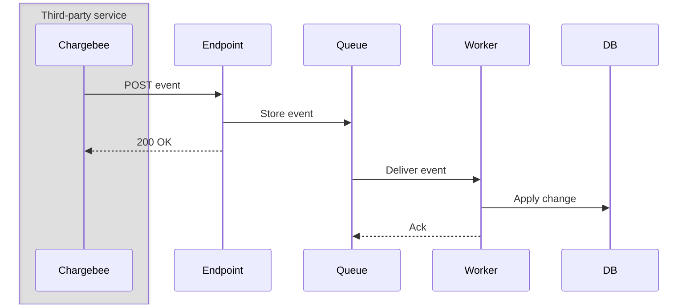
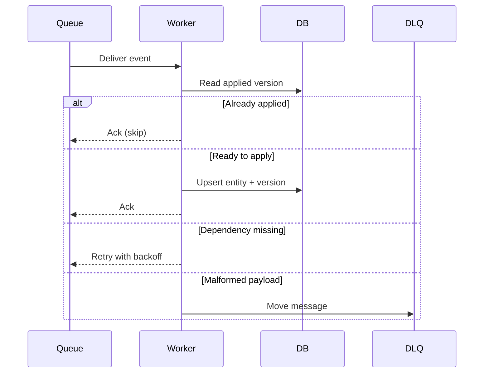
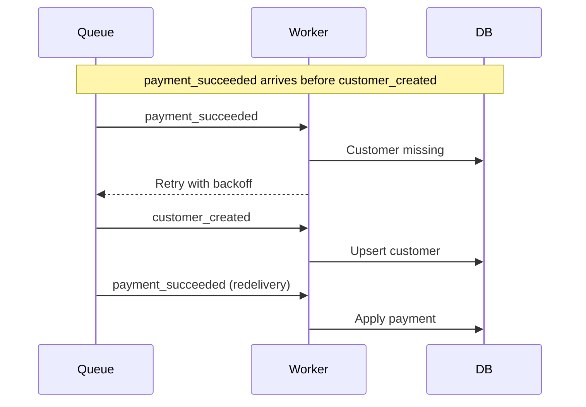

# How To Integrate Chargebee Webhooks

Webhooks notify your application when billing events happen in Chargebee: subscriptions are created, payments succeed, or plans change.

This guide covers how to:

* Keep your local copy of customers, subscriptions, and invoices in sync with Chargebee
* Trigger custom workflows when payments, renewals, or plan updates occur
* Recover cleanly from interrupted or failed user checkouts

Chargebee is the single source of truth for billing state. Your app maintains a local read-only mirror. The webhook endpoint's only job is to accept the event and store it durably. Everything else happens asynchronously in a background worker.

## Setup

- A webhook configured in Chargebee under **Settings > Configure Chargebee > API Keys and Webhooks**
- An HTTPS endpoint protected with [basic authentication](https://www.chargebee.com/docs/billing/2.0/site-configuration/webhook_settings)
- A durable queue (or database table) where the endpoint writes incoming payloads
- A background worker consuming messages from that queue
- A tracking table to record which event `id` and `resource_version` records have already been applied

## 1. How Webhook Delivery Works



### Flow

1. An event occurs in Chargebee (such as a subscription created or a payment succeeding).
2. Chargebee POSTs the event payload as JSON to your endpoint.
3. The endpoint verifies basic authentication and writes the event to a durable queue.
4. The endpoint returns HTTP 200 to acknowledge receipt.
5. The background worker pulls the event from the queue and updates the local database.

Chargebee's webhook delivery is **at-least-once** and **unordered**. The same event can arrive more than once, and an older event can arrive after a newer one. Once you return HTTP 200, Chargebee considers the event delivered, so safe execution rests entirely with your background pipeline.

## 2. What The Endpoint Does

The endpoint has one job: store the event in a durable queue and return quickly. Chargebee enforces a 60-second execution timeout on live sites, and a timeout counts as a delivery failure. Keep all business logic and database mutations inside the worker.

```typescript
// Validate, enqueue, answer. No DB writes on this path.
await queue.send({ MessageBody: JSON.stringify(event), MessageDeduplicationId: event.id });
return new Response(null, { status: 200 });
```

If the queue write fails, return a 5xx status code. Chargebee will [retry delivery](https://www.chargebee.com/docs/billing/2.0/site-configuration/webhook_settings) according to its backoff schedule so no event is lost.

✅ Do: Return HTTP 200 as soon as the event is safely queued.

✅ Do: Return a 5xx status code if enqueuing fails, prompting Chargebee to retry delivery.

⚠️ Don't: Update your database, call the Chargebee API, or send emails inside the webhook endpoint. Slow external dependencies cause webhook timeouts and retry storms.

⚠️ Don't: Return HTTP 200 on an ingestion error to silence webhook retries. If the event is dropped, Chargebee will not resend it automatically.

## 3. What The Worker Does

The background worker handles all entity synchronization. Running it in a process separate from your web application prevents webhook surges from competing with user traffic.



The worker executes this sequence for each message:

1. Parse the payload. Malformed bodies that cannot be parsed are poison messages and should be routed to a dead letter queue (Section 7).
2. Check the stored `resource_version` and skip the event if a newer or identical version is already applied (Section 5).
3. Check for parent records and requeue the message if a referenced entity does not exist yet (Section 6).
4. Apply the change to the local database.
5. Commit the updated `resource_version` and acknowledge the queue message.

```typescript
// Ack only after the version is committed, so a crash mid-apply replays the event
await applyEvent(event);
await commitVersions(event);
```

Worker guidelines:

* Acknowledging a message signals completion, not receipt.
* Throwing an error or leaving a message unacknowledged causes the queue to redeliver it after a timeout.
* Scale worker capacity by running additional consumer processes; queue visibility timeouts prevent concurrent workers from processing the same message.

✅ Do: Scale workers horizontally using queue-driven retries and dead letter policies to handle failures.

⚠️ Don't: Process webhooks inside fire-and-forget promises or timeouts within the web process. Restarts and deployments will drop in-flight events silently.

## 4. Handling Duplicate Deliveries

Because retries happen automatically, the same event can arrive more than once. Use Chargebee's event `id` as an idempotency key.

```sql
-- A replay of an already-processed event falls straight through
INSERT INTO webhook_event (id) VALUES ($1) ON CONFLICT (id) DO NOTHING;
```

Chargebee retries failed deliveries for up to [3 days and 7 hours](https://apidocs.chargebee.com/docs/api/events). Retain processed event IDs for at least that long before purging them.

✅ Do: Record applied event IDs in a dedicated table and make database upserts idempotent.

⚠️ Don't: Deduplicate based on composite keys like `(event_type, subscription_id)`. Legitimate back-to-back updates to the same subscription share that key.

## 5. Handling Out-Of-Order Events

Network delays and retries mean an event with a newer state can arrive before an older one. Every Chargebee entity includes a `resource_version` that increments on every mutation. Compare this version against your local record before applying updates.

```typescript
// The incoming snapshot is older than what's already applied — ignore it
if (event.content.subscription.resource_version <= stored.resourceVersion) return;
```

The `resource_version` applies to each individual resource, not the event wrapper. An event's `content` payload may contain a customer, a subscription, and an invoice, each carrying its own independent `resource_version`. Verify each entity individually before updating local tables.

Webhook payloads reflect the entity snapshot at the time the event fired and do not change during redeliveries. If your application needs current state rather than a historical snapshot, call Chargebee's retrieve endpoint directly.

✅ Do: Track `resource_version` per entity and only advance versions forward.

⚠️ Don't: Rely on `occurred_at` to determine event ordering. `occurred_at` records when the event was generated, not the sequence of mutations applied to the entity.

## 6. Handling Dependent Events That Arrive Early

A common race condition occurs when `payment_succeeded` arrives before the corresponding `customer_created` event has finished processing. The worker has no existing customer row to attach the payment to.



Treat a missing parent dependency as a retryable condition. Leave the message unacknowledged or throw a retryable error so the queue redelivers it after a short delay.

```typescript
// Not an error to alert on — the parent event is usually seconds behind
if (!(await customerExists(event.content.subscription.customer_id))) {
  throw new RetryableWebhookError("customer not in DB yet");
}
```

Exempt the entity that the event itself creates: a `customer_created` handler must not check for an existing customer record before running.

✅ Do: Requeue dependent events with progressive backoff until the parent record is created.

⚠️ Don't: Drop the event or return a 5xx status code to Chargebee. Once an event is enqueued, all retries belong to your internal queue.

⚠️ Don't: Fetch missing parent entities inline from the Chargebee API. Doing so masks ordering issues and wastes API quota during routine bursts.

## 7. Handling Poison Messages

Some payloads will never succeed: malformed JSON, missing event IDs, or schemas unsupported by your application code. Continuously retrying these wastes queue capacity and blocks healthy messages.

```typescript
// Skip the retries and send it to the dead letter queue immediately
if (!event.id) throw new PoisonWebhookError("webhook body is missing an event id");
```

Route non-retryable payloads directly to a [dead letter queue](https://en.wikipedia.org/wiki/Dead_letter_queue), set up alerts for when the queue receives messages, and provide a tool to replay messages once a fix is deployed. You can also retrigger failed webhooks from the Chargebee console under **Logs > Events**.

✅ Do: Distinguish between temporary dependency delays and permanent payload failures, routing unrecoverable messages straight to a dead letter queue.

⚠️ Don't: Catch all errors indiscriminately and retry every failure. Poison messages will cycle indefinitely and consume your worker retry budget.

## 8. Retry And Retention Settings

Webhook ingestion involves two independent retry lifecycles: Chargebee retries delivering to your endpoint, and your queue retries delivering to your worker.

| | Chargebee to endpoint | Queue to worker |
|---|---|---|
| Retries on | Non-2xx response or timeout | Unacknowledged message or worker error |
| Attempts | 7 attempts | Configured via `maxReceiveCount` |
| Schedule | 2m, 6m, 30m, 1h, 5h, 1d, 2d | Configured backoff policy |
| Total window | ~3 days 7 hours | Configured queue retention period |
| On exhaustion | Sends failure email, requires manual resend | Routes to dead letter queue |

Apply exponential backoff based on delivery count rather than retrying at fixed intervals.

```typescript
// 30s -> 1m -> 2m -> ... capped at 15m
const backoff = Math.min(30 * 2 ** (receiveCount - 1), 900);
```

Set the queue retention period well above the largest expected processing gap. Webhook processing delays are typically seconds, so several days of queue retention provides ample safety margin.

## 9. Choosing Events And Endpoints

Chargebee allows configuring up to five webhook endpoints per site. Subscribe each endpoint only to the event types it needs to handle rather than selecting **All Events**. Filtering reduces network traffic, lowers endpoint load, and avoids processing irrelevant noise.

When configuring multiple endpoints, divide them by function: for example, one endpoint for core billing synchronization and another for analytics or auditing. Having multiple endpoints write to the same database tables creates redundant work that your idempotency checks must filter.

Check the `api_version` field on incoming events against the API version supported by your SDK. A version mismatch means the payload structure may differ from what your application expects.

If your infrastructure runs on AWS and your event volume is high, [Event Streaming via AWS EventBridge](https://www.chargebee.com/docs/billing/2.0/site-configuration/webhook_settings) delivers webhook events directly to your cloud resources without managing a public HTTP endpoint.

✅ Do: Dedicate a single endpoint to the billing database mirror and subscribe only to relevant event types.

⚠️ Don't: Fan out webhooks directly to multiple internal services without a queue. A single slow consumer will cause the webhook endpoint to time out for all services.

## See It Running In The Demo App

Implementation files to review:

- [`pointer/lib/webhooks.ts`](../pointer/lib/webhooks.ts): Webhook ingestion endpoint. Validates basic auth, enqueues the event to SQS using the event `id` as the deduplication key, and returns HTTP 200.

- [`pointer/workers/chargebee-webhook-worker.ts`](../pointer/workers/chargebee-webhook-worker.ts): SQS consumer loop. Long-polls for messages, acks on successful completion, and allows unhandled errors to trigger queue redelivery.

- [`pointer/workers/chargebee-webhook-processor.ts`](../pointer/workers/chargebee-webhook-processor.ts): Message processing pipeline executing freshness checks, parent dependency validation, database updates, and version commits.

- [`pointer/lib/webhooks/webhook-guards.ts`](../pointer/lib/webhooks/webhook-guards.ts): `resource_version` guards and parent relationship checks backed by the `chargebee_resource_version` table.

- [`pointer/infra/sqs.tf`](../pointer/infra/sqs.tf): Terraform configuration for the SQS queue and DLQ. Configured with `maxReceiveCount = 5`, 4-day queue retention, 14-day DLQ retention, and CloudWatch alarms for DLQ messages.

## Go-Live Checklist

- [ ] Is the webhook URL served over HTTPS and protected with basic authentication?

- [ ] Does the endpoint return HTTP 200 only after the event is durably stored, and a 5xx code when storage fails?

- [ ] Does the endpoint avoid database writes, external API calls, and email delivery?

- [ ] Is every applied event `id` recorded and retained for at least 3 days and 7 hours?

- [ ] Does the worker check `resource_version` per entity before writing and only advance versions forward?

- [ ] Does the worker requeue dependent events instead of dropping them when parent entities are missing?

- [ ] Do malformed payloads route to a dead letter queue without consuming retry attempts?

- [ ] Is the dead letter queue monitored with alerts, and can messages be redriven onto the main queue?

- [ ] Is the queue retention period longer than the largest expected out-of-order delay?

- [ ] Is each webhook subscribed only to the event types it processes, rather than **All Events**?

- [ ] Does the event `api_version` match the version expected by your application client library?
