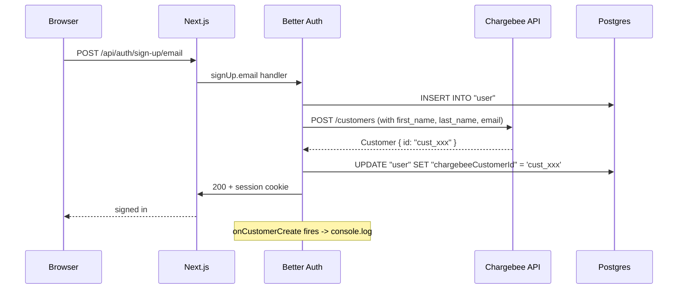

# Chargebee Better-Auth Plugin Integration

Add the official [`@chargebee/better-auth`](https://better-auth.com/docs/plugins/chargebee) plugin to the existing Better Auth setup at [src/lib/auth.ts](../src/lib/auth.ts) so that a Chargebee customer is automatically created (and linked) whenever a new app user signs up.

**Scope of this plan:** customer auto-creation only. Subscription management, plan definitions, and the billing portal are intentionally out of scope and can be layered on later by enabling the plugin's `subscription` block.

## Pre-requisites

- A Chargebee test site (`<your-site>-test.chargebee.com`)
- An API key from Chargebee Settings -> Configure Chargebee -> API Keys (use a Full-Access key for the test site)
- Optional but recommended for production: a username/password pair for webhook Basic Auth

## Dependencies to install

```bash
cd src
pnpm add @chargebee/better-auth chargebee
```

The `chargebee` package is the official Chargebee Node SDK; `@chargebee/better-auth` is the Better Auth plugin maintained by the Chargebee team.

## Environment variables

Add to [src/.env.example](../src/.env.example) and [src/.env.local](../src/.env.local):

```env
# Chargebee (test site for local dev)
CHARGEBEE_SITE=<your-site>-test
CHARGEBEE_API_KEY=<full-access-test-api-key>

# Optional: Basic Auth for the auto-mounted webhook endpoint
# (only required if the Chargebee dashboard webhook is configured with these)
CHARGEBEE_WEBHOOK_USERNAME=
CHARGEBEE_WEBHOOK_PASSWORD=
```

## Code changes

### 1. Server config: [src/lib/auth.ts](../src/lib/auth.ts)

Add a Chargebee client and register the plugin. The `getCustomerCreateParams` callback splits the single `user.name` field into `first_name` / `last_name` for Chargebee (per the plugin docs, "Better Auth stores names in a single `user.name` field"). `onCustomerCreate` logs to the dev console so we can see the link happening during smoke tests:

```ts
import { chargebee } from "@chargebee/better-auth";
import Chargebee from "chargebee";
// ...existing imports...

const chargebeeClient = new Chargebee({
  apiKey: process.env.CHARGEBEE_API_KEY!,
  site: process.env.CHARGEBEE_SITE!,
});

export const auth = betterAuth({
  // ...existing baseURL, secret, database, emailAndPassword, emailVerification...
  plugins: [
    organization(),
    admin(),
    twoFactor(),
    bearer(),
    chargebee({
      chargebeeClient,
      createCustomerOnSignUp: true,
      getCustomerCreateParams: (user) => {
        const [firstName, ...rest] = (user.name ?? "").trim().split(/\s+/);
        return {
          first_name: firstName || undefined,
          last_name: rest.join(" ") || undefined,
        };
      },
      onCustomerCreate: async ({ chargebeeCustomer, user }) => {
        console.log(
          `[chargebee] created customer ${chargebeeCustomer.id} for user ${user.id} (${user.email})`,
        );
      },
      webhookUsername: process.env.CHARGEBEE_WEBHOOK_USERNAME,
      webhookPassword: process.env.CHARGEBEE_WEBHOOK_PASSWORD,
    }),
    nextCookies(), // must remain LAST
  ],
  // ...advanced...
});
```

Plugin order matters: `nextCookies()` must stay at the end. The Chargebee plugin sits before it.

### 2. Client plugin: [src/lib/auth-client.ts](../src/lib/auth-client.ts)

Even though we're not exposing subscription UI yet, registering the client plugin keeps the typed surface consistent and ready for follow-ups. `subscription: false` keeps the surface minimal:

```ts
import { chargebeeClient } from "@chargebee/better-auth/client";

export const authClient = createAuthClient({
  // ...existing baseURL...
  plugins: [
    organizationClient(),
    adminClient(),
    twoFactorClient(),
    chargebeeClient({ subscription: false }),
  ],
});
```

### 3. Database migration

The plugin adds a `chargebeeCustomerId` (string, optional) column to both `user` and `organization` (the `organization` plugin is enabled, so the column appears there too). Run:

```bash
cd src
npx @better-auth/cli@latest migrate --yes
```

The CLI will detect the new fields and apply an additive migration. No data loss; existing rows get `chargebeeCustomerId = NULL`.

## Sign-up data flow after the change



## Webhook endpoint

The plugin auto-mounts `POST /api/auth/chargebee/webhook` via the existing catch-all at [src/app/api/auth/\[...all\]/route.ts](<../src/app/api/auth/[...all]/route.ts>) - no new file needed. For local development the webhook is optional (no events will fire unless we point Chargebee at the dev URL via a tunnel like ngrok). When ready, configure it in the Chargebee dashboard with at least:

- `customer_deleted` (the plugin handles this to keep `chargebeeCustomerId` in sync)

Other subscription events become relevant only when the `subscription` block is enabled later.

## Verification steps

1. `pnpm exec tsc --noEmit` from `src/` - expect clean
2. `pnpm lint` - expect clean
3. `pnpm dev` from `src/`
4. Sign up via the UI at `/sign-up` (or `curl -X POST http://localhost:3000/api/auth/sign-up/email -H 'Content-Type: application/json' -d '{"email":"cbtest@example.com","password":"testtest12","name":"CB Test"}'`)
5. Expect in the dev server console: `[chargebee] created customer cust_xxx for user yyy (cbtest@example.com)`
6. Confirm in Postgres: `SELECT id, email, "chargebeeCustomerId" FROM "user" WHERE email = 'cbtest@example.com';` - the `chargebeeCustomerId` column should be populated
7. Confirm in the Chargebee dashboard (Customers tab) that a matching customer exists

## Failure modes to anticipate

- **Missing or wrong `CHARGEBEE_API_KEY` / `CHARGEBEE_SITE`** -> the customer create call throws; Better Auth's sign-up will surface this as a 500. The user row still gets created in Postgres (so the next sign-in will work) but `chargebeeCustomerId` stays NULL. We may want to add a follow-up "backfill" job later.
- **`chargebee` SDK ESM/CJS interop** -> the SDK is published as both. If `import Chargebee from "chargebee"` complains under Next.js 16 / Turbopack, fall back to `import { Chargebee } from "chargebee"` or namespace import per the SDK README.
- **Duplicate field error on migrate** -> if the migration was already partially applied, drop the column manually before re-running.

## Out of scope (future plans)

- Defining `subscription.plans` and exposing `/pricing` + `/account/billing`
- Wiring `authorizeReference` for organization billing
- Mirroring Chargebee plan limits onto the app's authorization checks
- Production-grade webhook (Basic Auth + IP allowlist + ngrok/Cloudflare Tunnel for local testing)
