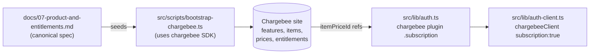

<!-- 299d1d8a-82f1-464b-9870-bde023106662 -->
---
todos:
  - id: "catalog-data"
    content: "Author src/scripts/catalog.ts with itemFamily, features, plans, creditPacks, itemEntitlements, and a shared planLimits map mirroring docs/07 §4.5 + §4.6"
    status: pending
  - id: "bootstrap-script"
    content: "Author src/scripts/bootstrap-chargebee.ts with idempotent retrieve-or-create for item family → features → items → item-prices → item-entitlements"
    status: pending
  - id: "package-and-tsconfig"
    content: "Add tsx devDep + 'bootstrap:chargebee' script to src/package.json; include scripts/** in src/tsconfig.json"
    status: pending
  - id: "run-bootstrap"
    content: "Run pnpm bootstrap:chargebee against the test site (CHARGEBEE_SITE=developer-experience-test) and verify all [created] outputs"
    status: pending
  - id: "verify-dashboard"
    content: "Inspect the Chargebee dashboard: 1 item family, 7 features, 8 items, 8 item-prices, item-entitlements per plan"
    status: pending
  - id: "auth-subscription-block"
    content: "Extend chargebee({...}) in src/lib/auth.ts with subscription.enabled + plans (from catalog.ts) + authorizeReference + onSubscriptionCreated logger"
    status: pending
  - id: "auth-client-flip"
    content: "Flip chargebeeClient({ subscription: true }) in src/lib/auth-client.ts"
    status: pending
  - id: "migrate-subscription-tables"
    content: "Run npx @better-auth/cli@latest migrate --yes to add subscription + subscriptionItem tables"
    status: pending
  - id: "smoke-test"
    content: "Type-check, lint, sign up a test user, call authClient.subscription.create with plan-pro-USD-Monthly, complete checkout, confirm DB rows + dashboard state"
    status: pending
isProject: false
---

## 1. Why two parts

The [`@chargebee/better-auth`](https://better-auth.com/llms.txt/docs/plugins/chargebee.md) plugin manages **runtime** Chargebee objects only — customers, subscriptions, hosted-page checkout/portal, and webhooks. It deliberately does **not** create item-families, features, items, item-prices, or item-entitlements; the plugin's `subscription.plans` array merely *references* item-price IDs that already exist in Chargebee.

Therefore this plan splits into:

- **Part A — Catalog bootstrap** (one-time, re-runnable): a Node script that uses the official `chargebee` SDK directly to seed everything from [docs/07-product-and-entitlements.md](docs/07-product-and-entitlements.md).
- **Part B — Better-Auth subscription block**: enable the plugin's `subscription` feature with a `plans` array that maps logical plan names → seeded `itemPriceId` + entitlement limits (mirrored from §3.1 of the doc for app-side checks).



## 2. Scope and assumptions

In scope:
- Item Family `ai-product`
- All 7 Features from §4.5 (`f_sso`, `f_input_tokens_daily`, `f_output_tokens_daily`, `f_credits_monthly`, `f_api_rate_per_minute`, `f_max_seats`, `f_models`)
- 5 Plan items + 3 Credit-pack items (§4.2, §4.3)
- USD-Monthly Item Prices for every plan + credit packs (§4.4 minimum slice)
- Item Entitlements per plan (§4.6)
- Better-Auth `subscription` block exposing Free, Pro, Max, Team to self-service

Out of scope (separate follow-up plans):
- Annual / EUR Item Prices, Enterprise contract pricing
- Per-customer Entitlement Overrides for Enterprise (§4.7)
- `/pricing` and `/account/billing` UI
- Credit-pack purchase server action (one-time `invoice.charge_addon` — plugin doesn't cover this)
- Paywall enforcement / Redis entitlement cache / quota counters (§5, §6)

Architectural simplifications worth flagging:
- Doc §1 models `Account = Chargebee customer (1:1)`; the current codebase has no `account` table. We keep the existing mapping: **Personal plans → `customerType: "user"`** (already created by `createCustomerOnSignUp`), **Team plans → `customerType: "organization"`** (Better-Auth plugin auto-creates an org-level Chargebee customer when first subscribed). A future plan can introduce a unified `account` abstraction.
- Enterprise is **excluded from the self-service plugin plan list** — it's sales-led; the bootstrap still seeds `plan-enterprise` so contracts can be wired manually in the Chargebee dashboard.

## 3. Part A — Bootstrap script

### 3.1 Files

- New: [src/scripts/bootstrap-chargebee.ts](src/scripts/bootstrap-chargebee.ts) — single-file, idempotent, runnable with `pnpm bootstrap:chargebee`.
- New: [src/scripts/catalog.ts](src/scripts/catalog.ts) — pure-data export of the catalog (item family, features, items, prices, entitlements) typed against the SDK so changes to the spec are a one-place edit. Also imported by Part B to derive plugin `limits`.
- Edit: [src/package.json](src/package.json) — add `"bootstrap:chargebee": "tsx scripts/bootstrap-chargebee.ts"` and `tsx` as devDep.
- Edit: [src/tsconfig.json](src/tsconfig.json) — ensure `scripts/**` is included for type-check (currently `app/**` only).

### 3.2 Catalog data shape ([src/scripts/catalog.ts](src/scripts/catalog.ts))

Single source of truth, mirrors §4.5 / §4.6:

```ts
export const itemFamily = { id: "ai-product", name: "AI Product" } as const;

export const features = [
  { id: "f_sso", name: "SSO", type: "switch" as const, status: "active" as const },
  {
    id: "f_input_tokens_daily", name: "Daily input tokens",
    type: "quantity" as const, unit: "token",
    levels: [
      { value: "50000",     level: 0 },
      { value: "1000000",   level: 1 },
      { value: "10000000",  level: 2 },
      { value: "5000000",   level: 3 },
      { is_unlimited: true, level: 4 },
    ],
  },
  // ... f_output_tokens_daily, f_credits_monthly, f_api_rate_per_minute, f_max_seats, f_models
] as const;

export const plans = [
  { id: "plan-free",       name: "Free",       priceUSDMonthly: 0   },
  { id: "plan-pro",        name: "Pro",        priceUSDMonthly: 20  },
  { id: "plan-max",        name: "Max",        priceUSDMonthly: 100 },
  { id: "plan-team",       name: "Team",       priceUSDMonthly: 30, perUnit: true },
  { id: "plan-enterprise", name: "Enterprise", priceUSDMonthly: 0,  custom: true },
] as const;

export const creditPacks = [
  { id: "pack-credits-1k",   priceUSD: 10,  credits: 1000   },
  { id: "pack-credits-10k",  priceUSD: 80,  credits: 10000  },
  { id: "pack-credits-100k", priceUSD: 700, credits: 100000 },
] as const;

// keyed by plan id — matches §4.6 exactly
export const itemEntitlements: Record<string, { feature_id: string; value: string }[]> = {
  "plan-free":       [ /* … */ ],
  "plan-pro":        [ /* … */ ],
  "plan-max":        [ /* … */ ],
  "plan-team":       [ /* … */ ],
  "plan-enterprise": [ /* … */ ],
};
```

### 3.3 Bootstrap algorithm ([src/scripts/bootstrap-chargebee.ts](src/scripts/bootstrap-chargebee.ts))

Idempotent retrieve-or-create pattern for each entity (re-runs are safe and report `[ok]` / `[created]` / `[updated]`):

```ts
import Chargebee from "chargebee";
import { config } from "dotenv";
import { itemFamily, features, plans, creditPacks, itemEntitlements } from "./catalog";

config({ path: ".env.local" });

const cb = new Chargebee({
  apiKey: process.env.CHARGEBEE_API_KEY!,
  site:   process.env.CHARGEBEE_SITE!,
});

async function upsertItemFamily() { /* cb.itemFamily.retrieve(id) || cb.itemFamily.create({ id, name }) */ }
async function upsertFeatures()    { /* per feature: retrieve → create or update levels */ }
async function upsertItems()       { /* per plan + credit pack: retrieve → create with item_family_id */ }
async function upsertItemPrices()  { /* plan-{id}-USD-Monthly; pricing_model=flat_fee, per_unit for team, charge for packs */ }
async function upsertItemEntitlements() { /* cb.itemEntitlement.add(itemId, { item_entitlements: [...] }) — replaces full set, naturally idempotent */ }

await upsertItemFamily();
await upsertFeatures();
await upsertItems();
await upsertItemPrices();
await upsertItemEntitlements();
console.log("Bootstrap complete.");
```

Key SDK calls (all already typed in `src/node_modules/chargebee/types/resources/`):
- `cb.itemFamily.create({ id, name })`
- `cb.feature.create({ id, name, type, unit, levels })`
- `cb.item.create({ id, name, type, item_family_id })`  — type = `plan` or `charge`
- `cb.itemPrice.create({ id, item_id, currency_code, period_unit, period, price, pricing_model })`
- `cb.itemEntitlement.itemEntitlementsForItem(item_id, { action: "upsert", item_entitlements: […] })`

Idempotency strategy: wrap each call in `try { …retrieve… } catch (e) { if (e.api_error_code === "resource_not_found") create() else throw }`. For features with already-present levels, call `cb.feature.update(id, { levels })`.

### 3.4 Running it

```bash
cd src
pnpm install              # adds tsx
pnpm bootstrap:chargebee  # uses CHARGEBEE_SITE + CHARGEBEE_API_KEY from .env.local
```

Expected output:
```
[created] item_family ai-product
[created] feature f_sso
[created] feature f_input_tokens_daily
...
[created] item plan-pro
[created] item_price plan-pro-USD-Monthly
[updated] item_entitlements for plan-pro (7 features)
Bootstrap complete.
```

## 4. Part B — Better-Auth subscription block

### 4.1 Edit [src/lib/auth.ts](src/lib/auth.ts)

Extend the existing `chargebee({…})` plugin call with a `subscription` block. The `limits` mirror §3.1 so app code can consult `subscription.list()` without round-tripping to Chargebee for entitlement values:

```ts
chargebee({
  chargebeeClient,
  createCustomerOnSignUp: true,
  getCustomerCreateParams: /* unchanged */,
  onCustomerCreate:        /* unchanged */,
  webhookUsername: process.env.CHARGEBEE_WEBHOOK_USERNAME,
  webhookPassword: process.env.CHARGEBEE_WEBHOOK_PASSWORD,

  organization: { enabled: true },         // lets Team plans use customerType:"organization"

  subscription: {
    enabled: true,
    requireEmailVerification: true,
    plans: [
      {
        name: "free",
        itemPriceId: "plan-free-USD-Monthly",
        type: "plan",
        limits: { inputTokensDaily: 50_000, outputTokensDaily: 10_000, creditsMonthly: 0,
                  apiRatePerMinute: 30, maxSeats: 1, sso: false, models: "basic" },
      },
      {
        name: "pro",
        itemPriceId: "plan-pro-USD-Monthly",
        type: "plan",
        limits: { inputTokensDaily: 1_000_000, outputTokensDaily: 200_000, creditsMonthly: 500,
                  apiRatePerMinute: 300, maxSeats: 1, sso: false, models: "advanced" },
      },
      {
        name: "max",
        itemPriceId: "plan-max-USD-Monthly",
        type: "plan",
        limits: { inputTokensDaily: 10_000_000, outputTokensDaily: 2_000_000, creditsMonthly: 5_000,
                  apiRatePerMinute: 1_000, maxSeats: 1, sso: false, models: "premium" },
      },
      {
        name: "team",
        itemPriceId: "plan-team-USD-Monthly",
        type: "plan",
        // Per-seat values; runtime multiplies pooled metrics by subscription.seats
        limits: { inputTokensDaily: 5_000_000, outputTokensDaily: 1_000_000, creditsMonthly: 2_000,
                  apiRatePerMinute: 500, maxSeats: 100, sso: true, models: "premium" },
      },
      // plan-enterprise intentionally omitted — sales-led, no self-service subscribe
    ],
    authorizeReference: async ({ user, referenceId, action }) => {
      // For Team plans (customerType: "organization") only org owners can manage billing.
      // We re-use the organization plugin's membership table.
      if (action === "create-subscription" || action === "update-subscription" ||
          action === "cancel-subscription" || action === "billing-portal") {
        const member = await pool.query(
          `SELECT role FROM "member" WHERE "organizationId" = $1 AND "userId" = $2`,
          [referenceId, user.id],
        );
        return member.rows[0]?.role === "owner";
      }
      return true;
    },
    onSubscriptionCreated: async ({ subscription, plan }) => {
      console.log(`[chargebee] subscription ${subscription.id} created on plan ${plan.name}`);
    },
  },
})
```

Note: limits are duplicated between [src/scripts/catalog.ts](src/scripts/catalog.ts) and [src/lib/auth.ts](src/lib/auth.ts). To stay DRY, export a `planLimits` map from `catalog.ts` and import it here. This way one edit propagates to both Chargebee and the runtime.

### 4.2 Edit [src/lib/auth-client.ts](src/lib/auth-client.ts)

Flip `subscription` to `true` so `authClient.subscription.{create,update,list,cancel,portal}` becomes available:

```ts
chargebeeClient({ subscription: true })
```

### 4.3 Database migration

The plugin's `subscription` schema adds two tables (`subscription`, `subscriptionItem`) — see the doc "Schema" section. Run after the code change:

```bash
cd src
npx @better-auth/cli@latest migrate --yes
```

### 4.4 Webhook events

The plugin auto-handles `subscription_created/activated/changed/renewed/started/cancelled/cancellation_scheduled/customer_deleted` on the existing `POST /api/auth/chargebee/webhook` mount. In the Chargebee dashboard, configure the webhook to include those events. No new files needed.

## 5. Verification

1. `pnpm bootstrap:chargebee` → all `[created]` first run, all `[ok]` second run (proves idempotency).
2. Chargebee dashboard → Product Catalog → confirm: 1 item family, 7 features, 8 items (5 plans + 3 packs), 8 item-prices, item-entitlements visible on each plan.
3. `pnpm exec tsc --noEmit` clean.
4. `pnpm lint` clean.
5. `npx @better-auth/cli@latest migrate --yes` → adds `subscription` + `subscriptionItem` tables.
6. Smoke test:
   - Sign up `pro-test@example.com` via `/sign-up`.
   - From a Node REPL or temporary test route: `await authClient.subscription.create({ itemPriceId: "plan-pro-USD-Monthly", successUrl: "/dashboard", cancelUrl: "/" })`.
   - Confirm redirect to Chargebee Hosted Page; pay with test card `4111 1111 1111 1111`.
   - Confirm row in `subscription` table with `status: 'active'` and matching `chargebeeSubscriptionId`.
7. `await authClient.subscription.list()` returns the active sub enriched with the `limits` map from §4.1.

## 6. Failure modes

- **`api_error_code: resource_not_found` on initial retrieves** — expected; the script falls through to `create`.
- **Feature `levels` mismatch on rerun** — Chargebee returns `409` on level conflicts. Script handles by calling `feature.update` to converge.
- **Item Price `period_unit` immutable after create** — if you change `period_unit` later, the script will error. Documented in the script comments; recovery is to archive the price in the dashboard and re-run.
- **Wrong API key scope** — the API key must allow write on `features`, `items`, `item_prices`, `item_entitlements`. Use a Full-Access key for the test site.
- **`authorizeReference` rejecting org owners** — happens if the `organization` plugin migration hasn't created the `member` table. Run `npx @better-auth/cli@latest migrate --yes` first.
