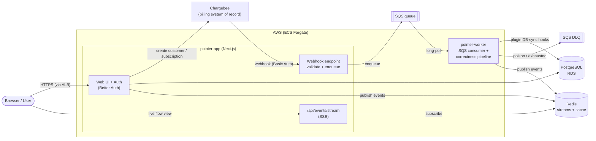
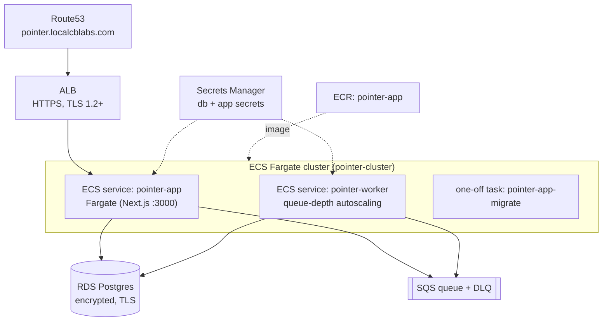

# Pointer — Architecture Overview

This document outlines the high level architecture of the app, including it's tech stack and infrastructure.


## 1. Tech Stack

| Layer | Technology | Role |
| --- | --- | --- |
| Web + API | **Next.js 16** (App Router, standalone build), **React 19** | Renders the UI and hosts all HTTP endpoints |
| Auth | **Better Auth** | Email/password, 2FA, bearer tokens, organizations, admin |
| Billing | **Chargebee** + [@chargebee/better-auth](https://npmx.dev/@chargebee/better-auth) plugin | Customer/subscription lifecycle and webhook sync |
| Primary DB | **PostgreSQL 18** (via `pg` + Kysely) | Users, sessions, orgs, subscription mirror |
| Cache + streams | **Redis 8** (`ioredis`) | Idempotency helpers and the live event stream |
| Async transport | **AWS SQS** (+ DLQ), `sqs-consumer` | Buffers Chargebee webhooks for the worker |
| Background jobs | Standalone Node process (`tsx`) | Consumes SQS and applies DB sync |

---

## 2. Component Diagram



**Reading the diagram**

- **Synchronous path (blue in your head):** the browser hits the app through the ALB.
  Better Auth handles sign-up/sign-in and, on sign-up, calls Chargebee to create a matching
  customer plus an idempotent free subscription. Upgrades and billing-portal actions also go
  straight to Chargebee via the SDK.
- **Asynchronous path:** Chargebee calls back with webhooks. The app endpoint authenticates
  and enqueues them to SQS, then returns `2xx` immediately. The worker picks them up and
  applies changes to Postgres. Once `subscription_created` has established the local
  subscription row, the worker queues a second job to fetch and persist its entitlements.
- **Observation tap:** every meaningful step emits an event onto a Redis stream. The `/flow`
  page subscribes over Server-Sent Events to animate the system live — it is purely for
  demonstration and never on the critical path.

---

## 3. Core Components

### 3.1 `pointer-app` (Next.js)

The single web/API application. It is responsible for:

- **Authentication & accounts** — Better Auth with the organization plugin. Personal accounts
  bill against the user; Team accounts bill against the organization.
- **Chargebee provisioning** — on user creation a Chargebee customer is created (or reused),
  its ID is stored on the `user` row, and an idempotent free subscription is created. The
  dashboard waits for the subscription webhook before opening, then uses free-tier defaults
  while the queued entitlement snapshot finishes loading.
- **Webhook ingress** — the Chargebee webhook endpoint validates HTTP Basic Auth, parses the
  payload, and enqueues it to SQS. It intentionally does **no** database work, so a webhook
  storm can never degrade the web tier.
- **Live event stream** — publishes domain events to a Redis stream and exposes them over SSE
  for the `/flow` visualization.

### 3.2 `pointer-worker` (SQS consumer)

A long-running process that owns all webhook-driven database sync. For each message it runs a
correctness pipeline that the plugin alone can't provide:

```
parse → stale/duplicate guard → dependency pre-check → process
      → verify-after-process → commit versions → ack
```

- **Idempotency without an inbox** — SQS is at-least-once, but the sync hooks are idempotent
  and a `resource_version` guard turns a stale or redelivered event into a no-op.
- **Error handling** — transient/dependency-not-ready errors get an increasing backoff (via
  `ChangeMessageVisibility`) and are left on the queue; after 5 attempts SQS auto-routes them
  to the DLQ. Malformed "poison" messages are sent straight to the DLQ.
- **Scaling** — more load simply means more worker tasks; SQS fans messages out and the
  visibility timeout prevents double-processing. No leader election.
- **Entitlement jobs** — after the subscription-created webhook writes the subscription and
  item rows, the same queue receives a job for its entitlement snapshot. Jobs skip the webhook
  pipeline, since there is no additional Chargebee event to order or verify, but reuse the
  backoff and DLQ.

See [`docs/plans/5-webhook-correctness.md`](docs/plans/5-webhook-correctness.md) for the full rationale.

### 3.3 Data stores

- **PostgreSQL** — the primary store. Better Auth manages the core schema (users, sessions,
  organizations, members) plus the Chargebee plugin's tables and a small
  `chargebee_resource_version` table used for out-of-order protection. Schema changes are
  applied by Better Auth's migration CLI, run as a dedicated one-off task.
- **Redis** — hosts the Redis-Streams event bus for the live flow view and short-lived
  idempotency/cache helpers. It is a best-effort observation tap: if it is down, publishing
  fails silently and the caller is unaffected.

### 3.4 Chargebee

The external billing **system of record**. The app never treats its local Postgres data as
authoritative for billing state — it mirrors Chargebee via webhooks and reconciles using
resource versions. See [`docs/03-chargebee-source-of-truth.md`](docs/03-chargebee-source-of-truth.md).

---

## 4. Infrastructure

Everything is defined as **Terraform** under [`infra/`](infra/) and runs on **AWS**. The stack
is intentionally lean for a proof-of-concept, with production trade-offs documented in the
infra README.



| Area | What runs |
| --- | --- |
| **Network** | `pointer-vpc` (10.20.0.0/16), Internet Gateway, 2 public subnets across 2 AZs |
| **Edge** | ALB (HTTPS only, HTTP→HTTPS redirect); Route53 alias to `pointer.localcblabs.com`; ACM cert looked up |
| **Compute** | ECS Fargate cluster with `pointer-app` (web), `pointer-worker` (webhook consumer), and a short-lived `pointer-app-migrate` task |
| **Images** | ECR repo `pointer-app`; a slim standalone `:latest` for the app, a `builder` image for worker + migrations |
| **Data** | RDS Postgres (`db.t4g.micro`, single-AZ, encrypted at rest, TLS enforced) |
| **Async** | SQS main queue + DLQ (SSE on both, `maxReceiveCount=5`) |
| **Secrets** | Secrets Manager holds DB credentials and app/Chargebee secrets, injected into tasks at start |
| **Logs** | CloudWatch log groups per service (14-day retention) |

**Deploy shape.** A new image is built and pushed to ECR, Better Auth migrations run as a
one-off Fargate task against the new schema, then the `pointer-app` and `pointer-worker`
services are rolled onto the new image.

**Worker autoscaling.** The worker scales on SQS backlog
(`ApproximateNumberOfMessagesVisible`): scale out when the queue is deep, scale in when it
drains, within configurable min/max bounds — so webhook bursts are absorbed without touching
the web tier.

**Security baseline.** Encryption at rest (RDS/SQS/Secrets/ECR) and in transit (ALB TLS 1.2+,
RDS `force_ssl`), security groups that reference each other rather than open CIDRs, RDS not
publicly reachable, and IAM scoped to specific secret and queue ARNs.

---

## 5. Local Development

`docker-compose.yaml` brings up the full dependency set offline:

- **Postgres 18** on `:5432`
- **Redis 8** on `:6379`
- **LocalStack** on `:4566` providing SQS, with the webhook queue + DLQ created on startup
  (mirroring `infra/sqs.tf`)

The app runs with `next dev`, and the worker with `pnpm worker:chargebee`. This mirrors the
production topology closely enough that the same code paths — enqueue, consume, sync — are
exercised end to end without any AWS account.

---

## 6. Where to Go Next

| Topic | Document |
| --- | --- |
| Component boundaries & ports | [`docs/01-architecture.md`](docs/01-architecture.md) |
| Data model | [`docs/02-data-architecture.md`](docs/02-data-architecture.md) |
| Chargebee as source of truth | [`docs/03-chargebee-source-of-truth.md`](docs/03-chargebee-source-of-truth.md) |
| Sequence flows | [`docs/04-sequence-flows.md`](docs/04-sequence-flows.md) |
| Scaling & deployment | [`docs/05-scaling-and-deployment.md`](docs/05-scaling-and-deployment.md) |
| Infrastructure (Terraform) | [`infra/README.md`](infra/README.md) |
