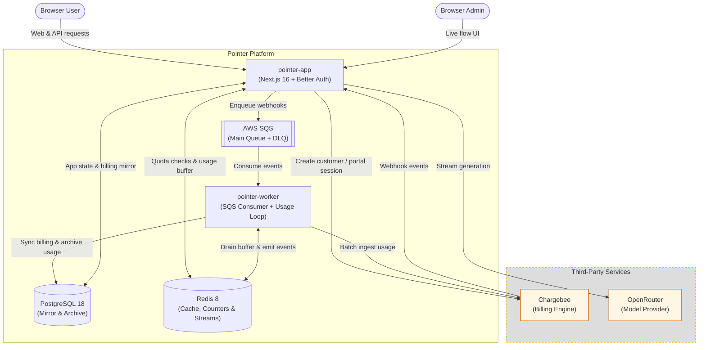
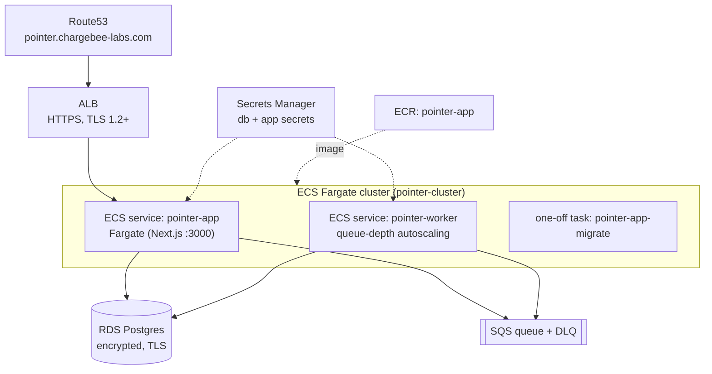

# Pointer — Architecture Overview

Pointer is a reference SaaS application which integrates with Chargebee for subscription billing and OpenRouter for AI text generation.

This document outlines the high level architecture of the app, including it's tech stack and infrastructure.

## Overview




## Tech Stack

| Layer | Technology | Role |
| --- | --- | --- |
| Web + API | **Next.js 16** (App Router, standalone build), **React 19** | Renders the UI and hosts all HTTP endpoints |
| Auth | **Better Auth** | Email/password, 2FA, bearer tokens, organizations, admin |
| Billing | **Chargebee** + [@chargebee/better-auth](https://npmx.dev/@chargebee/better-auth) plugin | Customer/subscription lifecycle and webhook sync |
| Model Provider | **OpenRouter** + `@openrouter/ai-sdk-provider` | External streaming text generation provider |
| Primary DB | **PostgreSQL 18** (via `pg` + Kysely) | Users, sessions, orgs, subscription mirror, usage archive |
| Cache + streams | **Redis 8** (`ioredis`) | Idempotency helpers, usage counters, the usage-event buffer, and the live event stream |
| Async Queue | **AWS SQS** (+ DLQ), `sqs-consumer` | Buffers Chargebee webhooks for the worker |
| Background jobs | Standalone Node process (`tsx`) | Consumes SQS and applies DB sync |

## Components

### 3.1 `pointer-app`

The single web/API application. It is responsible for:

- **Authentication & accounts** — Better Auth with the organization plugin. Personal accounts
  bill against the user; Team accounts bill against the organization.
- **Chargebee provisioning** — on user creation a Chargebee customer is created (or reused),
  its ID is stored on the `user` row, and an idempotent free subscription is created. The
  home page waits for the subscription webhook before opening, then uses free-tier defaults
  while the queued entitlement snapshot finishes loading.
- **Webhook ingress** — the Chargebee webhook endpoint validates HTTP Basic Auth, parses the
  payload, and enqueues it to SQS. It intentionally does **no** database work, so a webhook
  storm can never degrade the web tier.
- **Live event stream** — publishes domain events to a Redis stream and exposes them over SSE
  for the `/admin/flow` visualization.

### 3.2 `pointer-worker`

The worker owns all webhook-driven database sync and can run as either an ECS service (the
default) or an SQS-triggered Lambda function, selected by Terraform's `worker_runtime`
variable. The runtimes are mutually exclusive and consume the same durable queue. Both call
the same per-message correctness pipeline that the plugin alone can't provide:

```
parse → stale/duplicate guard → dependency pre-check → process
      → verify-after-process → commit versions → ack
```

- **Idempotency without an inbox** — SQS is at-least-once, but the sync hooks are idempotent
  and a `resource_version` guard turns a stale or redelivered event into a no-op.
- **Error handling** — transient/dependency-not-ready errors get an increasing backoff (via
  `ChangeMessageVisibility`) and are left on the queue; after 5 attempts SQS auto-routes them
  to the DLQ. Malformed "poison" messages are sent straight to the DLQ.
- **Scaling** — ECS scales tasks from queue-depth alarms. Lambda uses a bounded SQS event
  source concurrency so its warm connection pools cannot overwhelm PostgreSQL or Redis.
  SQS visibility prevents simultaneous processing; no leader election is required.
- **Lambda batches** — partial batch responses retry only failed records. A cold Lambda loads
  the existing application and database secrets from Secrets Manager before constructing the
  Better Auth processor; warm environments reuse the processor and connection pools.
- **Networking** — Lambda runs in private subnets for RDS/Redis and reaches Chargebee and AWS
  APIs through a NAT gateway. The POC uses one NAT; production should use one per AZ.
- **Entitlement jobs** — after the subscription-created webhook writes the subscription and
  item rows, the same queue receives a job for its entitlement snapshot. Jobs skip the webhook
  pipeline, since there is no additional Chargebee event to order or verify, but reuse the
  backoff and DLQ.
- **Usage flush** — a second loop drains the Redis usage buffer into Postgres and then
  Chargebee, up to 500 events per pass (Chargebee's batch ceiling). Both sinks are fed from
  one pass rather than a second consumer group, because settling an entry deletes it from the
  stream: whichever group acknowledged first would take it away from the other. A failed
  Postgres write abandons the pass without acknowledging anything, since history is the read
  path and a silent gap would be visible to the subscriber. It rides this process rather than
  a service of its own: the work is a periodic drain and this is already a long-running task in the VPC
  with a Redis connection. Redis consumer groups spread entries across however many tasks
  autoscaling creates, so no leader election is needed — the same property SQS provides for
  webhooks. The loop requires the ECS runtime; `lib/usage/flush.ts` is runtime-agnostic so a
  scheduled Lambda could drive it instead.

See [`docs/plans/5-webhook-correctness.md`](docs/plans/5-webhook-correctness.md) for the full rationale.

### 3.3 Data stores

- **PostgreSQL** — the primary store. Better Auth manages the core schema (users, sessions,
  organizations, members) plus the Chargebee plugin's tables and a small
  `chargebee_resource_version` table used for out-of-order protection. Schema changes are
  applied by Better Auth's migration CLI, run as a dedicated one-off task.
  It also holds `usage_event`, the durable usage archive. That table is range-partitioned by
  ISO week so a period's worth of history is a handful of contiguous partitions and ageing
  data can be dropped by detaching one; `pg_cron` provisions the coming fortnight's
  partitions nightly, with a `DEFAULT` partition catching anything it misses. A single
  unique index on `("subscriptionId", "usageTimestamp", "deduplicationId")` does double duty
  — it is the history query's range scan and the conflict target that makes the flush loop's
  at-least-once replay a no-op — so the write path pays for exactly one index. The CLI cannot
  express partitioning, so `lib/usage/partitions.ts` owns that DDL while
  `plugins/usage-plugin.ts` keeps the columns under CLI management.
- **Redis** — hosts the Redis-Streams event bus for the live flow view, the quota and rate
  counters, and the usage-event buffer awaiting its next Chargebee batch. The event bus is a
  best-effort observation tap: if it is down, publishing fails silently and the caller is
  unaffected. The usage buffer is held to a higher bar — it is read through a consumer group
  so an unacknowledged batch survives a worker crash — but it is not as durable as SQS. A node
  loss drops at most one flush interval of events. Production should enable AOF or add a
  replica; the POC runs a single `cache.t4g.micro`.

### 3.4 Chargebee

The external billing **system of record**. The app never treats its local Postgres data as
authoritative for billing state — it mirrors Chargebee via webhooks and reconciles using
resource versions. See [`docs/03-chargebee-source-of-truth.md`](docs/03-chargebee-source-of-truth.md).


## 4. Infrastructure

Everything is defined as **Terraform** under [`infra/`](infra/) and runs on **AWS**. The stack
is intentionally lean for a proof-of-concept, with production trade-offs documented in the
infra README.



| Area | What runs |
| --- | --- |
| **Network** | `pointer-vpc` (10.20.0.0/16), Internet Gateway, 2 public subnets across 2 AZs |
| **Edge** | ALB (HTTPS only, HTTP→HTTPS redirect); Route53 alias to `pointer.chargebee-labs.com`; ACM cert looked up |
| **Compute** | ECS Fargate cluster with `pointer-app` (web), `pointer-worker` (webhook consumer), and a short-lived `pointer-app-migrate` task |
| **Images** | ECR repo `pointer-app`; a slim standalone `:latest` for the app, a `builder` image for worker + migrations |
| **Data** | RDS Postgres (`db.t4g.micro`, single-AZ, encrypted at rest, TLS enforced) |
| **Async** | SQS main queue + DLQ (SSE on both, `maxReceiveCount=5`) |
| **Secrets** | Secrets Manager holds DB credentials and app/Chargebee secrets, injected into tasks at start |
| **Logs** | CloudWatch log groups per service (14-day retention) |

**Deployment:** A new image is built and pushed to ECR, Better Auth migrations run as a one-off Fargate task against the new schema, then the `pointer-app` and `pointer-worker` services are rolled onto the new image.

**Autoscaling:** The worker scales on SQS backlog(`ApproximateNumberOfMessagesVisible`): scale out when the queue is deep, scale in when it drains, within configurable min/max bounds — so webhook bursts are absorbed without touching the web tier.

**Security** Encryption at rest (RDS/SQS/Secrets/ECR) and in transit (ALB TLS 1.2+, RDS `force_ssl`), security groups that reference each other rather than open CIDRs, RDS not publicly reachable, and IAM scoped to specific secret and queue ARNs.
