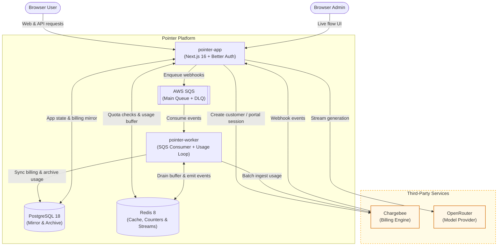
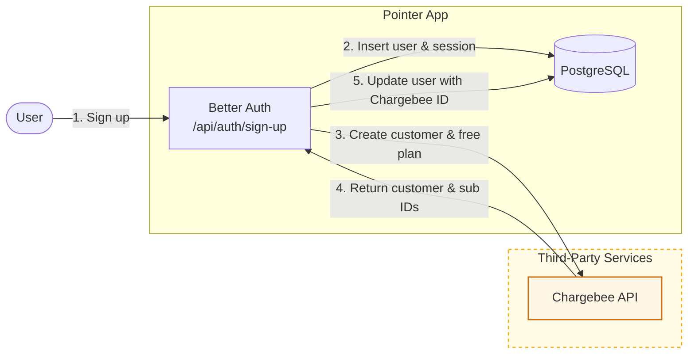
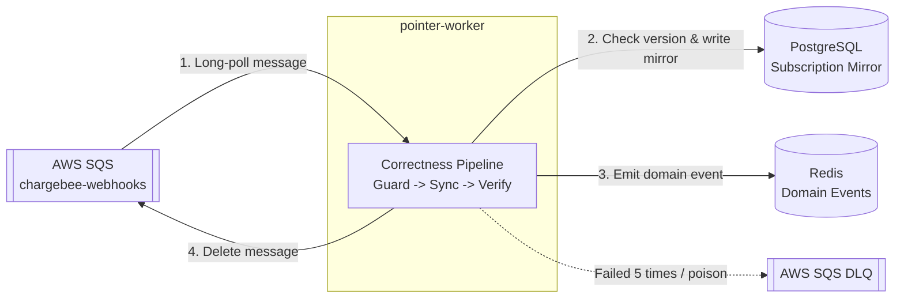
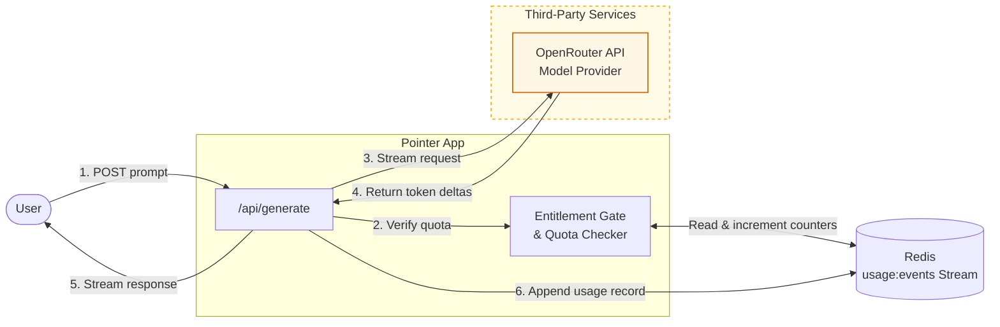
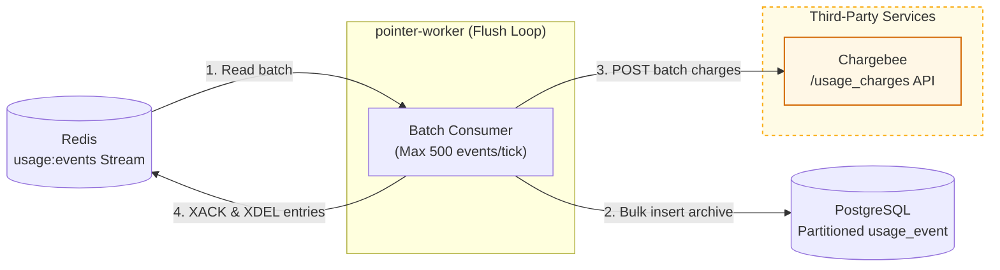
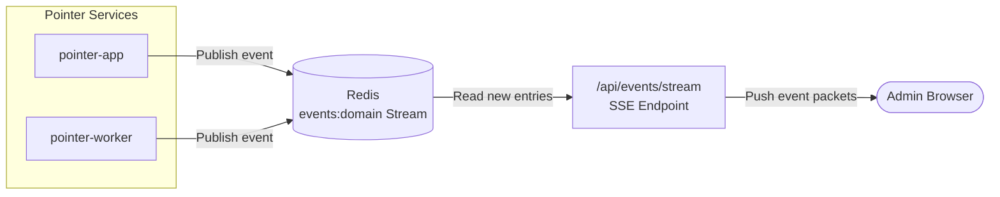

# Pointer — Architecture Overview

Pointer is a reference SaaS application that integrates with Chargebee for subscription billing and OpenRouter for AI text generation.

This document details the system architecture, component boundaries, core task flows, infrastructure design, and local development setup.

## 1. System Context

Pointer connects browser clients, background processing pipelines, and third-party APIs across well-defined network boundaries.


```mermaid
flowchart TB
  User([Browser User])
  Admin([Browser Admin])

  subgraph Platform["Pointer Platform"]
    App["pointer-app<br/>(Next.js 16 + Better Auth)"]
    Worker["pointer-worker<br/>(SQS Consumer + Usage Loop)"]
    Queue[["AWS SQS<br/>(Main Queue + DLQ)"]]
    PG[("PostgreSQL 18<br/>(Mirror & Archive)")]
    Redis[("Redis 8<br/>(Cache, Counters & Streams)")]
  end

  subgraph ThirdParty["Third-Party Services"]
    CB["Chargebee<br/>(Billing Engine)"]
    OR["OpenRouter<br/>(Model Provider)"]
  end

  style ThirdParty fill:#fffbe6,stroke:#faad14,stroke-width:1.5px,stroke-dasharray: 4 4
  style CB fill:#fff7e6,stroke:#d46b08,stroke-width:1.5px
  style OR fill:#fff7e6,stroke:#d46b08,stroke-width:1.5px

  User -->|Web & API requests| App
  Admin -->|Live flow UI| App
  App -->|Create customer / portal session| CB
  CB -->|Webhook events| App
  App -->|Enqueue webhooks| Queue
  Queue -->|Consume events| Worker
  Worker -->|Sync billing & archive usage| PG
  Worker -->|Batch ingest usage| CB
  App -->|Stream generation| OR
  App <-->|App state & billing mirror| PG
  App <-->|Quota checks & usage buffer| Redis
  Worker <-->|Drain buffer & emit events| Redis
```

## 2. Tech Stack

| Layer | Technology | Role |
| --- | --- | --- |
| Web & API | **Next.js 16** (App Router), **React 19** | Hosts user interface, auth routes, and generation endpoints |
| Auth | **Better Auth** | Email/password, 2FA, session tokens, and organizations |
| Third-Party Billing | **Chargebee** + `@chargebee/better-auth` | Customer records, subscription lifecycle, and customer portal |
| Third-Party Models | **OpenRouter** + `@openrouter/ai-sdk-provider` | External streaming text generation provider |
| Primary Database | **PostgreSQL 18** (`pg` + Kysely) | Users, accounts, subscription mirror, and partitioned usage archive |
| Cache & Streams | **Redis 8** (`ioredis`) | Quota counters, usage-event buffer, and live event bus |
| Async Queue | **AWS SQS** (+ DLQ), `sqs-consumer` | Buffers incoming Chargebee webhooks and entitlement sync jobs |
| Background Worker | Standalone Node process (`tsx`) or Lambda | Consumes SQS webhooks and runs periodic usage flush passes |

## 3. Platform Components

### 3.1 `pointer-app`

The web and API service is responsible for:

- **Authentication and accounts**: Better Auth with the organization plugin. Personal accounts bill against the individual user; team accounts bill against the organization.
- **Chargebee provisioning**: On user creation, a Chargebee customer record is created (or reused), its ID is recorded on the `user` table, and an idempotent free subscription is provisioned with `billing_cycles: 0`. The home page waits for the initial subscription webhook before rendering, using free-tier defaults while the queued entitlement snapshot completes.
- **Webhook ingress**: The Chargebee webhook endpoint verifies HTTP Basic Auth, parses payloads, and immediately pushes them to AWS SQS. It executes no database operations, preventing webhook traffic spikes from exhausting connection pools or slowing HTTP requests.
- **Live event stream**: Publishes domain events to a Redis stream, exposed via Server-Sent Events (SSE) for the `/admin/flow` diagnostic visualization.

### 3.2 `pointer-worker`

The worker owns all webhook-driven database synchronization and periodic background tasks. It can run as either an ECS Fargate service (the default) or an SQS-triggered Lambda function, configured by Terraform's `worker_runtime` variable. Both runtimes execute the same message pipeline:

```
parse -> stale/duplicate guard -> dependency pre-check -> process -> verify-after-process -> commit versions -> ack
```

- **Idempotency without an inbox**: SQS delivers messages with at-least-once guarantees. The worker uses a `chargebee_resource_version` table to guard against out-of-order or duplicate updates. Stale events turn into immediate no-ops.
- **Error handling**: Transient errors and missing dependencies trigger a visibility timeout increase (`ChangeMessageVisibility`) so the message remains in the queue for later redelivery. SQS moves the message to the DLQ after 5 failed attempts. Malformed poison messages route to the DLQ immediately.
- **Scaling**: Under ECS, tasks scale horizontally on queue depth alarms (`ApproximateNumberOfMessagesVisible`). Under Lambda, SQS event source concurrency is capped to protect database and Redis connection pools. SQS message visibility prevents concurrent processing of the same message without requiring leader election.
- **Lambda batching**: Lambda partial batch responses acknowledge successful records while retrying only failed entries. Warm instances reuse database connection pools and the initialized Better Auth processor.
- **Networking**: Worker tasks run in private subnets with direct access to RDS and Redis. Outbound traffic to Chargebee and AWS APIs routes through a NAT gateway.
- **Entitlement sync jobs**: After the subscription-created webhook updates the subscription mirror, an entitlement snapshot job is queued to the same SQS queue. These jobs bypass webhook version guards while sharing the same retry, backoff, and DLQ infrastructure.
- **Usage flush loop**: In the ECS runtime, a second loop drains usage records from the Redis buffer into PostgreSQL and flushes batches to Chargebee (up to 500 events per pass). Both sinks are populated in a single pass before acknowledging the Redis stream. If the PostgreSQL insert fails, the loop halts without acknowledging Redis, preventing gaps in audit history.

### 3.3 Data Stores

- **PostgreSQL 18**: Primary application datastore. Better Auth manages the core schema (users, sessions, organizations, members), Chargebee plugin tables, and `chargebee_resource_version`. Migrations run as a dedicated one-off task during deployments.
  
The `usage_event` table stores the durable usage archive, range-partitioned by ISO week. Weekly partitioning allows dropping aged billing periods cleanly without vacuum overhead. The `pg_cron` extension provisions future partitions nightly, while a `DEFAULT` partition catches unexpected timestamps. A composite unique index on `("subscriptionId", "usageTimestamp", "deduplicationId")` serves both range scan queries and conflict targets for idempotent batch inserts. Partition DDL is managed in `lib/usage/partitions.ts`.

- **Redis 8**: Hosts the event stream for live flow diagnostics, rate and quota counters, and the usage-event buffer awaiting batch ingestion. The diagnostic event bus is best-effort: connection drops fail silently without impacting caller requests. The usage buffer uses consumer groups so unacknowledged batches survive task crashes.

### 3.4 Chargebee

Chargebee is the external billing system of record. Pointer never treats local PostgreSQL tables as authoritative for billing status. Local tables act as a read mirror updated via webhooks and validated against `resource_version`.

## 4. Core Task Flows

### 4.1 User Sign-Up & Subscription Flow

When a user registers:
1. Better Auth creates the user and session in PostgreSQL.
2. The Chargebee plugin calls the Chargebee API to create a customer record.
3. Pointer creates an idempotent free subscription with `billing_cycles: 0`.
4. PostgreSQL stores the Chargebee customer identifier on the user record.


```mermaid
flowchart LR
  User([User])
  subgraph App["Pointer App"]
    Auth["Better Auth<br/>/api/auth/sign-up"]
    PG[("PostgreSQL")]
  end
  subgraph ThirdParty["Third-Party Services"]
    CB["Chargebee API"]
  end

  style ThirdParty fill:#fffbe6,stroke:#faad14,stroke-width:1.5px,stroke-dasharray: 4 4
  style CB fill:#fff7e6,stroke:#d46b08,stroke-width:1.5px

  User -->|1. Sign up| Auth
  Auth -->|2. Insert user & session| PG
  Auth -->|3. Create customer & free plan| CB
  CB -->|4. Return customer & sub IDs| Auth
  Auth -->|5. Update user with Chargebee ID| PG
```

### 4.2 Webhook Ingestion Flow

Chargebee notifies Pointer of billing events via HTTP POST. The webhook endpoint performs zero database operations:
1. Endpoint verifies Basic Auth credentials and signatures.
2. Endpoint sends the raw event to AWS SQS.
3. App returns HTTP 200 immediately (~30ms).

```mermaid
flowchart LR
  subgraph ThirdParty["Third-Party Services"]
    CB["Chargebee"]
  end
  subgraph App["Pointer App"]
    Endpoint["/api/auth/[...all]<br/>Webhook Receiver"]
  end
  Queue[["AWS SQS<br/>chargebee-webhooks"]]

  style ThirdParty fill:#fffbe6,stroke:#faad14,stroke-width:1.5px,stroke-dasharray: 4 4
  style CB fill:#fff7e6,stroke:#d46b08,stroke-width:1.5px

  CB -->|1. POST webhook event| Endpoint
  Endpoint -->|2. Validate & enqueue payload| Queue
  Endpoint -->|3. Return 200 OK (~30ms)| CB
```

### 4.3 Asynchronous Webhook Processing Flow

The background worker consumes events from SQS and applies them to PostgreSQL:
1. Worker long-polls messages from SQS.
2. Stale guard checks `chargebee_resource_version`. Older or duplicate versions are skipped.
3. Worker applies changes to local PostgreSQL tables inside a transaction.
4. For new subscriptions, an entitlement refresh job is queued to the same SQS queue.
5. On success, the worker deletes the message from SQS. Poison messages route to the DLQ after 5 retries.


```mermaid
flowchart LR
  Queue[["AWS SQS<br/>chargebee-webhooks"]]
  DLQ[["AWS SQS DLQ"]]
  subgraph Worker["pointer-worker"]
    Pipeline["Correctness Pipeline<br/>Guard -> Sync -> Verify"]
  end
  PG[("PostgreSQL<br/>Subscription Mirror")]
  Redis[("Redis<br/>Domain Events")]

  Queue -->|1. Long-poll message| Pipeline
  Pipeline -->|2. Check version & write mirror| PG
  Pipeline -->|3. Emit domain event| Redis
  Pipeline -->|4. Delete message| Queue
  Pipeline -.->|Failed 5 times / poison| DLQ
```

### 4.4 Text Generation & Metering Flow

When an authenticated user requests text generation:
1. The application resolves entitlement limits and checks quota counters in Redis.
2. The request streams directly from OpenRouter API using `@openrouter/ai-sdk-provider`.
3. Output tokens stream to the user. If quota runs out mid-stream, the connection closes cleanly.
4. Finished generation appends a usage record to the Redis `usage:events` stream.


```mermaid
flowchart LR
  User([User])
  subgraph App["Pointer App"]
    Route["/api/generate"]
    Gate["Entitlement Gate<br/>& Quota Checker"]
  end
  subgraph ThirdParty["Third-Party Services"]
    OR["OpenRouter API<br/>Model Provider"]
  end
  Redis[("Redis<br/>usage:events Stream")]

  style ThirdParty fill:#fffbe6,stroke:#faad14,stroke-width:1.5px,stroke-dasharray: 4 4
  style OR fill:#fff7e6,stroke:#d46b08,stroke-width:1.5px

  User -->|1. POST prompt| Route
  Route -->|2. Verify quota| Gate
  Gate <-->|Read & increment counters| Redis
  Route -->|3. Stream request| OR
  OR -->|4. Return token deltas| Route
  Route -->|5. Stream response| User
  Route -->|6. Append usage record| Redis
```

### 4.5 Asynchronous Usage Batch Flush Flow

The worker periodically drains usage records from the Redis stream:
1. Reads up to 500 entries per batch using a Redis consumer group.
2. Inserts the batch into weekly-partitioned PostgreSQL table `usage_event` (`ON CONFLICT DO NOTHING`).
3. Sends the batch to Chargebee's `/usage_charges` endpoint using idempotency keys.
4. Acknowledges and removes processed entries from Redis.


```mermaid
flowchart LR
  Redis[("Redis<br/>usage:events Stream")]
  subgraph Worker["pointer-worker (Flush Loop)"]
    Batch["Batch Consumer<br/>(Max 500 events/tick)"]
  end
  PG[("PostgreSQL<br/>Partitioned usage_event")]
  subgraph ThirdParty["Third-Party Services"]
    CB["Chargebee<br/>/usage_charges API"]
  end

  style ThirdParty fill:#fffbe6,stroke:#faad14,stroke-width:1.5px,stroke-dasharray: 4 4
  style CB fill:#fff7e6,stroke:#d46b08,stroke-width:1.5px

  Redis -->|1. Read batch| Batch
  Batch -->|2. Bulk insert archive| PG
  Batch -->|3. POST batch charges| CB
  Batch -->|4. XACK & XDEL entries| Redis
```

### 4.6 Live Event Stream Flow (Admin Flow View)

Administrators view events in real time at `/admin/flow`:
1. The app and worker publish non-blocking domain events to Redis.
2. The `/api/events/stream` route opens a Server-Sent Events (SSE) connection.
3. The browser listens to the SSE stream and highlights active nodes on the canvas.


```mermaid
flowchart LR
  subgraph Producers["Pointer Services"]
    App["pointer-app"]
    Worker["pointer-worker"]
  end
  Redis[("Redis<br/>events:domain Stream")]
  SSE["/api/events/stream<br/>SSE Endpoint"]
  Admin([Admin Browser])

  App -->|Publish event| Redis
  Worker -->|Publish event| Redis
  Redis -->|Read new entries| SSE
  SSE -->|Push event packets| Admin
```

## 5. Architecture Decisions & Anti-Patterns Avoided

### 5.1 No Database Writes in Webhook Endpoint

Handling database mutations directly inside webhook handlers risks exhausting database connection pools during traffic spikes and stalling concurrent user requests. Pointer's webhook route only verifies credentials and publishes the raw payload to AWS SQS in roughly 30ms, letting background workers process updates at a steady rate.

### 5.2 Resource Versioning Instead of an Inbox Table

Maintaining a dedicated inbox table of processed webhook IDs adds a synchronous database round trip to every message and grows indefinitely. Pointer relies on idempotent handlers guarded by the `chargebee_resource_version` table. If a duplicate or out-of-order event arrives with an older version, the worker drops it immediately as a no-op.

### 5.3 Chargebee as Billing System of Record

Treating local application tables as the primary billing authority leads to drift whenever webhooks fail, queue up, or arrive out of sequence. Chargebee remains the authoritative system of record. Local PostgreSQL tables serve as a read mirror that stays current through webhooks and periodic reconciliation.

### 5.4 Partitioned Database for Usage History

Querying Chargebee's API whenever a customer opens a billing dashboard introduces latency and quickly burns through upstream rate limits. Instead, Redis handles sub-millisecond live quota checks, while PostgreSQL stores historical records in the `usage_event` table partitioned by ISO week. Account dashboards query this local table directly.

### 5.5 Single-Pass Flush for Two Sinks

Splitting the usage stream between two independent Redis consumer groups creates a race condition: acknowledging an entry deletes it from the stream (`XDEL`), starving whichever consumer runs slower. Pointer uses a single worker loop that writes to PostgreSQL first, flushes to Chargebee second, and acknowledges the Redis stream only after both operations succeed.
