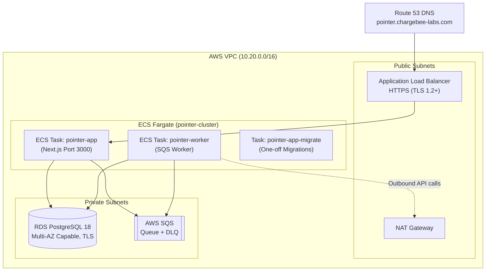

# Pointer Infrastructure

The production environment runs on **AWS** managed via Terraform under [`infra/`](infra/).

| Area | Component | Configuration |
| --- | --- | --- |
| Edge | Route 53 + ALB | ACM SSL certificate, TLS 1.2+, HTTP to HTTPS redirect |
| Compute | AWS ECS Fargate | `pointer-app` (web), `pointer-worker` (worker), and migration task |
| Worker Scaling | ECS CloudWatch Alarm | Autoscales based on SQS `ApproximateNumberOfMessagesVisible` |
| Database | AWS RDS PostgreSQL 18 | `db.t4g.micro`, encrypted at rest, TLS enforced (`force_ssl`) |
| Queue | AWS SQS | Main queue + DLQ (`maxReceiveCount = 5`), server-side encryption |
| Secrets | AWS Secrets Manager + KMS | DB credentials, Chargebee keys, and application secrets |

## Deployment Lifecycle

Deployments build and push new container images to Amazon ECR. Better Auth schema migrations run as a one-off Fargate task (`pointer-app-migrate`) against the target database before services roll over. Once migrations complete, `pointer-app` and `pointer-worker` update to the new image via rolling deployments.

## Worker Autoscaling

The worker service scales on SQS queue backlog (`ApproximateNumberOfMessagesVisible`). When queue depth rises during webhook bursts, additional worker tasks launch to absorb the load. When the queue drains, tasks scale in down to the configured minimum bound, protecting the web tier from processing backlog.

## Network and Data Security

- **Encryption**: Data is encrypted at rest across RDS, SQS, Secrets Manager, and ECR. Transport encryption uses TLS 1.2+ on the ALB and SSL enforcement on RDS (`force_ssl`).
- **Network isolation**: Application and worker tasks run in private subnets. RDS and Redis instances are inaccessible from the public internet. Security groups reference each other directly rather than exposing open CIDR blocks.
- **Least privilege IAM**: Task roles are scoped to explicit Secrets Manager and SQS ARNs, preventing unauthorized access across services.

## Scaling

## Deploying in other public clouds

The following table shows the AWS equivalent services for GCP and Azure if the app is to be deployed in those clouds. Note that the Terraform definitions have to be rewritten as the provided `infra` is specific to AWS.

| AWS | GCP | Azure |
| --- | --- | --- |
| Amazon EC2 | Compute Engine | Azure Virtual Machines |
| AWS Lambda | Cloud Run functions | Azure Functions |
| Amazon ECS with AWS Fargate | Cloud Run | Azure Container Apps |
| Amazon ECR | Artifact Registry | Azure Container Registry |
| Amazon VPC | Virtual Private Cloud | Azure Virtual Network |
| AWS NAT Gateway | Cloud NAT | Azure NAT Gateway |
| Elastic Load Balancing (Application Load Balancer) | Cloud Load Balancing | Azure Application Gateway |
| Amazon Route 53 | Cloud DNS | Azure DNS |
| AWS Certificate Manager | Certificate Manager | Key Vault Certificates |
| Amazon RDS for PostgreSQL | Cloud SQL for PostgreSQL | Azure Database for PostgreSQL |
| Amazon ElastiCache for Redis | Memorystore for Redis | Azure Managed Redis |
| Amazon SQS | Pub/Sub | Azure Service Bus queues |
| Amazon SNS | Pub/Sub | Azure Service Bus topics |
| AWS Secrets Manager | Secret Manager | Azure Key Vault |
| AWS KMS | Cloud Key Management Service | Azure Key Vault |
| Amazon CloudWatch | Cloud Monitoring and Cloud Logging | Azure Monitor |
| AWS IAM | Cloud IAM | Microsoft Entra ID and Azure RBAC |
| Amazon S3 | Cloud Storage | Azure Blob Storage |
