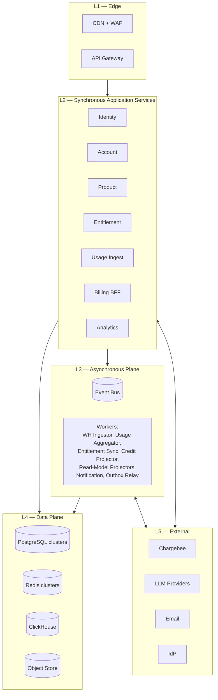
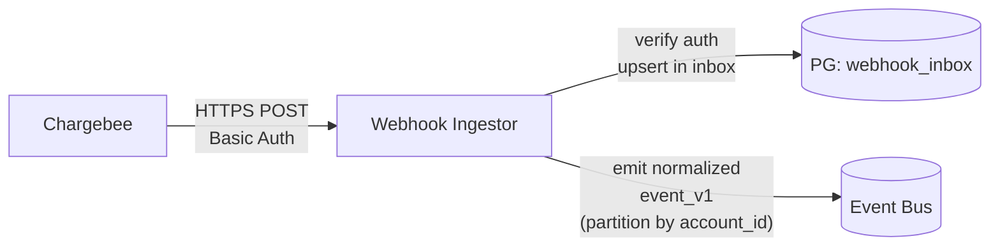
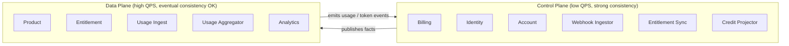

# 01 — Architecture

This document zooms into the headline diagram in `[README.md](../README.md)` and specifies the
**boundaries, ports, and interactions** of every component. It is normative for an
implementation agent: name, responsibility, and direction of dependency must be preserved.

The platform is an AI product (see `[07-product-and-entitlements.md](07-product-and-entitlements.md)`)
with a two-level identity model:

- `**user_id`** — auth identity, partition key for product data.
- `**account_id`** — billing subject, partition key for entitlements & quotas. 1:1 with a Chargebee customer.

Every authenticated request carries both in the JWT (`sub`, `acc`).

---

## 1. Layered View




**Cross-layer rules**

- L1 → L2 is the only synchronous client path.
- L2 services may call other L2 services **only via the API gateway / service mesh** (no direct DB access across services).
- L2 → L3 is fire-and-forget via the bus, except for synchronous billing operations against Chargebee.
- L3 → L4 is the only path that performs heavy writes/reads to ClickHouse.
- L5 (Chargebee) is reached **only** by Billing BFF (sync) and the Webhook Ingestor (async). LLM providers are reached **only** by Product Services (and only with valid entitlements).

---

## 2. Service Catalog

Each service is **stateless**, **horizontally scalable**, **owns its data**, and exposes only
the ports listed below. Every service speaks JSON over HTTPS and emits/consumes versioned
domain events.

### 2.1 Identity Service


| Aspect           | Detail                                                                                                           |
| ---------------- | ---------------------------------------------------------------------------------------------------------------- |
| Purpose          | User lifecycle: identity, authentication, profile, session issuance                                              |
| Sync API (in)    | `POST /signup`, `POST /login`, `POST /token/refresh`, `POST /sso/callback`, `GET /me`, `PATCH /me`, `DELETE /me` |
| Async events out | `user.signed_up.v1`, `user.email_verified.v1`, `user.profile_changed.v1`, `user.deleted.v1`                      |
| Stores           | `PG_Identity` (users, credentials, MFA, profile, shard map), `Redis_Hot` (sessions, refresh-token denylist)      |
| External         | OIDC/SAML IdPs (per-account SSO honoured for Team/Enterprise)                                                    |
| Owns             | `users`, `credentials`, `mfa_factors`, `sessions`, `logical_shard_map`                                           |


The Identity Service is the canonical source of `user_id`. It mints user IDs as time-ordered
UUIDs (UUIDv7 or equivalent) and is the only writer to the user record. SSO routing, when
enabled for an account, hooks into the login flow via the Account Service.

### 2.2 Account Service


| Aspect           | Detail                                                                                                                                                                                                                                                         |
| ---------------- | -------------------------------------------------------------------------------------------------------------------------------------------------------------------------------------------------------------------------------------------------------------- |
| Purpose          | Account (billing subject) lifecycle, members, roles, invitations                                                                                                                                                                                               |
| Sync API (in)    | `POST /accounts` (Team/Enterprise), `GET /me/accounts`, `POST /accounts/{id}/switch` (re-mints JWT with `acc` claim), `POST /accounts/{id}/invitations`, `POST /invitations/{token}/accept`, `DELETE /accounts/{id}/members/{user_id}`, `PATCH /accounts/{id}` |
| Async events out | `account.created.v1`, `account.member_added.v1`, `account.member_removed.v1`, `account.deleted.v1`                                                                                                                                                             |
| Async events in  | `user.signed_up.v1` (auto-create Personal Account), `subscription.activated.v1` (mirror plan_tier), `account.member_added.v1` (enforce seat cap)                                                                                                               |
| Stores           | `PG_Identity` (accounts, account_members, invitations)                                                                                                                                                                                                         |
| Owns             | `accounts` (writes for Team/Enterprise lifecycle), `account_members`, `account_invitations`                                                                                                                                                                    |


> **Identity ↔ Account ownership exception (deliberate):** every user must have a Personal
> Account at sign-up — the user record can't exist without one. To preserve this invariant
> atomically, **the Identity Service is permitted to write the Personal Account row in the
> same transaction as the user**, even though `accounts` is normally an Account-Service
> table. This is the only cross-service write in the architecture and exists because both
> services share `pg-identity`. All other account writes (Team/Enterprise creation, member
> changes, invitations) are owned exclusively by the Account Service.

### 2.3 Product Services (1..N)


| Aspect           | Detail                                                                           |
| ---------------- | -------------------------------------------------------------------------------- |
| Purpose          | The actual AI product features (chat, code, completions, agents, integrations)   |
| Sync API (in)    | Domain-specific REST/GraphQL                                                     |
| Async events out | `product.{domain}.{verb}.v1`                                                     |
| Stores           | `PG_Product` (sharded by `user_id`), `Redis_Hot` (caches), `ObjectStore` (blobs) |
| Calls            | Entitlement Service (per-action), Usage Ingest (per-action), LLM providers       |
| Owns             | All product-domain tables                                                        |


> **Decomposition rule:** every product service is a separate bounded context. Cross-context
> reads use events or a thin RPC; never a foreign-key into another service's database.

### 2.4 Entitlement Service


| Aspect         | Detail                                                                                                                                                             |
| -------------- | ------------------------------------------------------------------------------------------------------------------------------------------------------------------ |
| Purpose        | Sub-millisecond "can this user (in this account context) do this thing now?"                                                                                       |
| Sync API (in)  | `GET /entitlements/{account_id}`, `POST /entitlements/{account_id}/check` (batched), `POST /entitlements/{account_id}/consume` (token+credit decision in one call) |
| Stores         | `Redis_Hot` (authoritative read cache), `PG_Billing` (durable read model)                                                                                          |
| Reads from     | `Redis_Hot` first; PG fallback on miss; never Chargebee directly                                                                                                   |
| Updated by     | `EntitlementSyncWorker` and `CreditProjector`                                                                                                                      |
| Latency budget | p50 < 1 ms, p99 < 5 ms (in-cluster)                                                                                                                                |


The entitlement model is the **flat materialized view** of Chargebee's plan / item / feature
graph plus per-subscription overrides plus credit ledger balance. See
`[07-product-and-entitlements.md](07-product-and-entitlements.md)`.

### 2.5 Usage Ingest Service


| Aspect           | Detail                                                                    |
| ---------------- | ------------------------------------------------------------------------- |
| Purpose          | Capture token usage, API call events, and product analytics events        |
| Sync API (in)    | `POST /usage/events` (single + batch), idempotent on `event_id`           |
| Async events out | `usage.event.v1` to bus (partitioned by `account_id`)                     |
| Stores           | `Redis_Hot` (idempotency keys, short TTL), bus only — no OLTP write here  |
| Latency budget   | p99 < 20 ms; the service is *write-only* and does not block product flows |


Token usage is a special case: the Product Service emits a `usage.event.v1` per LLM call with
`{input_tokens, output_tokens, model_id, account_id, user_id, latency_ms, cost_usd}`. The
Usage Aggregator turns this into ClickHouse rows + Chargebee `usages_for_item` pushes for
Enterprise per-token metering, and into credit-ledger debits when an account is in overage.

### 2.6 Billing BFF (Backend-for-Frontend)


| Aspect           | Detail                                                                                                                                                                                      |
| ---------------- | ------------------------------------------------------------------------------------------------------------------------------------------------------------------------------------------- |
| Purpose          | The only service that writes to Chargebee. All checkout/portal/plan-change/credit-purchase flows go through it.                                                                             |
| Sync API (in)    | `POST /billing/checkout-session`, `POST /billing/portal-session`, `GET /billing/plans`, `POST /billing/subscriptions/{id}/change`, `POST /billing/credit-packs/purchase`, `GET /billing/me` |
| Async events out | `billing.checkout_started.v1`, `billing.subscription_change_requested.v1`, `billing.credit_pack_purchased.v1`                                                                               |
| Async events in  | `account.created.v1` (provisions Chargebee customer + free subscription)                                                                                                                    |
| Stores           | `PG_Billing` (read model only)                                                                                                                                                              |
| External         | Chargebee (sync, via official SDK)                                                                                                                                                          |
| Notes            | Holds idempotency keys for Chargebee mutations in `Redis_Hot`                                                                                                                               |


### 2.7 Notification Service


| Aspect          | Detail                                                                                                                                    |
| --------------- | ----------------------------------------------------------------------------------------------------------------------------------------- |
| Purpose         | Email, in-app, outbound webhooks                                                                                                          |
| Async events in | `user.signed_up.v1`, `account.member_added.v1`, `subscription.`*, `invoice.`*, `usage.threshold_crossed.v1`, `account.invitation_sent.v1` |
| Stores          | `PG` for templates + delivery log, `Redis` for rate limit per recipient                                                                   |
| External        | Email provider                                                                                                                            |


### 2.8 Analytics Service


| Aspect        | Detail                                                                                              |
| ------------- | --------------------------------------------------------------------------------------------------- |
| Purpose       | User-facing usage dashboards, admin/team usage reports, internal product analytics, finance reports |
| Sync API (in) | `GET /analytics/usage?account_id=...&from=...&to=...`, `GET /analytics/team/{account_id}/breakdown` |
| Stores        | `ClickHouse` (primary), `PG_Billing` for joining billing dimensions                                 |
| Notes         | Read-only; never the producer of events                                                             |


---

## 3. Async Workers

Workers are **stateless consumers** of the event bus. They are scaled by partition count.

### 3.1 Chargebee Webhook Ingestor




- Validates Chargebee Basic Auth credentials (`secrets.compare_digest`).
- Stores raw payload + Chargebee `event.id` in `webhook_inbox` (PK `event.id`) — duplicates dropped.
- Recovers `account_id` from the Chargebee customer's `cf_account_id` field; this is the bus partition key.

### 3.2 Usage Aggregator

- Consumes `usage.event.v1` from the bus.
- Writes raw events to ClickHouse `usage_events` (append-only, batched inserts).
- Maintains rolling rollups (per minute, per hour, per day) in ClickHouse `usage_rollup_*`.
- For Enterprise plans with metered pricing, periodically pushes per-subscription token usage to Chargebee via `usages_for_item` (idempotent per period).

### 3.3 Entitlement Sync Worker

- Consumes Chargebee-derived events: `subscription.activated|cancelled|changed`, `entitlement.changed`, `subscription.entitlement_overridden`.
- Recomputes the flat entitlement set for the affected account.
- Applies per-seat multiplication for pooled metrics (input/output tokens, credits).
- Writes to `PG_Billing.entitlements_current` and Redis `ent:{account_id}` (TTL 24h + jitter).
- Emits `entitlement.updated.v1`.

### 3.4 Credit Ledger Projector

- Consumes `invoice.paid.v1` events; if the invoice is for a credit-pack item, deposits credits into the ledger.
- Consumes `usage.event.v1` events that are flagged as overage; debits the credit balance.
- Writes to `PG_Billing.credit_ledger` (append-only) and updates `credits:{account_id}` in Redis.
- Emits `credits.deposited.v1` / `credits.debited.v1` / `credits.depleted.v1`.

### 3.5 Read-Model Projectors

- One projector per read model (analytics, search index, denormalized product views).
- Idempotent on `(consumer, event_id)`.

### 3.6 Outbox Relay

- Per producing service. Reads the local `outbox` table and publishes to the bus.
- Marks rows as published in a single transaction.
- Guarantees **at-least-once** publishing; consumers must be idempotent.

---

## 4. Control Plane vs Data Plane




Failure of the control plane must **not** take down the data plane. Product services serve
from cached entitlements during a control-plane outage (see `06-cross-cutting.md` §Resilience).

---

## 5. Inter-Service Communication Contract


| Style                           | Use case                           | Transport                          | Failure mode                                        |
| ------------------------------- | ---------------------------------- | ---------------------------------- | --------------------------------------------------- |
| Sync REST/gRPC via service mesh | Low-latency reads, billing writes  | HTTP/2 + mTLS                      | Circuit breaker, deadline 200–500 ms, retry budget  |
| Async events on bus             | Domain facts, projections, fan-out | Kafka-class, JSON or Avro/Protobuf | At-least-once, idempotent consumers                 |
| Webhooks (in)                   | Chargebee → us                     | HTTPS Basic Auth                   | Inbox table, retries handled by Chargebee           |
| Webhooks (out)                  | Us → user                          | HTTPS HMAC-signed                  | Notification service with exponential backoff + DLQ |


**Event envelope (normative):**

```json
{
  "event_id": "uuid-v7",
  "event_type": "subscription.activated.v1",
  "occurred_at": "RFC3339",
  "account_id": "a_...",
  "user_id": "u_...",
  "actor": { "type": "user|system|chargebee", "id": "..." },
  "trace_id": "w3c-trace",
  "data": { "...": "..." },
  "metadata": { "source": "billing-bff", "schema": "1.0" }
}
```

`event_id` is the inbox/outbox idempotency key. `**account_id` is the bus partition key.**
`user_id` is included on every event for traceability.

---

## 6. Component → Data Store Matrix


| Component        | PG (Identity)          | PG (Product) | PG (Billing) | Redis        | ClickHouse | Object Store | Chargebee     |
| ---------------- | ---------------------- | ------------ | ------------ | ------------ | ---------- | ------------ | ------------- |
| Identity         | RW (users, shard map)  | —            | —            | RW           | —          | —            | —             |
| Account          | RW (accounts, members) | —            | —            | R            | —          | —            | —             |
| Product          | R (shard map)          | RW           | —            | RW           | —          | RW           | —             |
| Entitlement      | —                      | —            | R            | RW           | —          | —            | —             |
| Usage Ingest     | —                      | —            | —            | RW (idem)    | —          | —            | —             |
| Billing BFF      | —                      | —            | RW           | RW (idem)    | —          | —            | RW            |
| Notification     | R (profile)            | —            | R            | RW           | —          | —            | —             |
| Analytics        | —                      | —            | R            | —            | R          | R            | —             |
| WH Ingestor      | —                      | —            | RW (inbox)   | —            | —          | —            | —             |
| Usage Aggregator | —                      | —            | R            | —            | RW         | —            | RW (usages)   |
| Entitlement Sync | —                      | —            | RW           | RW           | —          | —            | R (reconcile) |
| Credit Projector | —                      | —            | RW (ledger)  | RW (balance) | —          | —            | —             |


`R` = read, `W` = write, `RW` = both, `—` = no access. Identity and Account share the cluster
but **not** tables; Identity does not write to `accounts` and Account does not write to
`users`.