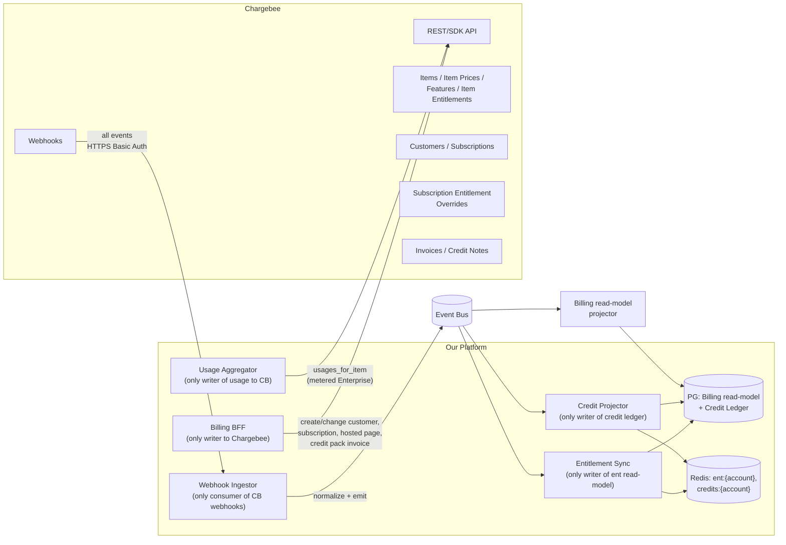
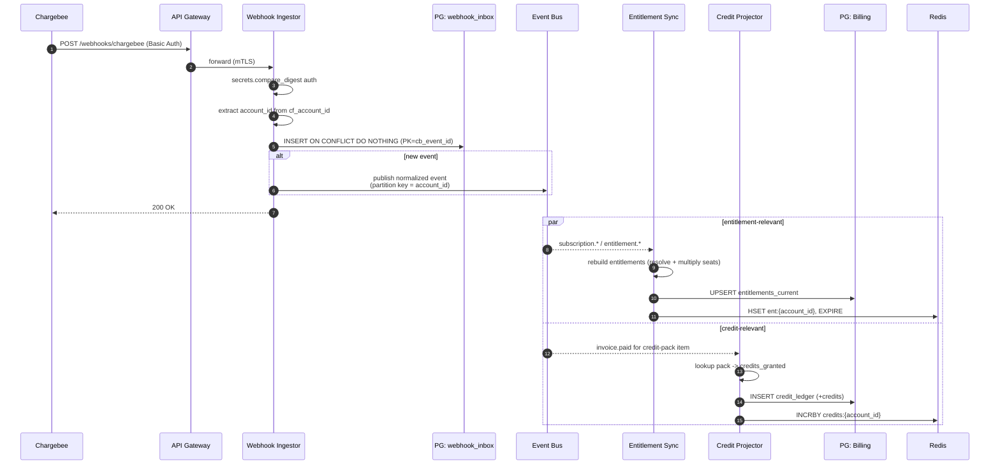
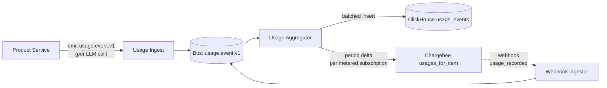

# 03 — Chargebee as the Source of Truth

Chargebee owns **plans, items, item-prices, features, entitlements, customers, subscriptions,
invoices, and credit notes**. The platform holds a *materialized read model* and a *hot-path
entitlement cache* — never an authoritative copy.

This document specifies the **boundary, object mapping, webhook ingestion, usage push, and
reconciliation**. The full **product entitlement catalog (concrete features, plans,
entitlement values)** lives in `[07-product-and-entitlements.md](07-product-and-entitlements.md)`.

> **Customer mapping:** `Chargebee customer` is **1:1 with `accounts.account_id`**. A user
> has at least one account (Personal); Team/Enterprise accounts are separate Chargebee
> customers. A user has no direct Chargebee customer record — only their accounts do.

> See the `chargebee-integration` skill for SDK selection, REST patterns, and event schemas.

---

## 1. Boundary




**Boundary rules (normative):**

1. **Only `Billing BFF` issues mutations to Chargebee.** Other services request changes by
  calling Billing BFF.
2. **Only `Webhook Ingestor` accepts Chargebee events.** Webhooks are not exposed to other
  services; the bus is the integration surface.
3. **Only `Entitlement Sync` writes `entitlements_current` and Redis `ent:`*.**
4. **Only `Credit Projector` writes `credit_ledger` and Redis `credits:`*.**
5. **No service ever calls Chargebee on the request hot path.** If the cache + PG are empty,
  the answer is the **default Free-tier set** baked into config.

---

## 2. Object Mapping

### 2.1 Customer ↔ Account (1:1)


| Chargebee                                                          | Platform                                               |
| ------------------------------------------------------------------ | ------------------------------------------------------ |
| `customer.id`                                                      | Same as our `account_id` (UUIDv7 string)               |
| `customer.email`                                                   | Owner user's email at the time of creation             |
| `customer.first_name` / `last_name`                                | Optional, populated for Personal accounts              |
| `customer.company`                                                 | Account name for Team/Enterprise                       |
| Custom fields `cf_account_id`, `cf_account_type`, `cf_environment` | Set on creation; carried back in every webhook payload |


**Convention** when Billing BFF creates a Chargebee customer:

```
customer.id              = "<account_id>"             # use our id directly for natural idempotency
customer.cf_account_id   = "<account_id>"
customer.cf_account_type = "personal" | "team" | "enterprise"
customer.cf_environment  = "prod" | "staging"
customer.email           = <owner user's email>
```

This allows the Webhook Ingestor to recover `account_id` from any payload without an extra
lookup, and makes `create_customer` naturally idempotent on retry.

### 2.2 Plan, Item Price, Subscription


| Chargebee                             | Platform                                                                          |
| ------------------------------------- | --------------------------------------------------------------------------------- |
| `item` (`type=plan`)                  | Plan family — `plan-free`, `plan-pro`, `plan-max`, `plan-team`, `plan-enterprise` |
| `item_price`                          | Concrete priced variant — `plan-team-USD-Monthly` etc.                            |
| `item` (`type=charge`)                | Credit packs — `pack-credits-1k` etc.                                             |
| `subscription`                        | A single tier on an account; `plan_quantity` = seat count for Team                |
| `subscription_entitlement` (override) | Per-account custom entitlements (Enterprise)                                      |


> See `[07-product-and-entitlements.md](07-product-and-entitlements.md)` §4 for the concrete
> catalog: feature definitions, plan items, item entitlements, credit pack items.

### 2.3 Free Tier

The Free tier is a **$0 plan** in Chargebee with its own item entitlements. Every Personal
Account gets a Free subscription on signup. This means:

- Identical code path for free and paid (everything is "a subscription").
- Free → Pro is a plan change in Chargebee, not an account migration.
- Usage caps for Free are enforced via entitlements + Redis quotas + ClickHouse rollups.

---

## 3. Entitlement Read-Model

The platform projects Chargebee's entitlement graph into a flat, account-keyed table for
hot-path reads. The graph is:

```
Account (= cb_customer)
  └─ Subscription
       ├─ plan        (item with item_entitlements)
       ├─ addons      (additional items with item_entitlements)
       └─ overrides   (subscription_entitlements; Enterprise only)
```

**Resolution** (run by `Entitlement Sync Worker`):

1. Fetch the account's active subscriptions from `cb_subscriptions`.
2. For each subscription, fetch item_entitlements for plan + addons.
3. Apply subscription_entitlements (overrides) — these win.
4. Combine across subscriptions per the policy:
  - `switch`: any `true` wins
  - `quantity`: take the **maximum** value (or `unlimited`)
  - `range`: union (broadest)
  - `custom`: highest-tier label wins (per a configured ordering)
5. **Apply seat multiplication** for pooled metrics (`f_input_tokens_daily`,
  `f_output_tokens_daily`, `f_credits_monthly`):
   `effective = raw_value × subscription.plan_quantity`. Values like `unlimited` are passed through unchanged.
6. Write `entitlements_current` (account_id, feature_id, raw_value, effective_value) and
  refresh `ent:{account_id}` in Redis.

The runtime hot-path always reads `effective_value`. It does not need to know about seats.

### 3.1 Hot-Path Read Contract

```
POST /entitlements/{account_id}/check
  body: { user_id, features: ["f_input_tokens_daily","f_models",...] }
  response: {
    results: {
      "f_input_tokens_daily": { allowed: true,  limit: 25000000, used: 12345678 },
      "f_models":             { allowed: true,  value: "premium" },
      "f_sso":                { allowed: false }
    },
    plan_tier: "team",
    seats: 5
  }
```


| Hop                               | Latency budget          | Behaviour                  |
| --------------------------------- | ----------------------- | -------------------------- |
| In-process LRU (per-pod)          | < 100 µs                | TTL ≤ 30 s; bounded size   |
| Redis (`ent:{account_id}`)        | < 1 ms p50, 5 ms p99    | Authoritative for hot path |
| `pg-billing.entitlements_current` | < 10 ms p99             | Fallback on Redis miss     |
| Chargebee API                     | not allowed on hot path | Reconciliation only        |


If both Redis and PG are unavailable, the service returns the **default Free-tier set** from
config and emits an alert. No user-facing 5xx.

---

## 4. Webhook Ingestion

### 4.1 Endpoint Contract

- URL: `POST https://<api>/webhooks/chargebee`
- Auth: HTTPS Basic Auth using a dedicated webhook user (not the API key)
- Behavior: validate, persist to inbox, ack `200` in < 200 ms, then enqueue to the bus.

### 4.2 Pipeline




### 4.3 Idempotency

- **At ingestor:** `INSERT INTO webhook_inbox (cb_event_id, ...) ON CONFLICT DO NOTHING`.
- **At consumer:** `(consumer_name, event_id)` composite key in Redis with TTL = max event lateness (~7 days).
- **At Chargebee usage push:** `(cb_subscription_id, cb_item_price_id, period_start, period_end, sequence)` is the natural idempotency key; pushed via the `usage_id` parameter.
- **At Chargebee mutation (Billing BFF):** every mutation carries a key derived from `sha256(account_id|operation|inputs|nonce)` held in Redis 24h.

### 4.4 Event Types Consumed


| Internal event                           | Triggered by Chargebee event types                                                               |
| ---------------------------------------- | ------------------------------------------------------------------------------------------------ |
| `subscription.activated.v1`              | `subscription_created`, `subscription_activated`, `subscription_started`                         |
| `subscription.changed.v1`                | `subscription_changed`, `subscription_renewed`, `subscription_reactivated`, plan/quantity change |
| `subscription.cancelled.v1`              | `subscription_cancelled`, `subscription_paused`                                                  |
| `subscription.trial_ending.v1`           | `subscription_trial_end_reminder`                                                                |
| `subscription.entitlement_overridden.v1` | `subscription_entitlement_`*                                                                     |
| `entitlement.changed.v1`                 | any `entitlement_*` events at the item level                                                     |
| `invoice.generated.v1`                   | `invoice_generated`                                                                              |
| `invoice.paid.v1`                        | `payment_succeeded` (filter for credit-pack item to drive Credit Projector)                      |
| `invoice.payment_failed.v1`              | `payment_failed`                                                                                 |
| `customer.changed.v1`                    | `customer_changed`, `customer_deleted`                                                           |


Full Chargebee event schema: see `chargebee-integration` skill `references/events.md`.

---

## 5. Usage Push to Chargebee

For Enterprise plans (and any future metered/usage-priced tier), the platform pushes
**incremental usage** to Chargebee so it can produce true-up invoices.




**Aggregator algorithm (per minute, per metered subscription):**

1. Pull last minute of `usage_rollup_1m` filtered to `is_overage = 1` or to subscriptions on metered plans.
2. Group by `(cb_subscription_id, cb_item_price_id, period_start)`.
3. Compute `delta = current_period_total - usage_push_state.high_water_quantity`.
4. Call `usages_for_item` with `usage_id = sha256(sub|item|period|sequence+1)` for explicit dedup.
5. On success: `UPDATE usage_push_state SET high_water_quantity = current_period_total, last_sequence = sequence+1`.
6. On failure: retry with backoff; DLQ after N attempts; alert finance.

**Why incremental:** Chargebee aggregates pushed usage. Pushing the absolute total each time
inflates the bill. The aggregator pushes the delta since the last successful push.

---

## 6. Reconciliation

Three jobs run on schedules to detect and correct drift:

### 6.1 Subscription Reconciler — Hourly

1. List subscriptions changed in Chargebee in the last 90 minutes (List API with `updated_at` filter).
2. Diff against `cb_subscriptions` in `pg-billing`.
3. For any difference, emit `subscription.changed.v1` to re-run Entitlement Sync.

### 6.2 Entitlement Reconciler — Daily

1. For each account whose subscription changed today, fetch entitlements from Chargebee (item entitlements + overrides).
2. Compare to `entitlements_current`.
3. On drift, force a recomputation; alert if drift count > threshold.

### 6.3 Finance Reconciler — Nightly

1. Sum daily token usage from `ClickHouse.usage_rollup_1d` per `(cb_subscription_id, cb_item_price_id)`.
2. Compare to corresponding line items on Chargebee invoices for the same period.
3. Cross-check credit ledger: `credits_purchased − credits_debited == cached balance`.
4. Alert if drift > 0.1% per item-price. Surface in Analytics for finance.

---

## 7. Failure Modes


| Failure                          | Effect                                                  | Mitigation                                                                           |
| -------------------------------- | ------------------------------------------------------- | ------------------------------------------------------------------------------------ |
| Chargebee API down (Billing BFF) | Checkout / portal / upgrade / pack purchase unavailable | Retry with idempotency keys; show maintenance banner; fail closed only on writes     |
| Chargebee API down (Usage push)  | No metered bill push; usage still recorded in CH        | Push retried with backoff; DLQ after N hours; reconciler catches up                  |
| Webhooks delayed                 | Entitlements stale                                      | Hourly reconciler bridges; users unaffected within budget (5 s p99)                  |
| Entitlement Sync lag             | Account paid but features locked                        | Critical alert; emergency manual recompute path                                      |
| Credit Projector lag             | Pack purchased but balance not visible                  | Critical alert; the ledger is the source of truth, recoverable on replay             |
| Redis ent cluster down           | Hot-path latency rises                                  | Fallback to `pg-billing` (warm path)                                                 |
| `pg-billing` unavailable         | New webhooks queue up                                   | Webhook Ingestor still ingests (writes to inbox); processing resumes when PG returns |


The **fail-safe stance** for entitlement is *deny questionable, allow only what is positively
known*. Free-tier defaults are baked in code so no external dependency is required to make
the basic decision.