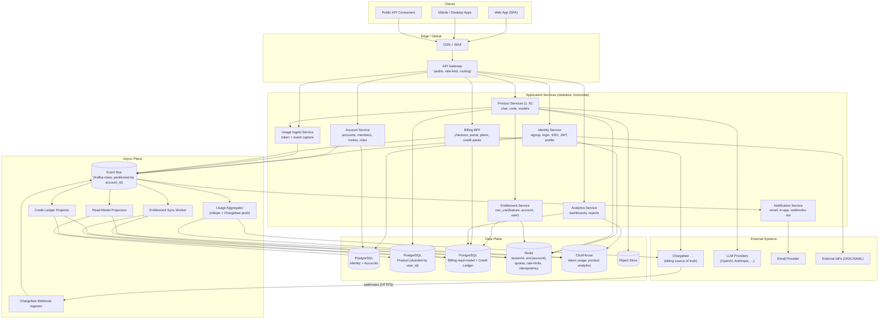

# Pointer

A production-grade, language-agnostic reference architecture for a **Product-Led Growth**
SaaS platform with a usage + subscription business model, designed to scale to
**100M end-user accounts (~50M freemium, ~50M paid)** while keeping every layer
**independently scalable**.

The product is a **Cursor-class AI coding/productivity assistant**. End users sign up
directly; Team and Enterprise tiers add multi-seat billing on top of the same platform.

**Chargebee is the source of truth** for plans, subscriptions, entitlements, invoices, and
billing events. Application services hold a *materialized read model* of billing state for
hot-path performance.

The stack assumes **PostgreSQL** (OLTP), **Redis** (cache, hot state, rate limits, pub/sub),
**ClickHouse** (usage analytics, product analytics), and an **event bus** (Kafka-class).

---

## 1. Tiers (Headline)

| Tier           | Pricing                   | Seats     | Use case                   |
| -------------- | ------------------------- | --------- | -------------------------- |
| **Free**       | $0                        | 1         | Try the product            |
| **Pro**        | $20 / month               | 1         | Solo professional          |
| **Max**        | $100 / month              | 1         | Power user                 |
| **Team**       | $30 / seat / month, min 2 | 2..100    | Small/mid team             |
| **Enterprise** | Contract                  | Unlimited | Large org, custom contract |

Entitlements: input/output tokens per day, monthly credits, API rate per minute, max seats,
SSO, available models. Full catalog and Chargebee config in
`[docs/07-product-and-entitlements.md](docs/07-product-and-entitlements.md)`.

---

## 2. Identity Model: User and Account

| Concept                    | Meaning                                                               |
| -------------------------- | --------------------------------------------------------------------- |
| **User** (`user_id`)       | Identity, auth subject. Always one human.                             |
| **Account** (`account_id`) | Billing subject. **1:1 with a Chargebee customer.** Has 1..N members. |

- Every user gets one **Personal Account** auto-created at sign-up (1 member, themselves).
- Free / Pro / Max plans live on a Personal Account.
- Team / Enterprise plans live on a separate Account that the user creates and invites others to.
- The Personal Account is invisible to solo users — they just see "my plan".
- A user can be a member of multiple accounts (one Personal + 0..N Teams).

The currently active account context travels in the JWT `acc` claim. Entitlements are
**per account**; product data remains partitioned by **user**.

---

## 3. Design Goals

| Goal                                         | How the architecture satisfies it                                                                                                                                        |
| -------------------------------------------- | ------------------------------------------------------------------------------------------------------------------------------------------------------------------------ |
| Scale to 100M users                          | Pool model with per-user product partitioning, sharded OLTP, append-only analytics, async event bus on the write path                                                    |
| 50% freemium without breaking unit economics | Cheap free-tier path: edge cache, materialized entitlements, no per-request Chargebee calls, ClickHouse for usage instead of OLTP                                        |
| PLG motion                                   | Self-serve sign-up, in-product upgrades via Chargebee Hosted Checkout, real-time entitlements, in-product paywalls driven from Chargebee plans                           |
| Production-ready / industry standard         | API gateway, JWT, OIDC, service mesh, outbox/inbox, idempotency, circuit breakers, structured tracing, blue/green + canary                                               |
| Independently scalable components            | Stateless services scale on QPS; PG scales by sharding; Redis scales by cluster + key-space partitioning; ClickHouse scales by shard + replica; bus scales by partitions |
| Chargebee as source of truth                 | All write-paths for billing go through Chargebee; webhooks fan out via outbox/inbox; local stores are read replicas only                                                 |
| LLM/agent-implementable                      | Each component documents responsibilities, ports, data contracts, and operational characteristics                                                                        |

---

## 4. Scale Assumptions

| Dimension                     | Assumption                                        | Implication                                                            |
| ----------------------------- | ------------------------------------------------- | ---------------------------------------------------------------------- |
| Users                         | 100M total, 50M paid, 50M free                    | Pool model required                                                    |
| Accounts                      | ~100M Personal + ~1–5M Team + few k Enterprise    | Accounts ~ users; few large accounts                                   |
| DAU                           | ~40M                                              | API tier sized for ~150–300k RPS peak                                  |
| Token usage                   | Tens of B tokens / day across the fleet           | Async metering pipeline; ClickHouse for rollups                        |
| Usage events                  | ~10–50 events/active user/day → 0.5–2B events/day | Need async ingestion + columnar store; not OLTP                        |
| Entitlement reads             | Every authenticated request                       | Hot-path cache (Redis) with sub-ms reads, never Chargebee on read path |
| Webhook volume from Chargebee | ~1–5k events/sec sustained, 20k/sec peak          | Outbox/inbox + partitioned bus consumers                               |

---

## 5. Architecture Principles

1. **Boundary first.** Each service owns its data; no cross-service DB reads. Crossing a boundary always goes through an API or an event.
2. **Chargebee writes go through Chargebee.** No service mutates a local "subscription" table directly; mutations are issued against Chargebee, and the local read model is updated from the resulting webhook event.
3. **Hot-path is cache-only.** Auth, entitlements, and rate-limits are served from Redis. PostgreSQL is the warm path; Chargebee is the cold path.
4. **Async by default on the write path for usage and analytics.** Synchronous writes are reserved for transactional product state.
5. **Event-driven integration.** Services communicate via an event bus with the **transactional outbox** pattern on producers and the **inbox** (idempotency) pattern on consumers.
6. **Partition keys, by construction.**
  - **Product data** is partitioned by `user_id` (one user's documents/conversations live together).
  - **Billing & entitlements** are keyed by `account_id` (the Chargebee customer).
  - **Authorisation** = "user is a member of account" + per-row `user_id` ownership.
7. **Independently scalable.** Each tier scales on its own metric; no shared scale-up units.
8. **Observability is non-optional.** Every request has a trace ID; every domain event has an event ID; both flow end-to-end.

---

## 6. Headline Architecture Diagram

---

## 7. Document Map

| Doc                                                                            | Contents                                                                                       |
| ------------------------------------------------------------------------------ | ---------------------------------------------------------------------------------------------- |
| `[docs/01-architecture.md](docs/01-architecture.md)`                           | Container view, service catalog, ports/interfaces, control plane vs data plane                 |
| `[docs/02-data-architecture.md](docs/02-data-architecture.md)`                 | PostgreSQL schemas + sharding, Redis namespaces + TTLs, ClickHouse tables                      |
| `[docs/03-chargebee-source-of-truth.md](docs/03-chargebee-source-of-truth.md)` | Boundary with Chargebee, entitlement read-model, webhook ingestion, usage push                 |
| `[docs/04-sequence-flows.md](docs/04-sequence-flows.md)`                       | Sequence diagrams for sign-up, entitlement check, usage, upgrade, team invite, webhook fan-out |
| `[docs/05-scaling-and-deployment.md](docs/05-scaling-and-deployment.md)`       | Per-component scaling, sharding, deployment topology, capacity model                           |
| `[docs/06-cross-cutting.md](docs/06-cross-cutting.md)`                         | Per-account/per-user isolation, security, observability, SLOs, DR                              |
| `[docs/07-product-and-entitlements.md](docs/07-product-and-entitlements.md)`   | **Product tiers, Chargebee feature catalog, item entitlements, runtime resolution**            |

---

## 8. Implementation Notes for an Agent

When generating a concrete implementation from this reference:

1. **Pick a language stack** for application services (the architecture is agnostic; popular choices are Go/Java/Node/Python with a typed framework).
2. **Pick a deployment substrate** (Kubernetes is assumed; equivalent works on ECS/Nomad).
3. **Apply Clean / Hexagonal Architecture** *inside* each service: domain entities, ports (repositories, gateways), adapters (PG, Redis, Chargebee SDK, Bus). See `architecture-patterns` skill.
4. **Use the Chargebee SDK** for the chosen language. See `chargebee-integration` skill.
5. **Bootstrap Chargebee with the catalog in `docs/07-product-and-entitlements.md` §9** (idempotent script).
6. **Implement the outbox + inbox pattern** for every service that both writes its own DB and emits/consumes events.
7. **Treat the diagrams as contracts.** Component names, port directions, and data ownership in the diagrams are normative.

