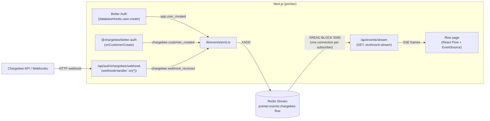

# Plan 4 — Event bus + Pointer ↔ Chargebee flow visualization

Implemented Jun 25, 2026.

## Goal

Wire a generic internal event pipeline on Redis Streams with **broadcast fanout** (every subscriber sees every event), and prove it out by visualizing the live App ↔ Chargebee flow on an authenticated `/flow` page using React Flow + SSE.

## Architecture



**Fanout strategy.** Every subscriber opens its own ioredis connection and runs `XREAD BLOCK 5000 STREAMS pointer:events:chargebee-flow <lastId>` in a loop. No consumer groups — pure broadcast. Stream is bounded with `MAXLEN ~ 10000`.

**Event envelope.** Implemented in `lib/events/types.ts`:

```ts
type AppEvent = {
  event_id: string;        // uuid v7
  event_type: string;      // e.g. "chargebee.customer_created"
  occurred_at: string;     // RFC3339
  source: "app" | "chargebee";
  trace_id?: string;
  data: Record<string, unknown>;
};
```

## Implemented files

### Dependencies — `package.json`
- `ioredis@5` (Redis client, supports `XREAD BLOCK`)
- `@xyflow/react@12` (React Flow v12)
- `uuid@14` (ships its own types; no `@types/uuid` needed)

### Redis client — `lib/redis.ts`
Singleton `getRedis()` plus per-subscriber `createRedisSubscriber()`. Lazy-connect so `next build` doesn't try to dial Redis during page-data collection. HMR-safe via `globalThis.__redisPub`.

### Event bus — `lib/events/`
- `types.ts` — `AppEvent`, `StreamedEvent`, `AppEventType` union.
- `bus.ts` — `EventBus` interface (`publish`, `subscribe`, `recent`).
- `redis-stream-bus.ts` — single stream key `pointer:events:chargebee-flow`. `subscribe` honours `AbortSignal` and uses `client.disconnect()` (not `quit()`) so an in-flight `BLOCK` doesn't park the socket for the full timeout.
- `emit.ts` — wraps `bus.publish` with uuid-v7 + timestamp and a try/catch so failed emits never break the request path.

### Producers — `lib/auth.ts`
- `databaseHooks.user.create.after` emits `app.user_created` immediately, then `chargebee.customer_created` after the manual Chargebee customer create.
- The plugin's `onCustomerCreate` callback emits a second `chargebee.customer_created` for the org path (with `origin: "plugin"`).
- `webhookHandler` registers `.on(type, …)` for every `Object.values(WebhookEventType)`, plus an `unhandled_event` catch-all, so every Chargebee webhook becomes a `chargebee.webhook_received` event on the bus. The plugin's own listeners continue to run because the SDK's `WebhookHandler` extends `EventEmitter` (multi-listener fan-out per event).

### SSE — `app/api/events/stream/route.ts`
- Auth-gated via `auth.api.getSession`.
- Accepts `?since=<stream-id>` (defaults to `$` for live-only).
- 15 s comment heartbeats keep proxies from closing the connection.
- Wires `request.signal` through an `AbortController` into the bus subscription so client disconnects tear down the Redis socket promptly.

### Backfill — `app/api/events/recent/route.ts`
`XREVRANGE` for the last `count` (default 50, max 500) events, returned in chronological order.

### Visualization — `app/flow/`
- `page.tsx` — server component, redirects to `/sign-in?from=/flow` if unauthenticated, renders `<FlowCanvas />`.
- `_lib/mapping.ts` — event-type → edge-id lookup.
- `_lib/useEventStream.ts` — fetches `/api/events/recent` for first paint, then opens `EventSource('/api/events/stream?since=<lastId>')`. Reducer maintains `events[]` and a TTL-keyed `activeEdges` map (2.2 s pulse per event).
- `_components/FlowCanvas.tsx` — React Flow with 5 fixed nodes (User, Pointer App, Chargebee API, Chargebee Webhook, Postgres). Active edges turn indigo + `animated`. Connection state pill in the top-right.
- `_components/EventLog.tsx` — collapsible JSON event log on the right.

### Routing — `proxy.ts`
Added `/flow/:path*` to the `matcher` so the cookie-presence check protects it before the page even renders.

## Non-goals
- No consumer-group / DLQ / replay tooling — pure broadcast, ephemeral.
- No multi-tenant filtering — global admin view.
- No persistence beyond the bounded Redis stream; ClickHouse stays out of this PR.
- The bus is a **parallel observation tap**, not the canonical webhook inbox. Chargebee plugin's own handler still runs every event.

## Verified during implementation
- `chargebee` SDK's `WebhookHandler` extends `EventEmitter`, so multiple `.on()` listeners coexist (`esm/resources/webhook/handler.js` line 102, dispatch at line 337-342).
- TS + ESLint clean (`pnpm exec tsc --noEmit`, `pnpm lint`).

## To verify at runtime
- Open `/flow` repeatedly; `redis-cli CLIENT LIST` should not accumulate idle XREAD clients after tabs close.
- `curl -N http://localhost:3000/api/events/stream` then Ctrl-C should release the corresponding Redis subscriber within a few seconds (proves `ReadableStream.cancel` fires).
